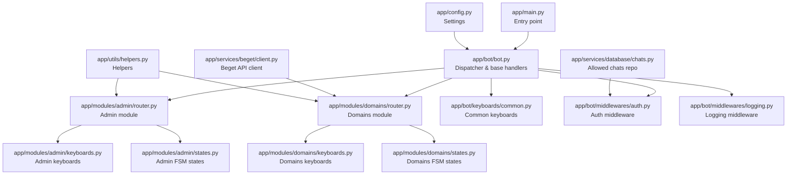
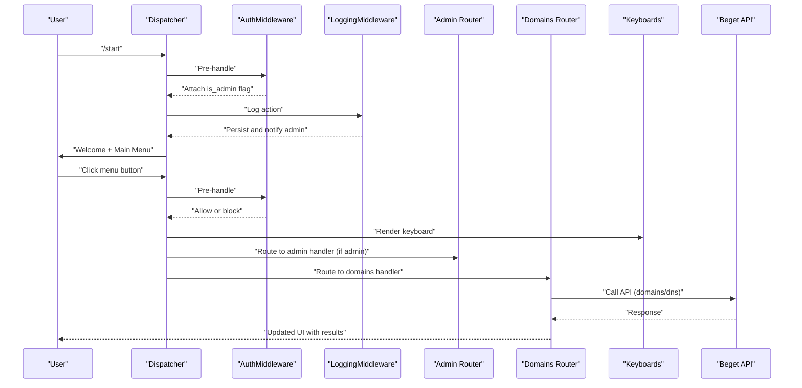
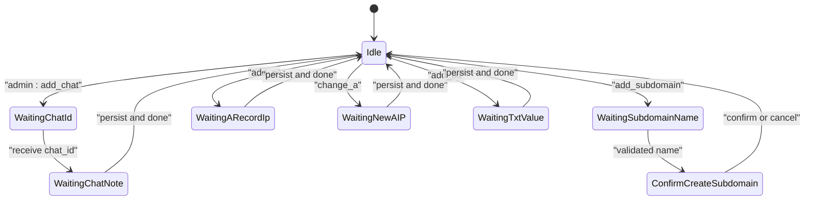
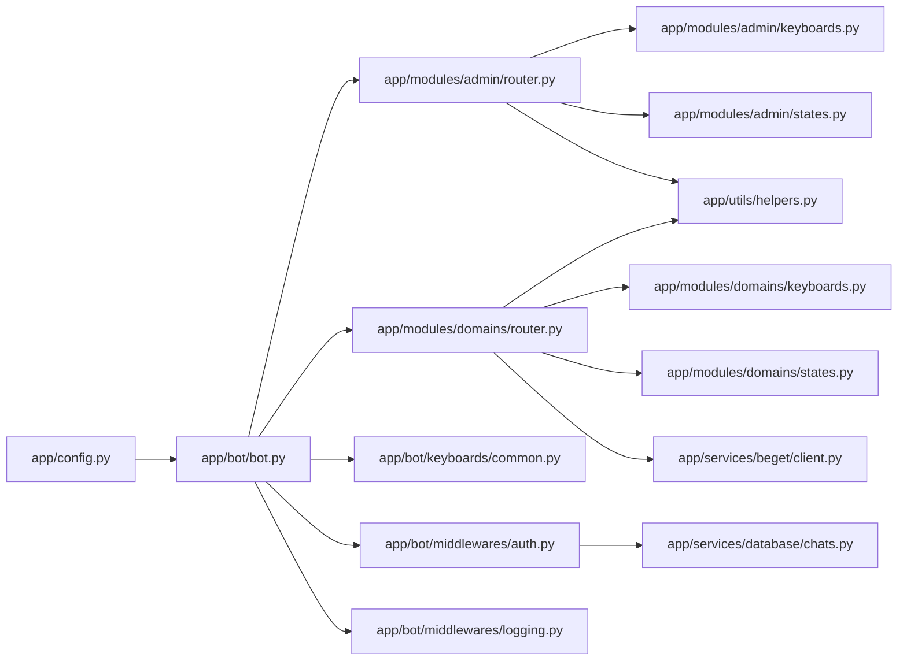

# API Reference

<cite>
**Referenced Files in This Document**
- [app/main.py](file://app/main.py)
- [app/config.py](file://app/config.py)
- [app/bot/bot.py](file://app/bot/bot.py)
- [app/bot/keyboards/common.py](file://app/bot/keyboards/common.py)
- [app/bot/middlewares/auth.py](file://app/bot/middlewares/auth.py)
- [app/bot/middlewares/logging.py](file://app/bot/middlewares/logging.py)
- [app/modules/admin/router.py](file://app/modules/admin/router.py)
- [app/modules/admin/keyboards.py](file://app/modules/admin/keyboards.py)
- [app/modules/admin/states.py](file://app/modules/admin/states.py)
- [app/modules/domains/router.py](file://app/modules/domains/router.py)
- [app/modules/domains/keyboards.py](file://app/modules/domains/keyboards.py)
- [app/modules/domains/states.py](file://app/modules/domains/states.py)
- [app/services/beget/client.py](file://app/services/beget/client.py)
- [app/services/database/chats.py](file://app/services/database/chats.py)
- [app/utils/helpers.py](file://app/utils/helpers.py)
</cite>

## Table of Contents
1. [Introduction](#introduction)
2. [Project Structure](#project-structure)
3. [Core Components](#core-components)
4. [Architecture Overview](#architecture-overview)
5. [Detailed Component Analysis](#detailed-component-analysis)
6. [Dependency Analysis](#dependency-analysis)
7. [Performance Considerations](#performance-considerations)
8. [Troubleshooting Guide](#troubleshooting-guide)
9. [Conclusion](#conclusion)
10. [Appendices](#appendices)

## Introduction
This document provides a comprehensive API reference for the Beget Manager bot’s Telegram interface. It covers all available commands and inline keyboard interactions, the state machine used for multi-step operations, the user permission system, and the command hierarchy. It also documents expected responses, error handling, and user feedback mechanisms, along with keyboard layouts and navigation patterns.

## Project Structure
The bot is structured around a central dispatcher and modular routers for Admin and Domains features. Middleware handles authentication and logging. Keyboard builders define consistent navigation. Services integrate with the Beget API and local SQLite storage.

**Diagram sources**
- [app/main.py](file://app/main.py#L10-L26)
- [app/bot/bot.py](file://app/bot/bot.py#L18-L82)
- [app/modules/admin/router.py](file://app/modules/admin/router.py#L19-L222)
- [app/modules/domains/router.py](file://app/modules/domains/router.py#L22-L718)
- [app/bot/keyboards/common.py](file://app/bot/keyboards/common.py#L7-L42)
- [app/bot/middlewares/auth.py](file://app/bot/middlewares/auth.py#L10-L46)
- [app/bot/middlewares/logging.py](file://app/bot/middlewares/logging.py#L12-L76)
- [app/modules/admin/keyboards.py](file://app/modules/admin/keyboards.py#L9-L76)
- [app/modules/admin/states.py](file://app/modules/admin/states.py#L6-L12)
- [app/modules/domains/keyboards.py](file://app/modules/domains/keyboards.py#L9-L196)
- [app/modules/domains/states.py](file://app/modules/domains/states.py#L6-L21)
- [app/services/beget/client.py](file://app/services/beget/client.py#L21-L135)
- [app/services/database/chats.py](file://app/services/database/chats.py#L20-L79)
- [app/utils/helpers.py](file://app/utils/helpers.py#L6-L16)

**Section sources**
- [app/main.py](file://app/main.py#L10-L26)
- [app/bot/bot.py](file://app/bot/bot.py#L18-L82)

## Core Components
- Dispatcher and base handlers: Registers middlewares, routers, and base commands like /start and menu navigation.
- Admin module: Manages allowed chats, logs, and administrative actions.
- Domains module: Lists domains, manages subdomains, and DNS records (A and TXT).
- Keyboard builders: Provide consistent inline keyboard layouts across modules.
- State machines: Manage multi-step flows for adding/removing subdomains and DNS records.
- Middleware: Authentication and logging.
- Services: Beget API client and database repositories.

**Section sources**
- [app/bot/bot.py](file://app/bot/bot.py#L18-L82)
- [app/modules/admin/router.py](file://app/modules/admin/router.py#L19-L222)
- [app/modules/domains/router.py](file://app/modules/domains/router.py#L22-L718)
- [app/bot/keyboards/common.py](file://app/bot/keyboards/common.py#L7-L42)
- [app/modules/admin/states.py](file://app/modules/admin/states.py#L6-L12)
- [app/modules/domains/states.py](file://app/modules/domains/states.py#L6-L21)
- [app/bot/middlewares/auth.py](file://app/bot/middlewares/auth.py#L10-L46)
- [app/bot/middlewares/logging.py](file://app/bot/middlewares/logging.py#L12-L76)
- [app/services/beget/client.py](file://app/services/beget/client.py#L21-L135)
- [app/services/database/chats.py](file://app/services/database/chats.py#L20-L79)

## Architecture Overview
The bot uses Aiogram with FSM for stateful interactions. Authentication middleware restricts access to allowed chats, while logging middleware records actions and notifies the admin. Routers encapsulate feature-specific handlers and keyboards.

**Diagram sources**
- [app/bot/bot.py](file://app/bot/bot.py#L54-L81)
- [app/bot/middlewares/auth.py](file://app/bot/middlewares/auth.py#L17-L45)
- [app/bot/middlewares/logging.py](file://app/bot/middlewares/logging.py#L20-L75)
- [app/modules/admin/router.py](file://app/modules/admin/router.py#L64-L71)
- [app/modules/domains/router.py](file://app/modules/domains/router.py#L28-L52)
- [app/bot/keyboards/common.py](file://app/bot/keyboards/common.py#L7-L17)
- [app/services/beget/client.py](file://app/services/beget/client.py#L70-L121)

## Detailed Component Analysis

### Commands and Base Handlers
- /start: Responds with a welcome message and the main menu. The menu differs for admins.
- Menu navigation:
  - menu:main: Returns to the main menu.
  - cancel: Cancels current operation and returns to main menu.

Expected responses:
- Text message with inline keyboard markup.

Behavior:
- Uses a shared main menu keyboard builder that adapts to admin status.

**Section sources**
- [app/bot/bot.py](file://app/bot/bot.py#L54-L81)
- [app/bot/keyboards/common.py](file://app/bot/keyboards/common.py#L7-L17)

### Admin Panel
Available commands and interactions:
- menu:admin: Opens admin panel menu.
- admin:chats: Lists allowed chats with actions per chat and “+ Add Chat”.
- admin:add_chat: Starts adding a new chat via multi-step FSM.
- admin:chat:{chat_id}: Shows actions for a selected chat.
- admin:remove_chat:{chat_id}: Confirms removal with a confirm/cancel keyboard.
- admin:confirm_remove:{chat_id}: Executes removal.
- admin:logs: Shows recent logged actions.

Keyboard layouts:
- Admin main menu: Allowed Chats, Action Logs, Back.
- Chats list: One row per chat with “Remove”, “+ Add Chat”, “Back”.
- Chat actions: Remove, Back.
- Confirm remove: Yes, Cancel.

State machine (AdminStates):
- waiting_chat_id
- waiting_chat_note
- confirm_remove_chat

Typical workflow: Add chat
1. admin:add_chat
2. Receive chat_id (number)
3. Receive note (optional)
4. Persist and return to chats list

Typical workflow: Remove chat
1. admin:chats
2. admin:chat:{chat_id}
3. admin:remove_chat:{chat_id}
4. admin:confirm_remove:{chat_id}

Error handling:
- Service unavailability is reported via alert or message.
- Validation errors prompt re-entry.

User feedback:
- Alerts for confirmations/deletions.
- Immediate edits of the current message for navigation.

**Section sources**
- [app/modules/admin/router.py](file://app/modules/admin/router.py#L64-L222)
- [app/modules/admin/keyboards.py](file://app/modules/admin/keyboards.py#L9-L76)
- [app/modules/admin/states.py](file://app/modules/admin/states.py#L6-L12)

### Domains Management
Available commands and interactions:
- menu:domains: Lists domains.
- domain:{domain_id}:{fqdn}: Opens domain menu.
- subdomains:{domain_id}:{fqdn}: Lists subdomains.
- subdomain:{subdomain_id}:{fqdn}: Shows subdomain actions.
- add_subdomain:{domain_id}:{fqdn}: Starts adding a subdomain via FSM.
- del_sub:{subdomain_id}: Confirms deletion.
- do_del_sub:{subdomain_id}: Executes deletion.
- back_subs:{domain_id}: Returns to subdomains list.

Keyboard layouts:
- Domains list: One row per domain, Back.
- Domain menu: Subdomains, DNS Records, Back.
- Subdomains list: One row per subdomain, “+ Add Subdomain”, Back.
- Subdomain actions: Delete, Back.

State machine (SubdomainStates):
- waiting_subdomain_name
- confirm_create_subdomain
- confirm_delete_subdomain

Typical workflow: Add subdomain
1. add_subdomain:{domain_id}:{fqdn}
2. Enter subdomain name (validation rules apply).
3. Confirm creation.
4. Success notification and refresh list.

Validation rules (name):
- Lowercase letters, digits, hyphens.
- No leading/trailing hyphens.
- No spaces or special characters.
- Non-empty.

Error handling:
- Validation errors prompt re-entry with guidance.
- API exceptions are surfaced via alerts/messages.

User feedback:
- Confirmation dialogs for destructive actions.
- Deletion confirmation messages.

**Section sources**
- [app/modules/domains/router.py](file://app/modules/domains/router.py#L28-L341)
- [app/modules/domains/keyboards.py](file://app/modules/domains/keyboards.py#L9-L103)
- [app/modules/domains/states.py](file://app/modules/domains/states.py#L6-L12)

### DNS Records Management
Available commands and interactions:
- dns:{fqdn}: Opens DNS menu.
- dns_view:{fqdn}: Displays all DNS records (A, AAAA, MX, TXT, CNAME, NS).
- dns_a:{fqdn}: Lists A records.
- edit_a:{fqdn}:{ip}: Shows edit options for an A record.
- add_a:{fqdn}: Starts adding an A record via FSM.
- change_a:{fqdn}:{ip}: Starts changing an A record via FSM.
- delete_a:{fqdn}:{ip}: Confirms deletion.
- do_delete_a:{fqdn}:{ip}: Executes deletion.
- dns_txt:{fqdn}: Lists TXT records.
- txt_record:{fqdn}:{index}: Shows TXT record detail and delete confirmation.
- add_txt:{fqdn}: Starts adding a TXT record via FSM.
- delete_txt:{fqdn}:{index}: Deletes a TXT record.

Keyboard layouts:
- DNS menu: View Records, A Records, TXT Records, Back.
- A records: One row per record, “+ Add A Record”, Back.
- Edit A record: Change IP, Delete, Back.
- TXT records: Truncated display, “+ Add TXT Record”, Back.

State machine (DnsStates):
- waiting_a_record_ip
- waiting_new_a_ip
- waiting_txt_value
- confirm_delete_record

Typical workflow: Add A record
1. add_a:{fqdn}
2. Enter IPv4 address.
3. Success notification.

Typical workflow: Change A record
1. change_a:{fqdn}:{ip}
2. Enter new IPv4 address.
3. Success notification.

Typical workflow: Delete A record
1. delete_a:{fqdn}:{ip}
2. Confirm.
3. Alert confirmation.

Typical workflow: Add TXT record
1. add_txt:{fqdn}
2. Enter TXT value.
3. Success notification.

Validation rules:
- IPv4 validation for A records.
- Non-empty TXT values.

Error handling:
- Validation errors prompt re-entry.
- API exceptions surfaced via alerts/messages.

User feedback:
- Alerts for confirmations/deletions.
- Immediate edits of the current message for navigation.

**Section sources**
- [app/modules/domains/router.py](file://app/modules/domains/router.py#L346-L718)
- [app/modules/domains/keyboards.py](file://app/modules/domains/keyboards.py#L105-L196)
- [app/modules/domains/states.py](file://app/modules/domains/states.py#L14-L21)

### Inline Keyboard System and Navigation Patterns
Common keyboards:
- main_menu_keyboard(is_admin): “Domains” and optionally “Admin Panel”.
- back_button(callback_data): Single “Back” button.
- confirm_cancel_keyboard(confirm_data, cancel_data): “Confirm” and “Cancel”.

Navigation patterns:
- Use callback_data to encode intent and minimal payload; store extended state in FSM.
- Prefer editing the current message for navigation to reduce clutter.
- Use confirm/cancel keyboards for destructive actions.

Accessibility considerations:
- Buttons use concise labels.
- Back navigation is consistent across modules.
- Truncated text for long values (e.g., TXT) with full value shown on detail view.

**Section sources**
- [app/bot/keyboards/common.py](file://app/bot/keyboards/common.py#L7-L42)
- [app/modules/domains/keyboards.py](file://app/modules/domains/keyboards.py#L105-L196)
- [app/modules/admin/keyboards.py](file://app/modules/admin/keyboards.py#L9-L76)

### State Machine Implementation
The bot uses FSM to manage multi-step operations:
- AdminStates: waiting_chat_id, waiting_chat_note, confirm_remove_chat
- SubdomainStates: waiting_subdomain_name, confirm_create_subdomain, confirm_delete_subdomain
- DnsStates: waiting_a_record_ip, waiting_new_a_ip, waiting_txt_value, confirm_delete_record

State transitions:
- Set state on initiation of multi-step flows.
- Update state with collected data.
- Clear state upon completion or cancellation.
- Use cancel to return to main menu.

**Diagram sources**
- [app/modules/admin/states.py](file://app/modules/admin/states.py#L6-L12)
- [app/modules/domains/states.py](file://app/modules/domains/states.py#L6-L21)

**Section sources**
- [app/modules/admin/states.py](file://app/modules/admin/states.py#L6-L12)
- [app/modules/domains/states.py](file://app/modules/domains/states.py#L6-L21)

### User Permission System
Permissions are enforced via middleware:
- Admin chat ID (from settings) always has access.
- Other chats must be present in the allowed chats table.
- Unauthorized events are silently ignored.

Effects:
- Admin-only menu items appear only for admin users.
- Admin-only routes are filtered by an admin filter.

**Section sources**
- [app/bot/middlewares/auth.py](file://app/bot/middlewares/auth.py#L10-L46)
- [app/modules/admin/router.py](file://app/modules/admin/router.py#L43-L61)
- [app/services/database/chats.py](file://app/services/database/chats.py#L51-L57)

### Command Hierarchy and Parameters
- /start: No parameters. Returns main menu.
- menu:main: No parameters. Returns main menu.
- cancel: No parameters. Clears state and returns to main menu.
- menu:domains: No parameters. Lists domains.
- domain:{domain_id}:{fqdn}: Parameters derived from previous selection.
- subdomains:{domain_id}:{fqdn}: Parameters derived from previous selection.
- subdomain:{subdomain_id}:{fqdn}: Parameters derived from previous selection.
- add_subdomain:{domain_id}:{fqdn}: Initiates subdomain creation.
- del_sub:{subdomain_id}: Initiates deletion confirmation.
- do_del_sub:{subdomain_id}: Executes deletion.
- back_subs:{domain_id}: Returns to subdomains list.
- dns:{fqdn}: Opens DNS menu.
- dns_view:{fqdn}: Displays all records.
- dns_a:{fqdn}: Lists A records.
- edit_a:{fqdn}:{ip}: Shows edit options.
- add_a:{fqdn}: Starts adding A record.
- change_a:{fqdn}:{ip}: Starts changing A record.
- delete_a:{fqdn}:{ip}: Confirms deletion.
- do_delete_a:{fqdn}:{ip}: Executes deletion.
- dns_txt:{fqdn}: Lists TXT records.
- txt_record:{fqdn}:{index}: Shows TXT detail.
- add_txt:{fqdn}: Starts adding TXT record.
- delete_txt:{fqdn}:{index}: Deletes TXT record.

**Section sources**
- [app/bot/bot.py](file://app/bot/bot.py#L54-L81)
- [app/modules/domains/router.py](file://app/modules/domains/router.py#L28-L718)
- [app/modules/admin/router.py](file://app/modules/admin/router.py#L64-L222)

### Expected Responses and Feedback
- Text responses with inline keyboards for navigation.
- Alerts for confirmations and deletions.
- Immediate message edits for smooth navigation.
- Error messages for invalid inputs and API failures.

**Section sources**
- [app/modules/domains/router.py](file://app/modules/domains/router.py#L153-L200)
- [app/modules/domains/router.py](file://app/modules/domains/router.py#L477-L500)
- [app/modules/domains/router.py](file://app/modules/domains/router.py#L665-L686)
- [app/modules/admin/router.py](file://app/modules/admin/router.py#L109-L124)

### Typical User Workflows
Workflow 1: Add a subdomain
- Navigate to a domain → Subdomains → “+ Add Subdomain”
- Enter subdomain name (validated)
- Confirm creation
- Success notification and refreshed list

Workflow 2: Add an A record
- Navigate to DNS → A Records → “+ Add A Record”
- Enter IPv4 address (validated)
- Success notification

Workflow 3: Change an A record
- Navigate to DNS → A Records → Select record → “Change IP”
- Enter new IPv4 address (validated)
- Success notification

Workflow 4: Delete a TXT record
- Navigate to DNS → TXT Records → Select record → “Delete”
- Confirm deletion
- Alert confirmation and refreshed list

Workflow 5: Admin add/remove chat
- Admin Panel → Allowed Chats → “+ Add Chat”
- Enter chat_id and optional note
- Persist and return to list
- Select chat → Remove → Confirm

**Section sources**
- [app/modules/domains/router.py](file://app/modules/domains/router.py#L135-L242)
- [app/modules/domains/router.py](file://app/modules/domains/router.py#L465-L500)
- [app/modules/domains/router.py](file://app/modules/domains/router.py#L502-L542)
- [app/modules/domains/router.py](file://app/modules/domains/router.py#L688-L718)
- [app/modules/admin/router.py](file://app/modules/admin/router.py#L98-L150)
- [app/modules/admin/router.py](file://app/modules/admin/router.py#L163-L191)

## Dependency Analysis
- Dispatcher depends on settings, middlewares, and routers.
- Routers depend on keyboards and state machines.
- Admin router depends on database repositories and helpers.
- Domains router depends on Beget API client and keyboards.
- Middlewares depend on repositories and bot instance.

**Diagram sources**
- [app/config.py](file://app/config.py#L37-L52)
- [app/bot/bot.py](file://app/bot/bot.py#L18-L52)
- [app/modules/admin/router.py](file://app/modules/admin/router.py#L19-L222)
- [app/modules/domains/router.py](file://app/modules/domains/router.py#L22-L718)
- [app/bot/keyboards/common.py](file://app/bot/keyboards/common.py#L7-L42)
- [app/bot/middlewares/auth.py](file://app/bot/middlewares/auth.py#L10-L46)
- [app/bot/middlewares/logging.py](file://app/bot/middlewares/logging.py#L12-L76)
- [app/modules/admin/keyboards.py](file://app/modules/admin/keyboards.py#L9-L76)
- [app/modules/domains/keyboards.py](file://app/modules/domains/keyboards.py#L9-L196)
- [app/modules/admin/states.py](file://app/modules/admin/states.py#L6-L12)
- [app/modules/domains/states.py](file://app/modules/domains/states.py#L6-L21)
- [app/services/beget/client.py](file://app/services/beget/client.py#L21-L135)
- [app/services/database/chats.py](file://app/services/database/chats.py#L20-L79)
- [app/utils/helpers.py](file://app/utils/helpers.py#L6-L16)

**Section sources**
- [app/bot/bot.py](file://app/bot/bot.py#L18-L52)
- [app/modules/admin/router.py](file://app/modules/admin/router.py#L19-L222)
- [app/modules/domains/router.py](file://app/modules/domains/router.py#L22-L718)

## Performance Considerations
- Use message edits for navigation to minimize sent messages.
- Keep callback_data compact; store extended data in FSM state.
- Validate inputs early to reduce API calls for invalid data.
- Batch database writes where appropriate.
- Limit concurrent API requests to Beget to avoid timeouts.

## Troubleshooting Guide
Common issues and resolutions:
- Unauthorized access: Ensure chat_id is in allowed chats or use admin chat_id.
- Invalid inputs:
  - Subdomain name: Must match allowed pattern; no spaces or special characters.
  - A record IP: Must be a valid IPv4 address.
  - TXT value: Must be non-empty.
- API errors: Inspect Beget API client error handling and logs.
- Service unavailability: Admin routes may return “Service unavailable” alerts.

User feedback mechanisms:
- Alerts for confirmations and deletions.
- Immediate message edits for navigation.
- Logging middleware notifies admin and persists actions.

**Section sources**
- [app/bot/middlewares/auth.py](file://app/bot/middlewares/auth.py#L34-L45)
- [app/modules/domains/router.py](file://app/modules/domains/router.py#L153-L184)
- [app/modules/domains/router.py](file://app/modules/domains/router.py#L477-L488)
- [app/modules/domains/router.py](file://app/modules/domains/router.py#L665-L674)
- [app/bot/middlewares/logging.py](file://app/bot/middlewares/logging.py#L50-L75)
- [app/services/beget/client.py](file://app/services/beget/client.py#L97-L121)

## Conclusion
The Beget Manager bot provides a structured, stateful Telegram interface for domain and DNS management. Its modular design, consistent keyboard layouts, and robust middleware ensure predictable user experiences. Admin and user permissions are enforced securely, while FSM enables reliable multi-step operations. The documented command hierarchy, keyboard layouts, and workflows support efficient integration and maintenance.

## Appendices

### Keyboard Layouts Reference
- Main menu: “Domains” and optionally “Admin Panel”.
- Back button: “Back”.
- Confirm/Cancel: “Confirm” and “Cancel”.

**Section sources**
- [app/bot/keyboards/common.py](file://app/bot/keyboards/common.py#L7-L42)
- [app/modules/domains/keyboards.py](file://app/modules/domains/keyboards.py#L105-L196)
- [app/modules/admin/keyboards.py](file://app/modules/admin/keyboards.py#L9-L76)

### Settings and Environment
- Required environment variables:
  - telegram_bot_token
  - admin_chat_id
  - beget_login
  - beget_password
  - log_level (optional)
  - data_dir (optional)

**Section sources**
- [app/config.py](file://app/config.py#L17-L35)