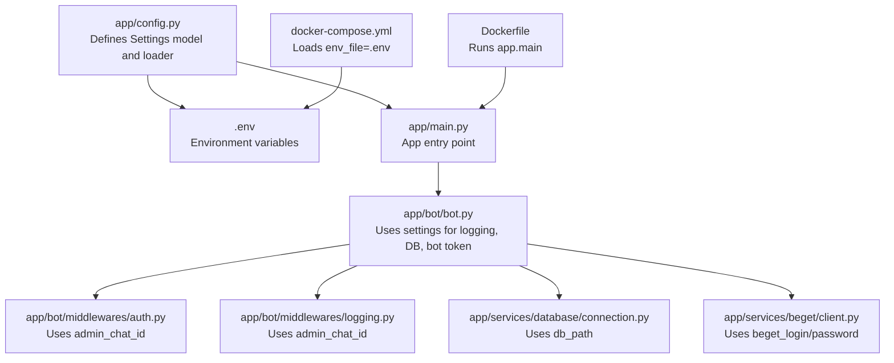
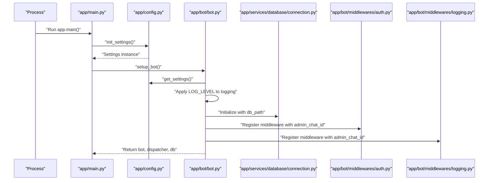
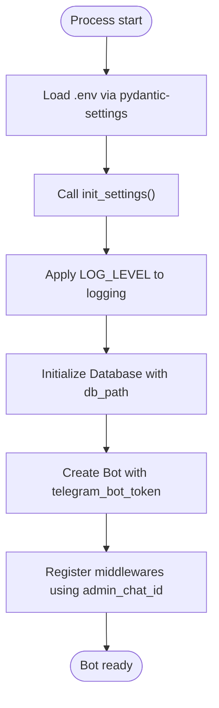
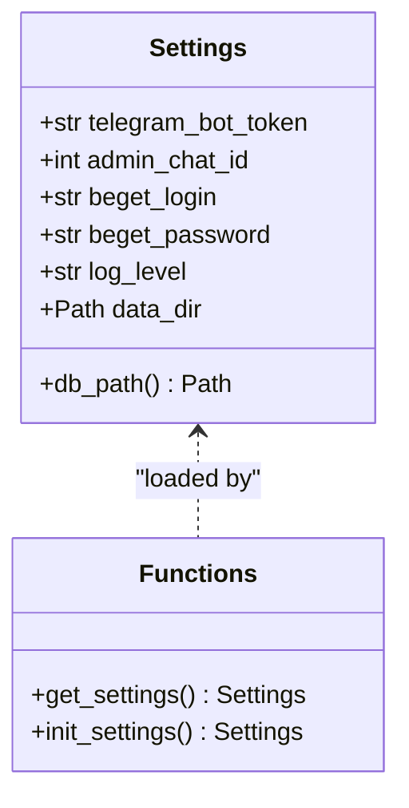
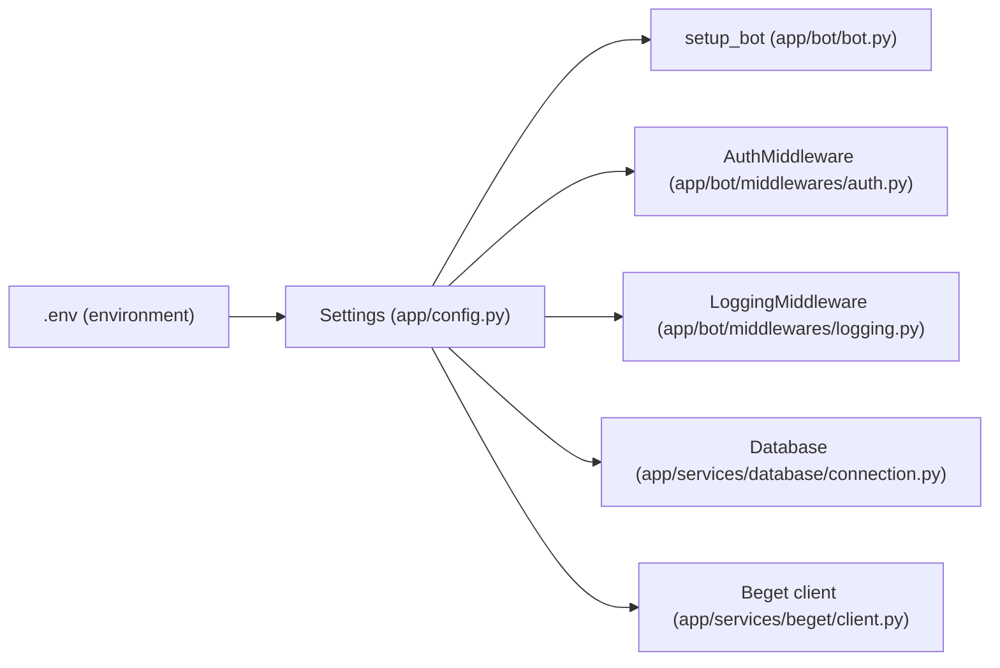

# Configuration Management

<cite>
**Referenced Files in This Document**
- [app/config.py](file://app/config.py)
- [.env.example](file://.env.example)
- [.env](file://.env)
- [app/main.py](file://app/main.py)
- [app/bot/bot.py](file://app/bot/bot.py)
- [app/bot/middlewares/auth.py](file://app/bot/middlewares/auth.py)
- [app/bot/middlewares/logging.py](file://app/bot/middlewares/logging.py)
- [app/services/beget/client.py](file://app/services/beget/client.py)
- [app/services/database/connection.py](file://app/services/database/connection.py)
- [docker-compose.yml](file://docker-compose.yml)
- [Dockerfile](file://Dockerfile)
- [requirements.txt](file://requirements.txt)
- [README.md](file://README.md)
</cite>

## Table of Contents
1. [Introduction](#introduction)
2. [Project Structure](#project-structure)
3. [Core Components](#core-components)
4. [Architecture Overview](#architecture-overview)
5. [Detailed Component Analysis](#detailed-component-analysis)
6. [Dependency Analysis](#dependency-analysis)
7. [Performance Considerations](#performance-considerations)
8. [Troubleshooting Guide](#troubleshooting-guide)
9. [Conclusion](#conclusion)
10. [Appendices](#appendices)

## Introduction
This document explains the configuration management system for the Beget Manager bot. It covers all environment variables, the Pydantic-based configuration model, validation behavior, defaults, and how configuration integrates with application startup. It also provides security guidance, production deployment considerations, and troubleshooting steps for common configuration issues.

## Project Structure
Configuration is centralized in a single module that defines typed settings, loads from an environment file, and exposes a cached instance for the rest of the application. The environment file is consumed both by the application and Docker Compose.

**Diagram sources**
- [app/config.py](file://app/config.py#L1-L52)
- [.env](file://.env#L1-L11)
- [app/main.py](file://app/main.py#L1-L30)
- [app/bot/bot.py](file://app/bot/bot.py#L1-L83)
- [app/bot/middlewares/auth.py](file://app/bot/middlewares/auth.py#L1-L46)
- [app/bot/middlewares/logging.py](file://app/bot/middlewares/logging.py#L1-L76)
- [app/services/database/connection.py](file://app/services/database/connection.py#L1-L59)
- [app/services/beget/client.py](file://app/services/beget/client.py#L1-L135)
- [docker-compose.yml](file://docker-compose.yml#L1-L14)
- [Dockerfile](file://Dockerfile#L1-L17)

**Section sources**
- [app/config.py](file://app/config.py#L1-L52)
- [.env.example](file://.env.example#L1-L11)
- [.env](file://.env#L1-L11)
- [app/main.py](file://app/main.py#L1-L30)
- [docker-compose.yml](file://docker-compose.yml#L1-L14)
- [Dockerfile](file://Dockerfile#L1-L17)

## Core Components
- Settings model: Defines all configuration keys, defaults, and computed properties.
- Environment loading: Reads from .env via pydantic-settings.
- Initialization: A cached loader and an explicit init function for startup.
- Usage: Consumed by bot setup, middlewares, database, and Beget client.

Key configuration keys:
- TELEGRAM_BOT_TOKEN: Telegram bot token for authentication.
- ADMIN_CHAT_ID: Integer chat ID for superuser/admin access.
- BEGET_LOGIN: Beget API login.
- BEGET_PASSWORD: Beget API password.
- LOG_LEVEL: Logging verbosity (default: INFO).
- DATA_DIR: Directory for persistent data (default: data); derived DB path is data/bot.db.

How they are used:
- Logging level is applied during bot setup.
- Database path is constructed from DATA_DIR and used to initialize SQLite.
- Telegram bot token and admin chat ID are passed to bot and middlewares.
- Beget credentials are passed to the Beget API client.

**Section sources**
- [app/config.py](file://app/config.py#L8-L35)
- [app/bot/bot.py](file://app/bot/bot.py#L23-L26)
- [app/bot/bot.py](file://app/bot/bot.py#L29-L30)
- [app/bot/middlewares/auth.py](file://app/bot/middlewares/auth.py#L13-L15)
- [app/bot/middlewares/logging.py](file://app/bot/middlewares/logging.py#L15-L18)
- [app/services/beget/client.py](file://app/services/beget/client.py#L27-L30)
- [app/services/database/connection.py](file://app/services/database/connection.py#L10-L11)

## Architecture Overview
The configuration system is a thin, typed layer around environment variables. It is initialized at process startup and then accessed globally via a cached instance.

**Diagram sources**
- [app/main.py](file://app/main.py#L10-L26)
- [app/config.py](file://app/config.py#L37-L51)
- [app/bot/bot.py](file://app/bot/bot.py#L18-L82)
- [app/services/database/connection.py](file://app/services/database/connection.py#L10-L11)
- [app/bot/middlewares/auth.py](file://app/bot/middlewares/auth.py#L13-L15)
- [app/bot/middlewares/logging.py](file://app/bot/middlewares/logging.py#L15-L18)

## Detailed Component Analysis

### Settings Model and Validation
- Model: A Pydantic Settings class with a typed schema for all configuration keys.
- Environment file: Loaded from .env with UTF-8 encoding; unknown keys are ignored.
- Defaults: LOG_LEVEL defaults to INFO; DATA_DIR defaults to data; DB path is computed from DATA_DIR.
- No explicit validators are defined; pydantic-settings performs basic type coercion and validation.

Validation behavior:
- Missing required keys cause a runtime error when the Settings class is instantiated.
- Type mismatches (e.g., ADMIN_CHAT_ID not an integer) trigger validation errors.
- Extra environment variables are ignored.

Computed property:
- db_path: Returns the SQLite database file path under DATA_DIR.

**Section sources**
- [app/config.py](file://app/config.py#L8-L35)
- [app/config.py](file://app/config.py#L11-L15)
- [app/config.py](file://app/config.py#L26-L29)
- [app/config.py](file://app/config.py#L31-L34)

### Environment Loading and Startup Integration
- Environment file: .env is loaded by the Settings class and by Docker Compose.
- Startup order: The application initializes settings first, then sets up the bot and database.
- Logging: The configured LOG_LEVEL is applied early in bot setup.

**Diagram sources**
- [app/config.py](file://app/config.py#L37-L51)
- [app/bot/bot.py](file://app/bot/bot.py#L23-L26)
- [app/bot/bot.py](file://app/bot/bot.py#L29-L30)
- [app/bot/bot.py](file://app/bot/bot.py#L40-L47)

**Section sources**
- [app/main.py](file://app/main.py#L10-L16)
- [app/bot/bot.py](file://app/bot/bot.py#L18-L30)
- [docker-compose.yml](file://docker-compose.yml#L6-L6)

### Environment Variables Reference
- TELEGRAM_BOT_TOKEN
  - Purpose: Telegram bot authentication token.
  - Type: String.
  - Required: Yes.
  - Example value: Provided in .env.example and .env.
  - Usage: Passed to the Telegram Bot constructor.

- ADMIN_CHAT_ID
  - Purpose: Superuser/admin chat identifier.
  - Type: Integer.
  - Required: Yes.
  - Usage: Middleware checks for admin access; logging middleware notifies admin.

- BEGET_LOGIN
  - Purpose: Beget API login.
  - Type: String.
  - Required: Yes.
  - Usage: Passed to Beget API client.

- BEGET_PASSWORD
  - Purpose: Beget API password.
  - Type: String.
  - Required: Yes.
  - Usage: Passed to Beget API client.

- LOG_LEVEL
  - Purpose: Logging verbosity.
  - Type: String.
  - Default: INFO.
  - Allowed values: Any standard logging level name (e.g., DEBUG, INFO, WARNING, ERROR).
  - Usage: Applied to logging configuration.

- DATA_DIR
  - Purpose: Directory for persistent data.
  - Type: Path-like string.
  - Default: data.
  - Derived effect: DB path becomes DATA_DIR/bot.db.

**Section sources**
- [app/config.py](file://app/config.py#L18-L29)
- [app/bot/bot.py](file://app/bot/bot.py#L23-L26)
- [app/bot/bot.py](file://app/bot/bot.py#L29-L30)
- [app/bot/middlewares/auth.py](file://app/bot/middlewares/auth.py#L13-L15)
- [app/bot/middlewares/logging.py](file://app/bot/middlewares/logging.py#L15-L18)
- [app/services/beget/client.py](file://app/services/beget/client.py#L27-L30)
- [.env.example](file://.env.example#L1-L11)
- [.env](file://.env#L1-L11)

### Pydantic-Based Configuration System
- Library versions: pydantic >= 2.4.1, pydantic-settings >= 2.1.0.
- Behavior: Settings are loaded from .env at import time; a cached instance is returned on subsequent calls.
- Initialization function: init_settings() assigns a global settings instance for convenience.

**Diagram sources**
- [app/config.py](file://app/config.py#L8-L35)
- [app/config.py](file://app/config.py#L37-L51)

**Section sources**
- [requirements.txt](file://requirements.txt#L4-L5)
- [app/config.py](file://app/config.py#L37-L51)

### Security Considerations
- Sensitive credentials: TELEGRAM_BOT_TOKEN, ADMIN_CHAT_ID, BEGET_LOGIN, BEGET_PASSWORD.
- Storage: Keep .env secret; never commit it to version control.
- Example file: .env.example is safe to commit and contains no real secrets.
- Exposure: The Beget client logs masked URLs for debugging; do not rely on this for production.

Best practices:
- Restrict file permissions on .env.
- Use secrets management in production environments.
- Avoid printing secrets in logs; the Beget client masks passwords in logs.
- Limit admin access to trusted users only.

**Section sources**
- [README.md](file://README.md#L290-L296)
- [app/services/beget/client.py](file://app/services/beget/client.py#L64-L67)

### Production Deployment Configurations
- Docker Compose: Loads .env via env_file and mounts ./data to persist the database.
- Image: Python slim image with dependencies installed from requirements.txt.
- Entrypoint: Runs the application module entry point.

Environment-specific settings:
- Development: Use local .env with test tokens and IDs.
- Production: Replace .env with production tokens and IDs; consider external secrets management.

**Section sources**
- [docker-compose.yml](file://docker-compose.yml#L6-L8)
- [Dockerfile](file://Dockerfile#L1-L17)
- [README.md](file://README.md#L88-L113)

### Configuration Scenarios
- Development
  - Copy .env.example to .env and fill in placeholders.
  - Use a test Telegram bot token and a development admin chat ID.
  - LOG_LEVEL can be set to DEBUG for verbose logs.

- Production
  - Replace .env with real credentials.
  - Ensure DATA_DIR points to a writable volume for persistence.
  - Use a stable LOG_LEVEL (e.g., INFO) for operational logs.

- Environment-specific overrides
  - In Docker, env_file:.env is used; ensure the file is present and correct.
  - For containerized deployments, consider injecting environment variables via orchestration platforms.

**Section sources**
- [.env.example](file://.env.example#L1-L11)
- [.env](file://.env#L1-L11)
- [docker-compose.yml](file://docker-compose.yml#L6-L8)
- [README.md](file://README.md#L32-L55)

### Troubleshooting Common Configuration Issues
- Missing or invalid TELEGRAM_BOT_TOKEN
  - Symptom: Bot fails to start or does not respond.
  - Action: Verify token in .env; regenerate if needed.

- Invalid ADMIN_CHAT_ID
  - Symptom: Unauthorized access errors or admin features inaccessible.
  - Action: Confirm the chat ID in .env; use provided methods to discover your ID.

- Incorrect BEGET_LOGIN or BEGET_PASSWORD
  - Symptom: Beget API errors or timeouts.
  - Action: Validate credentials; ensure API access is enabled.

- Missing LOG_LEVEL
  - Symptom: Default logging behavior; adjust to DEBUG for diagnostics.

- Database path issues
  - Symptom: Database not created or not persisted.
  - Action: Ensure DATA_DIR is writable and mounted in Docker; confirm db_path resolution.

**Section sources**
- [README.md](file://README.md#L219-L276)
- [app/bot/bot.py](file://app/bot/bot.py#L23-L26)
- [app/services/database/connection.py](file://app/services/database/connection.py#L16-L17)

## Dependency Analysis
Configuration is consumed across multiple modules. The diagram below shows how Settings is used.

**Diagram sources**
- [app/config.py](file://app/config.py#L8-L35)
- [app/bot/bot.py](file://app/bot/bot.py#L18-L82)
- [app/bot/middlewares/auth.py](file://app/bot/middlewares/auth.py#L10-L46)
- [app/bot/middlewares/logging.py](file://app/bot/middlewares/logging.py#L12-L76)
- [app/services/database/connection.py](file://app/services/database/connection.py#L7-L33)
- [app/services/beget/client.py](file://app/services/beget/client.py#L21-L135)
- [.env](file://.env#L1-L11)

**Section sources**
- [app/config.py](file://app/config.py#L8-L35)
- [app/bot/bot.py](file://app/bot/bot.py#L18-L82)
- [app/bot/middlewares/auth.py](file://app/bot/middlewares/auth.py#L10-L46)
- [app/bot/middlewares/logging.py](file://app/bot/middlewares/logging.py#L12-L76)
- [app/services/database/connection.py](file://app/services/database/connection.py#L7-L33)
- [app/services/beget/client.py](file://app/services/beget/client.py#L21-L135)

## Performance Considerations
- Settings caching: get_settings() uses LRU cache to avoid repeated parsing of .env.
- Minimal overhead: Settings are loaded once at startup; accessing them is O(1).
- Logging level: Higher verbosity increases I/O; use INFO or higher in production.

[No sources needed since this section provides general guidance]

## Troubleshooting Guide
- Startup fails with configuration error
  - Cause: Missing or invalid required environment variables.
  - Resolution: Fill in .env with correct values; verify types (e.g., ADMIN_CHAT_ID as integer).

- Bot does not respond
  - Cause: Invalid TELEGRAM_BOT_TOKEN or network issues.
  - Resolution: Regenerate token; check logs; verify connectivity.

- Unauthorized access
  - Cause: Chat ID not matching ADMIN_CHAT_ID or not in allowed chats.
  - Resolution: Update ADMIN_CHAT_ID; add user chat IDs to allowed list.

- Beget API errors
  - Cause: Incorrect credentials or API downtime.
  - Resolution: Verify BEGET_LOGIN and BEGET_PASSWORD; check API status.

- Database not persisting
  - Cause: DATA_DIR not mounted or not writable.
  - Resolution: Ensure Docker volume mapping and permissions.

**Section sources**
- [README.md](file://README.md#L219-L276)
- [app/main.py](file://app/main.py#L10-L26)
- [app/bot/bot.py](file://app/bot/bot.py#L18-L30)

## Conclusion
The Beget Manager bot uses a clean, Pydantic-based configuration system that loads environment variables from .env, applies sensible defaults, and integrates tightly with application startup. By following the documented environment variables, defaults, and security practices, you can deploy reliably in development and production while maintaining robust error handling and observability.

[No sources needed since this section summarizes without analyzing specific files]

## Appendices

### Environment Variable Reference Table
- TELEGRAM_BOT_TOKEN: String; required; used by bot.
- ADMIN_CHAT_ID: Integer; required; used by auth and logging middlewares.
- BEGET_LOGIN: String; required; used by Beget client.
- BEGET_PASSWORD: String; required; used by Beget client.
- LOG_LEVEL: String; default INFO; used to configure logging.
- DATA_DIR: Path-like; default data; used to compute db_path.

**Section sources**
- [app/config.py](file://app/config.py#L18-L29)
- [app/bot/bot.py](file://app/bot/bot.py#L23-L26)
- [app/bot/middlewares/auth.py](file://app/bot/middlewares/auth.py#L13-L15)
- [app/bot/middlewares/logging.py](file://app/bot/middlewares/logging.py#L15-L18)
- [app/services/beget/client.py](file://app/services/beget/client.py#L27-L30)
- [.env.example](file://.env.example#L1-L11)
- [.env](file://.env#L1-L11)