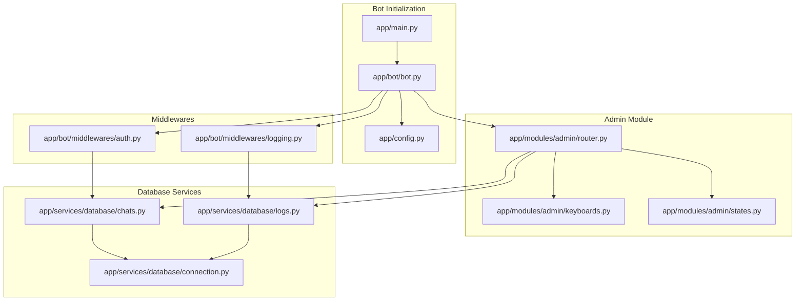
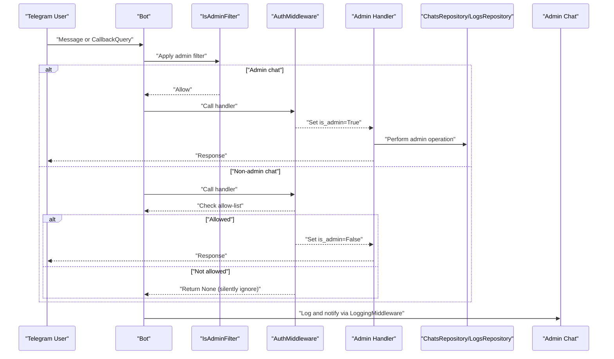
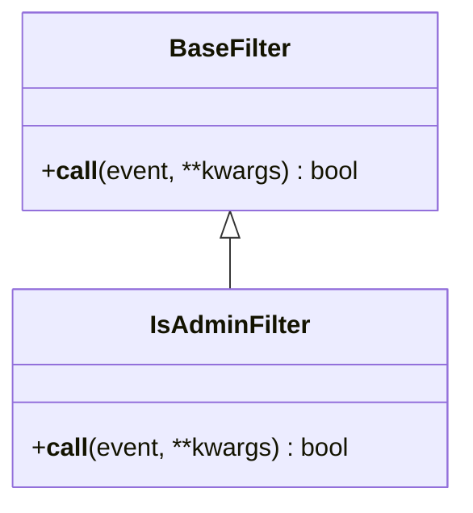
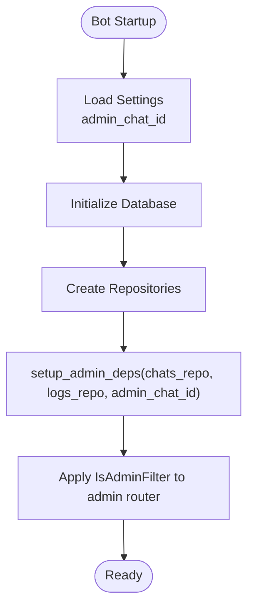
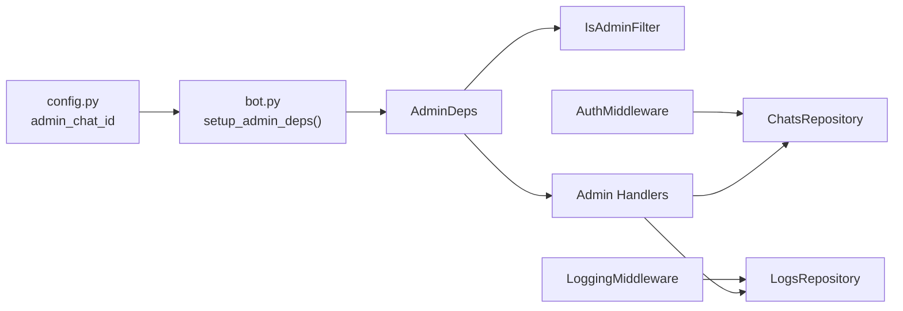

# Access Control

<cite>
**Referenced Files in This Document**
- [router.py](file://app/modules/admin/router.py)
- [keyboards.py](file://app/modules/admin/keyboards.py)
- [auth.py](file://app/bot/middlewares/auth.py)
- [logging.py](file://app/bot/middlewares/logging.py)
- [bot.py](file://app/bot/bot.py)
- [config.py](file://app/config.py)
- [states.py](file://app/modules/admin/states.py)
- [common.py](file://app/bot/keyboards/common.py)
- [chats.py](file://app/services/database/chats.py)
- [connection.py](file://app/services/database/connection.py)
- [logs.py](file://app/services/database/logs.py)
- [main.py](file://app/main.py)
</cite>

## Table of Contents
1. [Introduction](#introduction)
2. [Project Structure](#project-structure)
3. [Core Components](#core-components)
4. [Architecture Overview](#architecture-overview)
5. [Detailed Component Analysis](#detailed-component-analysis)
6. [Dependency Analysis](#dependency-analysis)
7. [Performance Considerations](#performance-considerations)
8. [Troubleshooting Guide](#troubleshooting-guide)
9. [Conclusion](#conclusion)

## Introduction
This document explains the Access Control system implemented through the IsAdminFilter mechanism. It covers how the admin-only filter compares incoming chat IDs with the configured admin_chat_id, how the filter integrates with both Message and CallbackQuery events, the BaseFilter inheritance pattern, and the security implications of admin-only operations. It also documents the keyboard-based navigation system with admin_menu_keyboard, chats_list_keyboard, and chat_actions_keyboard, provides examples of protected operations, describes unauthorized access handling, and outlines the overall security architecture that prevents non-admin users from accessing administrative functions. Finally, it addresses the dependency setup process and how the filter maintains state throughout the bot session.

## Project Structure
The Access Control system spans several modules:
- Admin module: Defines the IsAdminFilter, admin handlers, and admin-specific keyboards.
- Authentication middleware: Enforces allow-list checks and admin bypass for the primary admin chat.
- Logging middleware: Records user actions and notifies the admin chat.
- Configuration: Provides admin_chat_id and other settings.
- Database services: Manage allowed chats and action logs.

**Diagram sources**
- [main.py](file://app/main.py#L1-L30)
- [bot.py](file://app/bot/bot.py#L1-L83)
- [config.py](file://app/config.py#L1-L52)
- [router.py](file://app/modules/admin/router.py#L1-L222)
- [keyboards.py](file://app/modules/admin/keyboards.py#L1-L76)
- [states.py](file://app/modules/admin/states.py#L1-L12)
- [auth.py](file://app/bot/middlewares/auth.py#L1-L46)
- [logging.py](file://app/bot/middlewares/logging.py#L1-L76)
- [chats.py](file://app/services/database/chats.py#L1-L79)
- [logs.py](file://app/services/database/logs.py#L1-L90)
- [connection.py](file://app/services/database/connection.py#L1-L59)

**Section sources**
- [main.py](file://app/main.py#L1-L30)
- [bot.py](file://app/bot/bot.py#L1-L83)
- [config.py](file://app/config.py#L1-L52)

## Core Components
- IsAdminFilter: A BaseFilter subclass that checks whether the incoming event originates from the configured admin chat ID. It supports both Message and CallbackQuery events.
- AdminDeps: A dependency container holding repositories and admin_chat_id, initialized during bot setup.
- setup_admin_deps: Function to inject dependencies into AdminDeps.
- AuthMiddleware: Middleware that enforces allow-list access and admin bypass; it populates data["is_admin"] for downstream handlers.
- LoggingMiddleware: Records non-admin actions and notifies the admin chat.
- Admin keyboards: Keyboard builders for admin menu, chats list, and actions.

Key implementation references:
- IsAdminFilter.__call__ validates chat IDs from Message or CallbackQuery.
- AdminDeps and setup_admin_deps manage shared dependencies.
- AuthMiddleware determines access and sets is_admin flag.
- LoggingMiddleware logs and notifies admin for non-admin users.

**Section sources**
- [router.py](file://app/modules/admin/router.py#L43-L61)
- [router.py](file://app/modules/admin/router.py#L32-L41)
- [auth.py](file://app/bot/middlewares/auth.py#L10-L45)
- [logging.py](file://app/bot/middlewares/logging.py#L12-L75)
- [keyboards.py](file://app/modules/admin/keyboards.py#L9-L76)

## Architecture Overview
The Access Control architecture combines a filter-based admin gate with a middleware allow-list enforcement and a logging/notification layer. The admin filter ensures only the configured admin chat can trigger admin handlers. The allow-list middleware ensures only permitted chats can trigger non-admin handlers. The logging middleware captures actions and informs the admin chat.

**Diagram sources**
- [router.py](file://app/modules/admin/router.py#L43-L61)
- [auth.py](file://app/bot/middlewares/auth.py#L17-L45)
- [logging.py](file://app/bot/middlewares/logging.py#L20-L75)

## Detailed Component Analysis

### IsAdminFilter Mechanism
IsAdminFilter is a BaseFilter that:
- Extracts chat_id from Message or CallbackQuery.
- Compares chat_id against AdminDeps.admin_chat_id.
- Returns True only if the chat matches the admin chat ID.

Integration points:
- Applied globally to all message and callback_query handlers in the admin router.
- Ensures only the admin chat can trigger admin handlers.

**Diagram sources**
- [router.py](file://app/modules/admin/router.py#L43-L56)

**Section sources**
- [router.py](file://app/modules/admin/router.py#L43-L61)

### Admin Dependency Injection and State
AdminDeps holds:
- chats_repo: ChatsRepository instance
- logs_repo: LogsRepository instance
- admin_chat_id: Configured admin chat ID

setup_admin_deps initializes these dependencies during bot startup. The admin router applies IsAdminFilter to all handlers, ensuring only admin chat can reach admin handlers.

**Diagram sources**
- [bot.py](file://app/bot/bot.py#L36-L37)
- [router.py](file://app/modules/admin/router.py#L32-L41)
- [router.py](file://app/modules/admin/router.py#L59-L61)

**Section sources**
- [router.py](file://app/modules/admin/router.py#L22-L41)
- [bot.py](file://app/bot/bot.py#L36-L37)

### Authentication Middleware (Allow-list Enforcement)
AuthMiddleware:
- Extracts chat_id from Message or CallbackQuery.
- If chat_id equals admin_chat_id, marks data["is_admin"] = True and allows handler execution.
- Otherwise, checks allow-list via ChatsRepository.is_allowed(chat_id).
- If allowed, marks data["is_admin"] = False and allows handler execution.
- If not allowed, returns None (silently ignores the event).

This middleware protects non-admin handlers from unauthorized access while still allowing admin access.

**Section sources**
- [auth.py](file://app/bot/middlewares/auth.py#L17-L45)

### Logging Middleware (Notifications and Auditing)
LoggingMiddleware:
- Extracts chat_id, user_id, username, and action from Message or CallbackQuery.
- Executes the handler.
- If chat_id != admin_chat_id, logs the action via LogsRepository and sends a notification to admin_chat_id.
- Ignores notification failures to avoid breaking normal operations.

This provides transparency and admin oversight for all user actions.

**Section sources**
- [logging.py](file://app/bot/middlewares/logging.py#L20-L75)

### Admin Handlers and Protected Operations
Protected operations under IsAdminFilter include:
- Listing allowed chats
- Adding a new chat to the allow-list
- Removing a chat from the allow-list
- Viewing recent action logs

These handlers rely on AdminDeps repositories and state machines to manage operations safely.

Examples of protected operations:
- Show admin panel menu
- List allowed chats
- Start adding a chat (waiting_chat_id state)
- Receive chat ID and note, then add to allow-list
- Show chat actions and confirm removal
- View recent logs

**Section sources**
- [router.py](file://app/modules/admin/router.py#L64-L222)
- [states.py](file://app/modules/admin/states.py#L6-L11)

### Keyboard-Based Navigation System
Admin keyboards provide structured navigation:
- admin_menu_keyboard: Main admin menu with options to manage chats, view logs, and return to main menu.
- chats_list_keyboard: Lists allowed chats with per-chat actions and an option to add a new chat.
- chat_actions_keyboard: Per-chat actions (e.g., remove).
- confirm_remove_keyboard: Confirmation for removing a chat.

These keyboards integrate with admin handlers to guide users through administrative tasks.

**Section sources**
- [keyboards.py](file://app/modules/admin/keyboards.py#L9-L76)
- [common.py](file://app/bot/keyboards/common.py#L7-L17)

### Security Implications and Unauthorized Access Handling
Security model:
- Admin-only handlers are gated by IsAdminFilter, ensuring only admin_chat_id can trigger them.
- Non-admin handlers are gated by AuthMiddleware, which enforces allow-list membership.
- LoggingMiddleware captures and reports non-admin actions to the admin chat.
- Unauthorized access attempts are silently ignored at the handler level.

Unauthorized access handling:
- If admin_chat_id is not configured, IsAdminFilter returns False, preventing admin handlers from executing.
- If a non-admin chat attempts to trigger admin handlers, the filter blocks them.
- If a non-admin chat attempts to trigger non-admin handlers, AuthMiddleware silently ignores the event.

**Section sources**
- [router.py](file://app/modules/admin/router.py#L47-L56)
- [auth.py](file://app/bot/middlewares/auth.py#L31-L32)
- [logging.py](file://app/bot/middlewares/logging.py#L50-L58)

## Dependency Analysis
The admin module depends on:
- ChatsRepository for allow-list management
- LogsRepository for auditing
- AdminDeps for shared configuration and repositories
- Configuration for admin_chat_id

The bot initialization wires these dependencies and registers middlewares and routers.

**Diagram sources**
- [config.py](file://app/config.py#L18-L19)
- [bot.py](file://app/bot/bot.py#L36-L37)
- [router.py](file://app/modules/admin/router.py#L32-L41)
- [auth.py](file://app/bot/middlewares/auth.py#L13-L15)
- [logging.py](file://app/bot/middlewares/logging.py#L15-L18)

**Section sources**
- [bot.py](file://app/bot/bot.py#L36-L47)
- [router.py](file://app/modules/admin/router.py#L32-L41)

## Performance Considerations
- Allow-list checks use a simple SQL query with an index on created_at for logs and a unique constraint on chat_id for allowed chats. These minimize overhead for typical usage.
- Filtering and middleware execution occur per-event; ensure minimal blocking operations inside handlers.
- Logging notifications are asynchronous and ignore exceptions to avoid impacting performance.

## Troubleshooting Guide
Common issues and resolutions:
- Admin handlers not responding:
  - Verify admin_chat_id is configured and matches the admin chat ID.
  - Confirm setup_admin_deps was called with correct parameters.
  - Ensure IsAdminFilter is applied to admin router handlers.
- Non-admin handlers not responding:
  - Verify the chat is present in the allowed_chats table.
  - Check that AuthMiddleware is registered for message and callback_query.
- Missing logs or notifications:
  - Confirm LogsRepository is injected and database is initialized.
  - Ensure admin_chat_id is set; otherwise notifications will not be sent.
- Database schema issues:
  - The schema is initialized automatically on first connect; verify database connectivity and permissions.

**Section sources**
- [router.py](file://app/modules/admin/router.py#L32-L41)
- [auth.py](file://app/bot/middlewares/auth.py#L17-L45)
- [logging.py](file://app/bot/middlewares/logging.py#L50-L75)
- [connection.py](file://app/services/database/connection.py#L34-L57)

## Conclusion
The Access Control system combines a strict admin filter, allow-list enforcement via middleware, and comprehensive logging to ensure secure operation. IsAdminFilter guarantees admin-only handlers are accessible only to the configured admin chat, while AuthMiddleware protects non-admin handlers with allow-list checks. The logging middleware provides transparency by recording and notifying admin chat of user actions. Together, these components form a robust security architecture that prevents unauthorized access and maintains auditability.