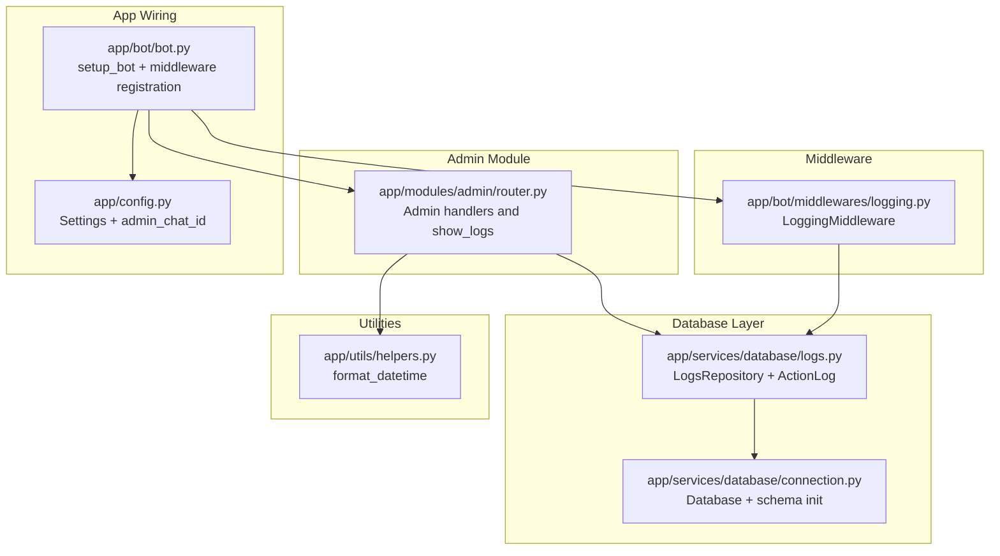
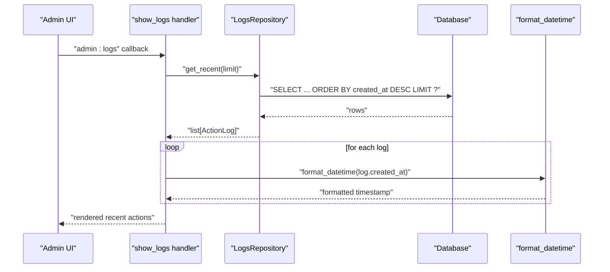
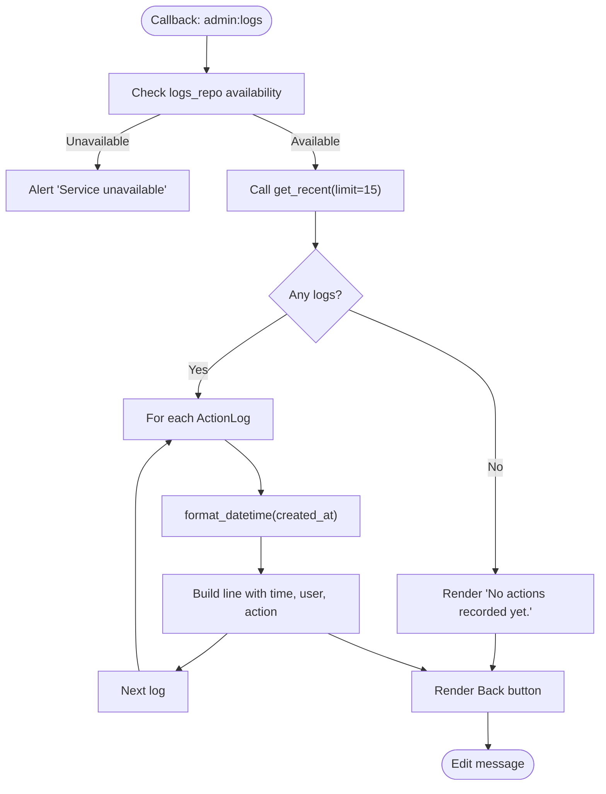
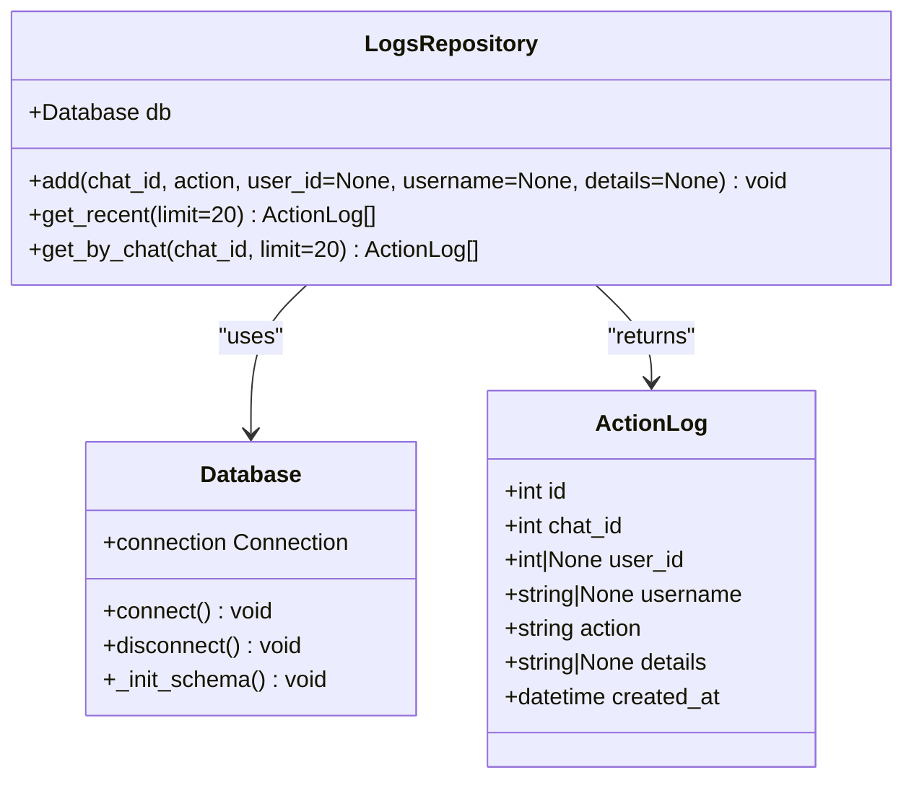
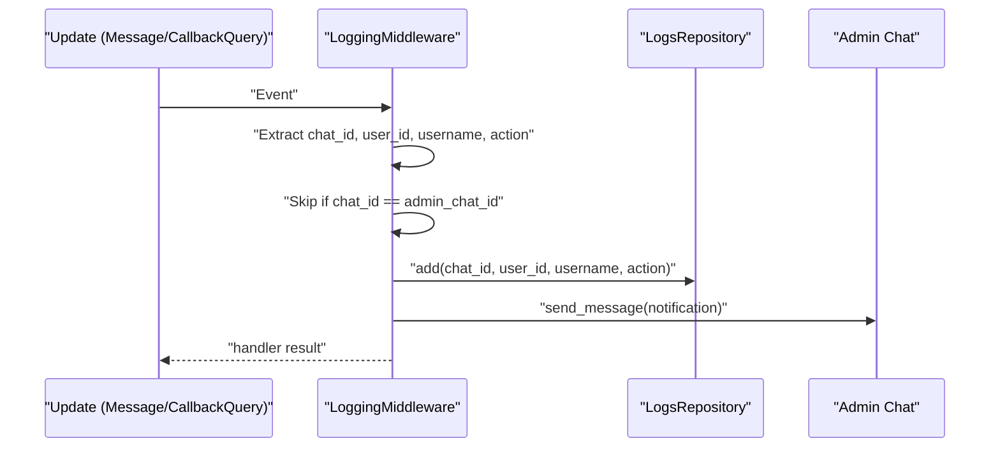
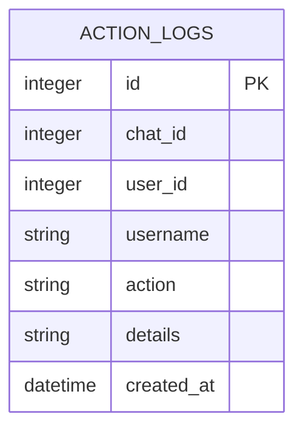
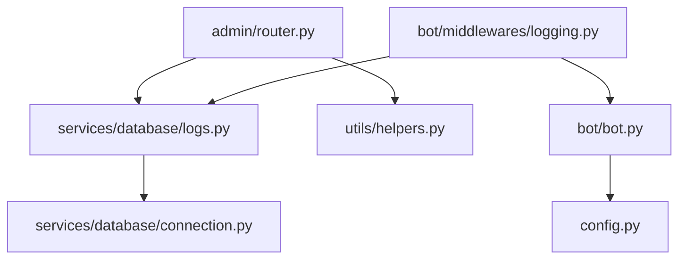

# Activity Logging

<cite>
**Referenced Files in This Document**
- [app/modules/admin/router.py](file://app/modules/admin/router.py)
- [app/services/database/logs.py](file://app/services/database/logs.py)
- [app/utils/helpers.py](file://app/utils/helpers.py)
- [app/bot/middlewares/logging.py](file://app/bot/middlewares/logging.py)
- [app/services/database/connection.py](file://app/services/database/connection.py)
- [app/bot/bot.py](file://app/bot/bot.py)
- [app/config.py](file://app/config.py)
</cite>

## Table of Contents
1. [Introduction](#introduction)
2. [Project Structure](#project-structure)
3. [Core Components](#core-components)
4. [Architecture Overview](#architecture-overview)
5. [Detailed Component Analysis](#detailed-component-analysis)
6. [Dependency Analysis](#dependency-analysis)
7. [Performance Considerations](#performance-considerations)
8. [Troubleshooting Guide](#troubleshooting-guide)
9. [Conclusion](#conclusion)

## Introduction
This document describes the Activity Logging system within the Admin Module. It focuses on the show_logs functionality that displays recent action logs with timestamps, user identification, and action descriptions. It explains the LogsRepository integration, the get_recent method with configurable limits, and the format_datetime utility for user-friendly timestamp display. It also documents the log data structure, common logged activities, audit trail capabilities, privacy considerations, and the database schema supporting the logging functionality.

## Project Structure
The Activity Logging system spans several modules:
- Admin module handlers and routing
- Database layer with repository and schema
- Middleware that captures user actions
- Utility functions for formatting
- Application configuration and dependency wiring

**Diagram sources**
- [app/modules/admin/router.py](file://app/modules/admin/router.py#L193-L221)
- [app/services/database/logs.py](file://app/services/database/logs.py#L22-L89)
- [app/services/database/connection.py](file://app/services/database/connection.py#L34-L58)
- [app/bot/middlewares/logging.py](file://app/bot/middlewares/logging.py#L12-L75)
- [app/utils/helpers.py](file://app/utils/helpers.py#L6-L8)
- [app/bot/bot.py](file://app/bot/bot.py#L18-L51)
- [app/config.py](file://app/config.py#L8-L35)

**Section sources**
- [app/modules/admin/router.py](file://app/modules/admin/router.py#L1-L222)
- [app/services/database/logs.py](file://app/services/database/logs.py#L1-L90)
- [app/services/database/connection.py](file://app/services/database/connection.py#L1-L59)
- [app/bot/middlewares/logging.py](file://app/bot/middlewares/logging.py#L1-L76)
- [app/utils/helpers.py](file://app/utils/helpers.py#L1-L16)
- [app/bot/bot.py](file://app/bot/bot.py#L1-L83)
- [app/config.py](file://app/config.py#L1-L52)

## Core Components
- Admin show_logs handler: Retrieves recent logs via LogsRepository, formats timestamps with format_datetime, and renders a user-friendly list.
- LogsRepository: Provides add and get_recent methods to persist and query logs, with configurable limits.
- LoggingMiddleware: Captures user actions (messages and callbacks), filters admin chat traffic, persists logs, and notifies the admin chat.
- ActionLog dataclass: Defines the log record structure with id, chat_id, user_id, username, action, details, and created_at.
- Database schema: Declares the action_logs table and index on created_at for efficient sorting and pagination.
- format_datetime utility: Converts datetime objects to a readable string format for display.
- Dependency wiring: setup_bot wires repositories, middleware, and admin dependencies.

**Section sources**
- [app/modules/admin/router.py](file://app/modules/admin/router.py#L193-L221)
- [app/services/database/logs.py](file://app/services/database/logs.py#L9-L20)
- [app/services/database/logs.py](file://app/services/database/logs.py#L22-L89)
- [app/bot/middlewares/logging.py](file://app/bot/middlewares/logging.py#L12-L75)
- [app/utils/helpers.py](file://app/utils/helpers.py#L6-L8)
- [app/services/database/connection.py](file://app/services/database/connection.py#L45-L57)
- [app/bot/bot.py](file://app/bot/bot.py#L32-L47)

## Architecture Overview
The Activity Logging system follows a layered architecture:
- Presentation layer: Admin handlers render logs.
- Business logic layer: LogsRepository encapsulates persistence and retrieval.
- Data access layer: Database manages schema and connections.
- Cross-cutting concerns: Middleware captures events and writes logs.

**Diagram sources**
- [app/modules/admin/router.py](file://app/modules/admin/router.py#L193-L221)
- [app/services/database/logs.py](file://app/services/database/logs.py#L46-L64)
- [app/utils/helpers.py](file://app/utils/helpers.py#L6-L8)

## Detailed Component Analysis

### Admin show_logs handler
- Purpose: Display recent actions performed by users in non-admin chats.
- Behavior:
  - Validates repository availability.
  - Calls get_recent with a limit of 15.
  - Formats created_at using format_datetime.
  - Builds a human-readable text with timestamps, usernames or user IDs, and action descriptions.
  - Provides a Back button to return to the admin menu.
- Integration points:
  - Uses AdminDeps for dependency injection.
  - Renders inline keyboard for navigation.

**Diagram sources**
- [app/modules/admin/router.py](file://app/modules/admin/router.py#L193-L221)
- [app/utils/helpers.py](file://app/utils/helpers.py#L6-L8)

**Section sources**
- [app/modules/admin/router.py](file://app/modules/admin/router.py#L193-L221)

### LogsRepository and ActionLog
- ActionLog fields:
  - id: integer primary key
  - chat_id: integer (non-null)
  - user_id: integer or null
  - username: text or null
  - action: text (non-null)
  - details: text or null
  - created_at: datetime (default current timestamp)
- Methods:
  - add: inserts a new log entry with chat_id, user_id, username, action, and optional details.
  - get_recent(limit): selects logs ordered by created_at descending with a configurable limit.
  - get_by_chat(chat_id, limit): filters logs by chat_id and orders by created_at descending.
- Data mapping:
  - Rows are mapped to ActionLog instances, converting created_at from ISO string to datetime.

**Diagram sources**
- [app/services/database/logs.py](file://app/services/database/logs.py#L9-L20)
- [app/services/database/logs.py](file://app/services/database/logs.py#L22-L89)
- [app/services/database/connection.py](file://app/services/database/connection.py#L7-L32)

**Section sources**
- [app/services/database/logs.py](file://app/services/database/logs.py#L9-L20)
- [app/services/database/logs.py](file://app/services/database/logs.py#L22-L89)

### LoggingMiddleware
- Purpose: Capture user actions and write them to the logs while notifying the admin chat.
- Behavior:
  - Extracts chat_id, user_id, username, and action from Message or CallbackQuery.
  - Skips admin chat traffic to avoid self-audit loops.
  - Persists the action via LogsRepository.add.
  - Sends a formatted notification to the admin chat using format_datetime.
  - Swallows notification errors to keep the pipeline resilient.
- Integration:
  - Registered for both message and callback_query updates.
  - Uses admin_chat_id from settings to filter admin traffic.

**Diagram sources**
- [app/bot/middlewares/logging.py](file://app/bot/middlewares/logging.py#L20-L75)
- [app/bot/bot.py](file://app/bot/bot.py#L44-L47)
- [app/config.py](file://app/config.py#L17-L26)

**Section sources**
- [app/bot/middlewares/logging.py](file://app/bot/middlewares/logging.py#L12-L75)
- [app/bot/bot.py](file://app/bot/bot.py#L44-L47)
- [app/config.py](file://app/config.py#L17-L26)

### Database Schema and Indexes
- Table: action_logs
  - Columns: id, chat_id, user_id, username, action, details, created_at
  - Constraints: primary key on id; default current timestamp on created_at
- Index: idx_action_logs_created_at on created_at DESC to optimize ordering and pagination.

**Diagram sources**
- [app/services/database/connection.py](file://app/services/database/connection.py#L45-L57)

**Section sources**
- [app/services/database/connection.py](file://app/services/database/connection.py#L34-L58)

### Utility: format_datetime
- Purpose: Convert datetime objects to a user-friendly string format for display.
- Usage: Applied in admin logs rendering and middleware notifications.

**Section sources**
- [app/utils/helpers.py](file://app/utils/helpers.py#L6-L8)
- [app/modules/admin/router.py](file://app/modules/admin/router.py#L205-L206)
- [app/bot/middlewares/logging.py](file://app/bot/middlewares/logging.py#L61-L68)

## Dependency Analysis
- Admin handler depends on LogsRepository and format_datetime.
- LogsRepository depends on Database for SQL operations.
- LoggingMiddleware depends on LogsRepository, Bot, and admin_chat_id.
- setup_bot wires repositories, registers middlewares, and injects admin dependencies.
- Configuration supplies admin_chat_id and database path.

**Diagram sources**
- [app/modules/admin/router.py](file://app/modules/admin/router.py#L9-L17)
- [app/services/database/logs.py](file://app/services/database/logs.py#L25-L26)
- [app/bot/middlewares/logging.py](file://app/bot/middlewares/logging.py#L15-L18)
- [app/bot/bot.py](file://app/bot/bot.py#L32-L37)
- [app/config.py](file://app/config.py#L17-L26)

**Section sources**
- [app/modules/admin/router.py](file://app/modules/admin/router.py#L9-L17)
- [app/services/database/logs.py](file://app/services/database/logs.py#L25-L26)
- [app/bot/middlewares/logging.py](file://app/bot/middlewares/logging.py#L15-L18)
- [app/bot/bot.py](file://app/bot/bot.py#L32-L37)
- [app/config.py](file://app/config.py#L17-L26)

## Performance Considerations
- Query efficiency: get_recent orders by created_at DESC and applies LIMIT, leveraging the index on created_at for fast retrieval.
- Pagination: The limit parameter allows tuning the number of records fetched; the admin handler uses a moderate limit to balance readability and performance.
- Middleware overhead: LoggingMiddleware executes per update; ensure minimal overhead by avoiding heavy operations in the handler chain.
- Database I/O: Each add operation commits immediately; consider batching for high-volume scenarios if needed.

[No sources needed since this section provides general guidance]

## Troubleshooting Guide
- No logs displayed:
  - Verify that LogsRepository is injected into AdminDeps and that the handler checks availability before querying.
  - Confirm that get_recent(limit) returns results; adjust limit if necessary.
- Incorrect timestamps:
  - Ensure format_datetime receives a datetime object; created_at is parsed from ISO string in repository mapping.
- Admin chat flooding:
  - LoggingMiddleware skips admin chat traffic; verify admin_chat_id configuration.
- Database connectivity:
  - Ensure Database.connect initializes schema and that the action_logs table exists with the created_at index.
- Notification failures:
  - Middleware swallows notification errors; check logs for exceptions and network issues.

**Section sources**
- [app/modules/admin/router.py](file://app/modules/admin/router.py#L196-L198)
- [app/services/database/logs.py](file://app/services/database/logs.py#L46-L64)
- [app/bot/middlewares/logging.py](file://app/bot/middlewares/logging.py#L50-L73)
- [app/services/database/connection.py](file://app/services/database/connection.py#L34-L58)
- [app/config.py](file://app/config.py#L17-L26)

## Conclusion
The Activity Logging system integrates middleware-driven capture, repository-managed persistence, and admin UI rendering to provide a robust audit trail. Administrators can monitor recent actions, track user behavior, and detect anomalies by reviewing formatted timestamps, usernames, and action descriptions. The design balances simplicity with extensibility, enabling configurable limits and future enhancements such as filtering by chat or action type.