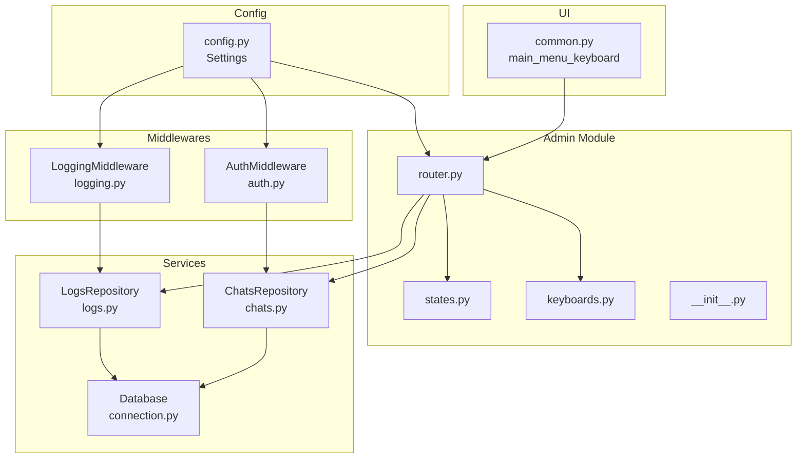
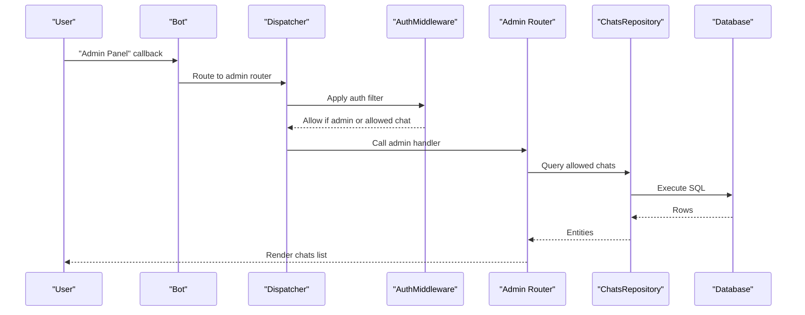
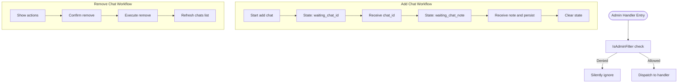
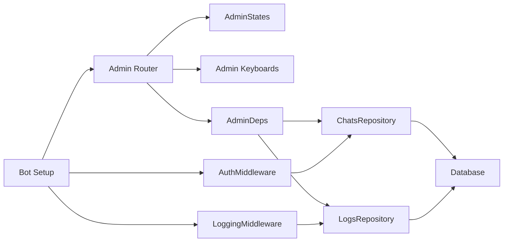

# Admin Module

<cite>
**Referenced Files in This Document**
- [app/modules/admin/__init__.py](file://app/modules/admin/__init__.py)
- [app/modules/admin/router.py](file://app/modules/admin/router.py)
- [app/modules/admin/states.py](file://app/modules/admin/states.py)
- [app/modules/admin/keyboards.py](file://app/modules/admin/keyboards.py)
- [app/bot/bot.py](file://app/bot/bot.py)
- [app/bot/middlewares/auth.py](file://app/bot/middlewares/auth.py)
- [app/bot/middlewares/logging.py](file://app/bot/middlewares/logging.py)
- [app/bot/keyboards/common.py](file://app/bot/keyboards/common.py)
- [app/services/database/chats.py](file://app/services/database/chats.py)
- [app/services/database/logs.py](file://app/services/database/logs.py)
- [app/services/database/connection.py](file://app/services/database/connection.py)
- [app/utils/helpers.py](file://app/utils/helpers.py)
- [app/config.py](file://app/config.py)
- [app/main.py](file://app/main.py)
</cite>

## Table of Contents
1. [Introduction](#introduction)
2. [Project Structure](#project-structure)
3. [Core Components](#core-components)
4. [Architecture Overview](#architecture-overview)
5. [Detailed Component Analysis](#detailed-component-analysis)
6. [Dependency Analysis](#dependency-analysis)
7. [Performance Considerations](#performance-considerations)
8. [Troubleshooting Guide](#troubleshooting-guide)
9. [Conclusion](#conclusion)
10. [Appendices](#appendices)

## Introduction
This document describes the Admin Module functionality for the Telegram bot. It covers the administrative workflow for managing allowed chats, enforcing admin-only access, logging activities, and the state machine used for multi-step operations. It also documents the inline keyboard navigation system, the IsAdminFilter mechanism, dependency injection pattern for repositories, and the admin chat ID validation system.

## Project Structure
The Admin Module is organized under app/modules/admin with four primary files:
- router.py: Defines admin routes, filters, handlers, and dependency injection container
- states.py: Declares finite state machine states for admin operations
- keyboards.py: Provides inline keyboard builders for admin menus and actions
- __init__.py: Exports the admin router for inclusion in the dispatcher

The module integrates with:
- Database repositories (ChatsRepository, LogsRepository) for persistence
- Middlewares (AuthMiddleware, LoggingMiddleware) for access control and audit logging
- Common keyboards for main menu and navigation
- Configuration settings for admin_chat_id and database path

**Diagram sources**
- [app/modules/admin/router.py](file://app/modules/admin/router.py#L1-L222)
- [app/modules/admin/states.py](file://app/modules/admin/states.py#L1-L12)
- [app/modules/admin/keyboards.py](file://app/modules/admin/keyboards.py#L1-L76)
- [app/services/database/chats.py](file://app/services/database/chats.py#L1-L79)
- [app/services/database/logs.py](file://app/services/database/logs.py#L1-L90)
- [app/services/database/connection.py](file://app/services/database/connection.py#L1-L59)
- [app/bot/middlewares/auth.py](file://app/bot/middlewares/auth.py#L1-L46)
- [app/bot/middlewares/logging.py](file://app/bot/middlewares/logging.py#L1-L76)
- [app/bot/keyboards/common.py](file://app/bot/keyboards/common.py#L1-L42)
- [app/config.py](file://app/config.py#L1-L52)

**Section sources**
- [app/modules/admin/__init__.py](file://app/modules/admin/__init__.py#L1-L6)
- [app/modules/admin/router.py](file://app/modules/admin/router.py#L1-L222)
- [app/modules/admin/states.py](file://app/modules/admin/states.py#L1-L12)
- [app/modules/admin/keyboards.py](file://app/modules/admin/keyboards.py#L1-L76)

## Core Components
- Admin router and handlers: Centralized admin routes, inline keyboard navigation, and state-driven workflows
- Admin FSM states: Multi-step state machine for adding chats and confirming removals
- Admin keyboards: Builders for admin menu, chat lists, actions, and confirmation dialogs
- IsAdminFilter: Enforces admin-only access to admin handlers
- Dependency injection container: AdminDeps holds repositories and admin_chat_id for handlers
- Access control middleware: AuthMiddleware checks allowed chats and admin privileges
- Activity logging middleware: LoggingMiddleware records actions and notifies admin
- Database repositories: ChatsRepository manages allowed chats; LogsRepository stores actions
- Database connection: SQLite-backed with schema initialization

**Section sources**
- [app/modules/admin/router.py](file://app/modules/admin/router.py#L1-L222)
- [app/modules/admin/states.py](file://app/modules/admin/states.py#L1-L12)
- [app/modules/admin/keyboards.py](file://app/modules/admin/keyboards.py#L1-L76)
- [app/bot/middlewares/auth.py](file://app/bot/middlewares/auth.py#L1-L46)
- [app/bot/middlewares/logging.py](file://app/bot/middlewares/logging.py#L1-L76)
- [app/services/database/chats.py](file://app/services/database/chats.py#L1-L79)
- [app/services/database/logs.py](file://app/services/database/logs.py#L1-L90)
- [app/services/database/connection.py](file://app/services/database/connection.py#L1-L59)

## Architecture Overview
The Admin Module follows a layered architecture:
- Presentation layer: Inline keyboards and handlers render UI and process user input
- Control layer: Router applies filters, manages FSM states, and delegates to repositories
- Persistence layer: Repositories encapsulate database operations
- Cross-cutting concerns: Middlewares enforce access control and log actions

**Diagram sources**
- [app/bot/middlewares/auth.py](file://app/bot/middlewares/auth.py#L1-L46)
- [app/modules/admin/router.py](file://app/modules/admin/router.py#L1-L222)
- [app/services/database/chats.py](file://app/services/database/chats.py#L1-L79)
- [app/services/database/connection.py](file://app/services/database/connection.py#L1-L59)

## Detailed Component Analysis

### Admin Router and Handlers
The admin router defines:
- AdminDeps dependency container holding ChatsRepository, LogsRepository, and admin_chat_id
- setup_admin_deps to inject dependencies at runtime
- IsAdminFilter to restrict access to admin_chat_id
- Handlers for:
  - Admin menu navigation
  - Listing allowed chats
  - Adding chats via multi-step FSM
  - Showing chat actions and confirming removals
  - Viewing recent action logs

Key behaviors:
- Applies IsAdminFilter to all admin handlers
- Uses FSM states to manage multi-step flows
- Renders dynamic inline keyboards based on current state and data

**Diagram sources**
- [app/modules/admin/router.py](file://app/modules/admin/router.py#L1-L222)
- [app/modules/admin/states.py](file://app/modules/admin/states.py#L1-L12)

**Section sources**
- [app/modules/admin/router.py](file://app/modules/admin/router.py#L1-L222)
- [app/modules/admin/states.py](file://app/modules/admin/states.py#L1-L12)

### Admin FSM States
The AdminStates group defines:
- waiting_chat_id: Captures numeric chat ID input
- waiting_chat_note: Captures optional note or skip marker
- confirm_remove_chat: Reserved for future confirmation flows

Complexity:
- O(1) transitions between states
- Minimal memory footprint for state data

**Section sources**
- [app/modules/admin/states.py](file://app/modules/admin/states.py#L1-L12)

### Inline Keyboard Navigation
Admin keyboards provide:
- admin_menu_keyboard: Main admin menu with Allowed Chats, Action Logs, Back
- chats_list_keyboard: Lists allowed chats with Add Chat and Back buttons
- chat_actions_keyboard: Per-chat actions (Remove) and Back
- confirm_remove_keyboard: Yes/Cancel confirmation for removal

Navigation pattern:
- Handlers edit existing messages with updated keyboards
- Callback data encodes operation identifiers and parameters

**Section sources**
- [app/modules/admin/keyboards.py](file://app/modules/admin/keyboards.py#L1-L76)
- [app/bot/keyboards/common.py](file://app/bot/keyboards/common.py#L1-L42)

### IsAdminFilter Mechanism
IsAdminFilter ensures only admin_chat_id can access admin handlers:
- Extracts chat_id from Message or CallbackQuery
- Compares against injected admin_chat_id
- Returns False if admin_chat_id not configured

Integration:
- Applied globally to admin router’s message and callback_query filters

**Section sources**
- [app/modules/admin/router.py](file://app/modules/admin/router.py#L43-L61)

### Access Control Middleware (AuthMiddleware)
AuthMiddleware enforces allowed chat access:
- Extracts chat_id from incoming events
- Grants admin access if chat_id equals admin_chat_id
- Checks ChatsRepository.is_allowed for non-admin chats
- Silently ignores unauthorized events

Integration:
- Registered as middleware in bot setup
- Injects is_admin flag into handler data

**Section sources**
- [app/bot/middlewares/auth.py](file://app/bot/middlewares/auth.py#L1-L46)
- [app/bot/bot.py](file://app/bot/bot.py#L44-L47)

### Activity Logging System (LoggingMiddleware)
LoggingMiddleware captures and reports user actions:
- Extracts chat_id, user_id, username, and action from events
- Persists logs via LogsRepository
- Sends admin notifications via Bot
- Ignores admin actions and errors during notification

Integration:
- Registered as middleware in bot setup
- Uses format_datetime helper for timestamps

**Section sources**
- [app/bot/middlewares/logging.py](file://app/bot/middlewares/logging.py#L1-L76)
- [app/utils/helpers.py](file://app/utils/helpers.py#L1-L16)
- [app/bot/bot.py](file://app/bot/bot.py#L46-L47)

### Database Repositories and Schema
ChatsRepository:
- Manages allowed chats with CRUD operations
- Provides is_allowed and get_chat_ids for access checks
- Returns entities with parsed datetimes

LogsRepository:
- Stores action logs with user context
- Supports recent logs and chat-specific queries

Database:
- SQLite-backed with schema initialization
- Creates tables and indexes for performance

**Section sources**
- [app/services/database/chats.py](file://app/services/database/chats.py#L1-L79)
- [app/services/database/logs.py](file://app/services/database/logs.py#L1-L90)
- [app/services/database/connection.py](file://app/services/database/connection.py#L1-L59)

### Dependency Injection Pattern
AdminDeps container centralizes dependencies:
- Holds ChatsRepository, LogsRepository, and admin_chat_id
- setup_admin_deps initializes dependencies during bot setup
- Admin handlers access dependencies via deps

Bot setup:
- Creates Database, ChatsRepository, LogsRepository
- Calls setup_admin_deps with repositories and admin_chat_id
- Registers middlewares and routers

**Section sources**
- [app/modules/admin/router.py](file://app/modules/admin/router.py#L22-L41)
- [app/bot/bot.py](file://app/bot/bot.py#L32-L51)

### Admin Chat ID Validation System
Validation occurs at two levels:
- IsAdminFilter: Ensures only admin_chat_id can trigger admin handlers
- AuthMiddleware: Prevents non-allowed chats from using bot features
- Configuration: admin_chat_id loaded from environment via Settings

**Section sources**
- [app/modules/admin/router.py](file://app/modules/admin/router.py#L43-L61)
- [app/bot/middlewares/auth.py](file://app/bot/middlewares/auth.py#L1-L46)
- [app/config.py](file://app/config.py#L1-L52)

## Dependency Analysis
The Admin Module depends on:
- Router: Depends on AdminDeps, FSM states, keyboards, and repositories
- FSM states: Used by router for multi-step flows
- Keyboards: Built by router handlers and passed to edit_text
- Repositories: Accessed via AdminDeps in handlers
- Middlewares: AuthMiddleware and LoggingMiddleware registered in bot setup
- Database: Connection initialized and schema created in bot setup

**Diagram sources**
- [app/modules/admin/router.py](file://app/modules/admin/router.py#L1-L222)
- [app/modules/admin/states.py](file://app/modules/admin/states.py#L1-L12)
- [app/modules/admin/keyboards.py](file://app/modules/admin/keyboards.py#L1-L76)
- [app/services/database/chats.py](file://app/services/database/chats.py#L1-L79)
- [app/services/database/logs.py](file://app/services/database/logs.py#L1-L90)
- [app/services/database/connection.py](file://app/services/database/connection.py#L1-L59)
- [app/bot/middlewares/auth.py](file://app/bot/middlewares/auth.py#L1-L46)
- [app/bot/middlewares/logging.py](file://app/bot/middlewares/logging.py#L1-L76)
- [app/bot/bot.py](file://app/bot/bot.py#L32-L51)

**Section sources**
- [app/modules/admin/router.py](file://app/modules/admin/router.py#L1-L222)
- [app/bot/bot.py](file://app/bot/bot.py#L32-L51)

## Performance Considerations
- Database operations are synchronous in the current design; consider batching inserts and using transactions for bulk operations
- Indexes exist on action_logs created_at; ensure appropriate indexing for allowed_chats if scaling
- LoggingMiddleware performs an insert and a send_message; consider rate limiting or queueing for high-volume scenarios
- Inline keyboard rendering is efficient; avoid excessive dynamic updates in rapid succession

## Troubleshooting Guide
Common issues and resolutions:
- Admin handlers not responding:
  - Verify admin_chat_id is configured and matches the admin chat
  - Confirm IsAdminFilter is applied to admin router
- Service unavailable errors:
  - Ensure setup_admin_deps is called with valid repositories
  - Check database connectivity and schema initialization
- Unauthorized access attempts:
  - AuthMiddleware silently ignores non-allowed chats; verify allowed_chats table
- Logging not appearing:
  - Confirm LoggingMiddleware is registered and admin_chat_id is set
  - Check database write permissions and LogsRepository operations

**Section sources**
- [app/modules/admin/router.py](file://app/modules/admin/router.py#L32-L41)
- [app/bot/middlewares/auth.py](file://app/bot/middlewares/auth.py#L34-L45)
- [app/bot/middlewares/logging.py](file://app/bot/middlewares/logging.py#L50-L75)
- [app/services/database/connection.py](file://app/services/database/connection.py#L34-L59)

## Conclusion
The Admin Module provides a robust foundation for managing allowed chats, enforcing admin-only access, and maintaining an audit trail. Its state machine enables intuitive multi-step workflows, while the dependency injection pattern cleanly separates concerns. The combination of IsAdminFilter, AuthMiddleware, and LoggingMiddleware ensures secure and observable operations.

## Appendices

### Practical Admin Tasks
- Add a user chat:
  - Navigate to Admin Panel -> Allowed Chats -> Add Chat
  - Enter chat ID and optional note
  - Confirmation appears upon success
- Manage permissions:
  - View allowed chats list
  - Select a chat to remove it after confirmation
- Monitor system activity:
  - Open Admin Panel -> Action Logs
  - Review recent actions and user context

### API and Data Model References
- AllowedChat entity fields: id, chat_id, added_by, added_at, note
- ActionLog entity fields: id, chat_id, user_id, username, action, details, created_at

**Section sources**
- [app/services/database/chats.py](file://app/services/database/chats.py#L9-L18)
- [app/services/database/logs.py](file://app/services/database/logs.py#L9-L20)