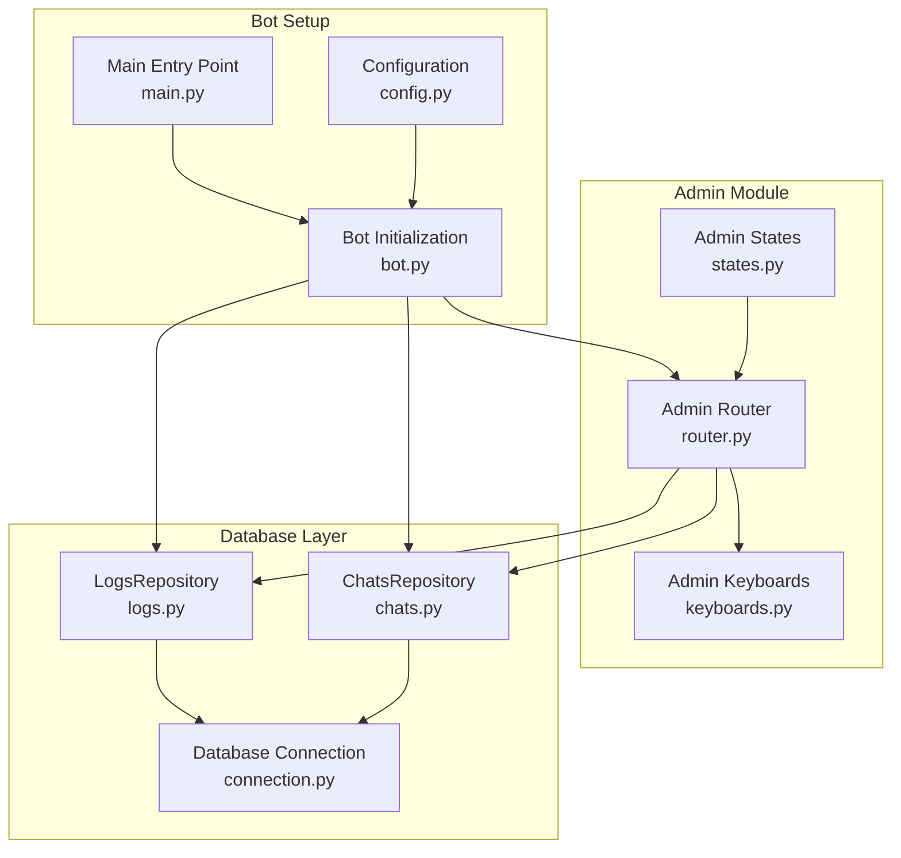
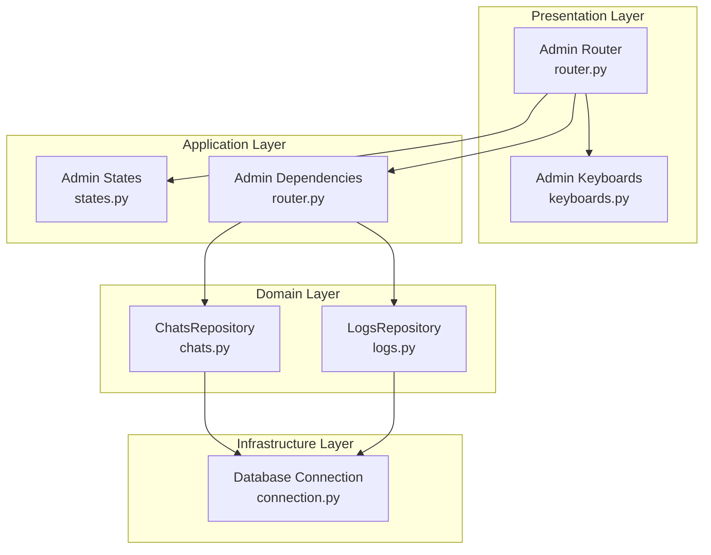
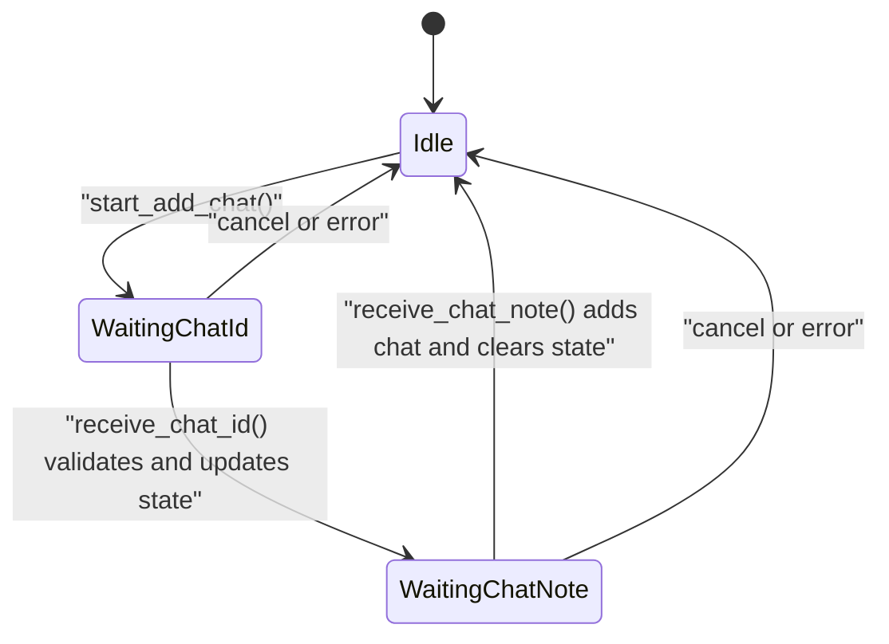
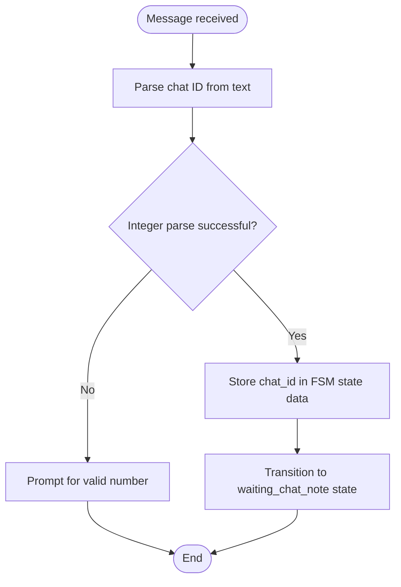
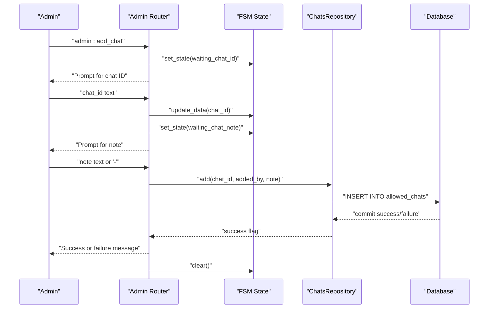
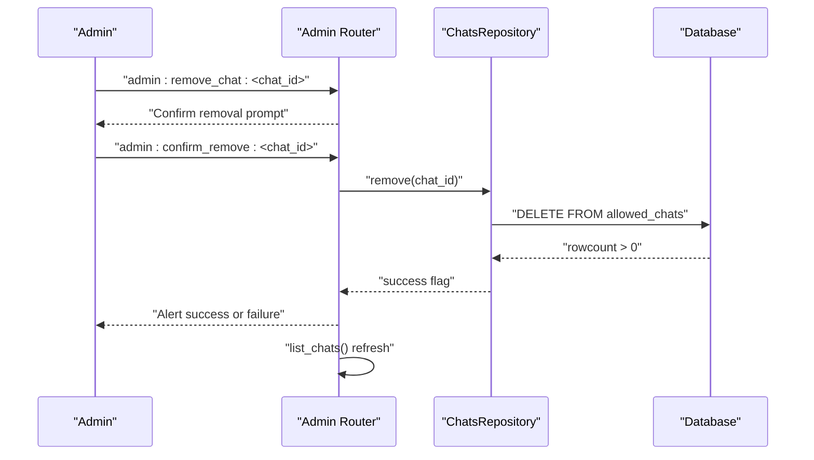
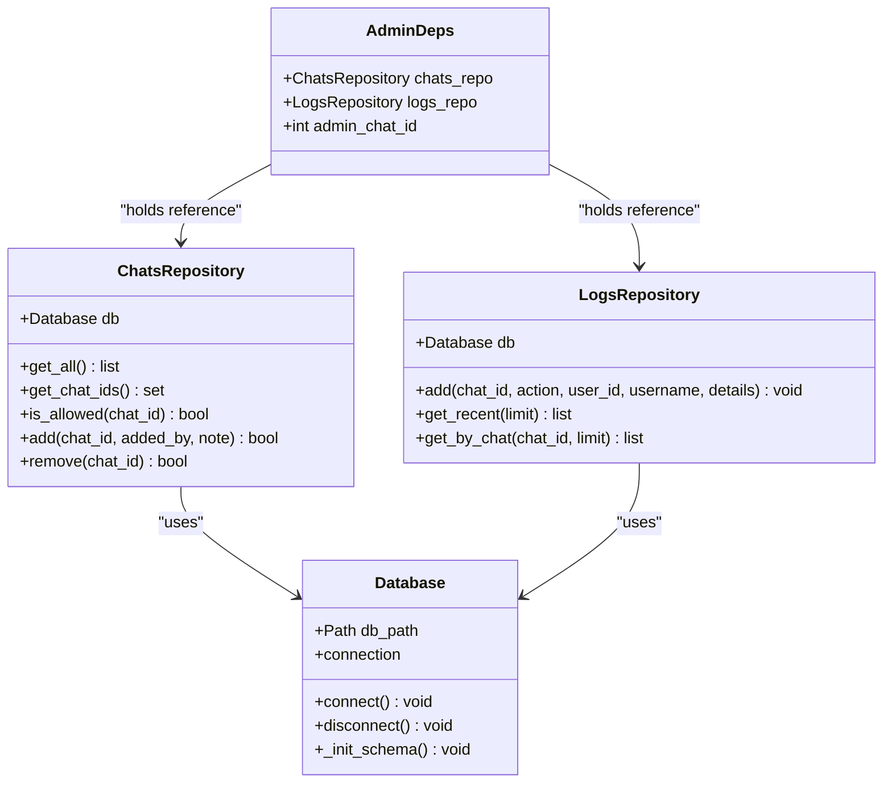
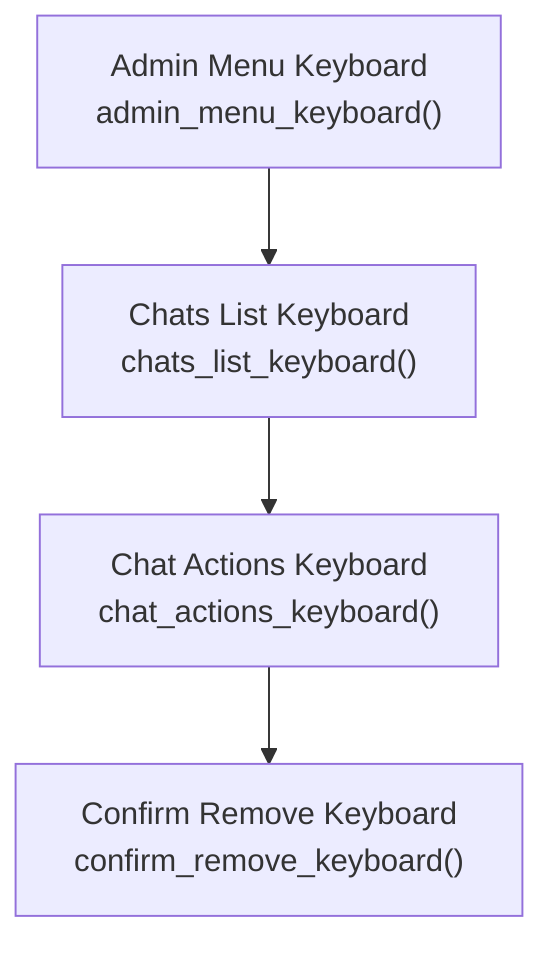
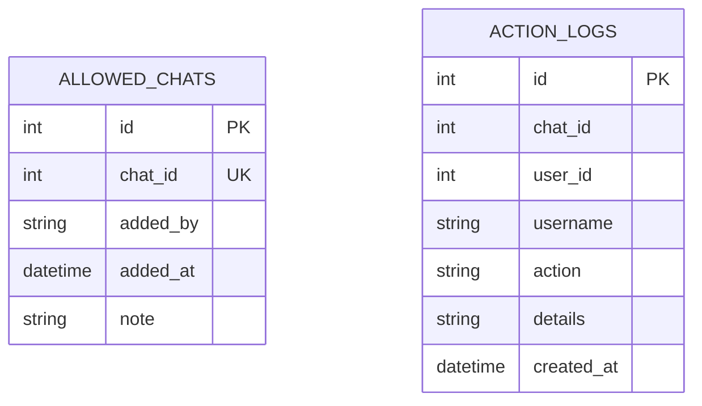
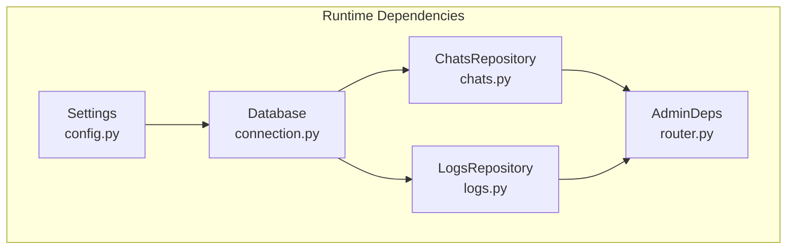

# Permission Management

<cite>
**Referenced Files in This Document**
- [states.py](file://app/modules/admin/states.py)
- [router.py](file://app/modules/admin/router.py)
- [keyboards.py](file://app/modules/admin/keyboards.py)
- [chats.py](file://app/services/database/chats.py)
- [connection.py](file://app/services/database/connection.py)
- [logs.py](file://app/services/database/logs.py)
- [bot.py](file://app/bot/bot.py)
- [config.py](file://app/config.py)
- [main.py](file://app/main.py)
</cite>

## Table of Contents
1. [Introduction](#introduction)
2. [Project Structure](#project-structure)
3. [Core Components](#core-components)
4. [Architecture Overview](#architecture-overview)
5. [Detailed Component Analysis](#detailed-component-analysis)
6. [Dependency Analysis](#dependency-analysis)
7. [Performance Considerations](#performance-considerations)
8. [Troubleshooting Guide](#troubleshooting-guide)
9. [Conclusion](#conclusion)

## Introduction
This document provides comprehensive documentation for the Permission Management functionality within the Admin Module. It covers the complete workflow for adding and removing allowed chat IDs, the finite state machine implementation with dedicated states for collecting chat IDs and notes, the chat ID validation process, the note assignment system, and the dependency injection pattern used for the ChatsRepository. It also details the multi-step conversation flow from receiving chat ID input to confirming addition, practical examples of common permission management scenarios, error handling for invalid inputs, and integration with the database layer. Finally, it addresses user experience patterns for chat ID collection using @userinfobot and the note-taking system for organizational purposes.

## Project Structure
The Permission Management feature is organized within the Admin Module and integrates with the database service layer and bot setup. The key components are:
- Admin States: Define the finite state machine states for the permission management workflow.
- Admin Router: Contains handlers for admin commands, chat management actions, and keyboard interactions.
- Admin Keyboards: Provide inline keyboard layouts for navigation and actions.
- Database Layer: Manages allowed chats and action logs with repositories and a connection manager.
- Bot Setup: Initializes dependencies and registers middleware and routers.

**Diagram sources**
- [states.py](file://app/modules/admin/states.py#L1-L12)
- [router.py](file://app/modules/admin/router.py#L1-L222)
- [keyboards.py](file://app/modules/admin/keyboards.py#L1-L76)
- [chats.py](file://app/services/database/chats.py#L1-L79)
- [connection.py](file://app/services/database/connection.py#L1-L59)
- [logs.py](file://app/services/database/logs.py#L1-L90)
- [bot.py](file://app/bot/bot.py#L1-L83)
- [config.py](file://app/config.py#L1-L52)
- [main.py](file://app/main.py#L1-L30)

**Section sources**
- [states.py](file://app/modules/admin/states.py#L1-L12)
- [router.py](file://app/modules/admin/router.py#L1-L222)
- [keyboards.py](file://app/modules/admin/keyboards.py#L1-L76)
- [chats.py](file://app/services/database/chats.py#L1-L79)
- [connection.py](file://app/services/database/connection.py#L1-L59)
- [logs.py](file://app/services/database/logs.py#L1-L90)
- [bot.py](file://app/bot/bot.py#L1-L83)
- [config.py](file://app/config.py#L1-L52)
- [main.py](file://app/main.py#L1-L30)

## Core Components
- Admin States: Defines the finite state machine states for admin operations, including waiting for chat ID input and waiting for chat notes.
- Admin Router: Implements handlers for starting the add-chat flow, receiving chat IDs, receiving notes, listing allowed chats, and removing chats. It also manages dependency injection for repositories and admin chat ID.
- Admin Keyboards: Provides inline keyboard layouts for navigating the admin panel, listing allowed chats, performing chat actions, and confirming removal.
- ChatsRepository: Manages allowed chats with methods to retrieve, add, and remove chats, and to check if a chat is allowed.
- Database Connection: Initializes SQLite schema for allowed chats and action logs, and provides a connection manager.
- LogsRepository: Manages action logs with methods to add entries and retrieve recent logs.
- Bot Setup: Initializes settings, database, repositories, and registers middleware and routers. It also sets up admin dependencies.

**Section sources**
- [states.py](file://app/modules/admin/states.py#L6-L12)
- [router.py](file://app/modules/admin/router.py#L22-L41)
- [keyboards.py](file://app/modules/admin/keyboards.py#L9-L76)
- [chats.py](file://app/services/database/chats.py#L20-L79)
- [connection.py](file://app/services/database/connection.py#L7-L59)
- [logs.py](file://app/services/database/logs.py#L22-L90)
- [bot.py](file://app/bot/bot.py#L18-L83)

## Architecture Overview
The Permission Management feature follows a layered architecture:
- Presentation Layer: Admin Router and Keyboards handle user interactions.
- Application Layer: Handlers orchestrate state transitions and repository operations.
- Domain Layer: Repositories encapsulate data access logic.
- Infrastructure Layer: Database Connection manages schema initialization and connections.

**Diagram sources**
- [router.py](file://app/modules/admin/router.py#L1-L222)
- [states.py](file://app/modules/admin/states.py#L1-L12)
- [keyboards.py](file://app/modules/admin/keyboards.py#L1-L76)
- [chats.py](file://app/services/database/chats.py#L1-L79)
- [logs.py](file://app/services/database/logs.py#L1-L90)
- [connection.py](file://app/services/database/connection.py#L1-L59)

## Detailed Component Analysis

### Finite State Machine Implementation
The Permission Management workflow uses a finite state machine with two primary states for chat ID and note collection:
- AdminStates.waiting_chat_id: Awaiting the chat ID input from the admin.
- AdminStates.waiting_chat_note: Awaiting the note input for the chat.

**Diagram sources**
- [states.py](file://app/modules/admin/states.py#L6-L12)
- [router.py](file://app/modules/admin/router.py#L98-L150)

**Section sources**
- [states.py](file://app/modules/admin/states.py#L6-L12)
- [router.py](file://app/modules/admin/router.py#L98-L150)

### Chat ID Validation and Note Assignment
The chat ID validation process occurs when the admin sends the chat ID:
- The handler attempts to convert the message text to an integer.
- If conversion fails, the admin is prompted to resend a valid number.
- On success, the chat ID is stored in the FSM state data, and the state transitions to waiting for the note.

The note assignment system allows the admin to optionally provide a note for the chat:
- The note can be any text or a dash character to skip.
- The note is stored alongside the chat ID in the database.

**Diagram sources**
- [router.py](file://app/modules/admin/router.py#L109-L124)

**Section sources**
- [router.py](file://app/modules/admin/router.py#L109-L124)

### Multi-Step Conversation Flow
The conversation flow for adding a chat ID involves several steps:
1. Admin selects "Add Chat" from the allowed chats menu.
2. The system prompts for the chat ID and explains how to obtain it using @userinfobot.
3. The admin sends the chat ID; the system validates it.
4. The system prompts for an optional note.
5. The admin sends the note (or a dash to skip).
6. The system adds the chat to the allowed list and confirms success or failure.

**Diagram sources**
- [router.py](file://app/modules/admin/router.py#L98-L150)
- [chats.py](file://app/services/database/chats.py#L59-L70)
- [connection.py](file://app/services/database/connection.py#L36-L57)

**Section sources**
- [router.py](file://app/modules/admin/router.py#L98-L150)
- [chats.py](file://app/services/database/chats.py#L59-L70)

### Removing Allowed Chats
The removal workflow includes confirmation:
1. Admin selects a chat from the allowed chats list.
2. The system shows chat actions and prompts for removal confirmation.
3. The admin confirms removal.
4. The system removes the chat and refreshes the list.

**Diagram sources**
- [router.py](file://app/modules/admin/router.py#L163-L191)
- [chats.py](file://app/services/database/chats.py#L71-L79)
- [connection.py](file://app/services/database/connection.py#L36-L57)

**Section sources**
- [router.py](file://app/modules/admin/router.py#L163-L191)
- [chats.py](file://app/services/database/chats.py#L71-L79)

### Dependency Injection Pattern for ChatsRepository
The Admin Module uses a dependency injection pattern to manage repositories and admin chat ID:
- AdminDeps: A container class holding references to ChatsRepository, LogsRepository, and admin_chat_id.
- setup_admin_deps: A function to initialize the AdminDeps container with actual instances.
- Middleware Registration: The bot setup initializes repositories and admin dependencies during startup.

**Diagram sources**
- [router.py](file://app/modules/admin/router.py#L22-L41)
- [chats.py](file://app/services/database/chats.py#L20-L25)
- [logs.py](file://app/services/database/logs.py#L22-L27)
- [connection.py](file://app/services/database/connection.py#L7-L33)

**Section sources**
- [router.py](file://app/modules/admin/router.py#L22-L41)
- [bot.py](file://app/bot/bot.py#L32-L38)

### Keyboard Interactions
The admin interface uses inline keyboards for navigation and actions:
- Admin Menu Keyboard: Provides access to allowed chats, action logs, and back navigation.
- Chats List Keyboard: Lists allowed chats with management options and an add button.
- Chat Actions Keyboard: Offers remove action for a selected chat.
- Confirm Remove Keyboard: Prompts for confirmation before removing a chat.

**Diagram sources**
- [keyboards.py](file://app/modules/admin/keyboards.py#L9-L76)

**Section sources**
- [keyboards.py](file://app/modules/admin/keyboards.py#L9-L76)

### Database Integration
The database layer manages schema initialization and CRUD operations:
- Schema Initialization: Creates tables for allowed chats and action logs with appropriate indexes.
- CRUD Operations: Methods to retrieve, add, and remove allowed chats, and to add and retrieve action logs.
- Entity Models: Dataclasses representing AllowedChat and ActionLog for structured data access.

**Diagram sources**
- [connection.py](file://app/services/database/connection.py#L36-L57)
- [chats.py](file://app/services/database/chats.py#L9-L18)
- [logs.py](file://app/services/database/logs.py#L9-L20)

**Section sources**
- [connection.py](file://app/services/database/connection.py#L34-L59)
- [chats.py](file://app/services/database/chats.py#L26-L79)
- [logs.py](file://app/services/database/logs.py#L28-L90)

### Practical Examples of Permission Management Scenarios
Common scenarios include:
- Adding a new allowed chat with a descriptive note for team organization.
- Removing an outdated or unused chat from the allowed list.
- Listing all allowed chats with their notes for audit and review.
- Using @userinfobot to obtain chat IDs when integrating new teams or channels.

These scenarios are supported by the handlers and keyboard interactions defined in the Admin Module.

**Section sources**
- [router.py](file://app/modules/admin/router.py#L74-L96)
- [router.py](file://app/modules/admin/router.py#L98-L150)
- [router.py](file://app/modules/admin/router.py#L152-L191)
- [keyboards.py](file://app/modules/admin/keyboards.py#L24-L43)

### Error Handling for Invalid Inputs
The system handles various error conditions:
- Invalid Chat ID Input: When the admin sends non-numeric input, the system prompts for a valid number.
- Service Unavailable: If repositories are not initialized, handlers return appropriate alerts.
- Duplicate Chat Addition: Attempts to add an existing chat return a failure message.
- Removal Failure: If a chat is not found or an error occurs, the system returns an alert.

**Section sources**
- [router.py](file://app/modules/admin/router.py#L112-L117)
- [router.py](file://app/modules/admin/router.py#L129-L132)
- [router.py](file://app/modules/admin/router.py#L144-L147)
- [router.py](file://app/modules/admin/router.py#L177-L187)

## Dependency Analysis
The Admin Module depends on the database layer and bot setup for runtime configuration and repository initialization. The dependency injection pattern centralizes repository management and ensures consistent access across handlers.

**Diagram sources**
- [config.py](file://app/config.py#L8-L35)
- [connection.py](file://app/services/database/connection.py#L7-L33)
- [chats.py](file://app/services/database/chats.py#L20-L25)
- [logs.py](file://app/services/database/logs.py#L22-L27)
- [router.py](file://app/modules/admin/router.py#L22-L41)

**Section sources**
- [config.py](file://app/config.py#L8-L35)
- [connection.py](file://app/services/database/connection.py#L7-L33)
- [chats.py](file://app/services/database/chats.py#L20-L25)
- [logs.py](file://app/services/database/logs.py#L22-L27)
- [router.py](file://app/modules/admin/router.py#L22-L41)

## Performance Considerations
- Database Indexing: The schema includes an index on action logs creation time to optimize retrieval queries.
- Asynchronous Operations: All database operations use async/await patterns to prevent blocking the event loop.
- Minimal Data Transfer: Repositories return only necessary fields, reducing memory overhead.
- State Management: FSM state transitions minimize unnecessary database calls by batching operations.

[No sources needed since this section provides general guidance]

## Troubleshooting Guide
Common issues and resolutions:
- Database Not Connected: Ensure the database connection is established during bot setup.
- Missing Admin Chat ID: Verify the admin chat ID is configured in environment settings.
- Repository Initialization: Confirm that repositories are passed to setup_admin_deps during bot initialization.
- Keyboard Navigation: Ensure keyboard callbacks match expected patterns for navigation and actions.
- Logging Middleware: Verify logging middleware is registered to capture action logs.

**Section sources**
- [connection.py](file://app/services/database/connection.py#L14-L33)
- [config.py](file://app/config.py#L17-L29)
- [bot.py](file://app/bot/bot.py#L32-L47)
- [router.py](file://app/modules/admin/router.py#L59-L61)
- [logs.py](file://app/services/database/logs.py#L28-L44)

## Conclusion
The Permission Management functionality within the Admin Module provides a robust, user-friendly system for managing allowed chat IDs. The finite state machine ensures predictable user interactions, while the dependency injection pattern promotes clean separation of concerns and testability. The database layer offers reliable persistence with appropriate indexing and asynchronous operations. Together, these components deliver a comprehensive solution for organizing and controlling access within the application.