# Core Features

<cite>
**Referenced Files in This Document**
- [app/main.py](file://app/main.py)
- [app/bot/bot.py](file://app/bot/bot.py)
- [app/config.py](file://app/config.py)
- [app/bot/keyboards/common.py](file://app/bot/keyboards/common.py)
- [app/modules/admin/router.py](file://app/modules/admin/router.py)
- [app/modules/admin/keyboards.py](file://app/modules/admin/keyboards.py)
- [app/modules/admin/states.py](file://app/modules/admin/states.py)
- [app/modules/domains/router.py](file://app/modules/domains/router.py)
- [app/modules/domains/keyboards.py](file://app/modules/domains/keyboards.py)
- [app/modules/domains/states.py](file://app/modules/domains/states.py)
- [app/bot/middlewares/auth.py](file://app/bot/middlewares/auth.py)
- [app/bot/middlewares/logging.py](file://app/bot/middlewares/logging.py)
- [app/services/database/chats.py](file://app/services/database/chats.py)
- [app/services/database/logs.py](file://app/services/database/logs.py)
- [app/services/beget/client.py](file://app/services/beget/client.py)
- [app/services/beget/dns.py](file://app/services/beget/dns.py)
- [app/services/beget/domains.py](file://app/services/beget/domains.py)
- [app/utils/helpers.py](file://app/utils/helpers.py)
</cite>

## Table of Contents
1. [Introduction](#introduction)
2. [Project Structure](#project-structure)
3. [Core Components](#core-components)
4. [Architecture Overview](#architecture-overview)
5. [Detailed Component Analysis](#detailed-component-analysis)
6. [Dependency Analysis](#dependency-analysis)
7. [Performance Considerations](#performance-considerations)
8. [Troubleshooting Guide](#troubleshooting-guide)
9. [Conclusion](#conclusion)

## Introduction
This document explains the core features of the Beget Manager bot, focusing on:
- Admin Module: user access control, permission management, and activity logging
- Domains Module: domain listing, subdomain management, and DNS record operations

It also documents the user workflows for administrators and regular users, the inline keyboard navigation system, stateful multi-step operations via FSM, command structure, keyboard layouts, and permission enforcement. Practical examples illustrate common tasks such as adding allowed chats, managing domains, creating subdomains, and editing DNS records. Finally, it details the state machine implementation enabling complex multi-step interactions through the Telegram interface.

## Project Structure
The application follows a modular structure:
- Application entry point initializes settings and sets up the bot, dispatcher, and database
- Bot setup registers middlewares, routers, and base handlers
- Modules implement Admin and Domains features with dedicated routers, keyboards, and FSM states
- Services integrate with Beget APIs for domains and DNS operations
- Database repositories manage allowed chats and action logs
- Utilities provide helper functions

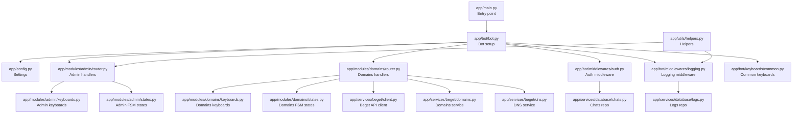

**Diagram sources**
- [app/main.py](file://app/main.py#L1-L30)
- [app/bot/bot.py](file://app/bot/bot.py#L1-L83)
- [app/config.py](file://app/config.py#L1-L52)
- [app/modules/admin/router.py](file://app/modules/admin/router.py#L1-L222)
- [app/modules/admin/keyboards.py](file://app/modules/admin/keyboards.py#L1-L76)
- [app/modules/admin/states.py](file://app/modules/admin/states.py#L1-L12)
- [app/modules/domains/router.py](file://app/modules/domains/router.py#L1-L718)
- [app/modules/domains/keyboards.py](file://app/modules/domains/keyboards.py#L1-L196)
- [app/modules/domains/states.py](file://app/modules/domains/states.py#L1-L21)
- [app/bot/middlewares/auth.py](file://app/bot/middlewares/auth.py#L1-L46)
- [app/bot/middlewares/logging.py](file://app/bot/middlewares/logging.py#L1-L76)
- [app/services/database/chats.py](file://app/services/database/chats.py#L1-L79)
- [app/services/database/logs.py](file://app/services/database/logs.py#L1-L90)
- [app/services/beget/client.py](file://app/services/beget/client.py#L1-L135)
- [app/services/beget/domains.py](file://app/services/beget/domains.py#L1-L58)
- [app/services/beget/dns.py](file://app/services/beget/dns.py#L1-L152)
- [app/bot/keyboards/common.py](file://app/bot/keyboards/common.py#L1-L42)
- [app/utils/helpers.py](file://app/utils/helpers.py#L1-L16)

**Section sources**
- [app/main.py](file://app/main.py#L1-L30)
- [app/bot/bot.py](file://app/bot/bot.py#L1-L83)
- [app/config.py](file://app/config.py#L1-L52)

## Core Components
- Admin Module
  - Access control: maintains an allowed chats list and enforces permissions via middleware
  - Permission management: adds/removes allowed chats and displays logs
  - Activity logging: records user actions and notifies the admin chat
- Domains Module
  - Domain listing: fetches domains from Beget and presents selection
  - Subdomain management: lists, creates, and deletes subdomains
  - DNS record operations: views and edits A and TXT records

Key implementation patterns:
- Inline keyboard navigation with structured callback data
- Stateful multi-step flows using FSM states
- Middleware-based authentication and logging
- Service layer for Beget API integration

**Section sources**
- [app/modules/admin/router.py](file://app/modules/admin/router.py#L1-L222)
- [app/modules/domains/router.py](file://app/modules/domains/router.py#L1-L718)
- [app/bot/middlewares/auth.py](file://app/bot/middlewares/auth.py#L1-L46)
- [app/bot/middlewares/logging.py](file://app/bot/middlewares/logging.py#L1-L76)
- [app/services/beget/domains.py](file://app/services/beget/domains.py#L1-L58)
- [app/services/beget/dns.py](file://app/services/beget/dns.py#L1-L152)

## Architecture Overview
The bot architecture centers around Aiogram’s Dispatcher and FSM, with clear separation of concerns:
- Entry point initializes configuration and bot resources
- Middlewares handle authentication and logging
- Routers register handlers for commands and callbacks
- Services encapsulate Beget API interactions
- Repositories manage local data (allowed chats and logs)
- Keyboard builders construct inline navigation

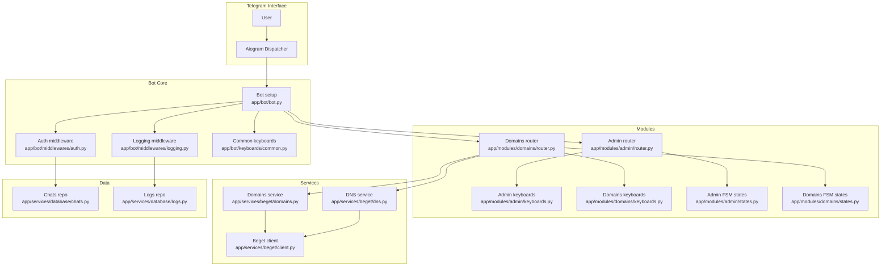

**Diagram sources**
- [app/bot/bot.py](file://app/bot/bot.py#L1-L83)
- [app/bot/middlewares/auth.py](file://app/bot/middlewares/auth.py#L1-L46)
- [app/bot/middlewares/logging.py](file://app/bot/middlewares/logging.py#L1-L76)
- [app/bot/keyboards/common.py](file://app/bot/keyboards/common.py#L1-L42)
- [app/modules/admin/router.py](file://app/modules/admin/router.py#L1-L222)
- [app/modules/admin/keyboards.py](file://app/modules/admin/keyboards.py#L1-L76)
- [app/modules/admin/states.py](file://app/modules/admin/states.py#L1-L12)
- [app/modules/domains/router.py](file://app/modules/domains/router.py#L1-L718)
- [app/modules/domains/keyboards.py](file://app/modules/domains/keyboards.py#L1-L196)
- [app/modules/domains/states.py](file://app/modules/domains/states.py#L1-L21)
- [app/services/beget/client.py](file://app/services/beget/client.py#L1-L135)
- [app/services/beget/domains.py](file://app/services/beget/domains.py#L1-L58)
- [app/services/beget/dns.py](file://app/services/beget/dns.py#L1-L152)
- [app/services/database/chats.py](file://app/services/database/chats.py#L1-L79)
- [app/services/database/logs.py](file://app/services/database/logs.py#L1-L90)

## Detailed Component Analysis

### Admin Module
The Admin Module controls who can use the bot and tracks actions taken by users.

- Permission system
  - Admin chat ID is configured; admin always has access
  - Allowed chats list is enforced by the Auth middleware
  - Users not in allowed chats are ignored silently
- Access control operations
  - List allowed chats and notes
  - Add a new allowed chat with optional note
  - Remove an allowed chat with confirmation
- Activity logging
  - Non-admin actions are logged to the database
  - Admin is notified of each action via a message

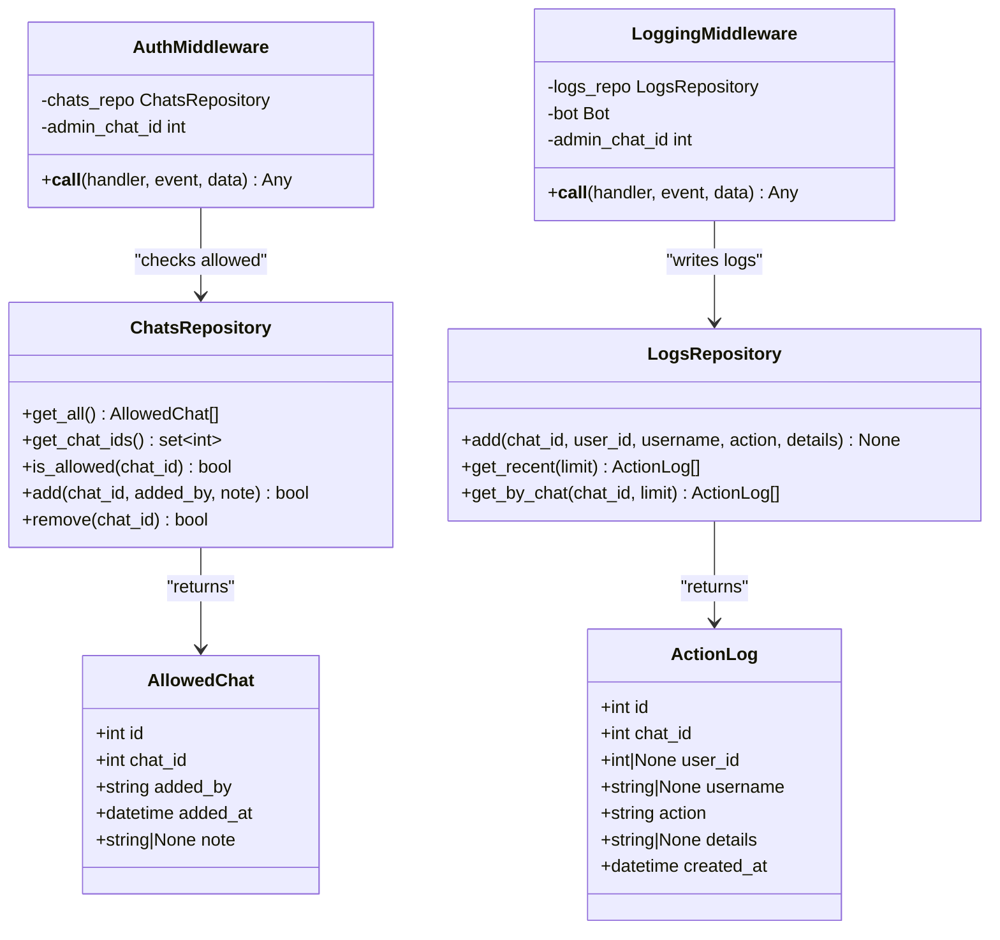

**Diagram sources**
- [app/bot/middlewares/auth.py](file://app/bot/middlewares/auth.py#L1-L46)
- [app/services/database/chats.py](file://app/services/database/chats.py#L1-L79)
- [app/bot/middlewares/logging.py](file://app/bot/middlewares/logging.py#L1-L76)
- [app/services/database/logs.py](file://app/services/database/logs.py#L1-L90)

- Admin workflow (adding an allowed chat)
  - Admin opens Admin Panel from the main menu
  - Selects “Allowed Chats”
  - Chooses “+ Add Chat”
  - Enters chat ID (validated as integer)
  - Optionally enters a note (or “-” to skip)
  - Confirmation clears state and returns to the list

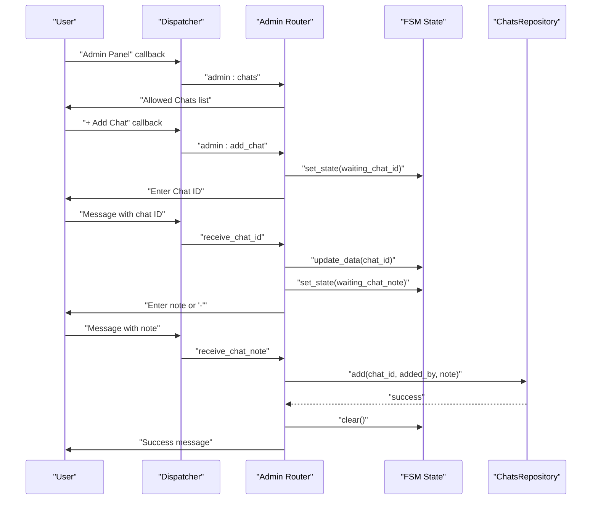

**Diagram sources**
- [app/modules/admin/router.py](file://app/modules/admin/router.py#L74-L150)
- [app/modules/admin/states.py](file://app/modules/admin/states.py#L1-L12)
- [app/services/database/chats.py](file://app/services/database/chats.py#L59-L69)

- Admin workflow (removing an allowed chat)
  - From “Allowed Chats”, select a chat
  - Choose “Remove”
  - Confirm removal
  - Refresh list

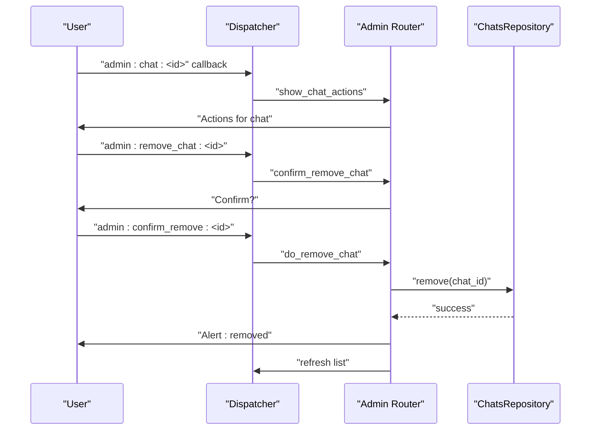

**Diagram sources**
- [app/modules/admin/router.py](file://app/modules/admin/router.py#L152-L191)
- [app/services/database/chats.py](file://app/services/database/chats.py#L71-L78)

- Admin workflow (viewing logs)
  - From Admin Panel, select “Action Logs”
  - View recent actions with timestamps and user identifiers
  - Back to Admin Panel

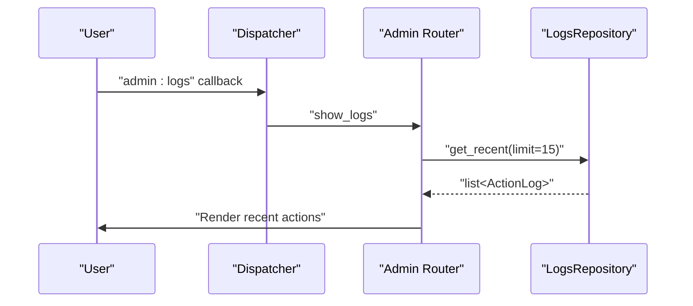

**Diagram sources**
- [app/modules/admin/router.py](file://app/modules/admin/router.py#L193-L222)
- [app/services/database/logs.py](file://app/services/database/logs.py#L46-L64)

**Section sources**
- [app/modules/admin/router.py](file://app/modules/admin/router.py#L1-L222)
- [app/modules/admin/keyboards.py](file://app/modules/admin/keyboards.py#L1-L76)
- [app/modules/admin/states.py](file://app/modules/admin/states.py#L1-L12)
- [app/bot/middlewares/auth.py](file://app/bot/middlewares/auth.py#L1-L46)
- [app/bot/middlewares/logging.py](file://app/bot/middlewares/logging.py#L1-L76)
- [app/services/database/chats.py](file://app/services/database/chats.py#L1-L79)
- [app/services/database/logs.py](file://app/services/database/logs.py#L1-L90)

### Domains Module
The Domains Module allows users to manage domains, subdomains, and DNS records.

- Domain listing
  - Fetches domains from Beget and presents a selectable list
- Subdomain management
  - Lists subdomains per domain
  - Creates a new subdomain with validation
  - Deletes a subdomain with confirmation
- DNS record operations
  - Views all DNS records
  - Manages A records: add, change IP, delete
  - Manages TXT records: add, delete

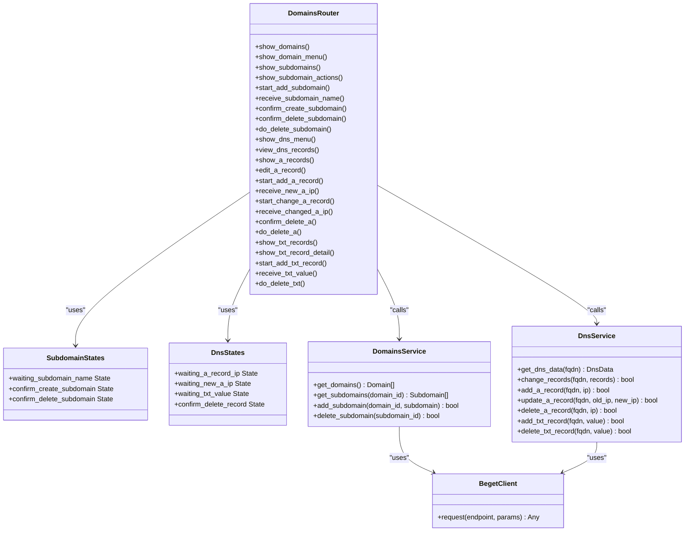

**Diagram sources**
- [app/modules/domains/router.py](file://app/modules/domains/router.py#L1-L718)
- [app/modules/domains/states.py](file://app/modules/domains/states.py#L1-L21)
- [app/services/beget/domains.py](file://app/services/beget/domains.py#L1-L58)
- [app/services/beget/dns.py](file://app/services/beget/dns.py#L1-L152)
- [app/services/beget/client.py](file://app/services/beget/client.py#L1-L135)

- User workflow: Creating a subdomain
  - Select domain → open domain menu
  - Choose “Subdomains”
  - Select “+ Add Subdomain”
  - Enter subdomain name (validation rules apply)
  - Confirm creation
  - Updated subdomains list shown

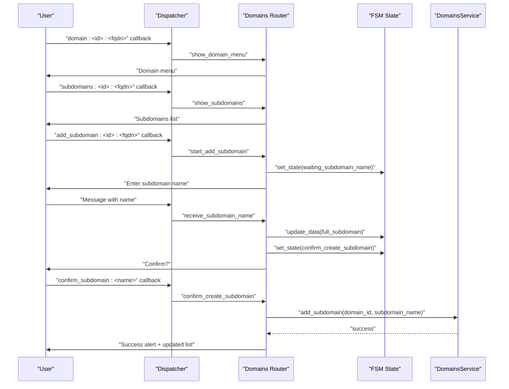

**Diagram sources**
- [app/modules/domains/router.py](file://app/modules/domains/router.py#L135-L242)
- [app/modules/domains/states.py](file://app/modules/domains/states.py#L1-L21)
- [app/services/beget/domains.py](file://app/services/beget/domains.py#L43-L49)

- User workflow: Editing A records
  - Open DNS menu for a domain
  - Choose “A Records”
  - Select an existing A record to edit
  - Choose “Change IP” and enter a valid IPv4
  - Or choose “Delete” with confirmation

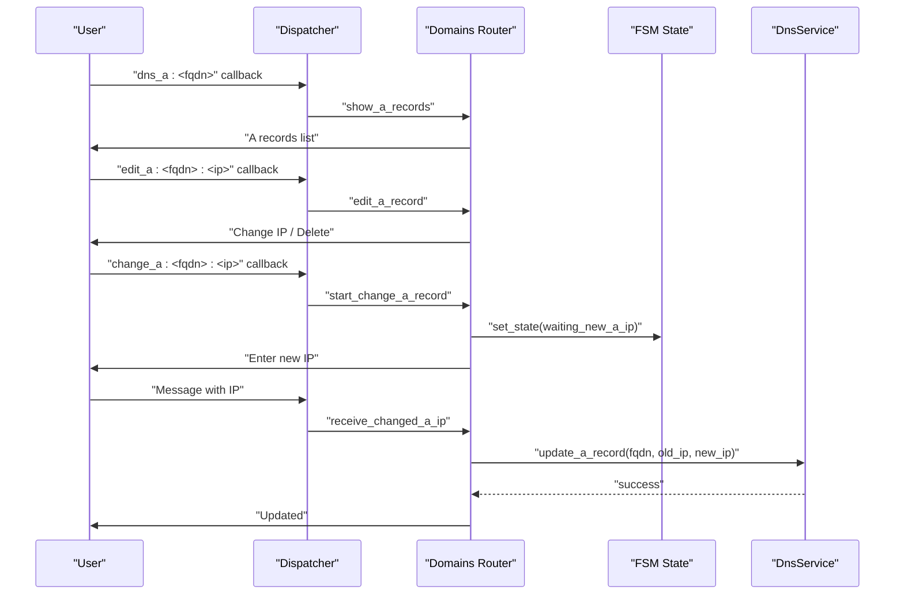

**Diagram sources**
- [app/modules/domains/router.py](file://app/modules/domains/router.py#L502-L542)
- [app/modules/domains/states.py](file://app/modules/domains/states.py#L1-L21)
- [app/services/beget/dns.py](file://app/services/beget/dns.py#L111-L121)

- User workflow: Managing TXT records
  - Open DNS menu → “TXT Records”
  - View list with truncated values
  - Select a record to delete
  - Or choose “+ Add TXT Record” and enter value

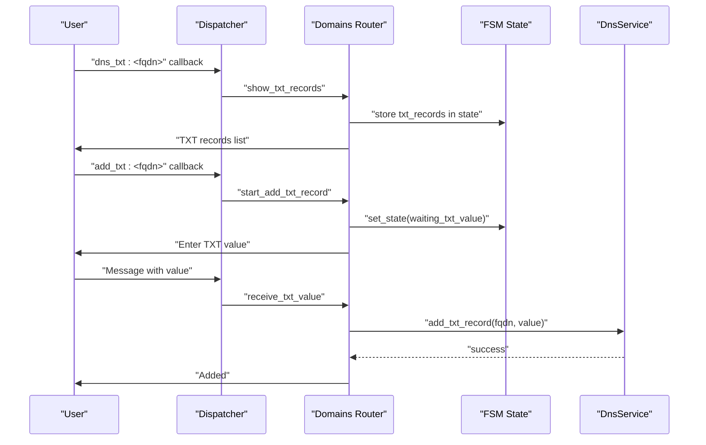

**Diagram sources**
- [app/modules/domains/router.py](file://app/modules/domains/router.py#L650-L686)
- [app/modules/domains/states.py](file://app/modules/domains/states.py#L1-L21)
- [app/services/beget/dns.py](file://app/services/beget/dns.py#L134-L140)

- Command structure and navigation
  - Base handlers: /start shows main menu; “Back” and “Cancel” are supported
  - Main menu routes to Domains and optionally Admin Panel
  - Domain menu routes to Subdomains and DNS Records
  - DNS menus route to record-specific operations

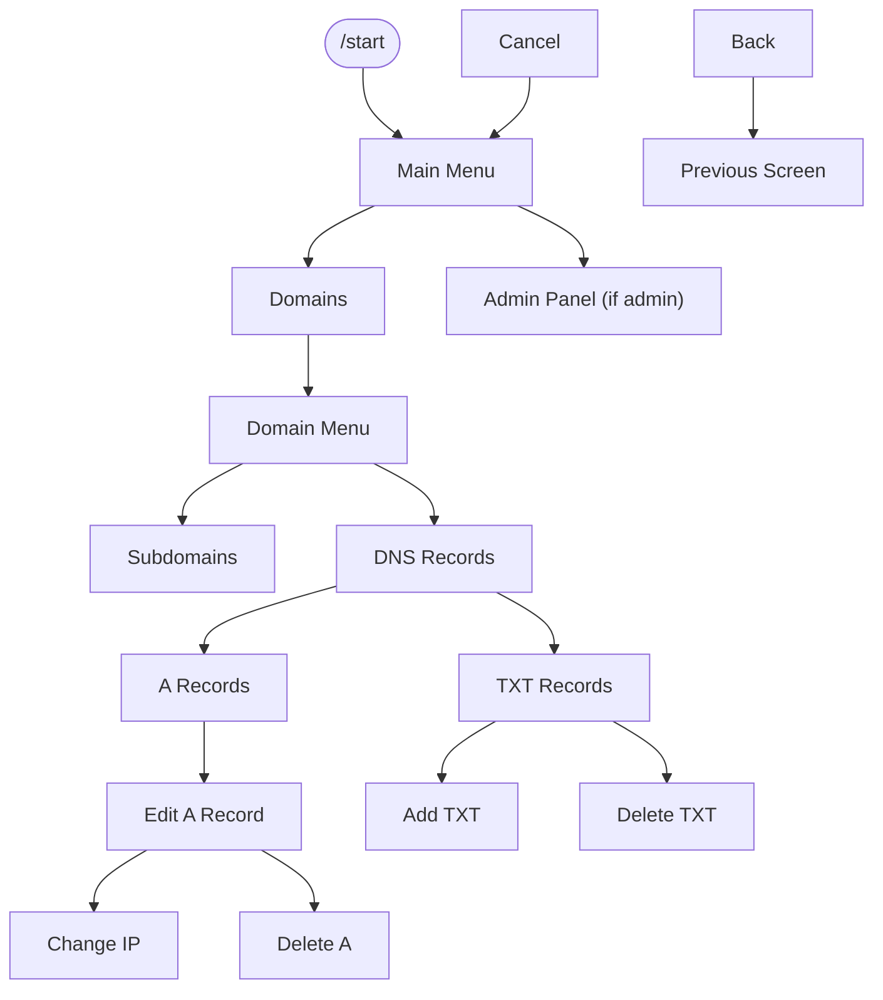

**Diagram sources**
- [app/bot/bot.py](file://app/bot/bot.py#L54-L81)
- [app/bot/keyboards/common.py](file://app/bot/keyboards/common.py#L7-L17)
- [app/modules/domains/keyboards.py](file://app/modules/domains/keyboards.py#L27-L45)
- [app/modules/domains/keyboards.py](file://app/modules/domains/keyboards.py#L105-L118)
- [app/modules/domains/keyboards.py](file://app/modules/domains/keyboards.py#L121-L139)
- [app/modules/domains/keyboards.py](file://app/modules/domains/keyboards.py#L142-L162)

**Section sources**
- [app/modules/domains/router.py](file://app/modules/domains/router.py#L1-L718)
- [app/modules/domains/keyboards.py](file://app/modules/domains/keyboards.py#L1-L196)
- [app/modules/domains/states.py](file://app/modules/domains/states.py#L1-L21)
- [app/services/beget/domains.py](file://app/services/beget/domains.py#L1-L58)
- [app/services/beget/dns.py](file://app/services/beget/dns.py#L1-L152)

## Dependency Analysis
- Authentication and authorization
  - Auth middleware checks admin_chat_id and allowed chats
  - Admin router applies an admin-only filter to handlers
- Logging
  - Logging middleware captures actions and notifies admin
- Data persistence
  - ChatsRepository manages allowed chats
  - LogsRepository stores action logs
- External APIs
  - Beget client encapsulates HTTP requests and error handling
  - DomainsService and DnsService wrap API endpoints

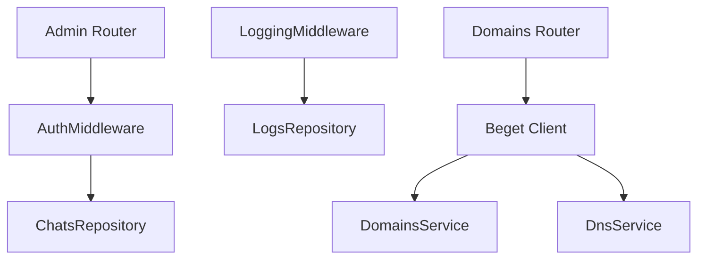

**Diagram sources**
- [app/bot/middlewares/auth.py](file://app/bot/middlewares/auth.py#L1-L46)
- [app/modules/admin/router.py](file://app/modules/admin/router.py#L43-L61)
- [app/bot/middlewares/logging.py](file://app/bot/middlewares/logging.py#L1-L76)
- [app/services/beget/client.py](file://app/services/beget/client.py#L1-L135)
- [app/services/beget/domains.py](file://app/services/beget/domains.py#L1-L58)
- [app/services/beget/dns.py](file://app/services/beget/dns.py#L1-L152)
- [app/services/database/chats.py](file://app/services/database/chats.py#L1-L79)
- [app/services/database/logs.py](file://app/services/database/logs.py#L1-L90)

**Section sources**
- [app/bot/middlewares/auth.py](file://app/bot/middlewares/auth.py#L1-L46)
- [app/modules/admin/router.py](file://app/modules/admin/router.py#L43-L61)
- [app/bot/middlewares/logging.py](file://app/bot/middlewares/logging.py#L1-L76)
- [app/services/beget/client.py](file://app/services/beget/client.py#L1-L135)
- [app/services/database/chats.py](file://app/services/database/chats.py#L1-L79)
- [app/services/database/logs.py](file://app/services/database/logs.py#L1-L90)

## Performance Considerations
- Network latency to Beget API
  - Requests are asynchronous; timeouts are configured
  - Responses are parsed defensively to handle non-JSON content-type
- Database operations
  - SQLite operations are simple queries; ensure indexes if scaling
- Keyboard rendering
  - Large lists are paginated implicitly by keyboard builders; keep lists concise
- Middleware overhead
  - Authentication and logging add minimal overhead; ensure admin notifications do not block

[No sources needed since this section provides general guidance]

## Troubleshooting Guide
- Authentication issues
  - Ensure admin_chat_id matches the admin’s chat ID
  - Verify allowed chats list contains the user’s chat ID
- API errors
  - BegetApiError indicates invalid credentials or API failures
  - Check Beget API credentials and network connectivity
- State issues
  - If multi-step flows fail, ensure state transitions occur in order
  - Use “Cancel” to reset state and return to main menu
- Logging
  - Admin receives notifications for non-admin actions
  - Use “Action Logs” to review recent activities

**Section sources**
- [app/bot/middlewares/auth.py](file://app/bot/middlewares/auth.py#L1-L46)
- [app/bot/middlewares/logging.py](file://app/bot/middlewares/logging.py#L1-L76)
- [app/services/beget/client.py](file://app/services/beget/client.py#L13-L135)
- [app/modules/admin/router.py](file://app/modules/admin/router.py#L74-L150)
- [app/modules/domains/router.py](file://app/modules/domains/router.py#L153-L242)

## Conclusion
The Beget Manager bot provides a secure, stateful, and extensible interface for managing domains and DNS records via Telegram. Administrators control access and monitor activity, while users navigate intuitive inline keyboards to perform complex multi-step operations. The modular design, clear separation of concerns, and robust middleware ensure maintainability and reliability.