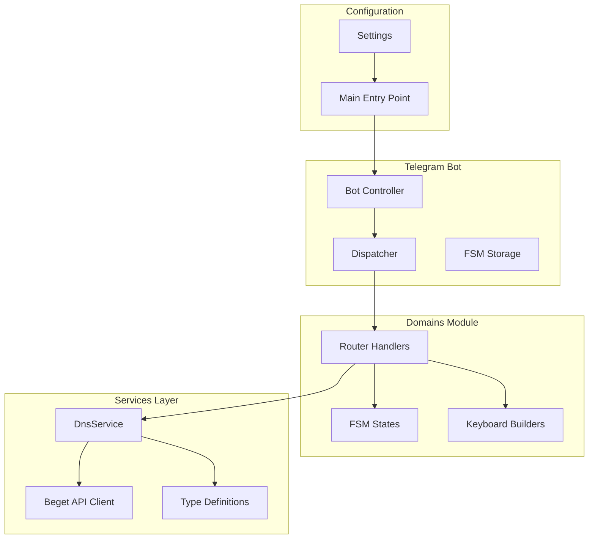
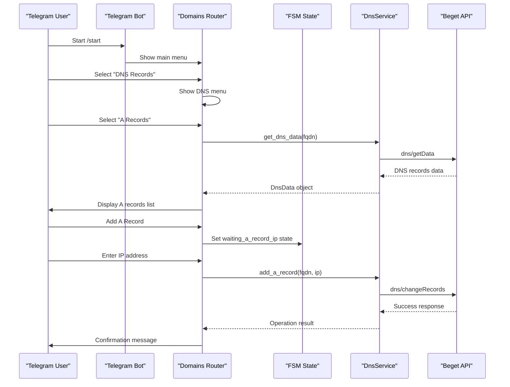
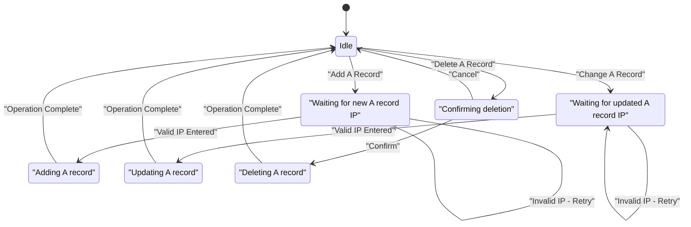
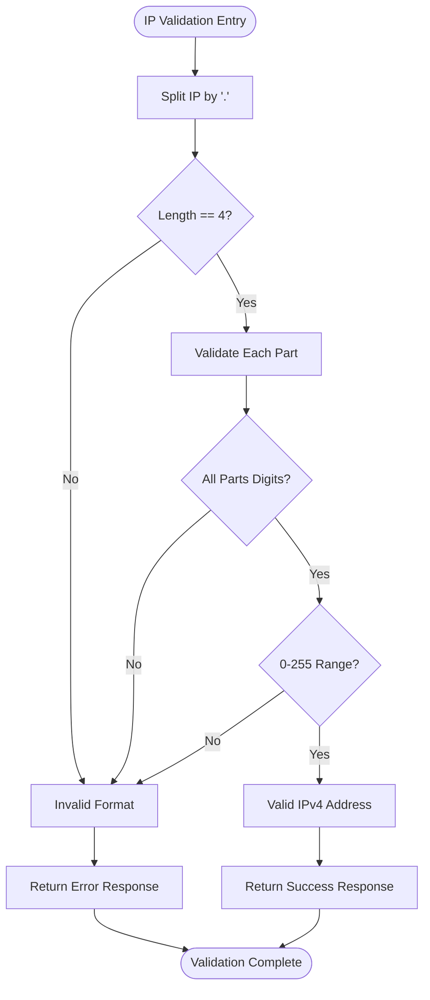
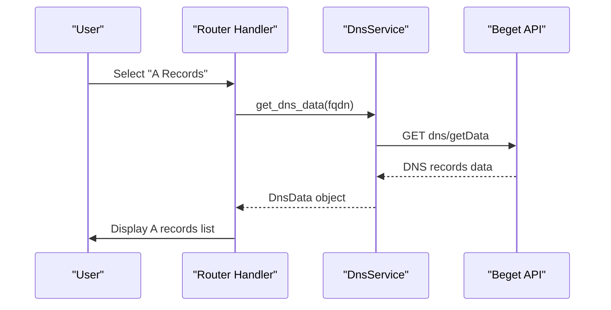
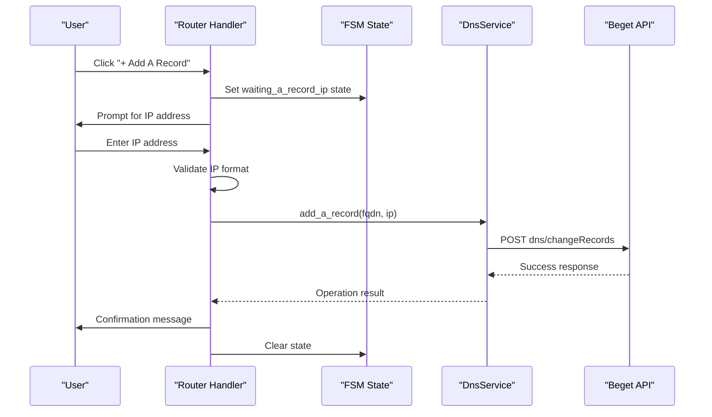
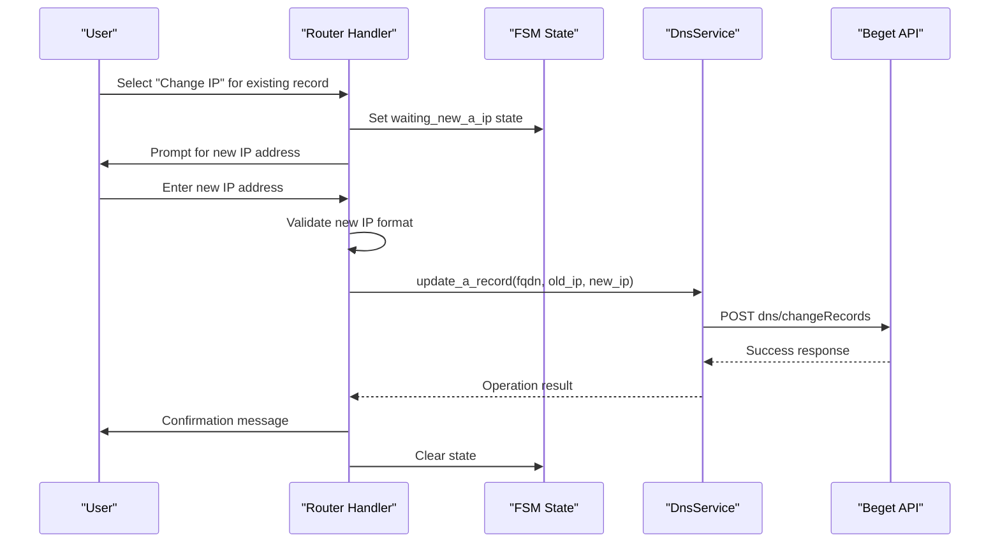
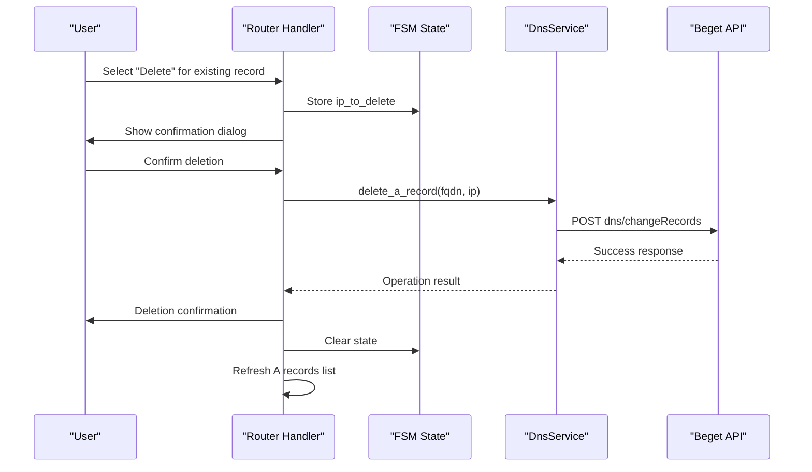
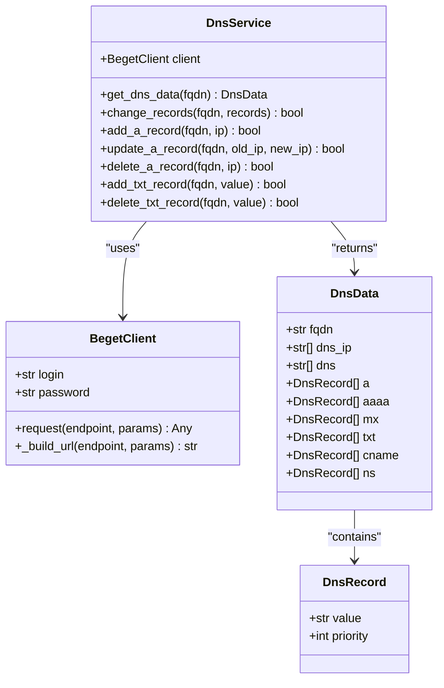
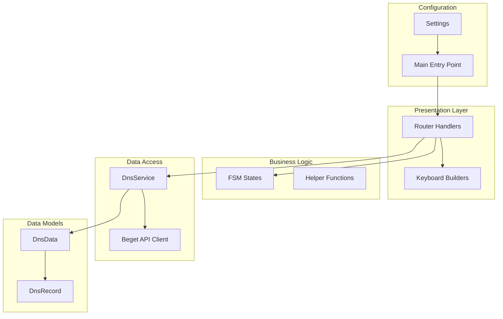

# A Records Management

<cite>
**Referenced Files in This Document**
- [states.py](file://app/modules/domains/states.py)
- [keyboards.py](file://app/modules/domains/keyboards.py)
- [router.py](file://app/modules/domains/router.py)
- [dns.py](file://app/services/beget/dns.py)
- [types.py](file://app/services/beget/types.py)
- [client.py](file://app/services/beget/client.py)
- [config.py](file://app/config.py)
- [bot.py](file://app/bot/bot.py)
- [main.py](file://app/main.py)
</cite>

## Table of Contents
1. [Introduction](#introduction)
2. [Project Structure](#project-structure)
3. [Core Components](#core-components)
4. [Architecture Overview](#architecture-overview)
5. [Detailed Component Analysis](#detailed-component-analysis)
6. [Dependency Analysis](#dependency-analysis)
7. [Performance Considerations](#performance-considerations)
8. [Troubleshooting Guide](#troubleshooting-guide)
9. [Conclusion](#conclusion)

## Introduction
This document provides comprehensive documentation for A records (IPv4 address records) management within the Beget Manager Telegram bot. It covers the complete workflow for viewing A records, adding new A records, changing existing A record values, and deleting A records. The documentation explains the finite state machine (FSM) implementation for A record operations, including waiting for IP addresses and handling validation. It details the IPv4 validation logic that ensures proper IP address formatting and the integration with DnsService methods for API operations. Practical examples of A record CRUD operations, error handling for invalid IP addresses, and the keyboard interfaces for A record management actions are included.

## Project Structure
The A records management functionality is implemented across several modules within the domains feature module. The key components include:
- State machine definitions for A record operations
- Keyboard builders for user interface interactions
- Router handlers for Telegram bot callbacks and messages
- DNS service for interacting with the Beget API
- Type definitions for DNS data structures
- Configuration and bot setup for application initialization

**Diagram sources**
- [bot.py](file://app/bot/bot.py#L18-L83)
- [router.py](file://app/modules/domains/router.py#L1-L718)
- [states.py](file://app/modules/domains/states.py#L1-L21)
- [keyboards.py](file://app/modules/domains/keyboards.py#L1-L196)
- [dns.py](file://app/services/beget/dns.py#L1-L152)
- [client.py](file://app/services/beget/client.py#L1-L135)
- [config.py](file://app/config.py#L1-L52)
- [main.py](file://app/main.py#L1-L30)

**Section sources**
- [bot.py](file://app/bot/bot.py#L18-L83)
- [router.py](file://app/modules/domains/router.py#L1-L718)
- [states.py](file://app/modules/domains/states.py#L1-L21)
- [keyboards.py](file://app/modules/domains/keyboards.py#L1-L196)
- [dns.py](file://app/services/beget/dns.py#L1-L152)
- [client.py](file://app/services/beget/client.py#L1-L135)
- [config.py](file://app/config.py#L1-L52)
- [main.py](file://app/main.py#L1-L30)

## Core Components
The A records management system consists of several interconnected components that work together to provide a seamless user experience for DNS record management.

### State Machine Implementation
The system uses a finite state machine to manage user interactions during A record operations. The DnsStates group defines specific states for waiting for user input and confirming actions.

### Keyboard Interfaces
The keyboard builders provide intuitive navigation and action selection for A record management operations, including viewing existing records, adding new ones, editing existing records, and deleting records.

### DNS Service Integration
The DnsService encapsulates all API interactions with the Beget DNS management system, providing methods for retrieving DNS data and performing record modifications.

**Section sources**
- [states.py](file://app/modules/domains/states.py#L14-L21)
- [keyboards.py](file://app/modules/domains/keyboards.py#L105-L196)
- [dns.py](file://app/services/beget/dns.py#L8-L152)

## Architecture Overview
The A records management follows a layered architecture pattern with clear separation of concerns between the presentation layer (Telegram bot), business logic (router handlers), and data access (DNS service).

**Diagram sources**
- [router.py](file://app/modules/domains/router.py#L423-L500)
- [dns.py](file://app/services/beget/dns.py#L101-L132)
- [client.py](file://app/services/beget/client.py#L70-L118)

## Detailed Component Analysis

### State Machine for A Record Operations
The state machine implementation provides structured user interaction patterns for A record management operations.

**Diagram sources**
- [states.py](file://app/modules/domains/states.py#L14-L21)
- [router.py](file://app/modules/domains/router.py#L477-L542)

The state machine includes three primary states for A record operations:
- `waiting_a_record_ip`: Used when adding new A records
- `waiting_new_a_ip`: Used when updating existing A records  
- `confirm_delete_record`: Used for confirming A record deletions

**Section sources**
- [states.py](file://app/modules/domains/states.py#L14-L21)
- [router.py](file://app/modules/domains/router.py#L477-L542)

### IPv4 Validation Logic
The system implements robust IPv4 validation to ensure proper IP address formatting before processing A record operations.

**Diagram sources**
- [router.py](file://app/modules/domains/router.py#L484-L488)
- [router.py](file://app/modules/domains/router.py#L526-L530)

The validation logic performs the following checks:
1. Splits the IP address by periods
2. Ensures exactly four octets
3. Validates each octet is numeric
4. Confirms each octet is within the 0-255 range

**Section sources**
- [router.py](file://app/modules/domains/router.py#L484-L488)
- [router.py](file://app/modules/domains/router.py#L526-L530)

### A Records CRUD Operations

#### View A Records
The system retrieves and displays all existing A records for a selected domain.

**Diagram sources**
- [router.py](file://app/modules/domains/router.py#L423-L449)
- [dns.py](file://app/services/beget/dns.py#L14-L77)

#### Add A Record
The add operation follows a multi-step process involving user input validation and API communication.

**Diagram sources**
- [router.py](file://app/modules/domains/router.py#L465-L500)
- [dns.py](file://app/services/beget/dns.py#L101-L109)

#### Update A Record
The update operation requires selecting an existing record, entering a new IP, and confirming the change.

**Diagram sources**
- [router.py](file://app/modules/domains/router.py#L502-L542)
- [dns.py](file://app/services/beget/dns.py#L111-L121)

#### Delete A Record
The delete operation includes user confirmation to prevent accidental deletions.

**Diagram sources**
- [router.py](file://app/modules/domains/router.py#L544-L584)
- [dns.py](file://app/services/beget/dns.py#L123-L132)

**Section sources**
- [router.py](file://app/modules/domains/router.py#L423-L584)
- [dns.py](file://app/services/beget/dns.py#L101-L132)

### Keyboard Interfaces for A Record Management
The keyboard builders provide intuitive navigation and action selection for A record management operations.

#### A Records Menu Keyboard
The main A records management interface displays existing records and provides options for adding, editing, and deleting records.

#### Edit A Record Keyboard
The edit interface provides specific actions for individual A records, including changing the IP address or deleting the record.

**Section sources**
- [keyboards.py](file://app/modules/domains/keyboards.py#L121-L139)
- [keyboards.py](file://app/modules/domains/keyboards.py#L165-L183)

### DnsService Integration
The DnsService provides a clean abstraction layer for all DNS-related operations, handling API communication and data transformation.

**Diagram sources**
- [dns.py](file://app/services/beget/dns.py#L8-L152)
- [client.py](file://app/services/beget/client.py#L21-L135)
- [types.py](file://app/services/beget/types.py#L28-L59)

**Section sources**
- [dns.py](file://app/services/beget/dns.py#L8-L152)
- [client.py](file://app/services/beget/client.py#L21-L135)
- [types.py](file://app/services/beget/types.py#L28-L59)

## Dependency Analysis
The A records management system exhibits clear dependency relationships that support maintainable and testable code.

**Diagram sources**
- [router.py](file://app/modules/domains/router.py#L1-L718)
- [states.py](file://app/modules/domains/states.py#L1-L21)
- [keyboards.py](file://app/modules/domains/keyboards.py#L1-L196)
- [dns.py](file://app/services/beget/dns.py#L1-L152)
- [client.py](file://app/services/beget/client.py#L1-L135)
- [types.py](file://app/services/beget/types.py#L1-L59)
- [config.py](file://app/config.py#L1-L52)
- [main.py](file://app/main.py#L1-L30)

**Section sources**
- [router.py](file://app/modules/domains/router.py#L1-L718)
- [dns.py](file://app/services/beget/dns.py#L1-L152)
- [client.py](file://app/services/beget/client.py#L1-L135)
- [types.py](file://app/services/beget/types.py#L1-L59)
- [config.py](file://app/config.py#L1-L52)
- [main.py](file://app/main.py#L1-L30)

## Performance Considerations
The A records management system is designed with several performance considerations in mind:

- **Async Operations**: All API calls use asynchronous patterns to prevent blocking operations
- **Minimal Network Calls**: The system consolidates DNS data retrieval into single requests
- **Efficient State Management**: FSM states minimize memory usage by only storing necessary data
- **Early Validation**: IP validation occurs before making API calls to reduce unnecessary network traffic
- **Batch Operations**: Record updates use batch operations to minimize API round trips

## Troubleshooting Guide

### Common Issues and Solutions

#### Invalid IP Address Format
**Problem**: Users enter IP addresses that don't meet IPv4 requirements
**Solution**: The system validates IP format using dot-separated octets with values 0-255
**Prevention**: Provide clear examples and validation feedback

#### API Communication Errors
**Problem**: Beget API returns errors or timeouts
**Solution**: The system handles BegetApiError exceptions and provides meaningful error messages
**Prevention**: Verify API credentials and check service availability

#### State Management Issues
**Problem**: Users get stuck in FSM states
**Solution**: The system includes a cancel action that clears FSM state and returns to main menu
**Prevention**: Provide clear navigation options and state indicators

#### Authentication Failures
**Problem**: Unauthorized access to Beget API
**Solution**: Verify login credentials and API access permissions
**Prevention**: Regular credential validation and secure storage

**Section sources**
- [router.py](file://app/modules/domains/router.py#L484-L488)
- [router.py](file://app/modules/domains/router.py#L526-L530)
- [client.py](file://app/services/beget/client.py#L13-L19)
- [client.py](file://app/services/beget/client.py#L97-L116)

## Conclusion
The A records management system provides a comprehensive solution for DNS record administration through a Telegram bot interface. The implementation demonstrates strong architectural patterns with clear separation of concerns, robust validation mechanisms, and intuitive user interfaces. The finite state machine approach ensures predictable user interactions, while the DnsService abstraction provides clean API integration. The system's error handling and validation logic contribute to a reliable user experience, making it suitable for production deployment in managing Beget hosting DNS records.