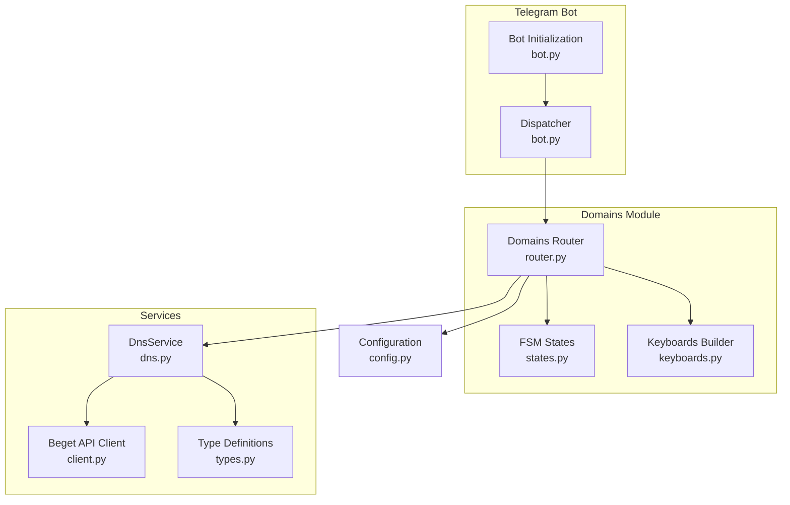
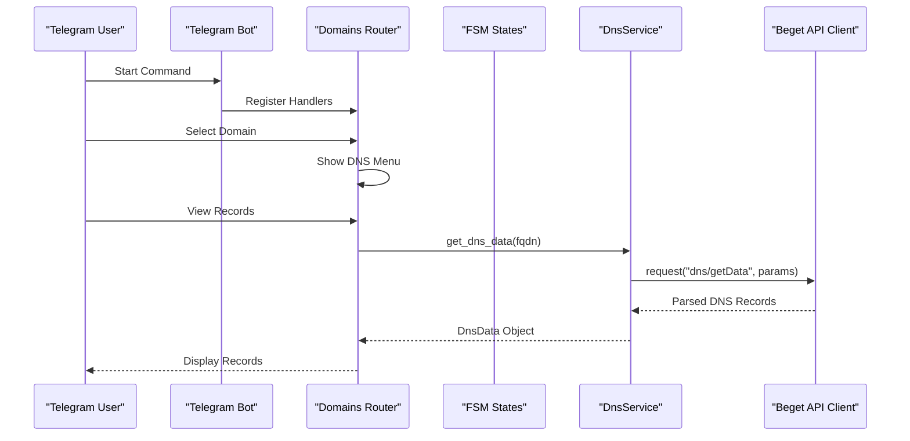
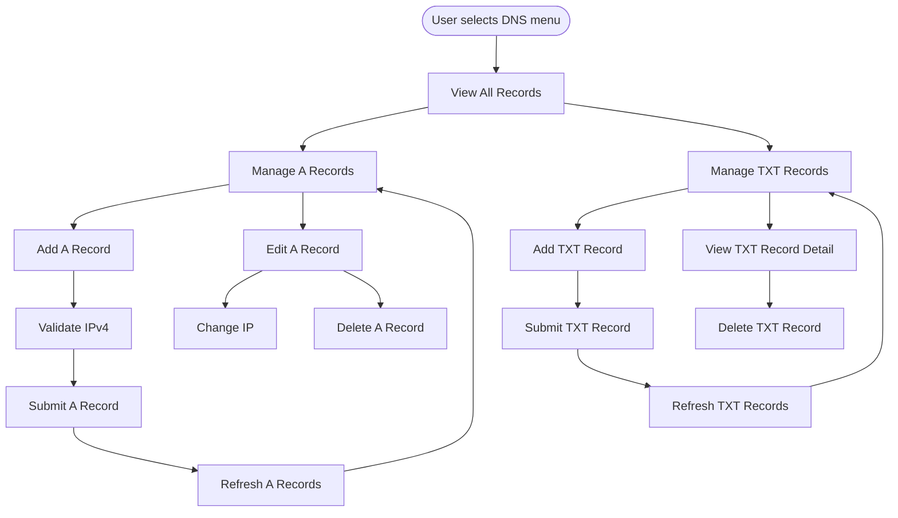
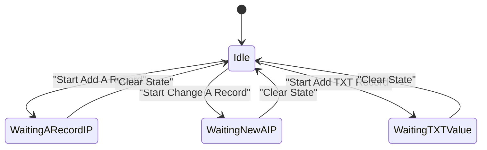
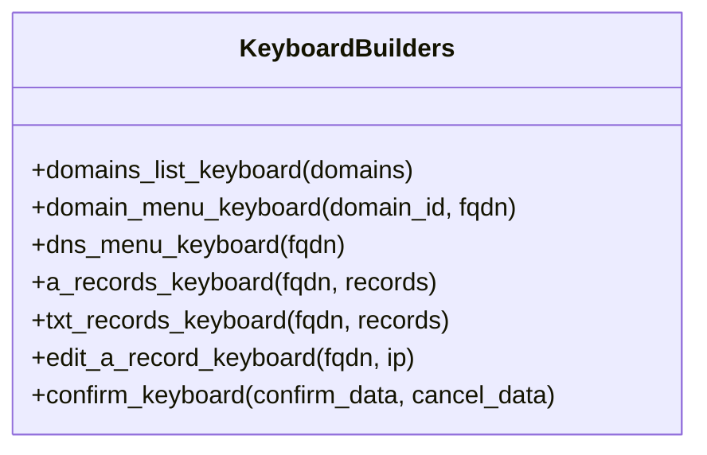
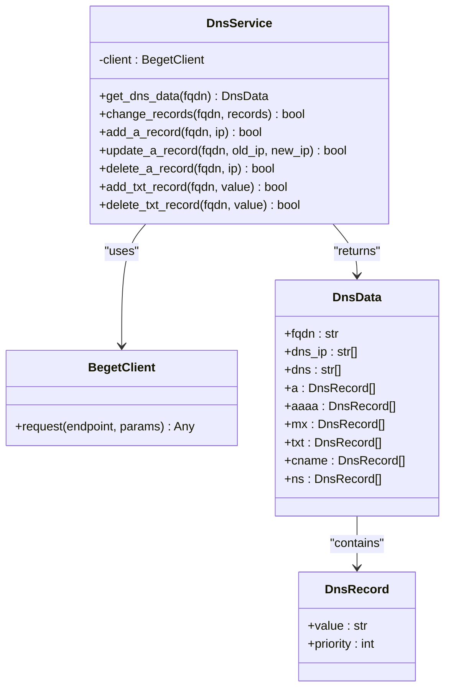
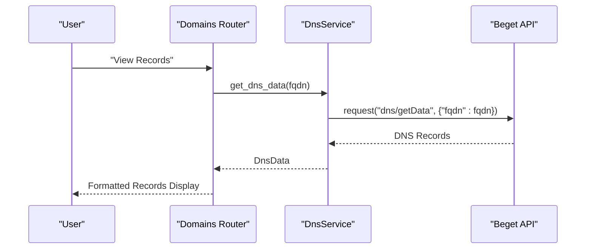
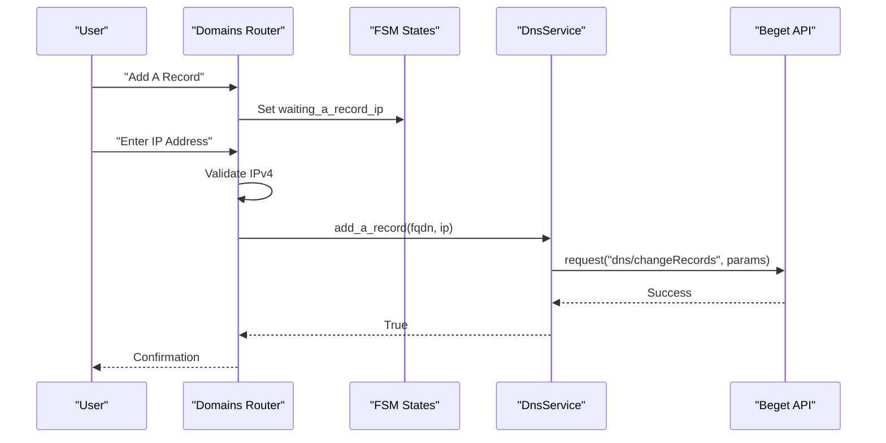
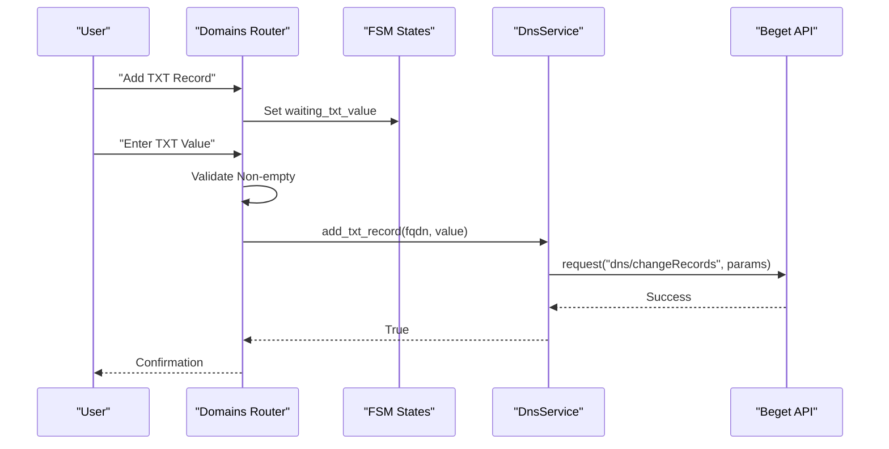
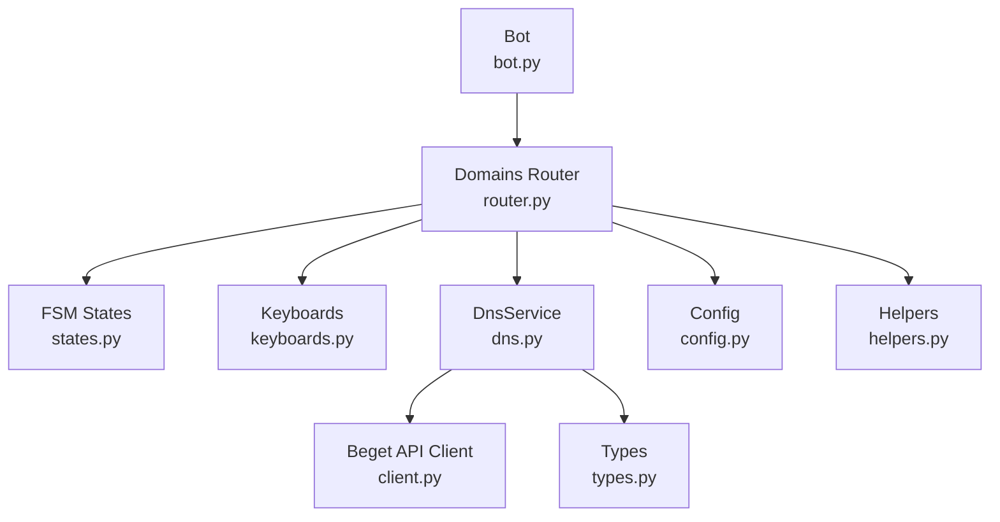

# DNS Records Management

<cite>
**Referenced Files in This Document**
- [router.py](file://app/modules/domains/router.py)
- [states.py](file://app/modules/domains/states.py)
- [keyboards.py](file://app/modules/domains/keyboards.py)
- [dns.py](file://app/services/beget/dns.py)
- [types.py](file://app/services/beget/types.py)
- [client.py](file://app/services/beget/client.py)
- [config.py](file://app/config.py)
- [bot.py](file://app/bot/bot.py)
- [helpers.py](file://app/utils/helpers.py)
- [README.md](file://README.md)
</cite>

## Table of Contents
1. [Introduction](#introduction)
2. [Project Structure](#project-structure)
3. [Core Components](#core-components)
4. [Architecture Overview](#architecture-overview)
5. [Detailed Component Analysis](#detailed-component-analysis)
6. [Dependency Analysis](#dependency-analysis)
7. [Performance Considerations](#performance-considerations)
8. [Troubleshooting Guide](#troubleshooting-guide)
9. [Conclusion](#conclusion)

## Introduction
This document provides comprehensive documentation for the DNS records management functionality within the Beget Manager Telegram bot. It covers the complete DNS management workflow including viewing all records, managing A records (IPv4 addresses), and handling TXT records (text-based DNS entries). The document explains the hierarchical navigation system for DNS operations with domain-specific record management, details the finite state machine (FSM) implementation for DNS operations, and describes the keyboard interfaces for different record types. Practical examples demonstrate DNS record viewing, A record manipulation (add, change, delete), TXT record management, and the integration with DnsService for API operations. The document also addresses record validation, error handling, and display formatting for different DNS record types.

## Project Structure
The DNS management feature is organized within the domains module and integrates with the Beget API service. The key components include:
- Router and handlers for DNS operations
- FSM states for managing user interactions
- Keyboard builders for navigation and actions
- DnsService for interacting with the Beget API
- Type definitions for DNS data structures
- Configuration and client utilities

**Diagram sources**
- [bot.py](file://app/bot/bot.py#L18-L83)
- [router.py](file://app/modules/domains/router.py#L1-L718)
- [states.py](file://app/modules/domains/states.py#L1-L21)
- [keyboards.py](file://app/modules/domains/keyboards.py#L1-L196)
- [dns.py](file://app/services/beget/dns.py#L1-L152)
- [client.py](file://app/services/beget/client.py#L1-L135)
- [types.py](file://app/services/beget/types.py#L1-L59)
- [config.py](file://app/config.py#L1-L52)

**Section sources**
- [router.py](file://app/modules/domains/router.py#L1-L718)
- [states.py](file://app/modules/domains/states.py#L1-L21)
- [keyboards.py](file://app/modules/domains/keyboards.py#L1-L196)
- [dns.py](file://app/services/beget/dns.py#L1-L152)
- [client.py](file://app/services/beget/client.py#L1-L135)
- [types.py](file://app/services/beget/types.py#L1-L59)
- [config.py](file://app/config.py#L1-L52)
- [bot.py](file://app/bot/bot.py#L1-L83)

## Core Components
This section outlines the primary components involved in DNS records management and their responsibilities.

- Domains Router: Handles all user interactions for DNS operations, including viewing records, adding/editing/deleting A and TXT records, and navigating between menus.
- FSM States: Defines the finite state machine states for DNS operations, including waiting for user input for A records and TXT records.
- Keyboard Builders: Generates dynamic inline keyboards for navigation and actions, tailored to DNS record types.
- DnsService: Encapsulates DNS API operations, including fetching DNS data, adding, updating, and deleting records.
- Type Definitions: Provides Pydantic models for DNS data structures, ensuring consistent data representation across the application.
- Beget API Client: Manages HTTP requests to the Beget API, handling authentication, request building, and response parsing.
- Configuration: Loads environment variables for bot and API credentials.

**Section sources**
- [router.py](file://app/modules/domains/router.py#L1-L718)
- [states.py](file://app/modules/domains/states.py#L1-L21)
- [keyboards.py](file://app/modules/domains/keyboards.py#L1-L196)
- [dns.py](file://app/services/beget/dns.py#L1-L152)
- [types.py](file://app/services/beget/types.py#L1-L59)
- [client.py](file://app/services/beget/client.py#L1-L135)
- [config.py](file://app/config.py#L1-L52)

## Architecture Overview
The DNS management architecture follows a layered approach:
- Presentation Layer: Telegram bot interface with inline keyboards and message handlers.
- Application Layer: Router and FSM states orchestrating user interactions and data flow.
- Service Layer: DnsService encapsulating API operations and data transformation.
- Integration Layer: Beget API client handling HTTP communication and error propagation.
- Data Layer: Pydantic models for type-safe data representation.

**Diagram sources**
- [bot.py](file://app/bot/bot.py#L18-L83)
- [router.py](file://app/modules/domains/router.py#L346-L421)
- [dns.py](file://app/services/beget/dns.py#L14-L77)
- [client.py](file://app/services/beget/client.py#L70-L117)

**Section sources**
- [bot.py](file://app/bot/bot.py#L18-L83)
- [router.py](file://app/modules/domains/router.py#L346-L421)
- [dns.py](file://app/services/beget/dns.py#L14-L77)
- [client.py](file://app/services/beget/client.py#L70-L117)

## Detailed Component Analysis

### DNS Management Workflow
The DNS management workflow encompasses viewing all records, managing A records, and handling TXT records. The workflow is initiated from the domain menu and navigates through various states and handlers.

**Diagram sources**
- [router.py](file://app/modules/domains/router.py#L358-L718)
- [states.py](file://app/modules/domains/states.py#L14-L21)

**Section sources**
- [router.py](file://app/modules/domains/router.py#L358-L718)
- [states.py](file://app/modules/domains/states.py#L14-L21)

### State Machine Implementation
The DNS state machine manages user interactions for record creation and modification. It defines states for waiting for user input and confirms actions before executing API calls.

**Diagram sources**
- [states.py](file://app/modules/domains/states.py#L14-L21)

**Section sources**
- [states.py](file://app/modules/domains/states.py#L14-L21)

### Keyboard Interfaces
The keyboard builders provide dynamic navigation and action options for DNS management. They adapt based on the current context and available records.

**Diagram sources**
- [keyboards.py](file://app/modules/domains/keyboards.py#L9-L196)

**Section sources**
- [keyboards.py](file://app/modules/domains/keyboards.py#L9-L196)

### DnsService Integration
DnsService handles all DNS-related API operations, including fetching DNS data and performing CRUD operations on records. It transforms API responses into typed data structures and prepares requests for record modifications.

**Diagram sources**
- [dns.py](file://app/services/beget/dns.py#L8-L152)
- [client.py](file://app/services/beget/client.py#L21-L135)
- [types.py](file://app/services/beget/types.py#L28-L59)

**Section sources**
- [dns.py](file://app/services/beget/dns.py#L8-L152)
- [client.py](file://app/services/beget/client.py#L21-L135)
- [types.py](file://app/services/beget/types.py#L28-L59)

### Practical Examples

#### Viewing DNS Records
Users can view all DNS records for a selected domain. The system fetches data from the Beget API and displays formatted records including A, AAAA, MX, TXT, CNAME, and NS records.

**Diagram sources**
- [router.py](file://app/modules/domains/router.py#L358-L421)
- [dns.py](file://app/services/beget/dns.py#L14-L77)

**Section sources**
- [router.py](file://app/modules/domains/router.py#L358-L421)
- [dns.py](file://app/services/beget/dns.py#L14-L77)

#### A Record Manipulation
Managing A records involves adding, changing, and deleting IPv4 addresses. The system validates IP addresses and updates records through the Beget API.

**Diagram sources**
- [router.py](file://app/modules/domains/router.py#L465-L500)
- [states.py](file://app/modules/domains/states.py#L17-L18)
- [dns.py](file://app/services/beget/dns.py#L101-L121)

**Section sources**
- [router.py](file://app/modules/domains/router.py#L465-L500)
- [states.py](file://app/modules/domains/states.py#L17-L18)
- [dns.py](file://app/services/beget/dns.py#L101-L121)

#### TXT Record Management
TXT records support text-based DNS entries such as SPF, DKIM, and verification strings. The system allows adding and deleting TXT records with proper validation.

**Diagram sources**
- [router.py](file://app/modules/domains/router.py#L650-L686)
- [states.py](file://app/modules/domains/states.py#L19)
- [dns.py](file://app/services/beget/dns.py#L134-L151)

**Section sources**
- [router.py](file://app/modules/domains/router.py#L650-L686)
- [states.py](file://app/modules/domains/states.py#L19)
- [dns.py](file://app/services/beget/dns.py#L134-L151)

### Record Validation and Error Handling
The system implements validation and error handling at multiple levels:
- IP address validation for A records using IPv4 format checks
- TXT record validation ensuring non-empty values
- API error handling with BegetApiError exceptions
- State clearing on completion or error conditions

**Section sources**
- [router.py](file://app/modules/domains/router.py#L477-L541)
- [router.py](file://app/modules/domains/router.py#L665-L685)
- [client.py](file://app/services/beget/client.py#L13-L19)
- [client.py](file://app/services/beget/client.py#L98-L116)

### Display Formatting
The system formats DNS record displays for readability:
- A records show raw IP addresses
- TXT records truncate long values for display
- Priority information included for MX records
- Proper formatting for different record types

**Section sources**
- [router.py](file://app/modules/domains/router.py#L372-L410)
- [keyboards.py](file://app/modules/domains/keyboards.py#L142-L162)

## Dependency Analysis
The DNS management feature depends on several core components with clear separation of concerns.

**Diagram sources**
- [router.py](file://app/modules/domains/router.py#L1-L718)
- [states.py](file://app/modules/domains/states.py#L1-L21)
- [keyboards.py](file://app/modules/domains/keyboards.py#L1-L196)
- [dns.py](file://app/services/beget/dns.py#L1-L152)
- [client.py](file://app/services/beget/client.py#L1-L135)
- [types.py](file://app/services/beget/types.py#L1-L59)
- [config.py](file://app/config.py#L1-L52)
- [helpers.py](file://app/utils/helpers.py#L1-L16)
- [bot.py](file://app/bot/bot.py#L1-L83)

**Section sources**
- [router.py](file://app/modules/domains/router.py#L1-L718)
- [dns.py](file://app/services/beget/dns.py#L1-L152)
- [client.py](file://app/services/beget/client.py#L1-L135)
- [types.py](file://app/services/beget/types.py#L1-L59)
- [config.py](file://app/config.py#L1-L52)
- [bot.py](file://app/bot/bot.py#L1-L83)

## Performance Considerations
- API Request Optimization: The system makes minimal API calls by fetching DNS data once per operation and caching results in state where appropriate.
- Network Efficiency: Uses async HTTP client for non-blocking API calls and implements timeouts to prevent hanging requests.
- Data Parsing: Efficiently parses API responses and converts them to typed data structures for consistent handling.
- Memory Usage: Maintains minimal state data and clears FSM state after operations to prevent memory accumulation.

## Troubleshooting Guide
Common issues and their resolutions:
- Unauthorized Access: Verify ADMIN_CHAT_ID matches the user's Telegram Chat ID and that the user is in the allowed chats list.
- Beget API Errors: Check credentials in .env file and ensure API access is enabled in the Beget control panel.
- Timeout Issues: Increase timeout settings if the Beget API responds slowly.
- Invalid Input Errors: Ensure IP addresses follow IPv4 format and TXT values are non-empty.

**Section sources**
- [README.md](file://README.md#L219-L276)
- [client.py](file://app/services/beget/client.py#L118-L121)
- [config.py](file://app/config.py#L37-L52)

## Conclusion
The DNS records management functionality provides a comprehensive solution for managing domain DNS entries through a Telegram bot interface. The system offers intuitive navigation, robust validation, and seamless integration with the Beget API. The modular architecture ensures maintainability and extensibility, while the state machine implementation provides reliable user interaction flows. The documented workflows, keyboard interfaces, and error handling mechanisms enable efficient DNS record management for both administrators and regular users.