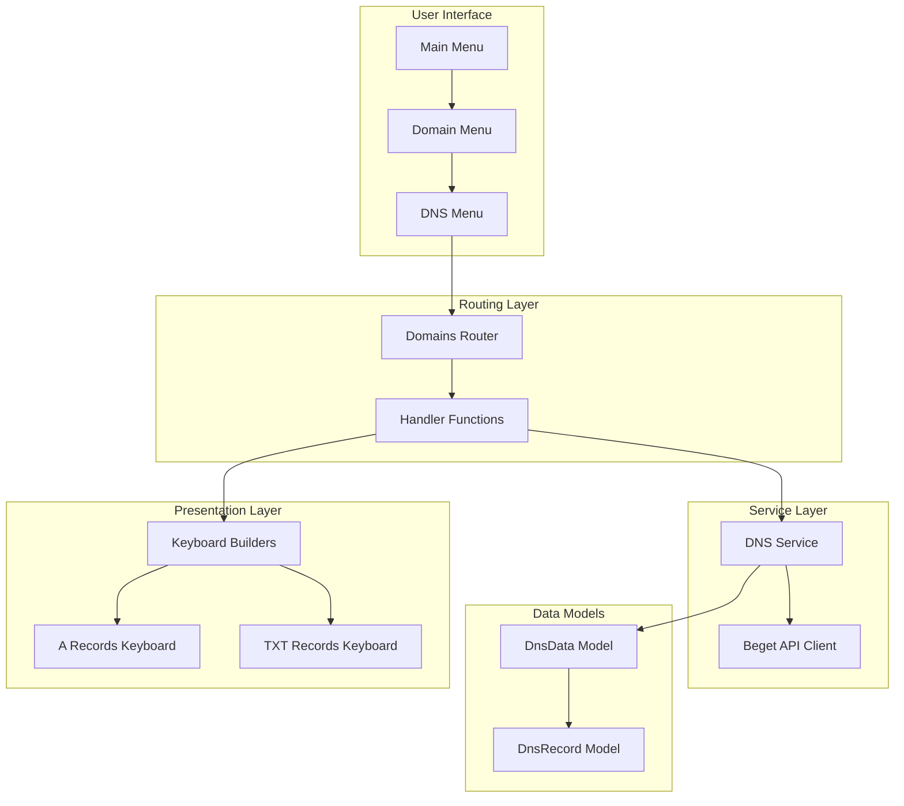
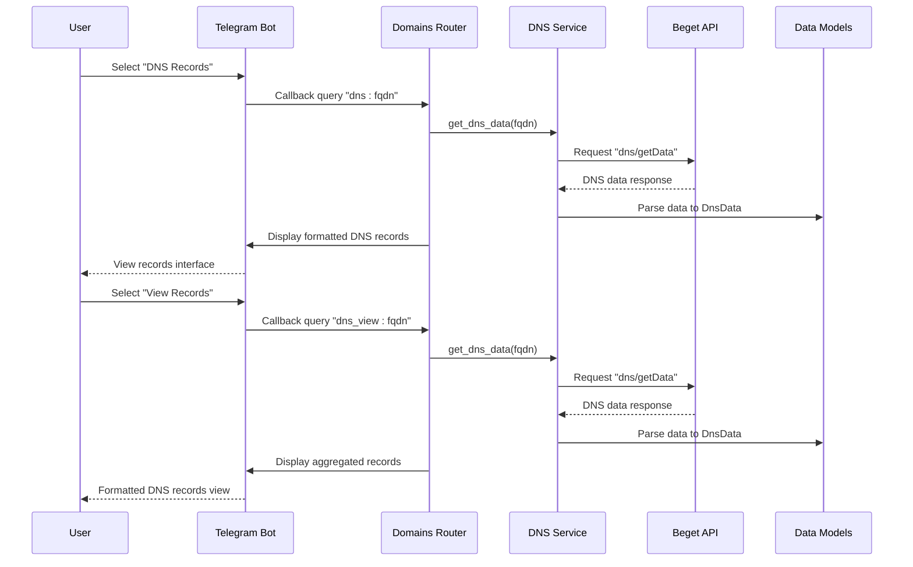
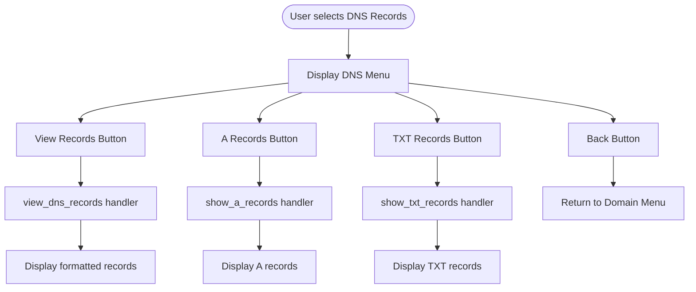
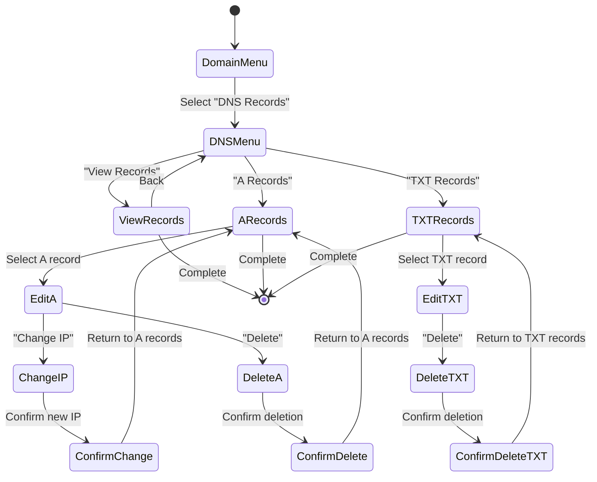
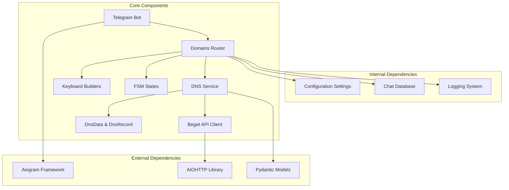

# DNS Records Overview and Navigation

<cite>
**Referenced Files in This Document**
- [dns.py](file://app/services/beget/dns.py)
- [types.py](file://app/services/beget/types.py)
- [client.py](file://app/services/beget/client.py)
- [keyboards.py](file://app/modules/domains/keyboards.py)
- [router.py](file://app/modules/domains/router.py)
- [states.py](file://app/modules/domains/states.py)
- [bot.py](file://app/bot/bot.py)
- [common.py](file://app/bot/keyboards/common.py)
</cite>

## Table of Contents
1. [Introduction](#introduction)
2. [Project Structure](#project-structure)
3. [Core Components](#core-components)
4. [Architecture Overview](#architecture-overview)
5. [Detailed Component Analysis](#detailed-component-analysis)
6. [Dependency Analysis](#dependency-analysis)
7. [Performance Considerations](#performance-considerations)
8. [Troubleshooting Guide](#troubleshooting-guide)
9. [Conclusion](#conclusion)

## Introduction
This document provides comprehensive documentation for the DNS records overview functionality within the Beget Manager Telegram bot. It explains how DNS records are organized and displayed for each domain, including the hierarchical navigation system that enables users to browse different record types. The document details the `dns_menu_keyboard` implementation and how it provides access to different DNS management operations. It also documents the `view_dns_records` function that aggregates and displays all DNS record types (A, AAAA, MX, TXT, CNAME, NS) in a formatted interface. Examples of DNS record display formatting and navigation patterns are included to help users understand the user experience.

## Project Structure
The DNS records functionality is implemented across several modules within the application:

- **Service Layer**: DNS service that interacts with the Beget API to retrieve and manage DNS records
- **Data Models**: Pydantic models that define the structure of DNS data and records
- **Presentation Layer**: Keyboard builders that create interactive navigation menus
- **Routing Layer**: Handler functions that process user interactions and orchestrate the display of DNS records
- **State Management**: FSM states for managing user input during DNS operations



**Diagram sources**
- [bot.py](file://app/bot/bot.py#L49-L51)
- [router.py](file://app/modules/domains/router.py#L346-L355)
- [dns.py](file://app/services/beget/dns.py#L8-L12)

**Section sources**
- [bot.py](file://app/bot/bot.py#L49-L51)
- [router.py](file://app/modules/domains/router.py#L346-L355)

## Core Components
The DNS records functionality consists of several interconnected components that work together to provide a seamless user experience:

### DNS Service
The `DnsService` class handles all DNS-related operations, including retrieving DNS data from the Beget API and managing DNS records. It provides methods for fetching DNS records, adding new records, updating existing ones, and deleting records.

### Data Models
The system uses Pydantic models to define the structure of DNS data:
- `DnsData`: Contains all DNS records for a domain, organized by record type
- `DnsRecord`: Represents individual DNS records with value and priority attributes

### Keyboard Builders
The keyboard builders create interactive navigation menus that guide users through the DNS management workflow. They provide intuitive interfaces for browsing different record types and performing management operations.

### Router Handlers
The router handlers process user interactions and coordinate the display of DNS records. They handle navigation between different views and manage the state transitions required for complex operations.

**Section sources**
- [dns.py](file://app/services/beget/dns.py#L8-L77)
- [types.py](file://app/services/beget/types.py#L28-L46)
- [keyboards.py](file://app/modules/domains/keyboards.py#L105-L118)
- [router.py](file://app/modules/domains/router.py#L346-L421)

## Architecture Overview
The DNS records architecture follows a layered approach with clear separation of concerns:



**Diagram sources**
- [router.py](file://app/modules/domains/router.py#L346-L421)
- [dns.py](file://app/services/beget/dns.py#L14-L77)

The architecture ensures that:
- User interactions are handled by the routing layer
- Business logic is encapsulated in the service layer
- Data transformations occur through well-defined models
- Presentation logic is separated from business logic

## Detailed Component Analysis

### DNS Menu Keyboard Implementation
The `dns_menu_keyboard` function creates the primary navigation interface for DNS management operations. It provides quick access to different DNS record types and management functions.



**Diagram sources**
- [keyboards.py](file://app/modules/domains/keyboards.py#L105-L118)
- [router.py](file://app/modules/domains/router.py#L358-L421)

The DNS menu keyboard provides:
- Quick access to view all DNS records at once
- Separate navigation for A records and TXT records
- Consistent back navigation to the domain menu

**Section sources**
- [keyboards.py](file://app/modules/domains/keyboards.py#L105-L118)
- [router.py](file://app/modules/domains/router.py#L346-L421)

### View DNS Records Function
The `view_dns_records` function serves as the central hub for displaying all DNS records in a formatted interface. It aggregates data from all record types and presents them in a structured, easy-to-read format.

```mermaid
flowchart TD
Start([User selects "View Records"]) --> GetData[Call get_dns_data]
GetData --> ParseData[Parse DNS data to DnsData]
ParseData --> CheckA{Has A records?}
CheckA --> |Yes| AddA[Add A records section]
CheckA --> |No| CheckAAAA{Has AAAA records?}
AddA --> CheckAAAA
CheckAAAA --> |Yes| AddAAAA[Add AAAA records section]
CheckAAAA --> |No| CheckMX{Has MX records?}
AddAAAA --> CheckMX
CheckMX --> |Yes| AddMX[Add MX records section]
CheckMX --> |No| CheckTXT{Has TXT records?}
AddMX --> CheckTXT
CheckTXT --> |Yes| AddTXT[Add TXT records section]
CheckTXT --> |No| CheckCNAME{Has CNAME records?}
AddTXT --> CheckCNAME
CheckCNAME --> |Yes| AddCNAME[Add CNAME records section]
CheckCNAME --> |No| CheckNS{Has NS records?}
AddCNAME --> CheckNS
CheckNS --> |Yes| AddNS[Add NS records section]
CheckNS --> |No| Display[Display formatted text]
AddNS --> Display
Display --> Back[Back to DNS Menu]
```

**Diagram sources**
- [router.py](file://app/modules/domains/router.py#L358-L421)

The function implements the following formatting logic:
- **A Records**: Displays IP addresses in a simple list format
- **AAAA Records**: Shows IPv6 addresses in a compact format
- **MX Records**: Includes priority information alongside exchange servers
- **TXT Records**: Truncates long values (first 50 characters) for readability
- **CNAME Records**: Displays canonical names without trailing dots
- **NS Records**: Shows nameserver values without trailing dots

**Section sources**
- [router.py](file://app/modules/domains/router.py#L358-L421)

### DNS Record Types and Organization
The system organizes DNS records according to standard DNS record types, each with specific formatting requirements:

#### A Records (IPv4 Addresses)
- **Format**: Standard IPv4 address notation (e.g., 192.168.1.1)
- **Priority**: Not applicable for A records
- **Display**: Simple list format with no additional metadata

#### AAAA Records (IPv6 Addresses)
- **Format**: Standard IPv6 address notation (e.g., 2001:db8::1)
- **Priority**: Not applicable for AAAA records
- **Display**: Compact format suitable for IPv6 addresses

#### MX Records (Mail Exchange)
- **Format**: Mail server hostname with priority values
- **Priority**: Numeric preference values (lower numbers have higher priority)
- **Display**: Includes priority information for easy identification

#### TXT Records (Text Records)
- **Format**: Arbitrary text data enclosed in quotes
- **Priority**: Not applicable for TXT records
- **Display**: Values are truncated to prevent excessive width in the interface

#### CNAME Records (Canonical Names)
- **Format**: Target hostname for alias resolution
- **Priority**: Not applicable for CNAME records
- **Display**: Removes trailing dots for cleaner presentation

#### NS Records (Name Servers)
- **Format**: Nameserver hostnames
- **Priority**: Not applicable for NS records
- **Display**: Removes trailing dots for consistency

**Section sources**
- [types.py](file://app/services/beget/types.py#L28-L46)
- [router.py](file://app/modules/domains/router.py#L372-L409)

### Navigation Patterns and User Experience
The DNS management interface follows consistent navigation patterns that guide users through the DNS management workflow:



**Diagram sources**
- [router.py](file://app/modules/domains/router.py#L423-L718)

The navigation system provides:
- **Hierarchical structure**: Clear progression from domain-level to record-type-specific views
- **Consistent back navigation**: Users can return to previous screens at any time
- **Intuitive labeling**: Buttons clearly indicate their purpose and destination
- **State persistence**: Important data is maintained across navigation steps

**Section sources**
- [router.py](file://app/modules/domains/router.py#L423-L718)

## Dependency Analysis
The DNS records functionality relies on several interconnected dependencies that ensure proper operation and maintain separation of concerns:



**Diagram sources**
- [bot.py](file://app/bot/bot.py#L18-L83)
- [router.py](file://app/modules/domains/router.py#L1-L30)
- [dns.py](file://app/services/beget/dns.py#L1-L10)

The dependency relationships ensure:
- **Loose coupling**: Components depend on abstractions rather than concrete implementations
- **Clear boundaries**: Each layer has distinct responsibilities
- **Testability**: Dependencies can be mocked for testing
- **Maintainability**: Changes in one layer don't cascade to unrelated components

**Section sources**
- [bot.py](file://app/bot/bot.py#L18-L83)
- [router.py](file://app/modules/domains/router.py#L1-L30)
- [dns.py](file://app/services/beget/dns.py#L1-L10)

## Performance Considerations
The DNS records functionality is designed with several performance optimizations:

### API Call Efficiency
- **Single request per view**: The system makes one API call per DNS view to minimize network overhead
- **Batch operations**: Record modifications use batch updates to reduce the number of API calls
- **Response caching**: While not explicitly implemented, the architecture supports easy addition of caching mechanisms

### Data Processing Optimization
- **Efficient parsing**: DNS data is parsed once and reused across different display formats
- **Lazy evaluation**: Complex formatting operations are performed only when needed
- **Memory management**: Temporary data structures are cleaned up promptly after use

### User Interface Responsiveness
- **Asynchronous operations**: All network operations use async/await to prevent blocking the UI
- **Immediate feedback**: Users receive immediate confirmation for their actions
- **Graceful error handling**: Network errors and API failures are handled gracefully without crashing the application

## Troubleshooting Guide
Common issues and their solutions when working with DNS records:

### API Authentication Issues
**Problem**: Users receive authentication errors when accessing DNS data
**Solution**: Verify that the Beget API credentials are correctly configured in the environment variables and that the bot has proper permissions to access DNS data.

### Network Connectivity Problems
**Problem**: DNS data fails to load with timeout errors
**Solution**: Check network connectivity and verify that the Beget API endpoints are reachable. Consider increasing the timeout values if the network is slow.

### Data Parsing Errors
**Problem**: DNS records display incorrectly or show unexpected formatting
**Solution**: Verify that the DNS data structure matches the expected format. Check for trailing dots in hostnames and ensure proper encoding of special characters.

### Navigation Issues
**Problem**: Users cannot navigate between different DNS record types
**Solution**: Ensure that the callback data format matches the expected patterns and that the router handlers are properly registered.

**Section sources**
- [client.py](file://app/services/beget/client.py#L118-L135)
- [router.py](file://app/modules/domains/router.py#L363-L371)

## Conclusion
The DNS records overview functionality provides a comprehensive and user-friendly interface for managing DNS records through the Telegram bot. The implementation demonstrates excellent separation of concerns with clear layers for presentation, business logic, and data access. The hierarchical navigation system enables efficient browsing of different record types, while the formatted display ensures that DNS data is presented in an easily understandable manner.

Key strengths of the implementation include:
- **Modular architecture**: Clean separation between UI, business logic, and data access layers
- **Extensible design**: Easy to add support for additional DNS record types
- **User-centric navigation**: Intuitive menu structures that guide users through complex operations
- **Robust error handling**: Comprehensive error handling for network issues and API failures
- **Performance optimization**: Efficient data processing and minimal API calls

The system successfully balances functionality with usability, providing administrators with powerful DNS management capabilities while maintaining an accessible interface suitable for various skill levels.