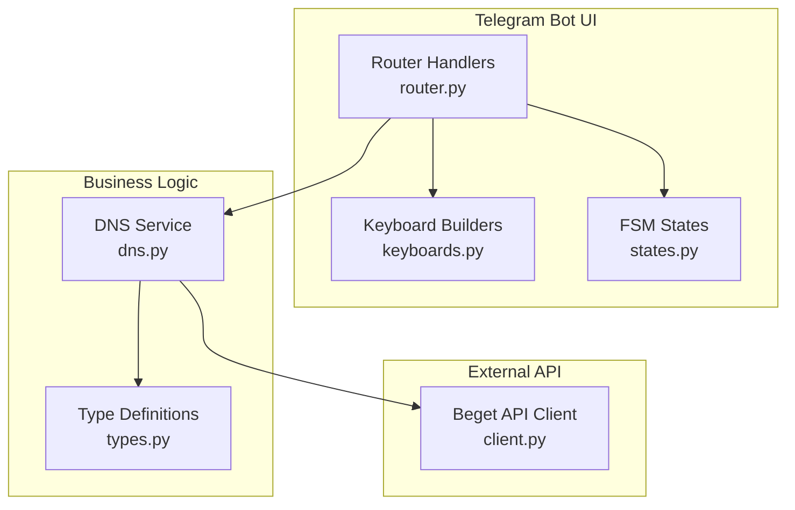
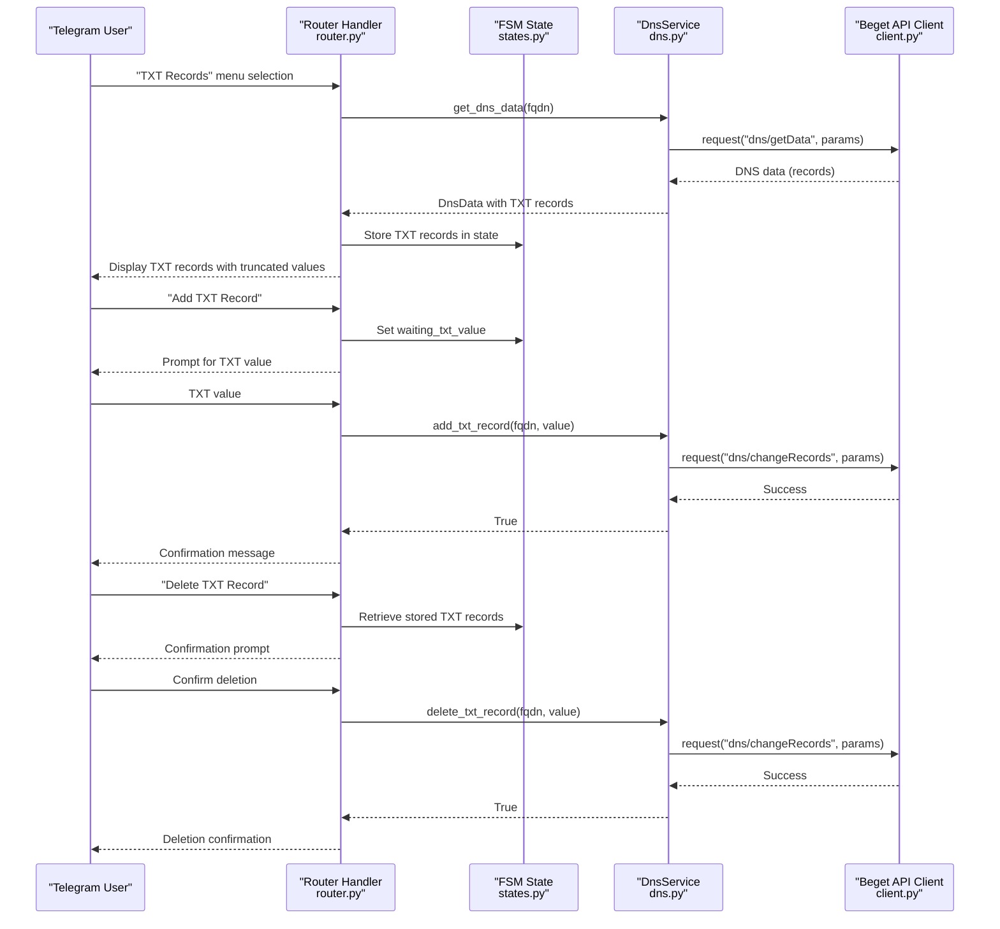
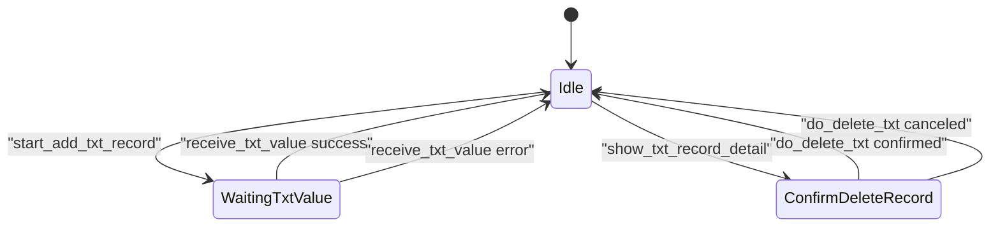
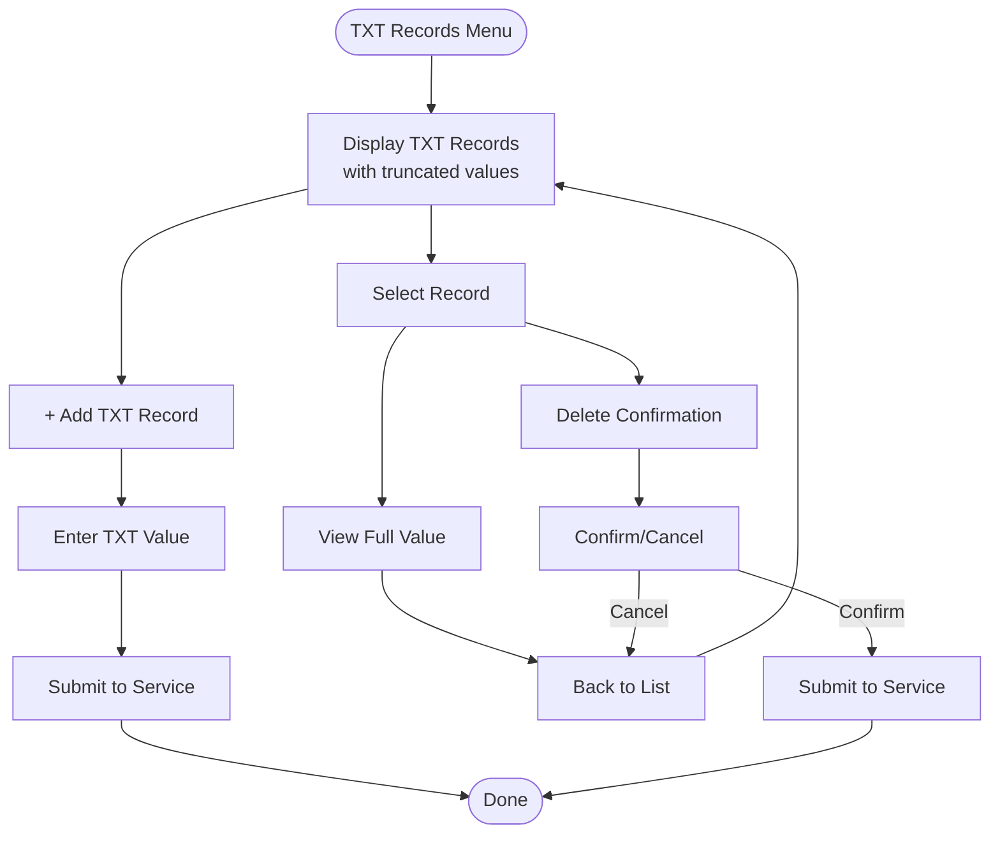
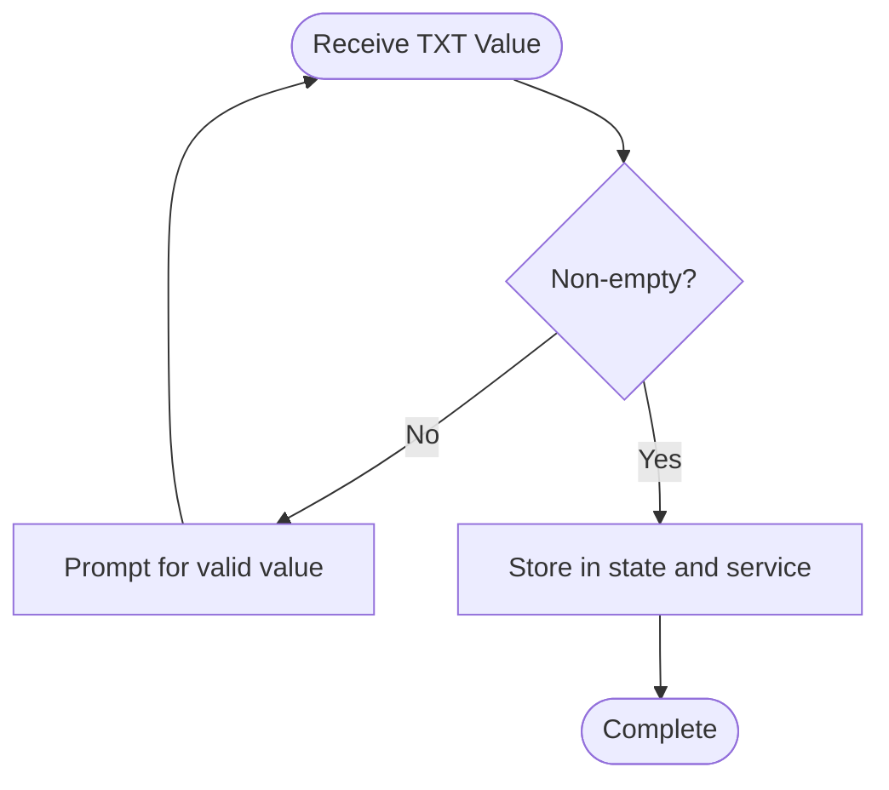
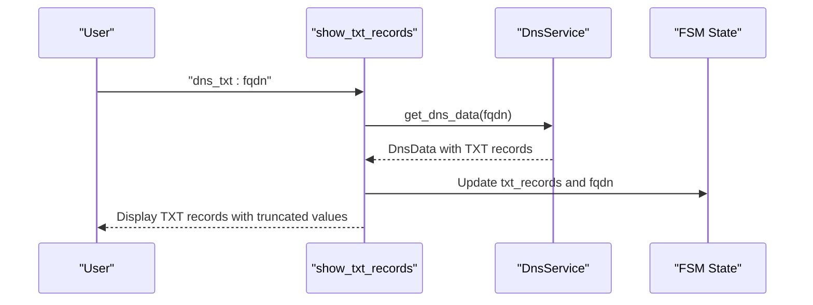
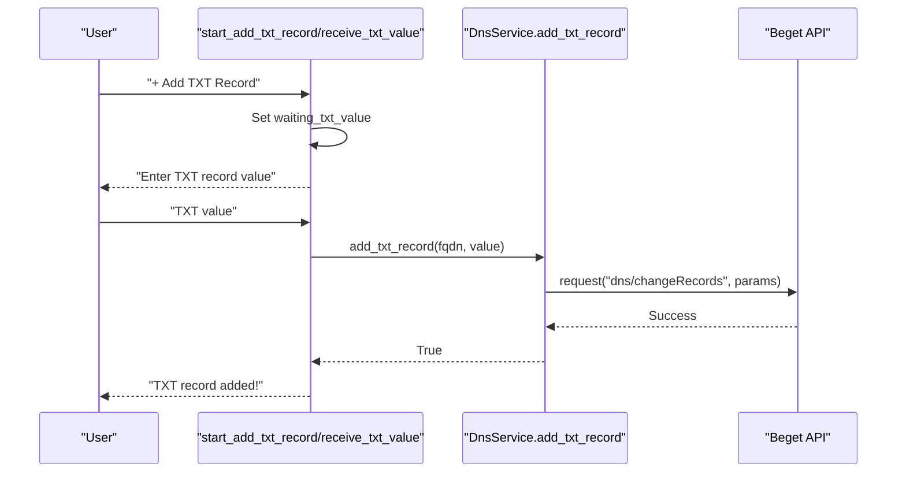
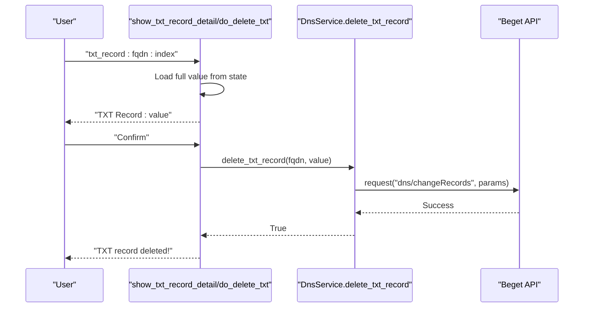
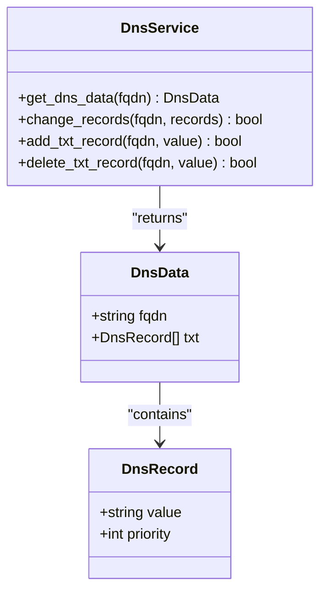
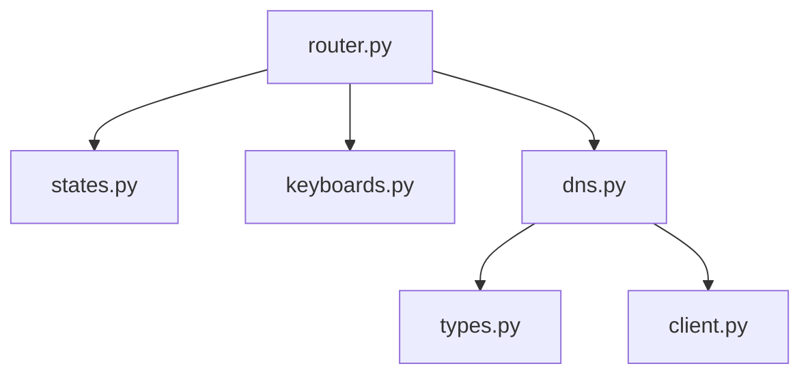

# TXT Records Management

<cite>
**Referenced Files in This Document**
- [states.py](file://app/modules/domains/states.py)
- [keyboards.py](file://app/modules/domains/keyboards.py)
- [router.py](file://app/modules/domains/router.py)
- [dns.py](file://app/services/beget/dns.py)
- [types.py](file://app/services/beget/types.py)
- [client.py](file://app/services/beget/client.py)
- [README.md](file://README.md)
</cite>

## Table of Contents
1. [Introduction](#introduction)
2. [Project Structure](#project-structure)
3. [Core Components](#core-components)
4. [Architecture Overview](#architecture-overview)
5. [Detailed Component Analysis](#detailed-component-analysis)
6. [Dependency Analysis](#dependency-analysis)
7. [Performance Considerations](#performance-considerations)
8. [Troubleshooting Guide](#troubleshooting-guide)
9. [Conclusion](#conclusion)

## Introduction
This document provides comprehensive guidance for managing TXT DNS records within the Beget Manager Telegram bot. It covers the end-to-end workflow for viewing TXT records, adding new TXT records, and deleting existing TXT records. It explains the finite state machine (FSM) state management used to persist data across multi-step operations, the keyboard interfaces for record selection and deletion, text validation requirements, and the handling of long TXT record values with truncation for display purposes. Finally, it documents the integration with the DnsService.add_txt_record() and delete_txt_record() methods.

## Project Structure
The TXT records management functionality is implemented across several modules:
- Router handlers orchestrate user interactions and state transitions
- FSM states define the multi-step workflows
- Keyboard builders construct interactive menus for record selection and confirmation
- Service layer handles communication with the Beget DNS API
- Type definitions model DNS records and data structures

**Diagram sources**
- [router.py](file://app/modules/domains/router.py#L1-L718)
- [keyboards.py](file://app/modules/domains/keyboards.py#L1-L196)
- [states.py](file://app/modules/domains/states.py#L1-L21)
- [dns.py](file://app/services/beget/dns.py#L1-L152)
- [types.py](file://app/services/beget/types.py#L1-L59)
- [client.py](file://app/services/beget/client.py#L1-L135)

**Section sources**
- [router.py](file://app/modules/domains/router.py#L1-L718)
- [keyboards.py](file://app/modules/domains/keyboards.py#L1-L196)
- [states.py](file://app/modules/domains/states.py#L1-L21)
- [dns.py](file://app/services/beget/dns.py#L1-L152)
- [types.py](file://app/services/beget/types.py#L1-L59)
- [client.py](file://app/services/beget/client.py#L1-L135)

## Core Components
- FSM States for TXT operations:
  - waiting_txt_value: Captures the TXT record value during creation
  - confirm_delete_record: Confirms deletion of a selected TXT record
- Keyboard builders:
  - dns_menu_keyboard: Provides navigation to TXT records
  - txt_records_keyboard: Lists TXT records with truncated display
  - confirm_keyboard: Generic confirmation interface for destructive actions
- Router handlers:
  - show_txt_records: Loads TXT records and stores them in state
  - show_txt_record_detail: Displays a selected TXT record and deletion options
  - start_add_txt_record: Initiates TXT creation workflow
  - receive_txt_value: Validates and persists the new TXT record
  - do_delete_txt: Confirms and deletes the selected TXT record
- Service layer:
  - DnsService.add_txt_record(): Adds a TXT record via Beget API
  - DnsService.delete_txt_record(): Removes a TXT record via Beget API
- Type definitions:
  - DnsRecord: Represents a DNS record with value and priority
  - DnsData: Aggregates DNS records for a domain

**Section sources**
- [states.py](file://app/modules/domains/states.py#L14-L21)
- [keyboards.py](file://app/modules/domains/keyboards.py#L105-L196)
- [router.py](file://app/modules/domains/router.py#L589-L718)
- [dns.py](file://app/services/beget/dns.py#L134-L152)
- [types.py](file://app/services/beget/types.py#L28-L59)

## Architecture Overview
The TXT records workflow follows a clear sequence: user selects TXT management, the bot loads records and displays them, the user chooses an action (view or add), and the bot performs the operation using the service layer.

**Diagram sources**
- [router.py](file://app/modules/domains/router.py#L589-L718)
- [states.py](file://app/modules/domains/states.py#L14-L21)
- [dns.py](file://app/services/beget/dns.py#L134-L152)
- [client.py](file://app/services/beget/client.py#L70-L121)

## Detailed Component Analysis

### State Management for TXT Operations
- Purpose: Persist multi-step data across user interactions without requiring persistent storage.
- Key states:
  - waiting_txt_value: Captures the TXT value during creation.
  - confirm_delete_record: Used for confirming deletion actions.
- Persistence mechanism:
  - During TXT record listing, the router stores the current TXT record values in state for later reference during deletion.
  - During creation, the router sets the waiting_txt_value state and clears it upon completion.

**Diagram sources**
- [states.py](file://app/modules/domains/states.py#L14-L21)
- [router.py](file://app/modules/domains/router.py#L650-L718)

**Section sources**
- [states.py](file://app/modules/domains/states.py#L14-L21)
- [router.py](file://app/modules/domains/router.py#L603-L621)
- [router.py](file://app/modules/domains/router.py#L665-L686)
- [router.py](file://app/modules/domains/router.py#L688-L718)

### Keyboard Interfaces for TXT Records
- TXT records list:
  - Displays truncated TXT values (first 30 characters) to fit within Telegram button width.
  - Provides navigation to add new TXT records and back to DNS menu.
- Record detail and deletion:
  - Shows the full TXT value for confirmation.
  - Offers confirm/cancel options using a generic keyboard.

**Diagram sources**
- [keyboards.py](file://app/modules/domains/keyboards.py#L142-L162)
- [router.py](file://app/modules/domains/router.py#L624-L648)
- [router.py](file://app/modules/domains/router.py#L650-L686)
- [router.py](file://app/modules/domains/router.py#L688-L718)

**Section sources**
- [keyboards.py](file://app/modules/domains/keyboards.py#L142-L162)
- [router.py](file://app/modules/domains/router.py#L624-L648)
- [router.py](file://app/modules/domains/router.py#L650-L686)
- [router.py](file://app/modules/domains/router.py#L688-L718)

### Text Validation Requirements
- TXT value acceptance:
  - Non-empty values are required.
  - The handler rejects empty inputs and requests a retry.
- Long TXT value handling:
  - Display truncation: Buttons show the first 30 characters followed by an ellipsis.
  - Full value preservation: The service stores and operates on the complete value.
- Priority assignment:
  - TXT records are assigned ascending priorities (multiples of 10) during addition and updates.

**Diagram sources**
- [router.py](file://app/modules/domains/router.py#L665-L686)
- [keyboards.py](file://app/modules/domains/keyboards.py#L146-L154)
- [dns.py](file://app/services/beget/dns.py#L134-L152)

**Section sources**
- [router.py](file://app/modules/domains/router.py#L665-L686)
- [keyboards.py](file://app/modules/domains/keyboards.py#L146-L154)
- [dns.py](file://app/services/beget/dns.py#L134-L152)

### Workflow: Viewing TXT Records
- Navigation: From the DNS menu, select "TXT Records".
- Loading: The router fetches DNS data and extracts TXT records.
- Display: The router builds a numbered list with truncated values and navigational buttons.
- State persistence: The router stores the current TXT record values in state for subsequent operations.

**Diagram sources**
- [router.py](file://app/modules/domains/router.py#L589-L622)
- [dns.py](file://app/services/beget/dns.py#L14-L77)

**Section sources**
- [router.py](file://app/modules/domains/router.py#L589-L622)

### Workflow: Adding a New TXT Record
- Initiation: Select "+ Add TXT Record" from the TXT records list.
- Capture: The router sets the waiting_txt_value state and prompts the user for the TXT value.
- Validation: The handler ensures the value is non-empty.
- Execution: The router calls DnsService.add_txt_record() with the FQDN and value.
- Completion: The router clears state and confirms success.

**Diagram sources**
- [router.py](file://app/modules/domains/router.py#L650-L686)
- [dns.py](file://app/services/beget/dns.py#L134-L140)
- [client.py](file://app/services/beget/client.py#L70-L121)

**Section sources**
- [router.py](file://app/modules/domains/router.py#L650-L686)
- [dns.py](file://app/services/beget/dns.py#L134-L140)

### Workflow: Deleting an Existing TXT Record
- Selection: Choose a TXT record from the list.
- Detail: The router retrieves the full value from state and displays it with confirmation options.
- Confirmation: The user confirms deletion.
- Execution: The router calls DnsService.delete_txt_record() with the FQDN and the exact value to remove.
- Completion: The router clears state and refreshes the TXT records list.

**Diagram sources**
- [router.py](file://app/modules/domains/router.py#L624-L648)
- [router.py](file://app/modules/domains/router.py#L688-L718)
- [dns.py](file://app/services/beget/dns.py#L142-L152)
- [client.py](file://app/services/beget/client.py#L70-L121)

**Section sources**
- [router.py](file://app/modules/domains/router.py#L624-L648)
- [router.py](file://app/modules/domains/router.py#L688-L718)
- [dns.py](file://app/services/beget/dns.py#L142-L152)

### Integration with DnsService Methods
- add_txt_record():
  - Retrieves current TXT records
  - Assigns ascending priorities
  - Calls change_records() to apply the update
- delete_txt_record():
  - Retrieves current TXT records
  - Excludes the target value
  - Calls change_records() to apply the update

**Diagram sources**
- [dns.py](file://app/services/beget/dns.py#L8-L152)
- [types.py](file://app/services/beget/types.py#L35-L59)

**Section sources**
- [dns.py](file://app/services/beget/dns.py#L134-L152)
- [types.py](file://app/services/beget/types.py#L28-L59)

## Dependency Analysis
The TXT records management depends on:
- Router handlers for user interaction and state orchestration
- FSM states for multi-step persistence
- Keyboard builders for UI construction
- Service layer for API integration
- Type definitions for data modeling

**Diagram sources**
- [router.py](file://app/modules/domains/router.py#L1-L718)
- [states.py](file://app/modules/domains/states.py#L1-L21)
- [keyboards.py](file://app/modules/domains/keyboards.py#L1-L196)
- [dns.py](file://app/services/beget/dns.py#L1-L152)
- [types.py](file://app/services/beget/types.py#L1-L59)
- [client.py](file://app/services/beget/client.py#L1-L135)

**Section sources**
- [router.py](file://app/modules/domains/router.py#L1-L718)
- [states.py](file://app/modules/domains/states.py#L1-L21)
- [keyboards.py](file://app/modules/domains/keyboards.py#L1-L196)
- [dns.py](file://app/services/beget/dns.py#L1-L152)
- [types.py](file://app/services/beget/types.py#L1-L59)
- [client.py](file://app/services/beget/client.py#L1-L135)

## Performance Considerations
- Display truncation: Limiting TXT display to 30 characters reduces button width and improves readability.
- State usage: Storing TXT values in state avoids repeated API calls for selection and deletion.
- Priority assignment: Sequential priority assignment simplifies ordering and avoids conflicts.
- API round-trips: The router minimizes redundant calls by fetching DNS data once per session and reusing state.

## Troubleshooting Guide
- Empty TXT value:
  - Symptom: User input rejected with a retry prompt.
  - Resolution: Ensure the TXT value is non-empty before submission.
- Record not found during deletion:
  - Symptom: Alert indicating the record was not found.
  - Resolution: Verify the index is valid and the state contains the current TXT records.
- API errors:
  - Symptom: Errors raised by the Beget API client.
  - Resolution: Check credentials, network connectivity, and API limits; review logs for detailed error messages.
- Timeout errors:
  - Symptom: Request timeout while communicating with the API.
  - Resolution: Increase timeout settings if necessary and retry the operation.

**Section sources**
- [router.py](file://app/modules/domains/router.py#L665-L686)
- [router.py](file://app/modules/domains/router.py#L688-L718)
- [client.py](file://app/services/beget/client.py#L118-L121)

## Conclusion
The TXT records management feature provides a robust, user-friendly workflow for viewing, adding, and deleting TXT DNS records. It leverages FSM states for reliable multi-step operations, keyboard builders for intuitive navigation, and a service layer that integrates seamlessly with the Beget DNS API. Display truncation ensures usability, while strict validation and state persistence improve reliability. The documented workflows and integration points enable maintainability and future enhancements.