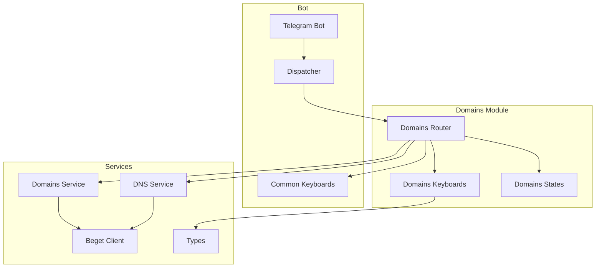
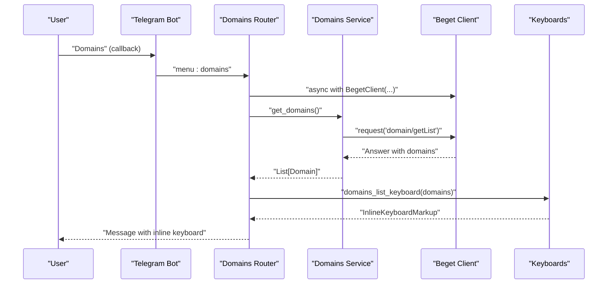
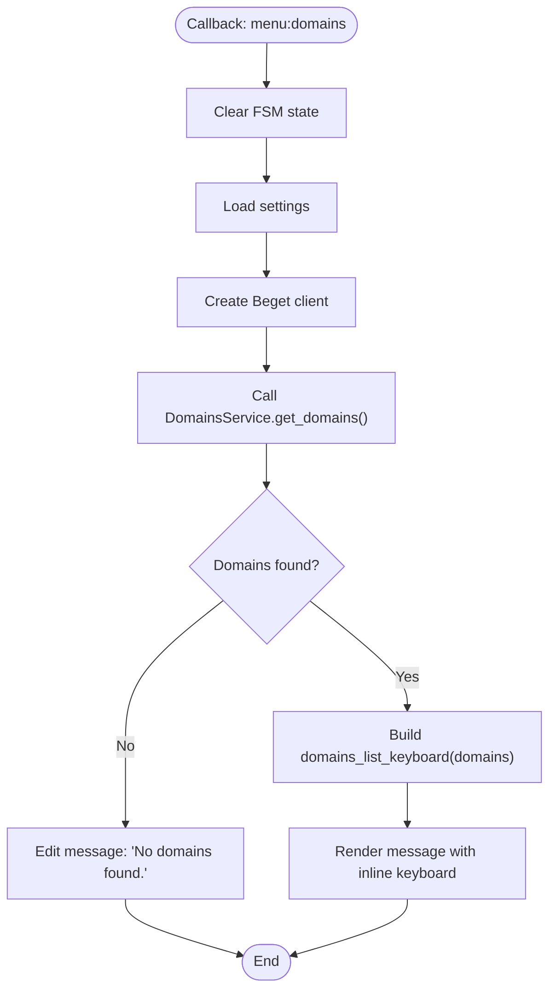
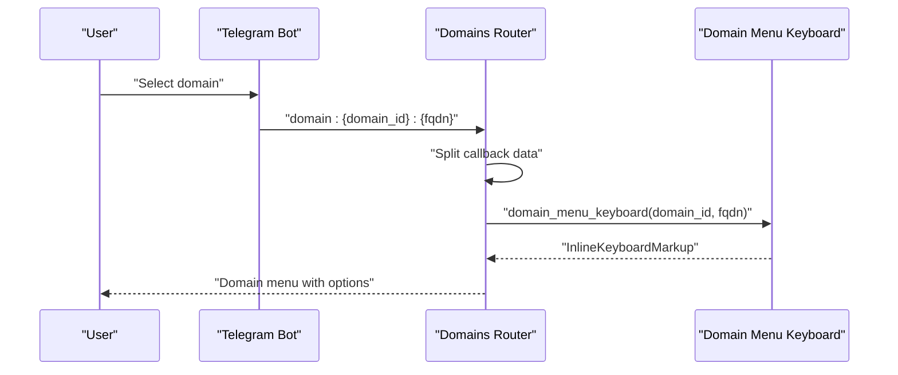
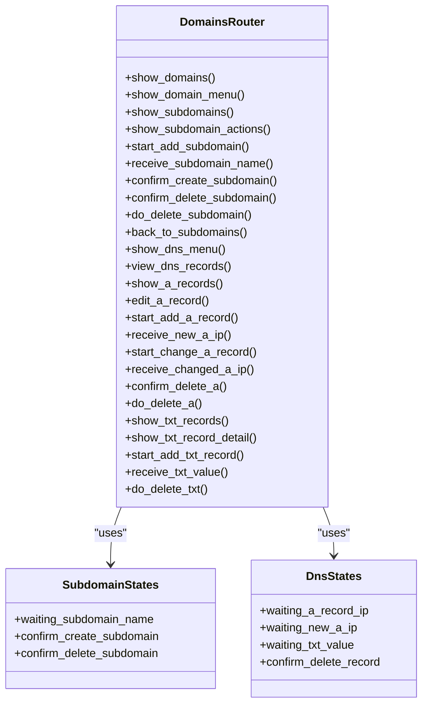
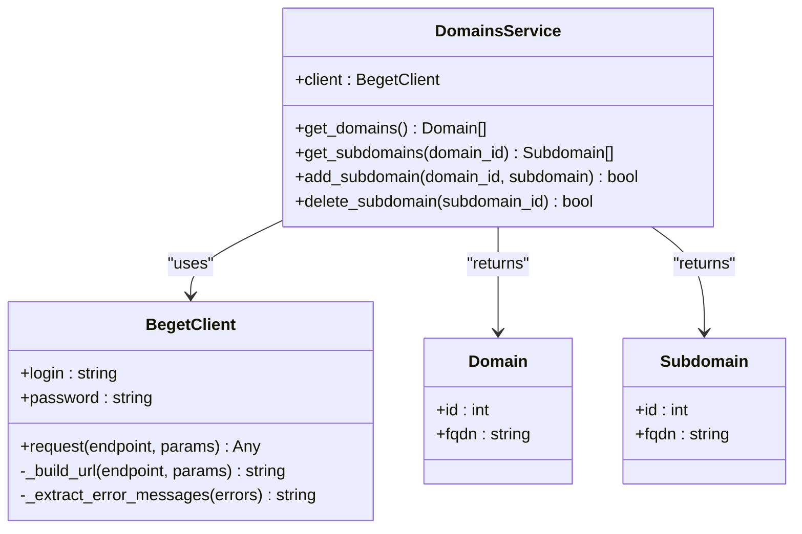
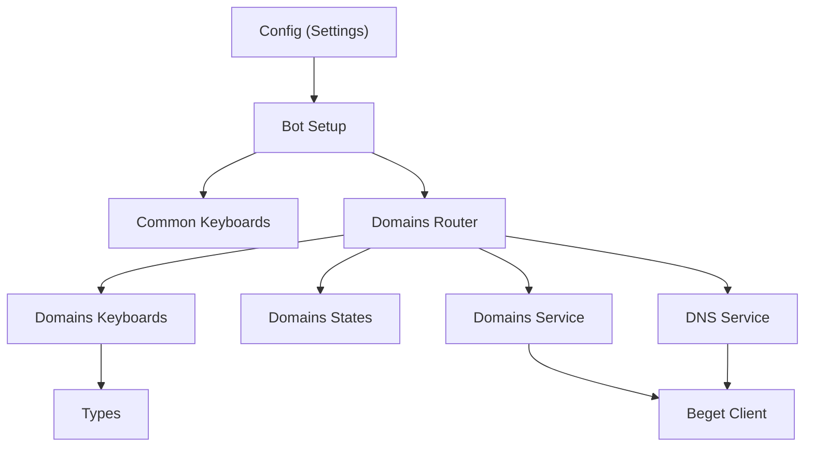

# Domain Browsing and Selection

<cite>
**Referenced Files in This Document**
- [router.py](file://app/modules/domains/router.py)
- [keyboards.py](file://app/modules/domains/keyboards.py)
- [states.py](file://app/modules/domains/states.py)
- [domains.py](file://app/services/beget/domains.py)
- [client.py](file://app/services/beget/client.py)
- [types.py](file://app/services/beget/types.py)
- [dns.py](file://app/services/beget/dns.py)
- [common.py](file://app/bot/keyboards/common.py)
- [bot.py](file://app/bot/bot.py)
- [config.py](file://app/config.py)
</cite>

## Table of Contents
1. [Introduction](#introduction)
2. [Project Structure](#project-structure)
3. [Core Components](#core-components)
4. [Architecture Overview](#architecture-overview)
5. [Detailed Component Analysis](#detailed-component-analysis)
6. [Dependency Analysis](#dependency-analysis)
7. [Performance Considerations](#performance-considerations)
8. [Troubleshooting Guide](#troubleshooting-guide)
9. [Conclusion](#conclusion)

## Introduction
This document explains the domain browsing and selection functionality of the Beget Manager Telegram bot. It covers how users discover their domains, navigate between domain menus, and manage subdomains and DNS records. The domain listing handler fetches domains from the Beget API and presents them in an inline keyboard interface. The domain selection process extracts domain IDs and fully qualified domain names (FQDN) from callback data. We also detail error handling for empty domain lists, integration with the Beget API client for real-time domain data retrieval, and the keyboard navigation system that maintains context for subsequent operations.

## Project Structure
The domain browsing and selection feature spans several modules:
- Router: Handles user interactions and orchestrates domain-related workflows
- Keyboards: Builds inline keyboards for domain lists, menus, and actions
- States: Manages conversation state for multi-step operations
- Services: Encapsulates Beget API interactions for domains and DNS
- Types: Defines data models for API responses
- Bot configuration: Registers routers and sets up the main menu

**Diagram sources**
- [bot.py](file://app/bot/bot.py#L18-L83)
- [router.py](file://app/modules/domains/router.py#L1-L718)
- [keyboards.py](file://app/modules/domains/keyboards.py#L1-L196)
- [states.py](file://app/modules/domains/states.py#L1-L21)
- [domains.py](file://app/services/beget/domains.py#L1-L58)
- [dns.py](file://app/services/beget/dns.py#L1-L152)
- [client.py](file://app/services/beget/client.py#L1-L135)
- [types.py](file://app/services/beget/types.py#L1-L59)
- [common.py](file://app/bot/keyboards/common.py#L1-L42)

**Section sources**
- [bot.py](file://app/bot/bot.py#L18-L83)
- [router.py](file://app/modules/domains/router.py#L1-L718)
- [keyboards.py](file://app/modules/domains/keyboards.py#L1-L196)
- [states.py](file://app/modules/domains/states.py#L1-L21)
- [domains.py](file://app/services/beget/domains.py#L1-L58)
- [dns.py](file://app/services/beget/dns.py#L1-L152)
- [client.py](file://app/services/beget/client.py#L1-L135)
- [types.py](file://app/services/beget/types.py#L1-L59)
- [common.py](file://app/bot/keyboards/common.py#L1-L42)

## Core Components
- Domain listing handler: Fetches domains from Beget API and renders an inline keyboard
- Domain selection handler: Parses callback data to extract domain ID and FQDN
- Keyboard builders: Generate inline keyboards for domain lists, menus, and actions
- FSM states: Maintain context for multi-step operations (e.g., adding subdomains)
- Beget API client: Provides authenticated HTTP requests to Beget endpoints
- Domain and DNS services: Transform API responses into typed models and orchestrate operations

**Section sources**
- [router.py](file://app/modules/domains/router.py#L28-L53)
- [keyboards.py](file://app/modules/domains/keyboards.py#L9-L24)
- [states.py](file://app/modules/domains/states.py#L6-L21)
- [domains.py](file://app/services/beget/domains.py#L13-L58)
- [dns.py](file://app/services/beget/dns.py#L14-L152)
- [client.py](file://app/services/beget/client.py#L21-L135)
- [types.py](file://app/services/beget/types.py#L14-L59)

## Architecture Overview
The domain browsing workflow follows a clear sequence:
1. User opens the main menu and selects "Domains"
2. Router triggers the domain listing handler
3. Handler authenticates with Beget API via the client and retrieves domains
4. Keyboard builder constructs an inline keyboard with domain options
5. User selects a domain, triggering the domain menu handler
6. Domain menu displays subdomain and DNS management options
7. Navigation maintains context using callback data and FSM state

**Diagram sources**
- [router.py](file://app/modules/domains/router.py#L28-L53)
- [domains.py](file://app/services/beget/domains.py#L13-L23)
- [client.py](file://app/services/beget/client.py#L70-L117)
- [keyboards.py](file://app/modules/domains/keyboards.py#L9-L24)

## Detailed Component Analysis

### Domain Listing Handler
The domain listing handler responds to the "menu:domains" callback, authenticates with the Beget API, and renders a selectable list of domains.

Key behaviors:
- Clears FSM state before starting
- Creates a Beget client with configured credentials
- Calls DomainsService.get_domains() to fetch domain list
- Handles exceptions by editing the message with an error
- Displays a message with an inline keyboard if domains are found
- Responds with a "No domains found" message if the list is empty

Callback data extraction:
- Uses callback.data.startswith("domain:") to route to domain menu
- Extracts domain_id and fqdn from callback data parts

**Diagram sources**
- [router.py](file://app/modules/domains/router.py#L28-L53)
- [domains.py](file://app/services/beget/domains.py#L13-L23)
- [keyboards.py](file://app/modules/domains/keyboards.py#L9-L24)

**Section sources**
- [router.py](file://app/modules/domains/router.py#L28-L53)
- [domains.py](file://app/services/beget/domains.py#L13-L23)
- [keyboards.py](file://app/modules/domains/keyboards.py#L9-L24)

### Domain Selection and Menu Navigation
When a user selects a domain from the inline keyboard, the router routes to the domain menu handler. The handler parses the callback data to extract domain_id and fqdn, then renders the domain menu with options for subdomains and DNS management.

Navigation patterns:
- Back to domains list: "menu:domains"
- Subdomains management: "subdomains:{domain_id}:{fqdn}"
- DNS management: "dns:{fqdn}"

**Diagram sources**
- [router.py](file://app/modules/domains/router.py#L55-L66)
- [keyboards.py](file://app/modules/domains/keyboards.py#L27-L45)

**Section sources**
- [router.py](file://app/modules/domains/router.py#L55-L66)
- [keyboards.py](file://app/modules/domains/keyboards.py#L27-L45)

### Keyboard Navigation System and Context Maintenance
The keyboard navigation system uses structured callback_data to maintain context across operations:
- Domain list: "domain:{domain_id}:{fqdn}"
- Domain menu: "subdomains:{domain_id}:{fqdn}", "dns:{fqdn}"
- Subdomains list: "subdomain:{subdomain_id}:{fqdn}", "add_subdomain:{domain_id}:{fqdn}"
- Subdomain actions: "del_sub:{subdomain_id}", "back_subs:{parent_domain_id}"
- DNS management: "dns_view:{fqdn}", "dns_a:{fqdn}", "dns_txt:{fqdn}"

FSM state is used for multi-step operations:
- Subdomain creation: waiting_subdomain_name, confirm_create_subdomain
- DNS record management: waiting_a_record_ip, waiting_new_a_ip, waiting_txt_value

**Diagram sources**
- [states.py](file://app/modules/domains/states.py#L6-L21)
- [router.py](file://app/modules/domains/router.py#L1-L718)

**Section sources**
- [router.py](file://app/modules/domains/router.py#L1-L718)
- [states.py](file://app/modules/domains/states.py#L6-L21)

### Beget API Integration and Data Retrieval
The DomainsService encapsulates Beget API interactions:
- get_domains(): Calls "domain/getList" and maps results to Domain models
- get_subdomains(): Calls "domain/getSubdomainList", filters by domain_id, and maps to Subdomain models
- add_subdomain(): Calls "domain/addSubdomainVirtual" with domain_id and subdomain
- delete_subdomain(): Calls "domain/deleteSubdomain" with subdomain_id

The Beget client handles authentication, URL construction, request/response parsing, and error handling:
- Builds URLs with login, password, and JSON input parameters
- Parses responses regardless of Content-Type
- Raises BegetApiError on API-level errors
- Implements timeouts and logging

**Diagram sources**
- [client.py](file://app/services/beget/client.py#L21-L135)
- [domains.py](file://app/services/beget/domains.py#L7-L58)
- [types.py](file://app/services/beget/types.py#L14-L26)

**Section sources**
- [domains.py](file://app/services/beget/domains.py#L13-L58)
- [client.py](file://app/services/beget/client.py#L70-L135)
- [types.py](file://app/services/beget/types.py#L14-L26)

### Practical Examples of Domain Navigation Patterns
- Listing domains: User clicks "Domains" → Router loads domains → Inline keyboard shows domain names
- Selecting a domain: User taps a domain → Router extracts domain_id and fqdn → Renders domain menu
- Subdomain management: From domain menu, user selects "Subdomains" → Router fetches subdomains → Renders subdomains list with actions
- DNS management: From domain menu, user selects "DNS Records" → Router renders DNS menu with options for viewing and editing records

These patterns rely on consistent callback_data formats and keyboard builders that encode domain identifiers and FQDNs.

**Section sources**
- [router.py](file://app/modules/domains/router.py#L28-L53)
- [router.py](file://app/modules/domains/router.py#L55-L66)
- [router.py](file://app/modules/domains/router.py#L72-L99)
- [router.py](file://app/modules/domains/router.py#L346-L355)

## Dependency Analysis
The domain browsing feature depends on:
- Bot configuration: Registers routers and main menu
- Common keyboards: Provides shared navigation elements
- Domain router: Orchestrates user interactions
- Domain and DNS services: Encapsulate API logic
- Beget client: Handles HTTP communication
- Types: Define data models for API responses

**Diagram sources**
- [config.py](file://app/config.py#L8-L52)
- [bot.py](file://app/bot/bot.py#L18-L83)
- [router.py](file://app/modules/domains/router.py#L1-L718)
- [keyboards.py](file://app/modules/domains/keyboards.py#L1-L196)
- [states.py](file://app/modules/domains/states.py#L1-L21)
- [domains.py](file://app/services/beget/domains.py#L1-L58)
- [dns.py](file://app/services/beget/dns.py#L1-L152)
- [client.py](file://app/services/beget/client.py#L1-L135)
- [types.py](file://app/services/beget/types.py#L1-L59)

**Section sources**
- [config.py](file://app/config.py#L8-L52)
- [bot.py](file://app/bot/bot.py#L18-L83)
- [router.py](file://app/modules/domains/router.py#L1-L718)
- [keyboards.py](file://app/modules/domains/keyboards.py#L1-L196)
- [states.py](file://app/modules/domains/states.py#L1-L21)
- [domains.py](file://app/services/beget/domains.py#L1-L58)
- [dns.py](file://app/services/beget/dns.py#L1-L152)
- [client.py](file://app/services/beget/client.py#L1-L135)
- [types.py](file://app/services/beget/types.py#L1-L59)

## Performance Considerations
- Asynchronous API calls: The Beget client uses aiohttp for non-blocking HTTP requests
- Minimal payload parsing: Responses are parsed regardless of Content-Type header to handle API inconsistencies
- Keyboard building: InlineKeyboardBuilder is used to efficiently construct menus
- State management: FSM reduces repeated API calls by storing context locally during multi-step operations
- Error handling: Early exits on API failures prevent unnecessary processing

## Troubleshooting Guide
Common issues and resolutions:
- Empty domain list: The handler checks for an empty list and responds with "No domains found." Ensure Beget credentials are valid and the account has domains.
- API errors: The Beget client raises BegetApiError with extracted error messages. Check logs for detailed error information.
- Timeout errors: The client implements timeouts; adjust settings if the API is slow.
- Unauthorized access: Ensure the user's Chat ID is in the allowed chats list; otherwise, middleware prevents access.

**Section sources**
- [router.py](file://app/modules/domains/router.py#L38-L46)
- [client.py](file://app/services/beget/client.py#L98-L120)
- [bot.py](file://app/bot/bot.py#L44-L47)

## Conclusion
The domain browsing and selection feature provides a robust, user-friendly interface for managing Beget domains and DNS records. The router orchestrates workflows, keyboards present navigable menus, and services integrate with the Beget API for real-time data retrieval. FSM state ensures smooth multi-step operations, while structured callback_data and consistent keyboard patterns maintain context across navigation. The system handles errors gracefully and logs API interactions for troubleshooting.