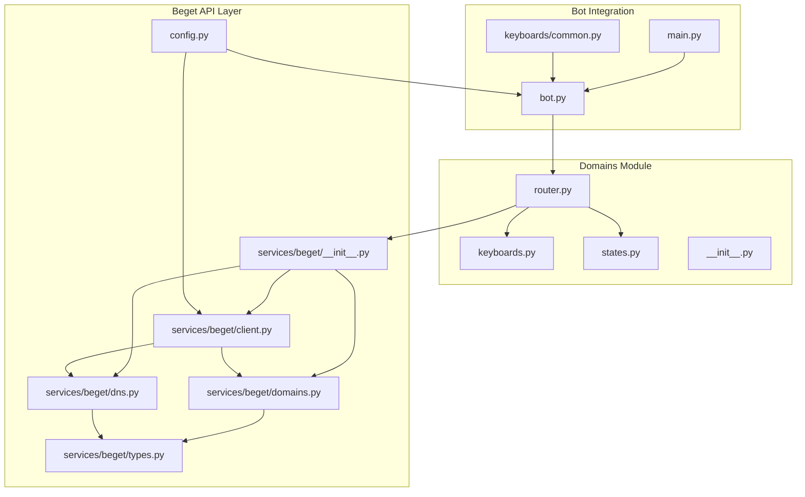
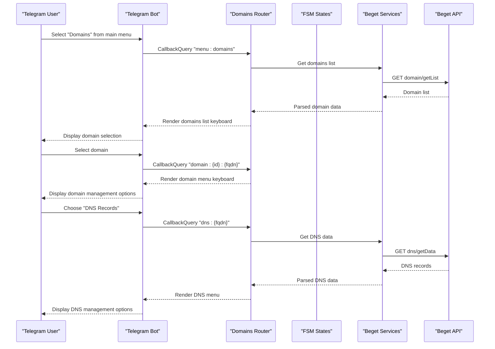
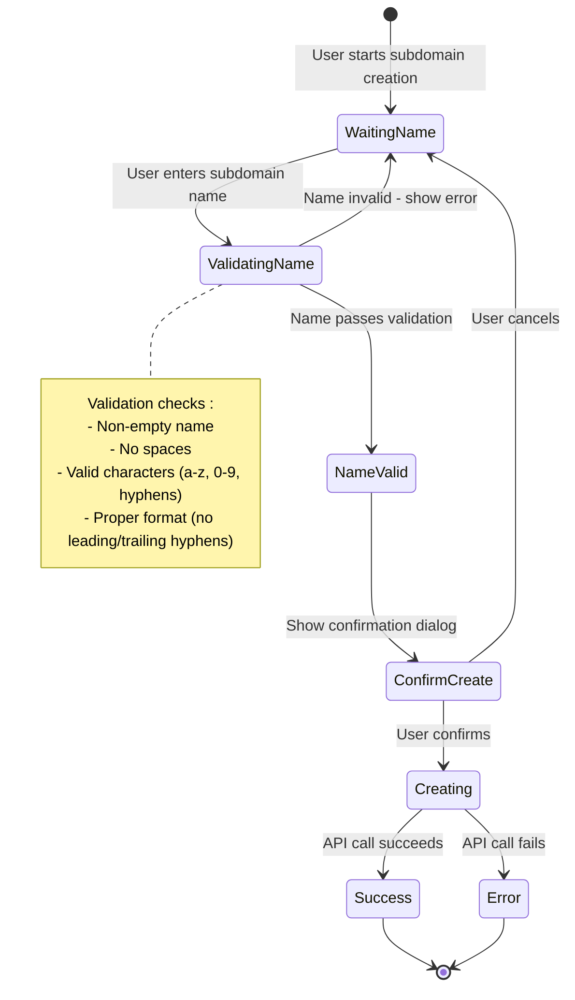
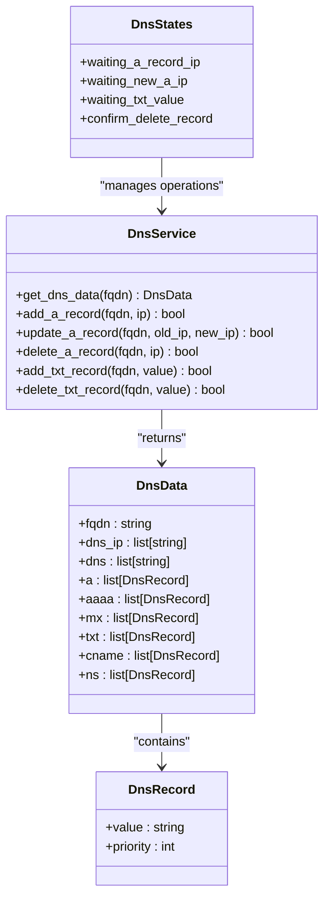
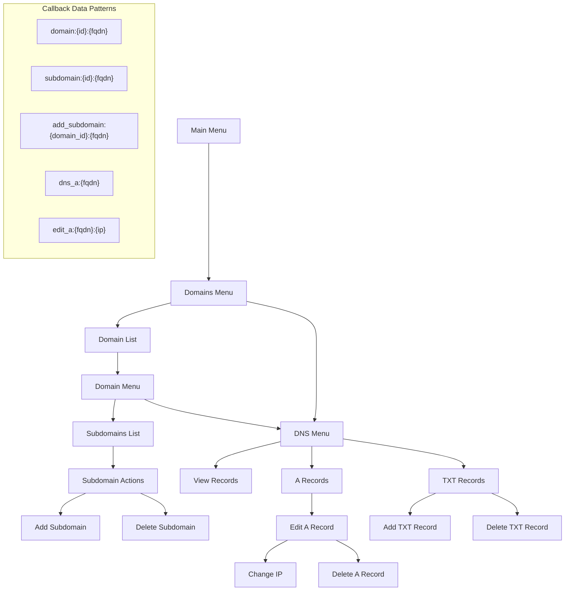
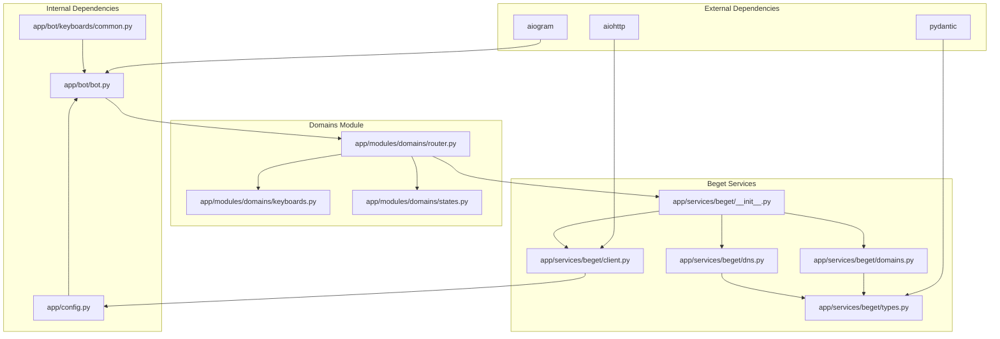

# Domains Module

<cite>
**Referenced Files in This Document**
- [app/modules/domains/__init__.py](file://app/modules/domains/__init__.py)
- [app/modules/domains/router.py](file://app/modules/domains/router.py)
- [app/modules/domains/keyboards.py](file://app/modules/domains/keyboards.py)
- [app/modules/domains/states.py](file://app/modules/domains/states.py)
- [app/bot/bot.py](file://app/bot/bot.py)
- [app/bot/keyboards/common.py](file://app/bot/keyboards/common.py)
- [app/services/beget/__init__.py](file://app/services/beget/__init__.py)
- [app/services/beget/client.py](file://app/services/beget/client.py)
- [app/services/beget/domains.py](file://app/services/beget/domains.py)
- [app/services/beget/dns.py](file://app/services/beget/dns.py)
- [app/services/beget/types.py](file://app/services/beget/types.py)
- [app/config.py](file://app/config.py)
- [app/main.py](file://app/main.py)
</cite>

## Table of Contents
1. [Introduction](#introduction)
2. [Project Structure](#project-structure)
3. [Core Components](#core-components)
4. [Architecture Overview](#architecture-overview)
5. [Detailed Component Analysis](#detailed-component-analysis)
6. [Dependency Analysis](#dependency-analysis)
7. [Performance Considerations](#performance-considerations)
8. [Troubleshooting Guide](#troubleshooting-guide)
9. [Conclusion](#conclusion)

## Introduction
This document provides comprehensive documentation for the Domains Module, which enables users to manage domains and DNS records through an intuitive inline keyboard interface. The module integrates with the Beget API to provide real-time domain and DNS data retrieval and updates. It supports hierarchical navigation from domain listing to subdomain management and DNS record administration, including A, TXT, MX, CNAME, and NS records. The module implements a finite state machine (FSM) for complex multi-step operations such as creating subdomains and editing DNS records.

## Project Structure
The Domains Module is organized into four primary components:
- Router: Handles user interactions and orchestrates domain and DNS operations
- Keyboards: Defines inline keyboard layouts for navigation and actions
- States: Implements FSM states for multi-step workflows
- Services: Integrates with Beget API for domain and DNS management



**Diagram sources**
- [app/modules/domains/router.py](file://app/modules/domains/router.py#L1-L718)
- [app/modules/domains/keyboards.py](file://app/modules/domains/keyboards.py#L1-L196)
- [app/modules/domains/states.py](file://app/modules/domains/states.py#L1-L21)
- [app/bot/bot.py](file://app/bot/bot.py#L1-L83)
- [app/bot/keyboards/common.py](file://app/bot/keyboards/common.py#L1-L42)
- [app/services/beget/__init__.py](file://app/services/beget/__init__.py#L1-L8)
- [app/services/beget/client.py](file://app/services/beget/client.py#L1-L135)
- [app/services/beget/domains.py](file://app/services/beget/domains.py#L1-L58)
- [app/services/beget/dns.py](file://app/services/beget/dns.py#L1-L152)
- [app/services/beget/types.py](file://app/services/beget/types.py#L1-L59)
- [app/config.py](file://app/config.py#L1-L52)
- [app/main.py](file://app/main.py#L1-L30)

**Section sources**
- [app/modules/domains/__init__.py](file://app/modules/domains/__init__.py#L1-L6)
- [app/bot/bot.py](file://app/bot/bot.py#L1-L83)
- [app/services/beget/__init__.py](file://app/services/beget/__init__.py#L1-L8)

## Core Components
The Domains Module consists of four core components that work together to provide domain and DNS management functionality:

### Router Component
The router handles all user interactions and orchestrates the domain management workflow. It processes callback queries and messages, manages state transitions, and coordinates with Beget API services.

Key responsibilities:
- Domain listing and selection
- Subdomain management (listing, creation, deletion)
- DNS record management (A, TXT, MX, CNAME, NS)
- State machine coordination for multi-step operations
- Error handling and user feedback

### Keyboard Component
The keyboard module defines reusable inline keyboard layouts for navigation and actions throughout the Domains Module. It provides structured interfaces for:
- Domain selection lists
- Domain management menus
- Subdomain management interfaces
- DNS record management screens
- Confirmation dialogs

### State Machine Component
The states module implements FSM states for complex multi-step operations. It maintains user session data and ensures proper workflow progression for:
- Subdomain creation (name validation, confirmation)
- DNS record modifications (IP changes, TXT additions)
- Deletion confirmations

### Service Layer
The service layer provides abstraction over Beget API operations:
- DomainsService: Manages domain and subdomain operations
- DnsService: Handles DNS record retrieval and updates
- BegetClient: Provides HTTP client with authentication and error handling

**Section sources**
- [app/modules/domains/router.py](file://app/modules/domains/router.py#L1-L718)
- [app/modules/domains/keyboards.py](file://app/modules/domains/keyboards.py#L1-L196)
- [app/modules/domains/states.py](file://app/modules/domains/states.py#L1-L21)
- [app/services/beget/domains.py](file://app/services/beget/domains.py#L1-L58)
- [app/services/beget/dns.py](file://app/services/beget/dns.py#L1-L152)

## Architecture Overview
The Domains Module follows a layered architecture with clear separation of concerns:



**Diagram sources**
- [app/modules/domains/router.py](file://app/modules/domains/router.py#L28-L53)
- [app/modules/domains/router.py](file://app/modules/domains/router.py#L55-L66)
- [app/modules/domains/router.py](file://app/modules/domains/router.py#L346-L355)
- [app/services/beget/domains.py](file://app/services/beget/domains.py#L13-L23)
- [app/services/beget/dns.py](file://app/services/beget/dns.py#L14-L77)

The architecture implements several key design patterns:
- **Command Pattern**: Each callback query handler acts as a command
- **State Machine Pattern**: FSM states manage complex workflows
- **Service Layer Pattern**: Abstraction over external API calls
- **Strategy Pattern**: Different keyboard layouts for various contexts

## Detailed Component Analysis

### Domain Listing and Selection Workflow
The domain listing workflow provides users with a hierarchical navigation system:

```mermaid
flowchart TD
Start([User selects "Domains"]) --> LoadDomains["Load domains from Beget API"]
LoadDomains --> HasDomains{"Domains found?"}
HasDomains --> |Yes| ShowList["Render domains list keyboard"]
HasDomains --> |No| NoDomains["Display 'No domains found' message"]
ShowList --> UserSelect["User selects domain"]
UserSelect --> ShowMenu["Render domain menu"]
NoDomains --> End([End])
ShowMenu --> End
subgraph "Domain Menu Options"
Subdomains["Subdomains"]
DnsRecords["DNS Records"]
BackDomains["Back to Domains"]
end
```

**Diagram sources**
- [app/modules/domains/router.py](file://app/modules/domains/router.py#L28-L53)
- [app/modules/domains/router.py](file://app/modules/domains/router.py#L55-L66)
- [app/modules/domains/keyboards.py](file://app/modules/domains/keyboards.py#L9-L24)

The workflow handles:
- API authentication and error handling
- Domain filtering and validation
- Keyboard rendering with proper callback data
- State management for subsequent operations

**Section sources**
- [app/modules/domains/router.py](file://app/modules/domains/router.py#L28-L66)
- [app/modules/domains/keyboards.py](file://app/modules/domains/keyboards.py#L9-L45)

### Subdomain Operations State Machine
The subdomain creation process implements a sophisticated state machine with validation and confirmation steps:



**Diagram sources**
- [app/modules/domains/states.py](file://app/modules/domains/states.py#L6-L12)
- [app/modules/domains/router.py](file://app/modules/domains/router.py#L135-L200)
- [app/modules/domains/router.py](file://app/modules/domains/router.py#L202-L242)

The state machine ensures:
- Input validation at every step
- Proper error handling and user feedback
- State persistence across operations
- Clean state cleanup after completion

**Section sources**
- [app/modules/domains/states.py](file://app/modules/domains/states.py#L6-L12)
- [app/modules/domains/router.py](file://app/modules/domains/router.py#L135-L242)

### DNS Record Management System
The DNS management system supports multiple record types with specialized workflows:



**Diagram sources**
- [app/modules/domains/states.py](file://app/modules/domains/states.py#L14-L21)
- [app/services/beget/dns.py](file://app/services/beget/dns.py#L8-L152)
- [app/services/beget/types.py](file://app/services/beget/types.py#L35-L59)

The system implements specialized workflows for different record types:
- **A Records**: IP validation, priority management, CRUD operations
- **TXT Records**: Value validation, truncation for display, safe deletion
- **Other Records**: MX, CNAME, NS support through unified API interface

**Section sources**
- [app/modules/domains/router.py](file://app/modules/domains/router.py#L423-L584)
- [app/modules/domains/router.py](file://app/modules/domains/router.py#L589-L718)
- [app/services/beget/dns.py](file://app/services/beget/dns.py#L101-L152)

### Inline Keyboard Navigation System
The inline keyboard system provides intuitive navigation through callback-based interactions:



**Diagram sources**
- [app/modules/domains/keyboards.py](file://app/modules/domains/keyboards.py#L9-L196)
- [app/bot/keyboards/common.py](file://app/bot/keyboards/common.py#L7-L17)

The keyboard system ensures:
- Consistent navigation patterns
- Hierarchical structure preservation
- Context-aware action availability
- Back navigation support

**Section sources**
- [app/modules/domains/keyboards.py](file://app/modules/domains/keyboards.py#L1-L196)
- [app/bot/keyboards/common.py](file://app/bot/keyboards/common.py#L1-L42)

## Dependency Analysis
The Domains Module exhibits clean dependency management with clear boundaries between components:



**Diagram sources**
- [app/modules/domains/router.py](file://app/modules/domains/router.py#L3-L20)
- [app/services/beget/__init__.py](file://app/services/beget/__init__.py#L1-L8)
- [app/services/beget/client.py](file://app/services/beget/client.py#L1-L135)
- [app/services/beget/types.py](file://app/services/beget/types.py#L1-L59)

Key dependency characteristics:
- **Low Coupling**: Router depends only on keyboards, states, and services
- **High Cohesion**: Each module has a single responsibility
- **Clear Interfaces**: Well-defined service contracts
- **External API Isolation**: Beget API details encapsulated in service layer

**Section sources**
- [app/modules/domains/router.py](file://app/modules/domains/router.py#L1-L30)
- [app/services/beget/__init__.py](file://app/services/beget/__init__.py#L1-L8)

## Performance Considerations
The Domains Module implements several performance optimizations:

### Asynchronous Operations
- All API calls use async/await patterns
- Concurrent operations where possible
- Proper resource cleanup with context managers

### Caching and State Management
- Minimal state persistence to reduce memory usage
- Efficient keyboard rendering with pre-built layouts
- Lazy loading of domain and DNS data

### Network Optimization
- Reuse of API client sessions
- Proper timeout configuration
- Error handling to prevent cascading failures

### Data Processing
- Efficient filtering of subdomains by domain ID
- Minimal data transformation overhead
- Optimized keyboard generation

## Troubleshooting Guide

### Common Issues and Solutions

**API Authentication Failures**
- Verify Beget API credentials in environment variables
- Check network connectivity to Beget API endpoints
- Review API rate limits and quotas

**State Machine Issues**
- Ensure proper state cleanup after operations
- Handle user cancellations gracefully
- Validate state transitions

**Keyboard Navigation Problems**
- Verify callback data format consistency
- Check keyboard layout generation logic
- Ensure proper state persistence

**Error Handling**
The module implements comprehensive error handling:
- Try-catch blocks around API calls
- User-friendly error messages
- Graceful degradation when API calls fail

**Debugging Tips**
- Enable detailed logging for API requests
- Monitor response times and error rates
- Validate data structures at each API boundary

**Section sources**
- [app/services/beget/client.py](file://app/services/beget/client.py#L13-L135)
- [app/modules/domains/router.py](file://app/modules/domains/router.py#L38-L41)
- [app/modules/domains/router.py](file://app/modules/domains/router.py#L84-L86)

## Conclusion
The Domains Module provides a robust, scalable solution for domain and DNS management through Telegram. Its architecture emphasizes:
- **Modularity**: Clear separation of concerns across components
- **Extensibility**: Easy addition of new record types and operations
- **Reliability**: Comprehensive error handling and state management
- **User Experience**: Intuitive inline keyboard navigation

The integration with Beget API enables real-time domain and DNS management capabilities while maintaining clean abstractions and proper error handling. The state machine implementation ensures reliable multi-step operations, and the keyboard system provides consistent navigation patterns.

Future enhancements could include:
- Support for additional DNS record types
- Bulk operations for DNS records
- Advanced filtering and search capabilities
- Audit logging for all operations
- Enhanced validation rules for different record types