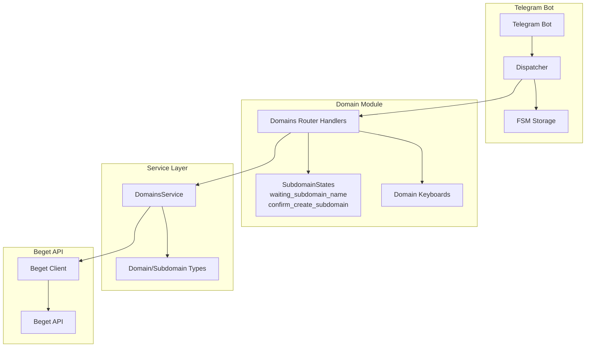
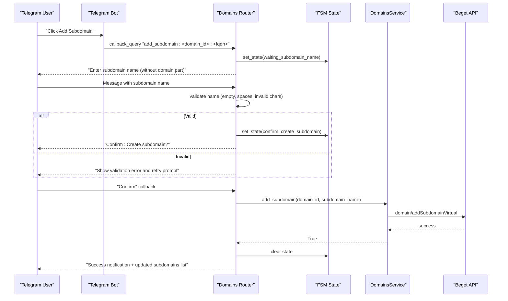
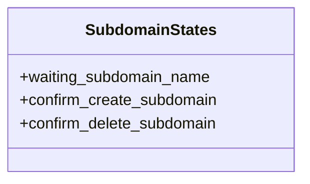
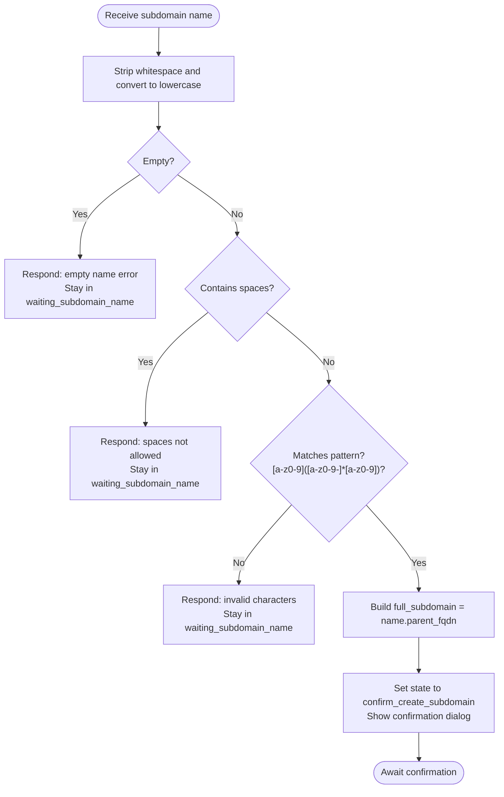
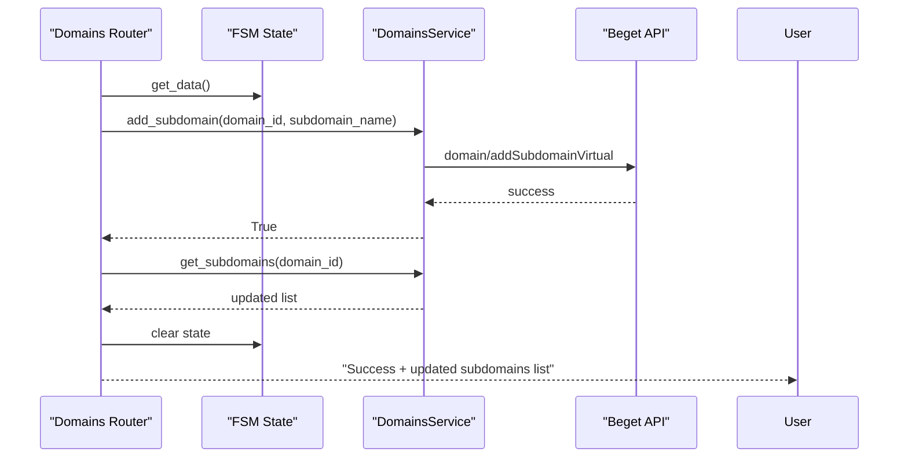
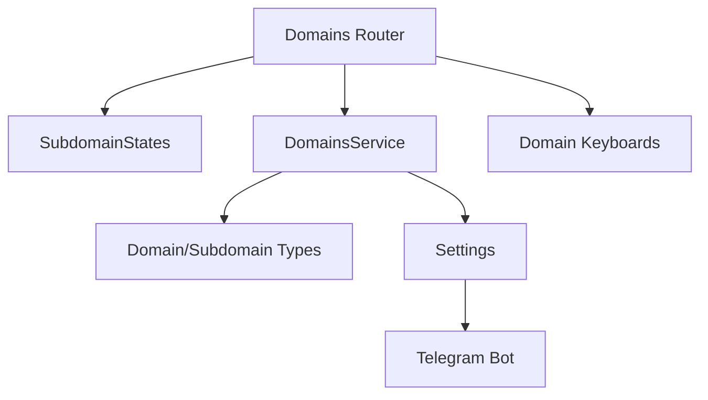

# Subdomain Creation Process

<cite>
**Referenced Files in This Document**
- [app/modules/domains/states.py](file://app/modules/domains/states.py)
- [app/modules/domains/router.py](file://app/modules/domains/router.py)
- [app/modules/domains/keyboards.py](file://app/modules/domains/keyboards.py)
- [app/services/beget/domains.py](file://app/services/beget/domains.py)
- [app/services/beget/types.py](file://app/services/beget/types.py)
- [app/config.py](file://app/config.py)
- [app/bot/bot.py](file://app/bot/bot.py)
- [app/main.py](file://app/main.py)
</cite>

## Table of Contents
1. [Introduction](#introduction)
2. [Project Structure](#project-structure)
3. [Core Components](#core-components)
4. [Architecture Overview](#architecture-overview)
5. [Detailed Component Analysis](#detailed-component-analysis)
6. [Dependency Analysis](#dependency-analysis)
7. [Performance Considerations](#performance-considerations)
8. [Troubleshooting Guide](#troubleshooting-guide)
9. [Conclusion](#conclusion)

## Introduction
This document explains the complete subdomain creation workflow in the Beget Manager Telegram bot. It covers the multi-step process from user input collection through validation, confirmation, and API execution. It also documents the SubdomainStates finite state machine (FSM) that orchestrates the creation flow, the validation logic for subdomain names, and the integration with the DomainsService.add_subdomain() method.

## Project Structure
The subdomain creation feature is implemented across several modules:
- State machine definitions for subdomain operations
- Router handlers that implement the user interaction flow
- Keyboard builders for inline menus and confirmation dialogs
- Service layer that communicates with the Beget API
- Type definitions for API responses and domain/subdomain models
- Configuration and bot setup

**Diagram sources**
- [app/modules/domains/states.py](file://app/modules/domains/states.py#L6-L11)
- [app/modules/domains/router.py](file://app/modules/domains/router.py#L135-L242)
- [app/modules/domains/keyboards.py](file://app/modules/domains/keyboards.py#L48-L102)
- [app/services/beget/domains.py](file://app/services/beget/domains.py#L7-L58)
- [app/services/beget/types.py](file://app/services/beget/types.py#L14-L26)

**Section sources**
- [app/modules/domains/states.py](file://app/modules/domains/states.py#L1-L21)
- [app/modules/domains/router.py](file://app/modules/domains/router.py#L1-L718)
- [app/modules/domains/keyboards.py](file://app/modules/domains/keyboards.py#L1-L196)
- [app/services/beget/domains.py](file://app/services/beget/domains.py#L1-L58)
- [app/services/beget/types.py](file://app/services/beget/types.py#L1-L59)

## Core Components
- SubdomainStates: Defines the FSM states for subdomain creation and deletion flows
- Domains Router: Implements the user interaction handlers for collecting input, validating, confirming, and executing creation
- DomainsService: Provides methods to fetch domains/subdomains and to add/delete subdomains via the Beget API
- Keyboard Builders: Generate inline menus and confirmation dialogs for user interactions
- Type Definitions: Define Domain and Subdomain models used by the service layer

Key responsibilities:
- State orchestration: Move between waiting for input, confirmation, and completion
- Input validation: Enforce naming conventions and reject invalid characters/spaces
- Confirmation UX: Present a clear "Confirm/Delete" dialog before API calls
- API integration: Call DomainsService.add_subdomain() with validated parameters

**Section sources**
- [app/modules/domains/states.py](file://app/modules/domains/states.py#L6-L11)
- [app/modules/domains/router.py](file://app/modules/domains/router.py#L135-L242)
- [app/services/beget/domains.py](file://app/services/beget/domains.py#L43-L49)
- [app/modules/domains/keyboards.py](file://app/modules/domains/keyboards.py#L186-L196)

## Architecture Overview
The subdomain creation follows a classic FSM-driven Telegram bot flow:
1. User initiates creation from the subdomains list
2. Bot transitions to waiting_subdomain_name state and requests input
3. Bot validates input and transitions to confirm_create_subdomain state
4. Bot presents confirmation dialog; on confirmation, executes API call
5. On success, refreshes the subdomains list; on failure, shows error and clears state

**Diagram sources**
- [app/modules/domains/router.py](file://app/modules/domains/router.py#L135-L242)
- [app/services/beget/domains.py](file://app/services/beget/domains.py#L43-L49)

## Detailed Component Analysis

### SubdomainStates State Machine
The SubdomainStates group defines two primary states used in the creation flow:
- waiting_subdomain_name: Collects the raw subdomain name input from the user
- confirm_create_subdomain: Presents a confirmation dialog before executing the API call

**Diagram sources**
- [app/modules/domains/states.py](file://app/modules/domains/states.py#L6-L11)

**Section sources**
- [app/modules/domains/states.py](file://app/modules/domains/states.py#L6-L11)

### Router Handlers: Input Collection and Validation
The router implements the end-to-end flow:
- Start handler sets state and prompts for input
- Input handler validates the subdomain name and transitions to confirmation
- Confirmation handler executes the API call and updates the UI

Validation logic enforced:
- Reject empty names
- Reject names containing spaces
- Apply regex pattern allowing lowercase letters, digits, and hyphens, with hyphens only in the middle (not at the start or end)

**Diagram sources**
- [app/modules/domains/router.py](file://app/modules/domains/router.py#L153-L200)

**Section sources**
- [app/modules/domains/router.py](file://app/modules/domains/router.py#L135-L200)

### Confirmation and API Execution
On confirmation, the router:
- Extracts domain_id, subdomain_name, and parent_fqdn from FSM state
- Creates a Beget client and DomainsService instance
- Calls DomainsService.add_subdomain()
- Refreshes the subdomains list and displays success
- Handles exceptions by showing an alert and clearing state

**Diagram sources**
- [app/modules/domains/router.py](file://app/modules/domains/router.py#L202-L242)
- [app/services/beget/domains.py](file://app/services/beget/domains.py#L43-L49)

**Section sources**
- [app/modules/domains/router.py](file://app/modules/domains/router.py#L202-L242)
- [app/services/beget/domains.py](file://app/services/beget/domains.py#L43-L49)

### Keyboard Integration
The subdomains list and action menus are built using keyboard builders:
- subdomains_list_keyboard: Shows existing subdomains and "+ Add Subdomain" button
- subdomain_actions_keyboard: Provides "Delete" and "Back" actions for a selected subdomain
- confirm_keyboard: Generic confirmation dialog with "Confirm" and "Cancel" buttons

These keyboards integrate with the router callbacks to drive the FSM transitions and API calls.

**Section sources**
- [app/modules/domains/keyboards.py](file://app/modules/domains/keyboards.py#L48-L102)
- [app/modules/domains/keyboards.py](file://app/modules/domains/keyboards.py#L186-L196)

### Service Layer Integration
DomainsService encapsulates Beget API interactions:
- add_subdomain(domain_id, subdomain): Calls the virtual subdomain creation endpoint
- get_subdomains(domain_id): Retrieves and filters subdomains by domain_id
- delete_subdomain(subdomain_id): Deletes a subdomain

The router uses DomainsService to persist changes and refresh data after successful operations.

**Section sources**
- [app/services/beget/domains.py](file://app/services/beget/domains.py#L43-L58)

### Type Definitions
Domain and Subdomain models define the data structures used by the service layer:
- Domain: id, fqdn
- Subdomain: id, fqdn

These models are constructed from the Beget API response and used to render lists and confirmations.

**Section sources**
- [app/services/beget/types.py](file://app/services/beget/types.py#L14-L26)

## Dependency Analysis
The subdomain creation flow depends on:
- Router handlers depending on SubdomainStates for state transitions
- Router handlers depending on DomainsService for API operations
- DomainsService depending on Beget client and response types
- Keyboard builders providing UI elements for user interactions
- Configuration providing credentials for the Beget client

**Diagram sources**
- [app/modules/domains/router.py](file://app/modules/domains/router.py#L1-L30)
- [app/services/beget/domains.py](file://app/services/beget/domains.py#L1-L12)
- [app/config.py](file://app/config.py#L37-L41)
- [app/bot/bot.py](file://app/bot/bot.py#L18-L52)

**Section sources**
- [app/modules/domains/router.py](file://app/modules/domains/router.py#L1-L30)
- [app/services/beget/domains.py](file://app/services/beget/domains.py#L1-L12)
- [app/config.py](file://app/config.py#L37-L41)
- [app/bot/bot.py](file://app/bot/bot.py#L18-L52)

## Performance Considerations
- State persistence: The bot uses memory storage for FSM state. For production, consider Redis-based storage to handle multiple instances and persistent sessions.
- API calls: Each confirmation triggers two API calls (add_subdomain and get_subdomains). Consider batching or caching strategies if the subdomain list grows large.
- Regex validation: The pattern matching is efficient and runs synchronously; keep it as-is for simplicity.
- Keyboard rendering: Building keyboards dynamically is lightweight, but avoid excessive rebuilds by caching frequently used structures.

## Troubleshooting Guide
Common issues and resolutions:
- Invalid subdomain name:
  - Symptom: Immediate rejection with validation error
  - Cause: Empty input, spaces, or disallowed characters
  - Resolution: Ensure the name contains only lowercase letters, digits, and hyphens, with hyphens not at the start or end
  - Reference: [app/modules/domains/router.py](file://app/modules/domains/router.py#L159-L184)
- API error during creation:
  - Symptom: Alert shows "Error" and state is cleared
  - Cause: Beget API failure or invalid parameters
  - Resolution: Check Beget credentials and permissions; review logs
  - Reference: [app/modules/domains/router.py](file://app/modules/domains/router.py#L236-L239)
- State stuck in waiting_subdomain_name:
  - Symptom: User cannot proceed after entering input
  - Cause: Validation failure or missing state data
  - Resolution: Ensure input passes validation; verify state update in receive_subdomain_name
  - Reference: [app/modules/domains/router.py](file://app/modules/domains/router.py#L153-L200)
- Confirmation not appearing:
  - Symptom: User enters name but no confirmation dialog appears
  - Cause: State not transitioning to confirm_create_subdomain
  - Resolution: Check state transitions and keyboard construction in confirm_create_subdomain
  - Reference: [app/modules/domains/router.py](file://app/modules/domains/router.py#L191-L199)

**Section sources**
- [app/modules/domains/router.py](file://app/modules/domains/router.py#L153-L242)

## Conclusion
The subdomain creation workflow is a well-structured FSM-driven process that collects user input, enforces strict validation, confirms actions, and integrates with the Beget API through DomainsService. The SubdomainStates state machine cleanly separates concerns across input collection, validation, and execution phases. The implementation demonstrates robust error handling and clear user feedback via inline keyboards and alerts.