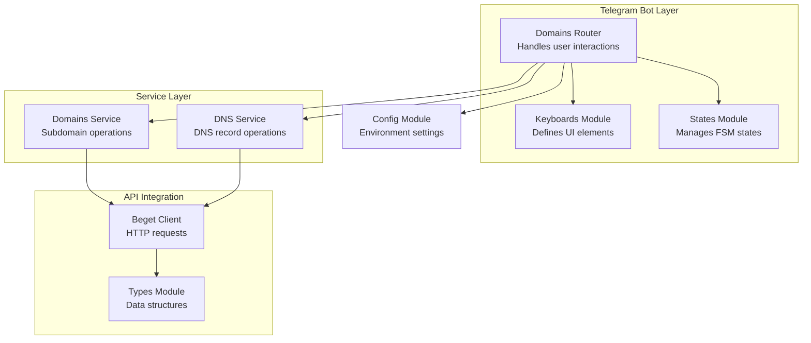
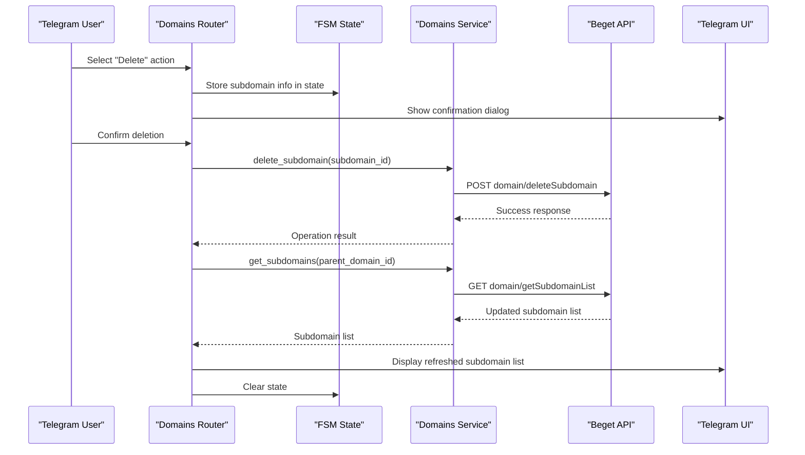
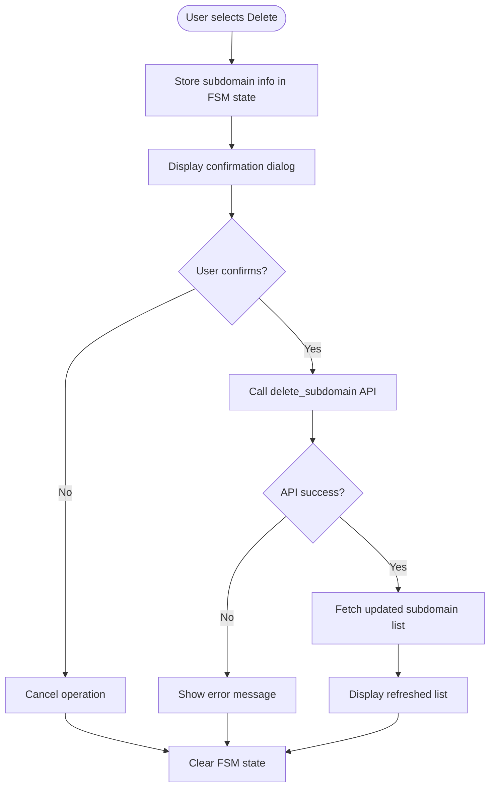
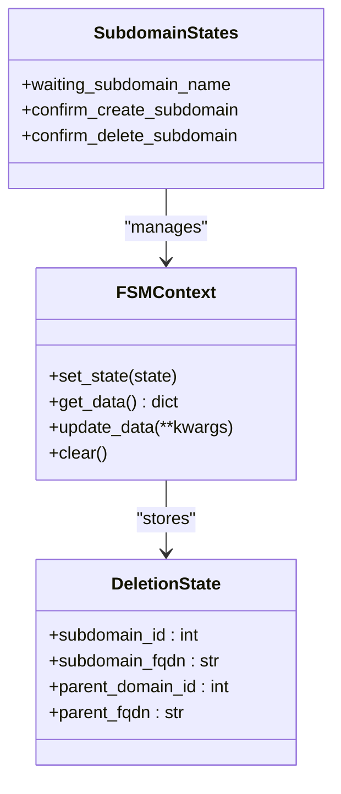
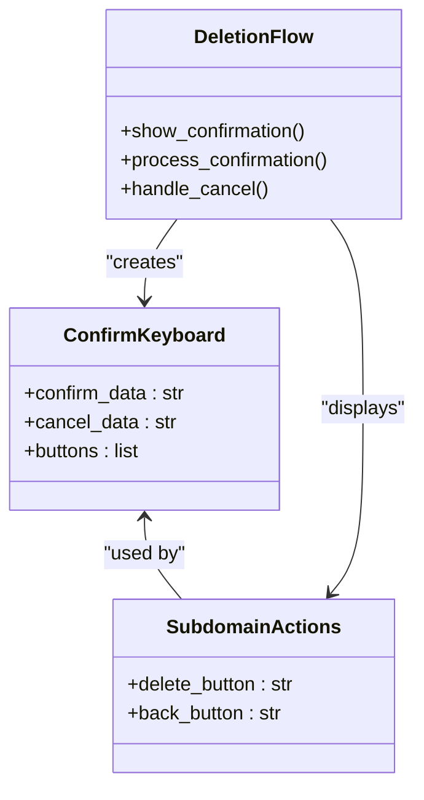
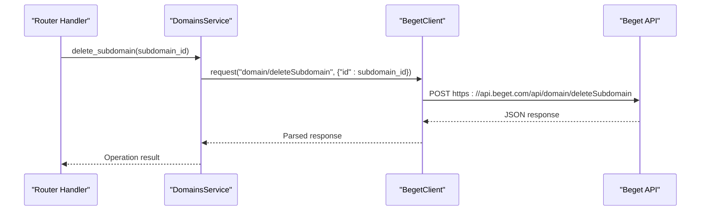
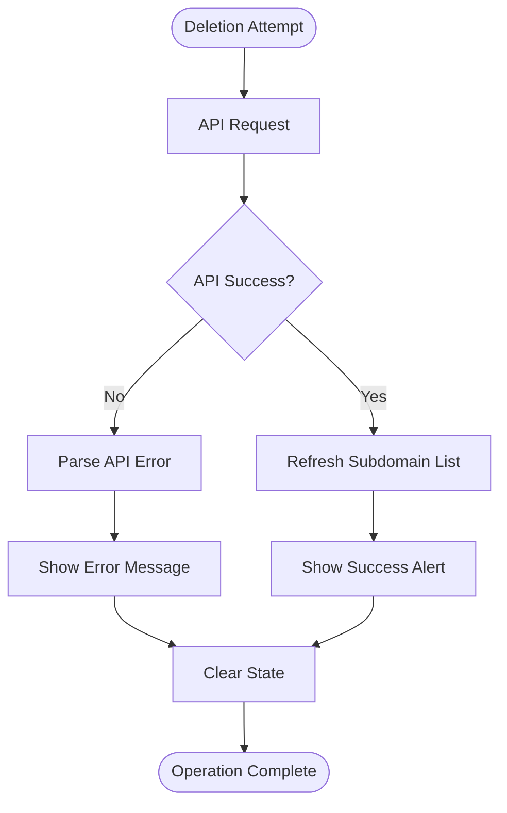
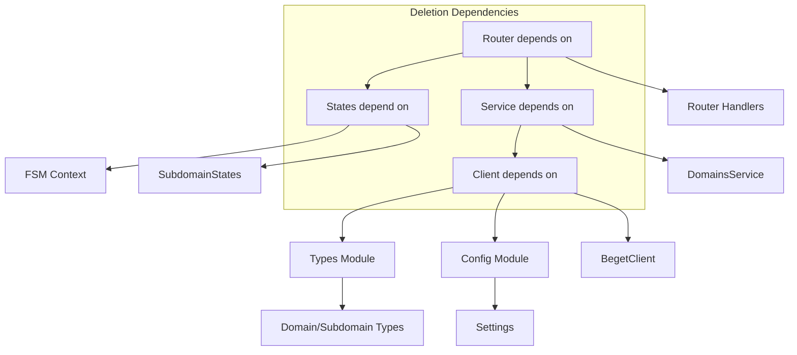

# Subdomain Deletion Operations

<cite>
**Referenced Files in This Document**
- [router.py](file://app/modules/domains/router.py)
- [keyboards.py](file://app/modules/domains/keyboards.py)
- [states.py](file://app/modules/domains/states.py)
- [domains.py](file://app/services/beget/domains.py)
- [client.py](file://app/services/beget/client.py)
- [types.py](file://app/services/beget/types.py)
- [config.py](file://app/config.py)
- [bot.py](file://app/bot/bot.py)
- [main.py](file://app/main.py)
</cite>

## Table of Contents
1. [Introduction](#introduction)
2. [Project Structure](#project-structure)
3. [Core Components](#core-components)
4. [Architecture Overview](#architecture-overview)
5. [Detailed Component Analysis](#detailed-component-analysis)
6. [Dependency Analysis](#dependency-analysis)
7. [Performance Considerations](#performance-considerations)
8. [Troubleshooting Guide](#troubleshooting-guide)
9. [Conclusion](#conclusion)

## Introduction
This document provides comprehensive coverage of the subdomain deletion functionality within the Beget Manager Telegram bot. It explains the confirmation-based deletion process designed to prevent accidental removal of subdomains, details the state management used to store subdomain information during the deletion workflow, and documents the implementation of irreversible action warnings. Additionally, it covers the delete_subdomain API integration, error handling for deletion failures, and the automatic refresh of subdomain lists after successful deletions. Examples of the confirmation dialog implementation and keyboard navigation for deletion actions are included.

## Project Structure
The subdomain deletion feature spans several modules:
- Router module handles user interactions and orchestrates the deletion workflow
- Keyboard module defines the interactive UI elements used in the deletion process
- States module manages the finite state machine for deletion operations
- Services module integrates with the Beget API for subdomain management
- Client module encapsulates HTTP communication and error handling
- Types module defines data structures exchanged with the API
- Configuration module provides environment-based settings for API credentials

**Diagram sources**
- [router.py](file://app/modules/domains/router.py#L1-L718)
- [keyboards.py](file://app/modules/domains/keyboards.py#L1-L196)
- [states.py](file://app/modules/domains/states.py#L1-L21)
- [domains.py](file://app/services/beget/domains.py#L1-L58)
- [client.py](file://app/services/beget/client.py#L1-L135)
- [types.py](file://app/services/beget/types.py#L1-L59)
- [config.py](file://app/config.py#L1-L52)

**Section sources**
- [router.py](file://app/modules/domains/router.py#L1-L718)
- [keyboards.py](file://app/modules/domains/keyboards.py#L1-L196)
- [states.py](file://app/modules/domains/states.py#L1-L21)
- [domains.py](file://app/services/beget/domains.py#L1-L58)
- [client.py](file://app/services/beget/client.py#L1-L135)
- [types.py](file://app/services/beget/types.py#L1-L59)
- [config.py](file://app/config.py#L1-L52)

## Core Components
The subdomain deletion functionality consists of four primary components:

### Confirmation Dialog Implementation
The deletion process uses a two-step confirmation mechanism implemented through the `confirm_keyboard` function. This ensures users must explicitly confirm their intention to delete a subdomain, preventing accidental removal.

### State Management for Deletion Workflow
The FSM tracks subdomain information throughout the deletion process using the `SubdomainStates` group. The state stores essential data including subdomain ID, FQDN, parent domain information, and operation context.

### API Integration for Deletion
The `DomainsService.delete_subdomain` method integrates with the Beget API using the `domain/deleteSubdomain` endpoint. The service handles authentication, request formatting, and response processing.

### Automatic List Refresh
After successful deletion, the system automatically fetches the updated subdomain list and displays it to the user, ensuring the interface reflects the current state.

**Section sources**
- [router.py](file://app/modules/domains/router.py#L244-L298)
- [keyboards.py](file://app/modules/domains/keyboards.py#L186-L196)
- [states.py](file://app/modules/domains/states.py#L6-L12)
- [domains.py](file://app/services/beget/domains.py#L51-L57)

## Architecture Overview
The subdomain deletion architecture follows a layered approach with clear separation of concerns:

**Diagram sources**
- [router.py](file://app/modules/domains/router.py#L244-L298)
- [domains.py](file://app/services/beget/domains.py#L51-L57)
- [client.py](file://app/services/beget/client.py#L70-L121)

The architecture ensures:
- **Confirmation-based safety**: Two-step confirmation prevents accidental deletions
- **State persistence**: FSM maintains context throughout the operation
- **API abstraction**: Service layer handles all external communication
- **Automatic refresh**: UI updates reflect immediate changes

## Detailed Component Analysis

### Deletion Workflow Orchestration
The deletion process begins when a user selects the delete action from the subdomain actions menu. The router captures this interaction and initiates the confirmation workflow.

**Diagram sources**
- [router.py](file://app/modules/domains/router.py#L244-L298)

### State Management Implementation
The FSM manages the deletion workflow through carefully defined states and data persistence:

**Diagram sources**
- [states.py](file://app/modules/domains/states.py#L6-L12)
- [router.py](file://app/modules/domains/router.py#L120-L126)

The state management ensures:
- **Data persistence**: Subdomain information survives between user interactions
- **Context preservation**: Parent domain context remains available throughout the operation
- **Clean state cleanup**: All temporary data is cleared after completion

### Confirmation Dialog Implementation
The confirmation dialog uses a standardized approach across the application:

**Diagram sources**
- [keyboards.py](file://app/modules/domains/keyboards.py#L79-L102)
- [keyboards.py](file://app/modules/domains/keyboards.py#L186-L196)

The confirmation dialog implements:
- **Irreversible warning**: Clear messaging indicating the action cannot be undone
- **Standardized buttons**: Consistent "Confirm" and "Cancel" button layout
- **Context-aware callbacks**: Proper navigation back to previous screens

### API Integration Details
The deletion API integration follows a structured approach:

**Diagram sources**
- [domains.py](file://app/services/beget/domains.py#L51-L57)
- [client.py](file://app/services/beget/client.py#L70-L121)

The API integration provides:
- **Structured request building**: Proper parameter formatting and authentication
- **Robust error handling**: Comprehensive error detection and reporting
- **Response validation**: Consistent response structure validation

### Error Handling and Recovery
The system implements comprehensive error handling throughout the deletion process:

**Diagram sources**
- [router.py](file://app/modules/domains/router.py#L294-L297)
- [client.py](file://app/services/beget/client.py#L98-L115)

Error handling mechanisms include:
- **API-level error detection**: Parsing of Beget API error responses
- **Network timeout handling**: Graceful handling of network connectivity issues
- **User feedback**: Clear error messages with actionable information
- **State cleanup**: Automatic cleanup of temporary data on failure

**Section sources**
- [router.py](file://app/modules/domains/router.py#L244-L298)
- [domains.py](file://app/services/beget/domains.py#L51-L57)
- [client.py](file://app/services/beget/client.py#L98-L115)

## Dependency Analysis
The subdomain deletion functionality relies on several interconnected dependencies:

**Diagram sources**
- [router.py](file://app/modules/domains/router.py#L1-L22)
- [states.py](file://app/modules/domains/states.py#L1-L21)
- [domains.py](file://app/services/beget/domains.py#L1-L12)
- [client.py](file://app/services/beget/client.py#L1-L12)
- [types.py](file://app/services/beget/types.py#L1-L59)
- [config.py](file://app/config.py#L1-L52)

Key dependency relationships:
- **Router-to-State coupling**: Handlers depend on FSM for context management
- **Service-to-Client coupling**: Service layer abstracts API communication
- **Client-to-Config coupling**: Authentication credentials come from environment
- **Type safety**: Pydantic models ensure data consistency across layers

**Section sources**
- [router.py](file://app/modules/domains/router.py#L1-L22)
- [states.py](file://app/modules/domains/states.py#L1-L21)
- [domains.py](file://app/services/beget/domains.py#L1-L12)
- [client.py](file://app/services/beget/client.py#L1-L12)
- [types.py](file://app/services/beget/types.py#L1-L59)
- [config.py](file://app/config.py#L1-L52)

## Performance Considerations
The subdomain deletion implementation incorporates several performance optimizations:

### Asynchronous Processing
- **Non-blocking operations**: All API calls use asynchronous patterns
- **Connection pooling**: Reuse of HTTP connections through the client session
- **Efficient state management**: Minimal memory footprint for FSM operations

### Network Optimization
- **Single API call per operation**: Direct deletion without intermediate steps
- **Batch operations**: Subdomain list refresh occurs only after successful deletion
- **Timeout handling**: Configurable timeouts prevent hanging operations

### Memory Management
- **State cleanup**: Automatic clearing of temporary data after operations
- **Resource disposal**: Proper closing of database and HTTP connections
- **Lazy loading**: Configuration loaded only when needed

## Troubleshooting Guide

### Common Issues and Solutions

**Issue**: Deletion confirmation dialog not appearing
- **Cause**: Missing subdomain state data
- **Solution**: Verify that `show_subdomain_actions` handler executes before deletion
- **Prevention**: Ensure proper state storage in the FSM context

**Issue**: API authentication failures
- **Cause**: Incorrect Beget credentials in environment
- **Solution**: Check `.env` file for valid login and password
- **Prevention**: Validate credentials using the configuration loader

**Issue**: Subdomain list not refreshing after deletion
- **Cause**: API response parsing errors
- **Solution**: Review API response structure and error handling
- **Prevention**: Implement robust response validation

**Issue**: State data corruption during operations
- **Cause**: Improper state cleanup or concurrent operations
- **Solution**: Ensure state clearing after each operation completes
- **Prevention**: Implement proper state lifecycle management

### Debugging Strategies
- **Enable detailed logging**: Set log level to DEBUG for comprehensive API interaction tracking
- **Monitor API responses**: Check response status codes and error messages
- **Validate state transitions**: Trace FSM state changes during deletion workflow
- **Test error scenarios**: Simulate network failures and API errors

**Section sources**
- [router.py](file://app/modules/domains/router.py#L294-L297)
- [client.py](file://app/services/beget/client.py#L98-L115)
- [config.py](file://app/config.py#L37-L41)

## Conclusion
The subdomain deletion functionality in the Beget Manager Telegram bot demonstrates robust design principles for safe and reliable domain management operations. The implementation successfully balances user experience with operational safety through:

- **Confirmation-based safety**: Multi-step confirmation prevents accidental deletions
- **State-driven orchestration**: Comprehensive state management ensures operation reliability
- **API abstraction**: Clean service layer provides consistent external integration
- **Error resilience**: Comprehensive error handling maintains system stability
- **Automatic refresh**: Immediate UI updates provide clear feedback

The modular architecture enables easy maintenance and extension while maintaining clear separation of concerns. The implementation serves as a solid foundation for similar administrative operations within the Telegram bot ecosystem.