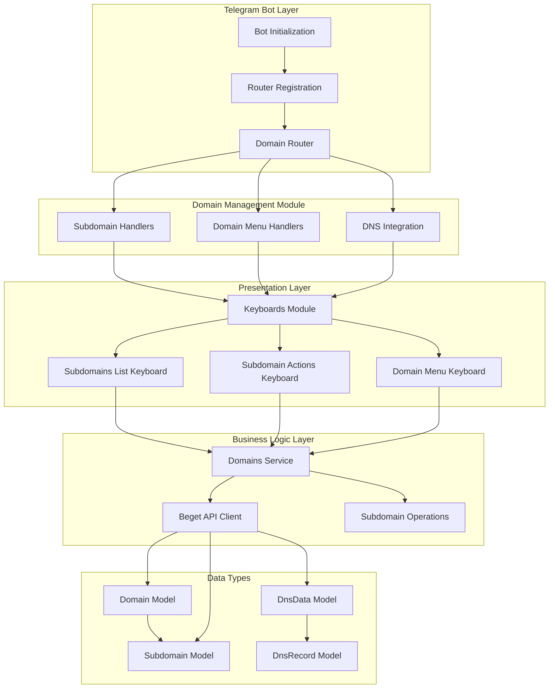
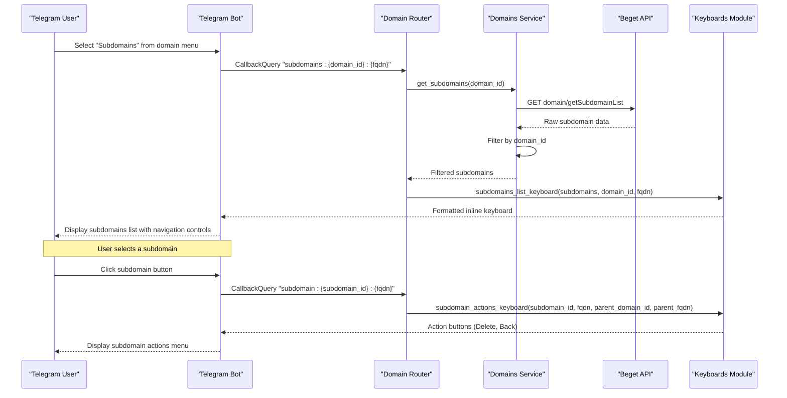
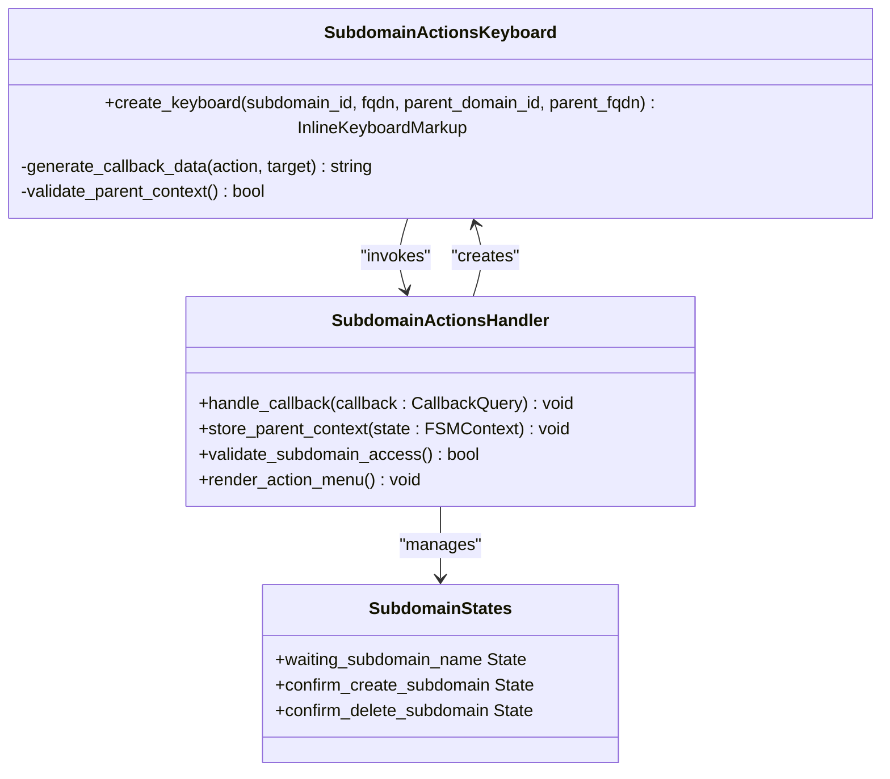
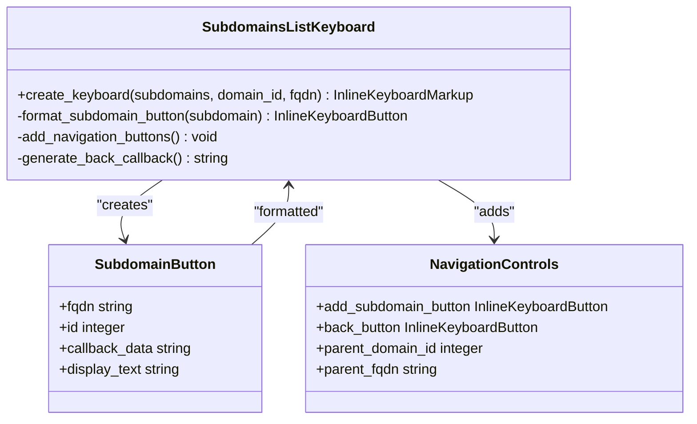
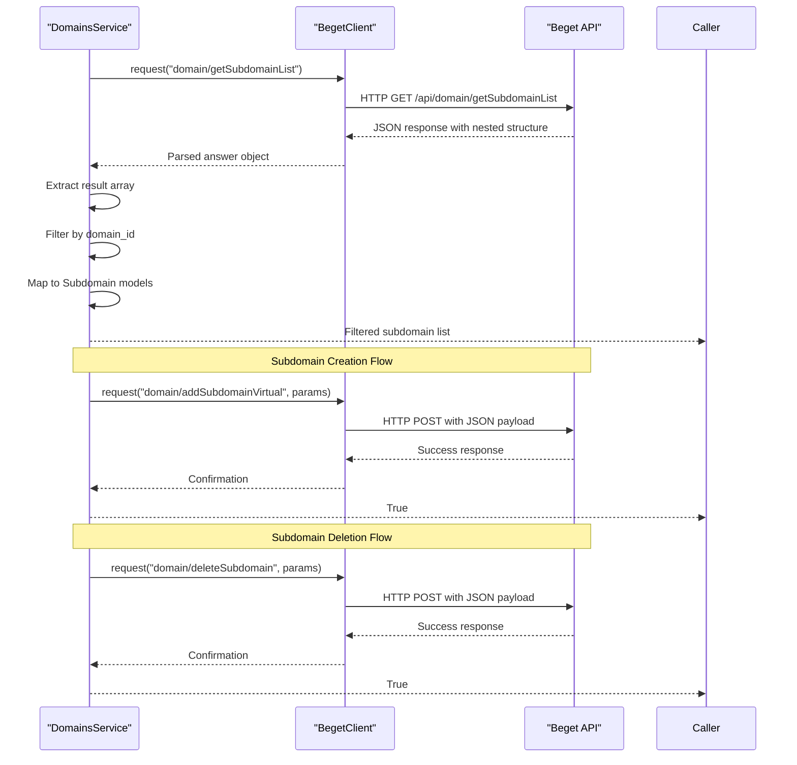
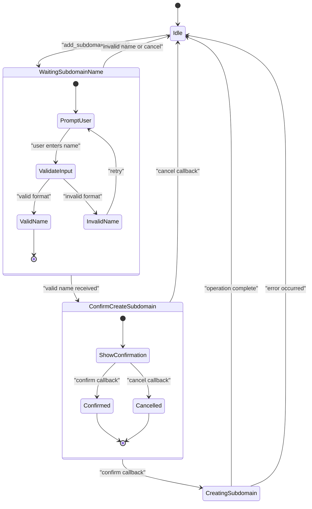
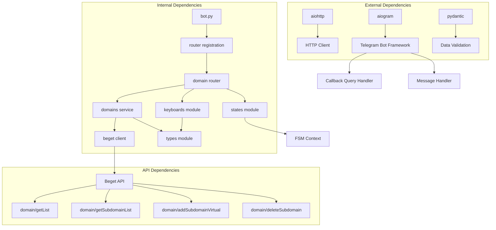
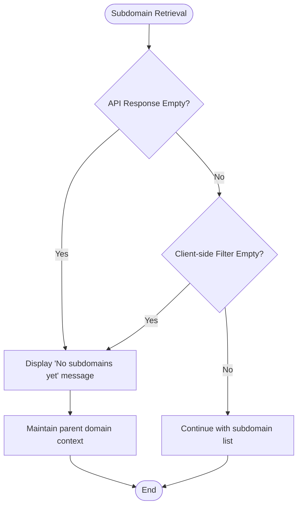

# Subdomain Listing and Navigation

<cite>
**Referenced Files in This Document**
- [router.py](file://app/modules/domains/router.py)
- [keyboards.py](file://app/modules/domains/keyboards.py)
- [states.py](file://app/modules/domains/states.py)
- [domains.py](file://app/services/beget/domains.py)
- [client.py](file://app/services/beget/client.py)
- [types.py](file://app/services/beget/types.py)
- [bot.py](file://app/bot/bot.py)
- [common.py](file://app/bot/keyboards/common.py)
</cite>

## Table of Contents
1. [Introduction](#introduction)
2. [Project Structure](#project-structure)
3. [Core Components](#core-components)
4. [Architecture Overview](#architecture-overview)
5. [Detailed Component Analysis](#detailed-component-analysis)
6. [Dependency Analysis](#dependency-analysis)
7. [Performance Considerations](#performance-considerations)
8. [Troubleshooting Guide](#troubleshooting-guide)
9. [Conclusion](#conclusion)

## Introduction

This document provides comprehensive documentation for the subdomain listing functionality within the Beget Manager Telegram bot. The system enables users to retrieve, display, and manage subdomains associated with their Beget-hosted domains through an intuitive inline keyboard interface. The implementation follows a structured approach that separates concerns between presentation (keyboards), business logic (routers), state management (FSM), and data access (service layer).

The subdomain management system integrates seamlessly with the broader domain management functionality, providing users with a complete solution for DNS administration through Telegram's inline keyboard interface.

## Project Structure

The subdomain functionality is organized within a modular architecture that promotes separation of concerns and maintainability:



**Diagram sources**
- [bot.py](file://app/bot/bot.py#L18-L52)
- [router.py](file://app/modules/domains/router.py#L22-L22)
- [keyboards.py](file://app/modules/domains/keyboards.py#L1-L196)

**Section sources**
- [bot.py](file://app/bot/bot.py#L18-L52)
- [router.py](file://app/modules/domains/router.py#L1-L718)

## Core Components

The subdomain listing functionality consists of several interconnected components that work together to provide a seamless user experience:

### Domain Router Module
The router module serves as the central coordination point for all domain-related operations, implementing callback query handlers for subdomain management workflows.

### Keyboards Module
Provides specialized inline keyboard layouts for different stages of the subdomain management process, including list views, action menus, and confirmation dialogs.

### Domains Service
Handles communication with the Beget API, implementing methods for retrieving domain lists, subdomains, and performing CRUD operations on subdomains.

### FSM States
Manages conversational state for interactive operations like subdomain creation and deletion, ensuring proper user flow and data persistence.

**Section sources**
- [router.py](file://app/modules/domains/router.py#L1-L718)
- [keyboards.py](file://app/modules/domains/keyboards.py#L1-L196)
- [domains.py](file://app/services/beget/domains.py#L1-L58)

## Architecture Overview

The subdomain management system follows a layered architecture pattern that ensures clean separation of concerns:



**Diagram sources**
- [router.py](file://app/modules/domains/router.py#L72-L133)
- [domains.py](file://app/services/beget/domains.py#L25-L41)
- [keyboards.py](file://app/modules/domains/keyboards.py#L48-L102)

The architecture ensures that:
- Presentation logic remains separate from business logic
- API communication is centralized in the service layer
- State management is handled through FSM for complex workflows
- Keyboard layouts are reusable and maintainable

## Detailed Component Analysis

### Subdomains List Handler

The subdomains list handler coordinates the retrieval and display of subdomain information:

```mermaid
flowchart TD
Start([Callback: subdomains:{domain_id}:{fqdn}]) --> ParseData["Parse callback data<br/>Extract domain_id, fqdn"]
ParseData --> InitClient["Initialize Beget API client"]
InitClient --> CallService["Call DomainsService.get_subdomains(domain_id)"]
CallService --> HandleResponse{"API Response<br/>Success?"}
HandleResponse --> |No| ShowError["Display error message<br/>with callback answer"]
HandleResponse --> |Yes| BuildText["Build formatted text<br/>with subdomain list"]
BuildText --> CheckEmpty{"Any subdomains?"}
CheckEmpty --> |Yes| FormatList["Format subdomain names<br/>with bullet points"]
CheckEmpty --> |No| ShowEmpty["Show 'No subdomains yet' message"]
FormatList --> CreateKeyboard["Create subdomains_list_keyboard<br/>with add/delete/back buttons"]
ShowEmpty --> CreateKeyboard
CreateKeyboard --> EditMessage["Edit message with<br/>formatted text and keyboard"]
ShowError --> End([End])
EditMessage --> End
```

**Diagram sources**
- [router.py](file://app/modules/domains/router.py#L72-L99)

The handler implements robust error handling and user feedback mechanisms, ensuring that users receive clear information about the subdomain listing status.

**Section sources**
- [router.py](file://app/modules/domains/router.py#L72-L99)

### Subdomain Actions Interface

The subdomain actions interface provides granular control over individual subdomains:



**Diagram sources**
- [keyboards.py](file://app/modules/domains/keyboards.py#L79-L102)
- [states.py](file://app/modules/domains/states.py#L6-L12)

The actions interface maintains parent domain context through multiple mechanisms:
- State-based storage of parent domain information
- Callback data parsing for direct navigation
- Fallback extraction from subdomain FQDN structure

**Section sources**
- [router.py](file://app/modules/domains/router.py#L102-L132)
- [keyboards.py](file://app/modules/domains/keyboards.py#L79-L102)
- [states.py](file://app/modules/domains/states.py#L6-L12)

### Subdomains List Keyboard Implementation

The subdomains list keyboard provides an intuitive navigation interface:



**Diagram sources**
- [keyboards.py](file://app/modules/domains/keyboards.py#L48-L76)

The keyboard implementation features:
- Dynamic subdomain button generation based on API response
- Consistent formatting with FQDN display
- Intuitive navigation controls (Add, Back)
- Responsive layout adaptation to subdomain count

**Section sources**
- [keyboards.py](file://app/modules/domains/keyboards.py#L48-L76)

### Beget API Integration

The DomainsService handles all Beget API interactions for subdomain operations:



**Diagram sources**
- [domains.py](file://app/services/beget/domains.py#L25-L57)
- [client.py](file://app/services/beget/client.py#L70-L117)

The service layer implements sophisticated error handling and data transformation:
- Handles nested API response structures
- Implements client-side filtering for subdomains
- Provides model validation and conversion
- Manages API rate limits and timeouts

**Section sources**
- [domains.py](file://app/services/beget/domains.py#L1-L58)
- [client.py](file://app/services/beget/client.py#L1-L135)

### State Management for Conversational Flows

The FSM states coordinate complex user interactions for subdomain operations:



**Diagram sources**
- [states.py](file://app/modules/domains/states.py#L6-L12)

The state machine ensures:
- Proper validation of user input before API calls
- Context preservation across multiple interaction steps
- Graceful error recovery and user guidance
- Resource cleanup after operation completion

**Section sources**
- [states.py](file://app/modules/domains/states.py#L1-L21)

## Dependency Analysis

The subdomain functionality exhibits well-structured dependencies that promote maintainability and testability:



**Diagram sources**
- [bot.py](file://app/bot/bot.py#L14-L51)
- [router.py](file://app/modules/domains/router.py#L1-L22)
- [domains.py](file://app/services/beget/domains.py#L1-L58)

The dependency structure ensures:
- Loose coupling between modules through well-defined interfaces
- Clear separation between presentation and business logic
- Minimal external dependency footprint
- Extensible architecture for future enhancements

**Section sources**
- [bot.py](file://app/bot/bot.py#L14-L51)
- [router.py](file://app/modules/domains/router.py#L1-L22)

## Performance Considerations

The subdomain listing implementation incorporates several performance optimizations:

### API Response Caching
- Subdomain lists are fetched on-demand to ensure freshness
- No local caching is implemented, prioritizing accuracy over performance
- Consider implementing short-term caching for frequently accessed domains

### Network Optimization
- Single API call retrieves all subdomains, which are then filtered client-side
- Efficient JSON parsing with fallback error handling
- Connection pooling through aiohttp session management

### Memory Management
- Subdomain objects are processed and immediately used for keyboard generation
- No persistent state storage for subdomain lists
- Proper resource cleanup in async context managers

### User Experience Optimization
- Immediate callback answers prevent Telegram timeout errors
- Progressive disclosure of information reduces initial load time
- Responsive keyboard layouts adapt to content size

## Troubleshooting Guide

### Common Issues and Solutions

**Empty Subdomain Lists**
When no subdomains are found, the system displays a user-friendly message and maintains navigation context:



**Navigation Context Loss**
The system implements multiple fallback mechanisms to preserve parent domain context:

1. **State-based Storage**: Parent domain information stored in FSM state
2. **Callback Data Parsing**: Direct extraction from callback data
3. **FQDN Analysis**: Automatic parent domain extraction from subdomain FQDN
4. **API Fallback**: Querying subdomains to infer parent domain

**API Error Handling**
The system provides comprehensive error handling for various failure scenarios:

- **Network Timeout**: Graceful timeout with retry suggestion
- **Authentication Failure**: Clear credential error messages
- **Rate Limiting**: Informative messages about API limitations
- **Invalid Response**: Structured error parsing with detailed messages

**Validation Failures**
Input validation occurs at multiple levels:
- Subdomain name format validation (alphanumeric, hyphens)
- Domain existence verification
- Permission validation for operations
- Duplicate subdomain detection

**Section sources**
- [router.py](file://app/modules/domains/router.py#L88-L93)
- [router.py](file://app/modules/domains/router.py#L114-L126)
- [client.py](file://app/services/beget/client.py#L97-L115)

## Conclusion

The subdomain listing and navigation system demonstrates a well-architected solution for domain management through Telegram's inline keyboard interface. The implementation successfully balances user experience with technical robustness, providing:

**Key Strengths:**
- Clean separation of concerns across multiple architectural layers
- Comprehensive error handling and user feedback mechanisms
- Flexible navigation that maintains context across operations
- Scalable design supporting future enhancements

**Technical Achievements:**
- Efficient API integration with proper error handling
- Robust state management for complex workflows
- Reusable keyboard components for consistent UX
- Type-safe data handling with Pydantic models

**Areas for Enhancement:**
- Consider implementing subdomain list caching for improved performance
- Add pagination support for domains with large numbers of subdomains
- Implement bulk operations for administrative tasks
- Add audit logging for all subdomain management operations

The system provides a solid foundation for domain management automation while maintaining the flexibility to accommodate future requirements and scale with growing user bases.