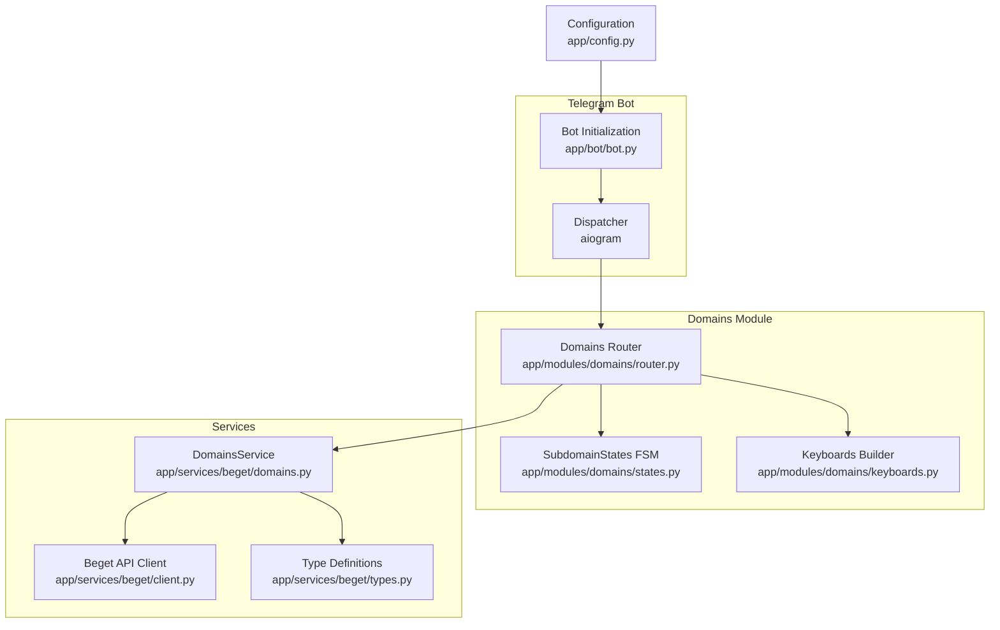
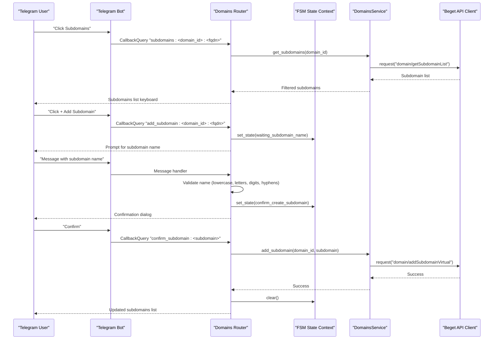
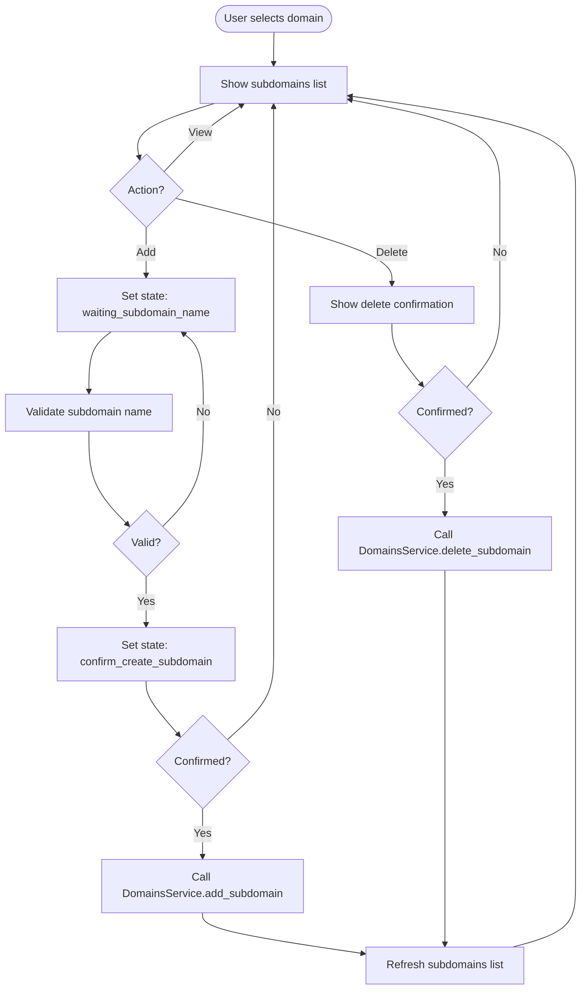
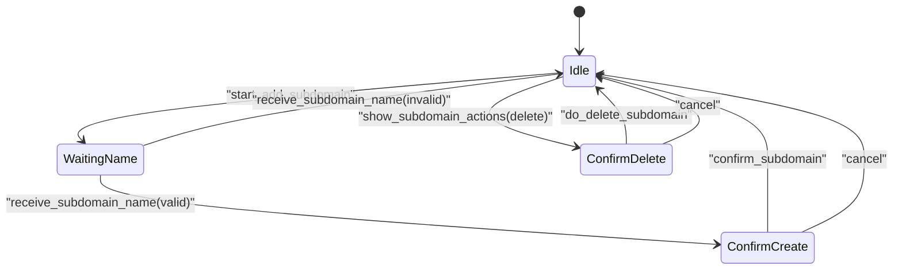
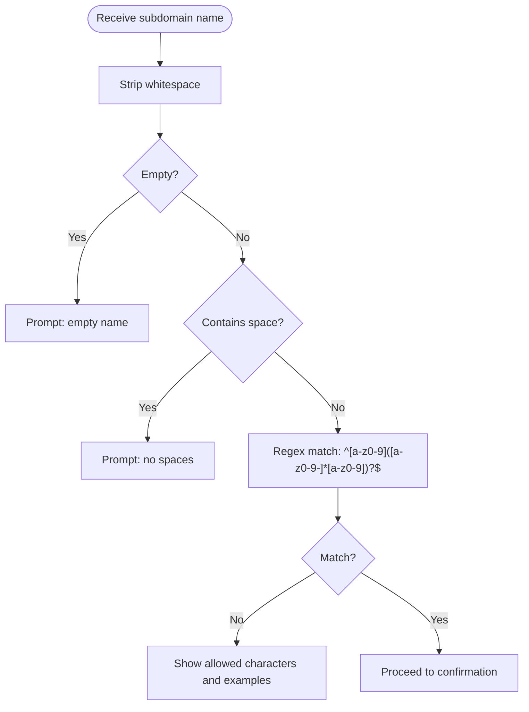
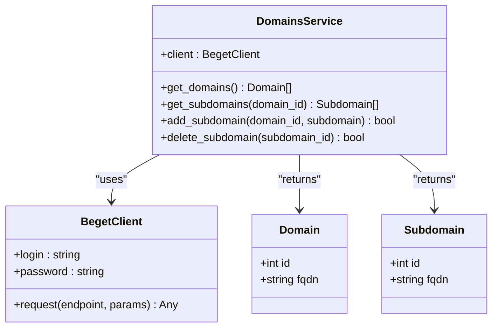
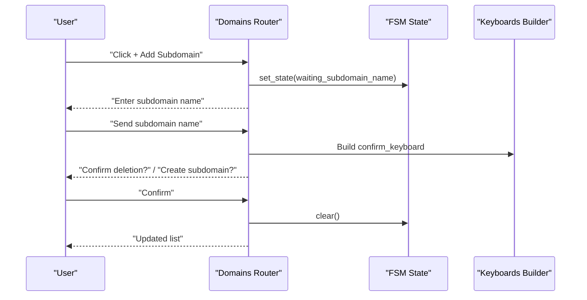
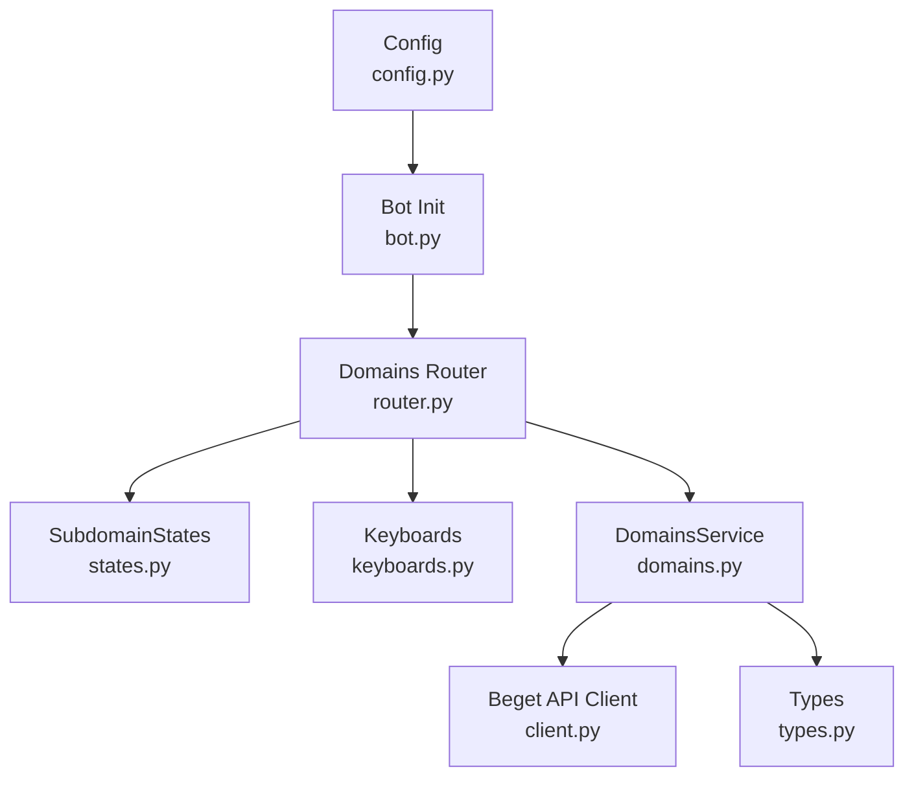

# Subdomain Management

<cite>
**Referenced Files in This Document**
- [app/modules/domains/router.py](file://app/modules/domains/router.py)
- [app/modules/domains/states.py](file://app/modules/domains/states.py)
- [app/modules/domains/keyboards.py](file://app/modules/domains/keyboards.py)
- [app/services/beget/domains.py](file://app/services/beget/domains.py)
- [app/services/beget/client.py](file://app/services/beget/client.py)
- [app/services/beget/types.py](file://app/services/beget/types.py)
- [app/bot/bot.py](file://app/bot/bot.py)
- [app/config.py](file://app/config.py)
- [README.md](file://README.md)
</cite>

## Table of Contents
1. [Introduction](#introduction)
2. [Project Structure](#project-structure)
3. [Core Components](#core-components)
4. [Architecture Overview](#architecture-overview)
5. [Detailed Component Analysis](#detailed-component-analysis)
6. [Dependency Analysis](#dependency-analysis)
7. [Performance Considerations](#performance-considerations)
8. [Troubleshooting Guide](#troubleshooting-guide)
9. [Conclusion](#conclusion)
10. [Appendices](#appendices)

## Introduction
This document provides comprehensive documentation for subdomain management operations within the Beget Manager Telegram bot. It covers the complete workflow for listing subdomains, creating new subdomains, and deleting existing ones. It explains the finite-state machine (FSM) implementation using SubdomainStates for multi-step operations, including validation and confirmation steps. It documents the subdomain validation logic that enforces naming conventions (lowercase letters, numbers, hyphens) and rejects spaces or special characters. Practical examples illustrate CRUD operations, error handling for invalid inputs, integration with DomainsService for API calls, confirmation dialogs, state persistence during multi-step operations, and the keyboard navigation system for subdomain actions.

## Project Structure
The subdomain management feature is implemented as part of the domains module. The relevant components are organized as follows:
- Router and handlers: app/modules/domains/router.py
- FSM states: app/modules/domains/states.py
- Keyboard builders: app/modules/domains/keyboards.py
- Domain service and Beget API integration: app/services/beget/domains.py
- Beget API client and error handling: app/services/beget/client.py
- Type definitions: app/services/beget/types.py
- Bot integration and module registration: app/bot/bot.py
- Configuration: app/config.py
- Usage overview: README.md

**Diagram sources**
- [app/bot/bot.py](file://app/bot/bot.py#L49-L51)
- [app/modules/domains/router.py](file://app/modules/domains/router.py#L22-L22)
- [app/modules/domains/states.py](file://app/modules/domains/states.py#L6-L11)
- [app/modules/domains/keyboards.py](file://app/modules/domains/keyboards.py#L9-L24)
- [app/services/beget/domains.py](file://app/services/beget/domains.py#L7-L12)
- [app/services/beget/client.py](file://app/services/beget/client.py#L21-L43)
- [app/services/beget/types.py](file://app/services/beget/types.py#L6-L26)
- [app/config.py](file://app/config.py#L37-L51)

**Section sources**
- [app/bot/bot.py](file://app/bot/bot.py#L49-L51)
- [app/modules/domains/router.py](file://app/modules/domains/router.py#L22-L22)
- [app/modules/domains/states.py](file://app/modules/domains/states.py#L6-L11)
- [app/modules/domains/keyboards.py](file://app/modules/domains/keyboards.py#L9-L24)
- [app/services/beget/domains.py](file://app/services/beget/domains.py#L7-L12)
- [app/services/beget/client.py](file://app/services/beget/client.py#L21-L43)
- [app/services/beget/types.py](file://app/services/beget/types.py#L6-L26)
- [app/config.py](file://app/config.py#L37-L51)

## Core Components
- SubdomainStates: Defines FSM states for subdomain operations (waiting_subdomain_name, confirm_create_subdomain, confirm_delete_subdomain).
- Domains Router: Implements handlers for listing subdomains, starting creation, receiving input, confirming creation, and deleting subdomains.
- DomainsService: Encapsulates Beget API calls for retrieving domains/subdomains and performing CRUD operations.
- Beget API Client: Provides HTTP client with request building, response parsing, and error handling.
- Keyboard Builders: Generate inline keyboards for navigation and confirmation dialogs.
- Type Definitions: Pydantic models for Domain, Subdomain, and DNS-related structures.

**Section sources**
- [app/modules/domains/states.py](file://app/modules/domains/states.py#L6-L11)
- [app/modules/domains/router.py](file://app/modules/domains/router.py#L135-L298)
- [app/services/beget/domains.py](file://app/services/beget/domains.py#L7-L58)
- [app/services/beget/client.py](file://app/services/beget/client.py#L21-L135)
- [app/modules/domains/keyboards.py](file://app/modules/domains/keyboards.py#L186-L195)
- [app/services/beget/types.py](file://app/services/beget/types.py#L14-L26)

## Architecture Overview
The subdomain management workflow integrates Telegram UI interactions with the Beget API through a structured pipeline:
- UI triggers: Callback queries and messages initiate operations.
- FSM states: Persist user context across multi-step flows.
- Validation: Input validation occurs before API calls.
- API integration: DomainsService delegates to Beget API client.
- Confirmation dialogs: Inline keyboards enforce explicit user consent for destructive actions.
- State persistence: FSM context stores intermediate data between steps.

**Diagram sources**
- [app/modules/domains/router.py](file://app/modules/domains/router.py#L72-L99)
- [app/modules/domains/router.py](file://app/modules/domains/router.py#L135-L200)
- [app/modules/domains/router.py](file://app/modules/domains/router.py#L202-L242)
- [app/services/beget/domains.py](file://app/services/beget/domains.py#L25-L50)
- [app/services/beget/client.py](file://app/services/beget/client.py#L70-L117)

## Detailed Component Analysis

### Subdomain Workflow: Listing, Creating, Deleting
- Listing subdomains:
  - Handler receives a callback with domain_id and fqdn.
  - Calls DomainsService.get_subdomains(domain_id).
  - Builds a subdomains list keyboard with actions and navigation.
- Creating subdomains:
  - Starts by setting FSM state to waiting_subdomain_name.
  - Receives user input, validates naming rules, and transitions to confirm_create_subdomain.
  - On confirmation, calls DomainsService.add_subdomain and refreshes the list.
- Deleting subdomains:
  - Navigates to subdomain actions and confirms deletion via inline keyboard.
  - Calls DomainsService.delete_subdomain and refreshes the list.

**Diagram sources**
- [app/modules/domains/router.py](file://app/modules/domains/router.py#L72-L99)
- [app/modules/domains/router.py](file://app/modules/domains/router.py#L135-L200)
- [app/modules/domains/router.py](file://app/modules/domains/router.py#L202-L242)
- [app/modules/domains/router.py](file://app/modules/domains/router.py#L244-L298)

**Section sources**
- [app/modules/domains/router.py](file://app/modules/domains/router.py#L72-L99)
- [app/modules/domains/router.py](file://app/modules/domains/router.py#L135-L200)
- [app/modules/domains/router.py](file://app/modules/domains/router.py#L202-L242)
- [app/modules/domains/router.py](file://app/modules/domains/router.py#L244-L298)

### State Machine Implementation with SubdomainStates
SubdomainStates defines three states for multi-step operations:
- waiting_subdomain_name: Captures the subdomain name input.
- confirm_create_subdomain: Presents confirmation dialog before creation.
- confirm_delete_subdomain: Presents confirmation dialog before deletion.

The router sets and clears states appropriately, storing contextual data in FSM state between steps.

**Diagram sources**
- [app/modules/domains/states.py](file://app/modules/domains/states.py#L6-L11)
- [app/modules/domains/router.py](file://app/modules/domains/router.py#L135-L200)
- [app/modules/domains/router.py](file://app/modules/domains/router.py#L202-L242)
- [app/modules/domains/router.py](file://app/modules/domains/router.py#L244-L298)

**Section sources**
- [app/modules/domains/states.py](file://app/modules/domains/states.py#L6-L11)
- [app/modules/domains/router.py](file://app/modules/domains/router.py#L135-L200)
- [app/modules/domains/router.py](file://app/modules/domains/router.py#L202-L242)
- [app/modules/domains/router.py](file://app/modules/domains/router.py#L244-L298)

### Subdomain Validation Logic
Validation occurs when receiving the subdomain name:
- Rejects empty names.
- Rejects names containing spaces.
- Uses a regular expression to enforce allowed characters and structure:
  - Lowercase letters (a–z), digits (0–9), and hyphens (-) in the middle.
  - No Cyrillic or other non-Latin characters.
  - No special characters or spaces.
- Provides a helpful error message with examples and allowed character categories.

**Diagram sources**
- [app/modules/domains/router.py](file://app/modules/domains/router.py#L153-L200)

**Section sources**
- [app/modules/domains/router.py](file://app/modules/domains/router.py#L153-L200)

### Integration with DomainsService and Beget API
- Listing subdomains:
  - DomainsService.get_subdomains(domain_id) retrieves all subdomains and filters by domain_id.
  - Returns a list of Subdomain objects.
- Creating subdomains:
  - DomainsService.add_subdomain(domain_id, subdomain) calls the Beget API endpoint for virtual subdomain creation.
- Deleting subdomains:
  - DomainsService.delete_subdomain(subdomain_id) calls the Beget API endpoint for deletion.
- Beget API Client:
  - Handles URL construction, authentication, request execution, and response parsing.
  - Raises BegetApiError on API errors with extracted error messages.

**Diagram sources**
- [app/services/beget/domains.py](file://app/services/beget/domains.py#L7-L58)
- [app/services/beget/client.py](file://app/services/beget/client.py#L21-L135)
- [app/services/beget/types.py](file://app/services/beget/types.py#L14-L26)

**Section sources**
- [app/services/beget/domains.py](file://app/services/beget/domains.py#L25-L50)
- [app/services/beget/client.py](file://app/services/beget/client.py#L70-L117)
- [app/services/beget/types.py](file://app/services/beget/types.py#L14-L26)

### Confirmation Dialogs and Keyboard Navigation
- Confirmation dialogs:
  - Generic confirm_keyboard is used for destructive actions (create and delete).
  - Buttons labeled "Confirm" and "Cancel" route to specific callback handlers.
- Keyboard builders:
  - subdomains_list_keyboard displays subdomains and navigation controls.
  - subdomain_actions_keyboard provides delete and back actions.
  - confirm_keyboard constructs confirmation layouts consistently.

**Diagram sources**
- [app/modules/domains/keyboards.py](file://app/modules/domains/keyboards.py#L48-L76)
- [app/modules/domains/keyboards.py](file://app/modules/domains/keyboards.py#L79-L102)
- [app/modules/domains/keyboards.py](file://app/modules/domains/keyboards.py#L186-L195)

**Section sources**
- [app/modules/domains/keyboards.py](file://app/modules/domains/keyboards.py#L48-L76)
- [app/modules/domains/keyboards.py](file://app/modules/domains/keyboards.py#L79-L102)
- [app/modules/domains/keyboards.py](file://app/modules/domains/keyboards.py#L186-L195)

### Practical Examples of Subdomain CRUD Operations
- Listing subdomains:
  - Trigger: CallbackQuery "subdomains:<domain_id>:<fqdn>".
  - Behavior: Fetch subdomains via DomainsService and render subdomains_list_keyboard.
- Creating a subdomain:
  - Start: CallbackQuery "add_subdomain:<domain_id>:<fqdn>" sets waiting_subdomain_name.
  - Input: Message with subdomain name triggers validation.
  - Confirm: CallbackQuery "confirm_subdomain:<subdomain>" executes creation.
  - Result: Updated subdomains list is sent to the user.
- Deleting a subdomain:
  - Navigate: CallbackQuery "subdomain:<subdomain_id>:<fqdn>" then "del_sub:<subdomain_id>".
  - Confirm: CallbackQuery "do_del_sub:<subdomain_id>" executes deletion.
  - Result: Updated subdomains list is sent to the user.

**Section sources**
- [app/modules/domains/router.py](file://app/modules/domains/router.py#L72-L99)
- [app/modules/domains/router.py](file://app/modules/domains/router.py#L135-L200)
- [app/modules/domains/router.py](file://app/modules/domains/router.py#L202-L242)
- [app/modules/domains/router.py](file://app/modules/domains/router.py#L244-L298)

### Error Handling for Invalid Inputs
- Validation failures:
  - Empty or whitespace-only names prompt retry.
  - Names with spaces prompt retry.
  - Regex mismatch shows allowed characters and examples.
- API failures:
  - BegetApiError is raised with extracted error messages.
  - Handlers catch exceptions and notify users via alerts.

**Section sources**
- [app/modules/domains/router.py](file://app/modules/domains/router.py#L153-L200)
- [app/services/beget/client.py](file://app/services/beget/client.py#L97-L116)

## Dependency Analysis
The subdomain management feature depends on:
- Router handlers depend on FSM states and keyboard builders.
- DomainsService depends on Beget API client and type definitions.
- Bot initialization registers routers and middleware, enabling the domain module.

**Diagram sources**
- [app/modules/domains/router.py](file://app/modules/domains/router.py#L8-L20)
- [app/modules/domains/states.py](file://app/modules/domains/states.py#L6-L11)
- [app/modules/domains/keyboards.py](file://app/modules/domains/keyboards.py#L9-L24)
- [app/services/beget/domains.py](file://app/services/beget/domains.py#L7-L12)
- [app/services/beget/client.py](file://app/services/beget/client.py#L21-L43)
- [app/services/beget/types.py](file://app/services/beget/types.py#L6-L26)
- [app/bot/bot.py](file://app/bot/bot.py#L49-L51)
- [app/config.py](file://app/config.py#L37-L51)

**Section sources**
- [app/modules/domains/router.py](file://app/modules/domains/router.py#L8-L20)
- [app/modules/domains/states.py](file://app/modules/domains/states.py#L6-L11)
- [app/modules/domains/keyboards.py](file://app/modules/domains/keyboards.py#L9-L24)
- [app/services/beget/domains.py](file://app/services/beget/domains.py#L7-L12)
- [app/services/beget/client.py](file://app/services/beget/client.py#L21-L43)
- [app/services/beget/types.py](file://app/services/beget/types.py#L6-L26)
- [app/bot/bot.py](file://app/bot/bot.py#L49-L51)
- [app/config.py](file://app/config.py#L37-L51)

## Performance Considerations
- API calls are asynchronous and use aiohttp sessions; ensure timeouts are configured appropriately.
- Filtering subdomains server-side would reduce payload size; current implementation filters client-side after fetching all subdomains.
- Keyboard rendering uses InlineKeyboardBuilder for efficient layout construction.

[No sources needed since this section provides general guidance]

## Troubleshooting Guide
- Unauthorized access:
  - Ensure ADMIN_CHAT_ID matches the user’s Chat ID and the admin filter is applied.
- Beget API errors:
  - Verify BEGET_LOGIN and BEGET_PASSWORD in environment variables.
  - Check logs for BegetApiError messages indicating API-level issues.
- State persistence:
  - If the bot loses state, users can re-initiate the operation from the domain menu.
- Keyboard navigation:
  - Use the “Back” buttons to navigate menus; “Cancel” resets FSM state.

**Section sources**
- [app/bot/bot.py](file://app/bot/bot.py#L44-L47)
- [app/config.py](file://app/config.py#L17-L26)
- [app/services/beget/client.py](file://app/services/beget/client.py#L97-L116)

## Conclusion
The subdomain management feature provides a robust, user-friendly workflow for listing, creating, and deleting subdomains through a Telegram interface. It leverages FSM states for multi-step operations, enforces strict validation rules, and integrates seamlessly with the Beget API via DomainsService. Confirmation dialogs ensure user intent for destructive actions, while keyboard builders offer intuitive navigation. The modular design allows for easy extension and maintenance.

[No sources needed since this section summarizes without analyzing specific files]

## Appendices
- Usage overview and feature highlights are documented in the project README.

**Section sources**
- [README.md](file://README.md#L5-L15)