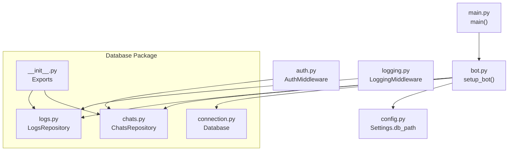
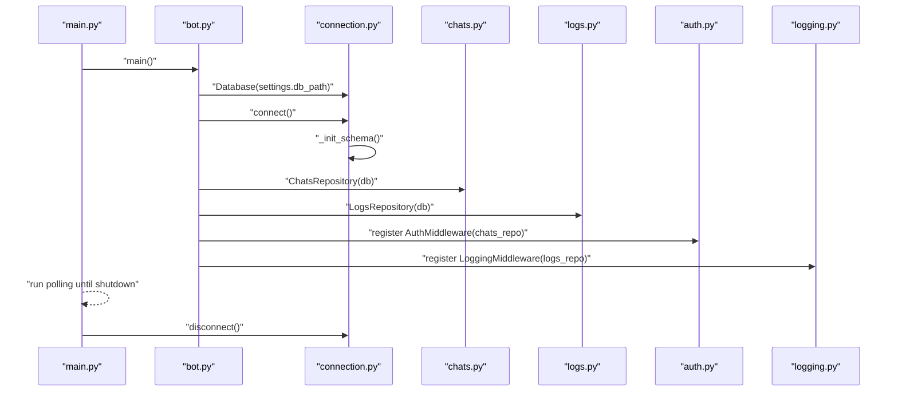
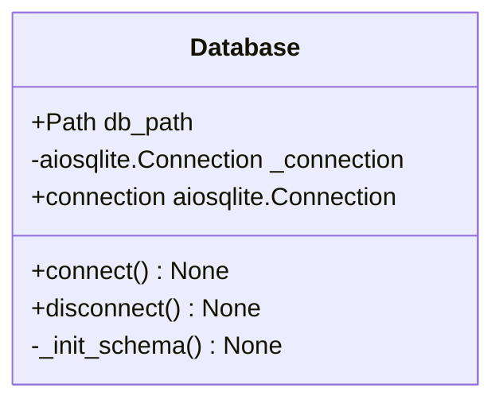
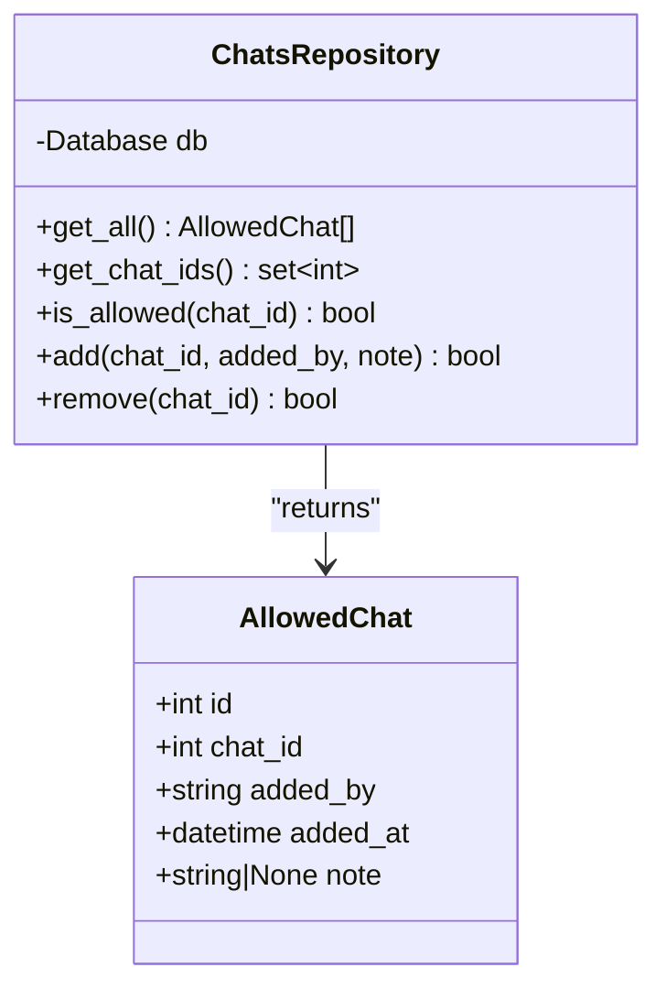
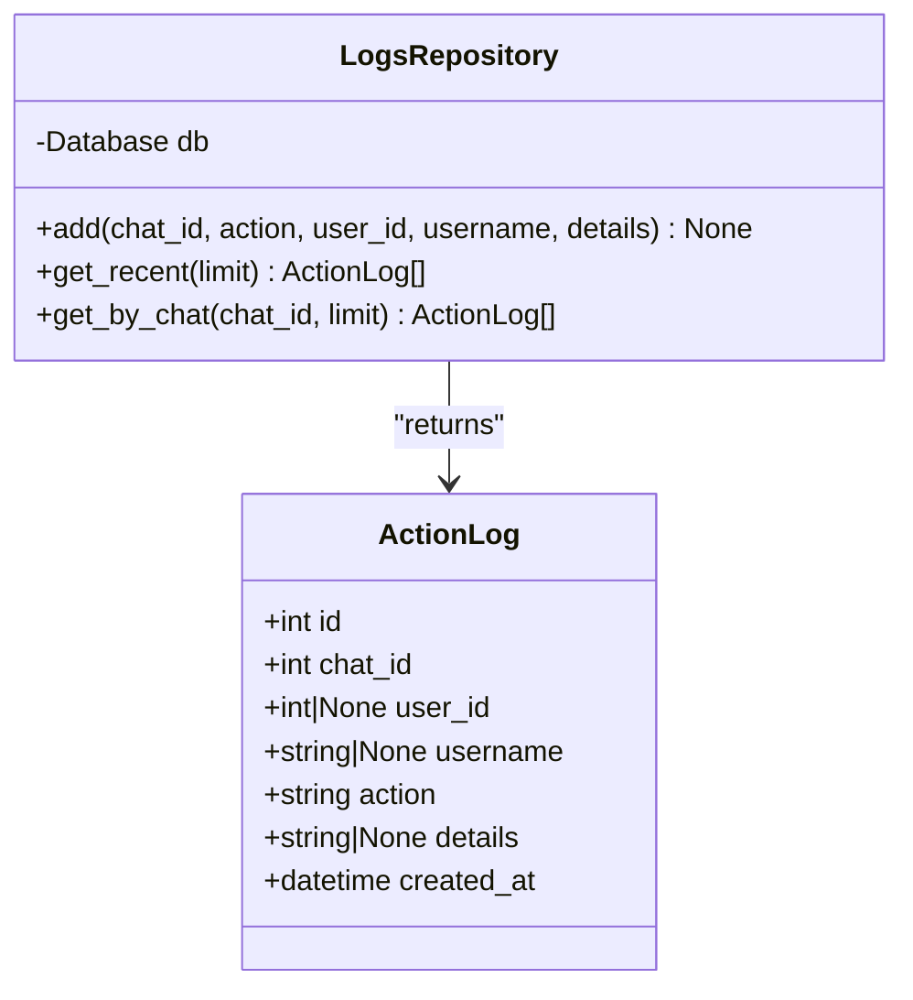
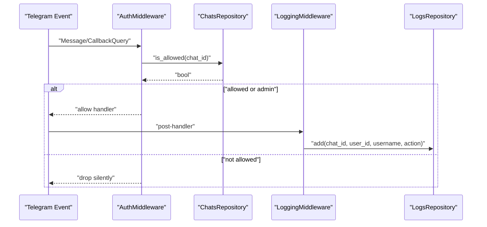
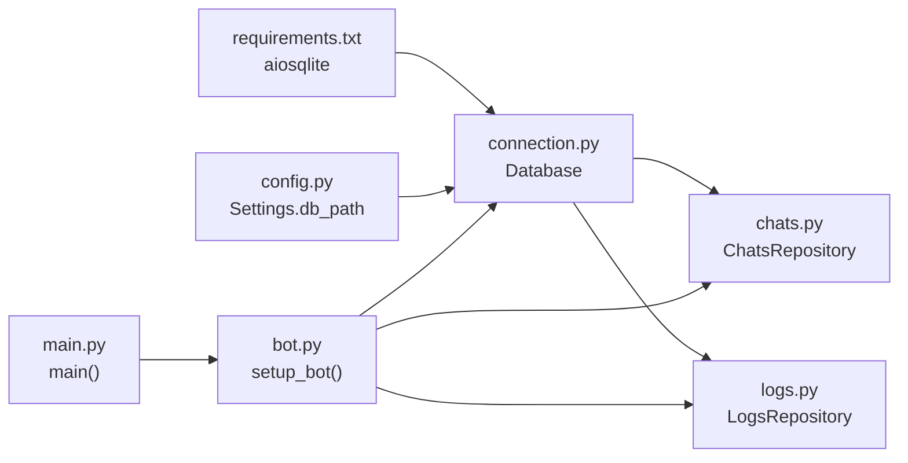

# Database Layer

<cite>
**Referenced Files in This Document**
- [connection.py](file://app/services/database/connection.py)
- [chats.py](file://app/services/database/chats.py)
- [logs.py](file://app/services/database/logs.py)
- [__init__.py](file://app/services/database/__init__.py)
- [bot.py](file://app/bot/bot.py)
- [auth.py](file://app/bot/middlewares/auth.py)
- [logging.py](file://app/bot/middlewares/logging.py)
- [main.py](file://app/main.py)
- [config.py](file://app/config.py)
- [docker-compose.yml](file://docker-compose.yml)
- [Dockerfile](file://Dockerfile)
- [requirements.txt](file://requirements.txt)
</cite>

## Table of Contents
1. [Introduction](#introduction)
2. [Project Structure](#project-structure)
3. [Core Components](#core-components)
4. [Architecture Overview](#architecture-overview)
5. [Detailed Component Analysis](#detailed-component-analysis)
6. [Dependency Analysis](#dependency-analysis)
7. [Performance Considerations](#performance-considerations)
8. [Troubleshooting Guide](#troubleshooting-guide)
9. [Conclusion](#conclusion)
10. [Appendices](#appendices)

## Introduction
This document describes the database layer of the Beget Manager bot. It focuses on the SQLite implementation powered by aiosqlite for asynchronous operations, the repository pattern used to abstract database interactions, and the data models that support user permission checks and activity logging. It also covers connection lifecycle, transaction handling, schema initialization, and how the application persists data via Docker volumes.

## Project Structure
The database layer is organized under app/services/database with three primary modules:
- connection.py: Async SQLite connection manager and schema initializer
- chats.py: Repository for allowed chats and permissions
- logs.py: Repository for action logs and audit trails
- __init__.py: Public exports for the database package

The bot wiring integrates the database during startup and injects repositories into middlewares and routers.

**Diagram sources**
- [connection.py](file://app/services/database/connection.py#L7-L58)
- [chats.py](file://app/services/database/chats.py#L20-L79)
- [logs.py](file://app/services/database/logs.py#L22-L90)
- [__init__.py](file://app/services/database/__init__.py#L1-L8)
- [bot.py](file://app/bot/bot.py#L18-L83)
- [auth.py](file://app/bot/middlewares/auth.py#L10-L46)
- [logging.py](file://app/bot/middlewares/logging.py#L12-L76)
- [main.py](file://app/main.py#L10-L30)
- [config.py](file://app/config.py#L31-L35)

**Section sources**
- [connection.py](file://app/services/database/connection.py#L1-L59)
- [chats.py](file://app/services/database/chats.py#L1-L79)
- [logs.py](file://app/services/database/logs.py#L1-L90)
- [__init__.py](file://app/services/database/__init__.py#L1-L8)
- [bot.py](file://app/bot/bot.py#L18-L83)
- [main.py](file://app/main.py#L10-L30)
- [config.py](file://app/config.py#L31-L35)

## Core Components
- Database: Async SQLite connection manager that ensures the schema exists and exposes a single active connection property.
- ChatsRepository: Provides CRUD-like operations for allowed chats, including existence checks and bulk retrieval.
- LogsRepository: Records user actions and retrieves recent or chat-specific logs.

Key behaviors:
- Asynchronous operations via aiosqlite
- Row factory configured for dict-like access
- Schema creation and index initialization on connect
- Manual commit after write operations

**Section sources**
- [connection.py](file://app/services/database/connection.py#L7-L58)
- [chats.py](file://app/services/database/chats.py#L20-L79)
- [logs.py](file://app/services/database/logs.py#L22-L90)

## Architecture Overview
The database layer is tightly coupled with application startup and middleware pipelines:
- Application startup initializes settings, creates a Database instance, connects to SQLite, and registers repositories.
- Middlewares use repositories to enforce permissions and log actions.
- Shutdown closes the database connection gracefully.

**Diagram sources**
- [main.py](file://app/main.py#L10-L30)
- [bot.py](file://app/bot/bot.py#L18-L83)
- [connection.py](file://app/services/database/connection.py#L14-L58)
- [chats.py](file://app/services/database/chats.py#L20-L79)
- [logs.py](file://app/services/database/logs.py#L22-L90)
- [auth.py](file://app/bot/middlewares/auth.py#L10-L46)
- [logging.py](file://app/bot/middlewares/logging.py#L12-L76)

## Detailed Component Analysis

### Database Connection Manager (connection.py)
Responsibilities:
- Manage a single async SQLite connection
- Ensure parent directory exists for the database file
- Configure row factory for convenient row access
- Initialize schema and indexes on first connect
- Expose a property to access the underlying connection

Schema initialization includes:
- allowed_chats table with autoincrement primary key, unique chat identifier, author field, timestamp, and optional note
- action_logs table with autoincrement primary key, chat reference, optional user identity, action descriptor, optional details, and timestamp
- Index on action_logs created_at for efficient chronological queries

Transaction handling:
- Writes are committed immediately after insert/update/delete operations in repositories
- No explicit rollback or transaction blocks are used in the current implementation

Data validation:
- Unique constraint on chat_id prevents duplicates
- Default timestamps are handled by the database
- Repository methods validate inputs at the SQL level (e.g., NOT NULL constraints)

**Diagram sources**
- [connection.py](file://app/services/database/connection.py#L7-L58)

**Section sources**
- [connection.py](file://app/services/database/connection.py#L7-L58)

### Allowed Chats Repository (chats.py)
Responsibilities:
- Retrieve all allowed chats ordered by addition time
- Fetch allowed chat IDs as a set for fast membership checks
- Check if a chat is permitted
- Add a new allowed chat with author and optional note
- Remove an allowed chat

Data model:
- AllowedChat entity mirrors the allowed_chats table schema

Constraints and keys:
- chat_id is unique and not null
- id is primary key and autoincremented

Error handling:
- Insert operation catches exceptions and returns a boolean outcome

**Diagram sources**
- [chats.py](file://app/services/database/chats.py#L9-L79)

**Section sources**
- [chats.py](file://app/services/database/chats.py#L9-L79)

### Action Logs Repository (logs.py)
Responsibilities:
- Record action logs with chat identity, optional user identity, action descriptor, and optional details
- Retrieve recent logs with a configurable limit
- Retrieve logs filtered by chat with a configurable limit

Data model:
- ActionLog entity mirrors the action_logs table schema

Constraints and keys:
- id is primary key and autoincremented
- created_at defaults to current timestamp

Indexing:
- An index on created_at is created during schema initialization to optimize chronological queries

**Diagram sources**
- [logs.py](file://app/services/database/logs.py#L9-L90)

**Section sources**
- [logs.py](file://app/services/database/logs.py#L9-L90)

### Middleware Integration
- AuthMiddleware uses ChatsRepository to authorize incoming updates against the allowed chats list and admin override
- LoggingMiddleware uses LogsRepository to record user actions and notify the admin chat

**Diagram sources**
- [auth.py](file://app/bot/middlewares/auth.py#L17-L46)
- [chats.py](file://app/services/database/chats.py#L51-L57)
- [logging.py](file://app/bot/middlewares/logging.py#L20-L76)
- [logs.py](file://app/services/database/logs.py#L28-L44)

**Section sources**
- [auth.py](file://app/bot/middlewares/auth.py#L10-L46)
- [logging.py](file://app/bot/middlewares/logging.py#L12-L76)

## Dependency Analysis
External dependencies relevant to the database layer:
- aiosqlite: Async SQLite driver
- pydantic/pydantic-settings: Configuration loading and typed settings

Internal dependencies:
- Database is constructed from Settings.db_path
- Repositories depend on Database.connection
- Middlewares depend on repositories
- Application lifecycle depends on graceful disconnect

**Diagram sources**
- [requirements.txt](file://requirements.txt#L1-L6)
- [config.py](file://app/config.py#L31-L35)
- [connection.py](file://app/services/database/connection.py#L10-L19)
- [chats.py](file://app/services/database/chats.py#L23-L24)
- [logs.py](file://app/services/database/logs.py#L25-L26)
- [bot.py](file://app/bot/bot.py#L28-L37)
- [main.py](file://app/main.py#L17-L25)

**Section sources**
- [requirements.txt](file://requirements.txt#L1-L6)
- [config.py](file://app/config.py#L31-L35)
- [connection.py](file://app/services/database/connection.py#L10-L19)
- [chats.py](file://app/services/database/chats.py#L23-L24)
- [logs.py](file://app/services/database/logs.py#L25-L26)
- [bot.py](file://app/bot/bot.py#L28-L37)
- [main.py](file://app/main.py#L17-L25)

## Performance Considerations
- Indexing: A descending index on action_logs.created_at supports chronological queries. Consider adding indexes for frequently filtered columns if query patterns evolve (e.g., chat_id).
- Query patterns: Repositories use simple selects with limits; ensure appropriate indexes exist for any new filters.
- Concurrency: aiosqlite connections are not thread-safe; the current design uses a single connection per process, which is suitable for this bot’s scale.
- Transactions: Each write operation commits immediately. For batch writes, consider grouping operations within a single transaction block to reduce overhead.
- Data types: Using datetime objects from the database requires parsing; ensure consistent timezone handling if logs span multiple timezones.

[No sources needed since this section provides general guidance]

## Troubleshooting Guide
Common issues and resolutions:
- Database not connected: Accessing the connection property before connecting raises a runtime error. Ensure Database.connect() is called before any repository operations.
- Permission denied: If a chat is not found in allowed_chats and is not the admin chat, the AuthMiddleware drops the update. Verify the chat is added and the admin_chat_id setting matches the intended admin chat.
- Missing logs: Ensure LoggingMiddleware is registered and that the admin_chat_id is configured. Check that the action_logs table exists and is not corrupted.
- Volume persistence: Confirm the Docker volume mounts the host data directory to /app/data so the SQLite file persists across container restarts.

Operational checks:
- Verify Settings.db_path resolves to a writable location inside the container
- Confirm docker-compose.yml mounts ./data to /app/data
- On startup, the schema is initialized automatically; inspect the database file to confirm tables and indexes exist

**Section sources**
- [connection.py](file://app/services/database/connection.py#L27-L32)
- [auth.py](file://app/bot/middlewares/auth.py#L34-L42)
- [logging.py](file://app/bot/middlewares/logging.py#L50-L74)
- [docker-compose.yml](file://docker-compose.yml#L7-L8)
- [Dockerfile](file://Dockerfile#L12-L13)

## Conclusion
The database layer uses a clean repository pattern around an async SQLite connection to manage permissions and audit logs. The design is straightforward, with immediate commits and a single active connection, which suits the bot’s usage patterns. Persistence is ensured via Docker volumes mapped to /app/data, and schema initialization occurs on first connect. Future enhancements could include additional indexes, transaction batching for bulk operations, and explicit transaction boundaries for multi-step writes.

[No sources needed since this section summarizes without analyzing specific files]

## Appendices

### Database Schema
Tables and indexes:
- allowed_chats
  - id: integer, primary key, autoincrement
  - chat_id: integer, unique, not null
  - added_by: text, not null
  - added_at: datetime, default current_timestamp
  - note: text
- action_logs
  - id: integer, primary key, autoincrement
  - chat_id: integer, not null
  - user_id: integer
  - username: text
  - action: text, not null
  - details: text
  - created_at: datetime, default current_timestamp
- Indexes
  - idx_action_logs_created_at on action_logs(created_at DESC)

**Section sources**
- [connection.py](file://app/services/database/connection.py#L34-L58)

### Data Models
- AllowedChat
  - Fields: id, chat_id, added_by, added_at, note
- ActionLog
  - Fields: id, chat_id, user_id, username, action, details, created_at

**Section sources**
- [chats.py](file://app/services/database/chats.py#L9-L18)
- [logs.py](file://app/services/database/logs.py#L9-L20)

### Initialization and Lifecycle
- Settings load data_dir and construct db_path
- Database.connect() ensures directory exists, opens the connection, sets row factory, and initializes schema/indexes
- Repositories are created and injected into middlewares
- On shutdown, Database.disconnect() closes the connection

**Section sources**
- [config.py](file://app/config.py#L28-L35)
- [connection.py](file://app/services/database/connection.py#L14-L58)
- [bot.py](file://app/bot/bot.py#L28-L37)
- [main.py](file://app/main.py#L21-L25)

### Docker Persistence
- Container writes data to /app/data
- Host directory ./data is mounted to /app/data via docker-compose
- The Dockerfile creates /app/data at build time

**Section sources**
- [docker-compose.yml](file://docker-compose.yml#L7-L8)
- [Dockerfile](file://Dockerfile#L12-L13)