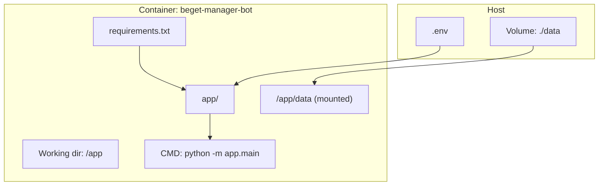
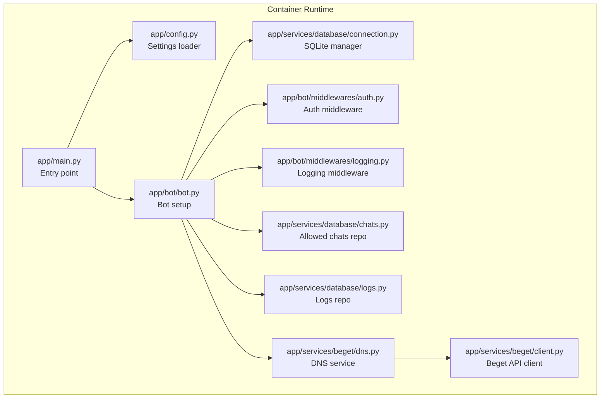
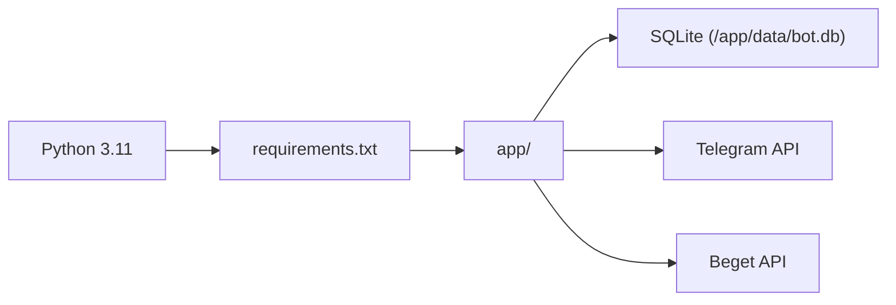

# Deployment Guide

<cite>
**Referenced Files in This Document**
- [Dockerfile](file://Dockerfile)
- [docker-compose.yml](file://docker-compose.yml)
- [.env.example](file://.env.example)
- [requirements.txt](file://requirements.txt)
- [README.md](file://README.md)
- [app/config.py](file://app/config.py)
- [app/main.py](file://app/main.py)
- [app/bot/bot.py](file://app/bot/bot.py)
- [app/bot/middlewares/auth.py](file://app/bot/middlewares/auth.py)
- [app/bot/middlewares/logging.py](file://app/bot/middlewares/logging.py)
- [app/services/database/connection.py](file://app/services/database/connection.py)
- [app/services/database/chats.py](file://app/services/database/chats.py)
- [app/services/database/logs.py](file://app/services/database/logs.py)
- [app/services/beget/client.py](file://app/services/beget/client.py)
- [app/services/beget/dns.py](file://app/services/beget/dns.py)
</cite>

## Table of Contents
1. [Introduction](#introduction)
2. [Project Structure](#project-structure)
3. [Core Components](#core-components)
4. [Architecture Overview](#architecture-overview)
5. [Detailed Component Analysis](#detailed-component-analysis)
6. [Dependency Analysis](#dependency-analysis)
7. [Performance Considerations](#performance-considerations)
8. [Troubleshooting Guide](#troubleshooting-guide)
9. [Conclusion](#conclusion)
10. [Appendices](#appendices)

## Introduction
This guide provides comprehensive deployment instructions for the Beget Manager bot, covering containerization with Docker, orchestration via Docker Compose, persistent storage, environment configuration, logging, health considerations, monitoring, scaling, networking, security, backups, disaster recovery, updates, rollbacks, and operational best practices across development, staging, and production environments.

## Project Structure
The repository follows a straightforward layout optimized for containerized deployment:
- Application code under app/
- SQLite database persisted under data/
- Containerization artifacts: Dockerfile, docker-compose.yml, requirements.txt
- Configuration examples: .env.example
- Operational guidance: README.md

**Diagram sources**
- [Dockerfile](file://Dockerfile#L1-L17)
- [docker-compose.yml](file://docker-compose.yml#L1-L14)
- [requirements.txt](file://requirements.txt#L1-L6)

**Section sources**
- [Dockerfile](file://Dockerfile#L1-L17)
- [docker-compose.yml](file://docker-compose.yml#L1-L14)
- [README.md](file://README.md#L191-L208)

## Core Components
- Application entry point initializes settings and starts the polling loop.
- Configuration is managed via Pydantic settings loaded from .env.
- Database is SQLite, stored under a configurable data directory and persisted via a mounted volume.
- Middleware enforces access control and logs actions for admins.
- Beget API client handles asynchronous HTTP requests with timeouts and robust error handling.

Key deployment-relevant behaviors:
- Settings loading from .env and caching.
- Database initialization and schema creation on first run.
- Middleware registration for authentication and logging.
- Beget API client lifecycle and error reporting.

**Section sources**
- [app/main.py](file://app/main.py#L10-L26)
- [app/config.py](file://app/config.py#L8-L40)
- [app/services/database/connection.py](file://app/services/database/connection.py#L14-L59)
- [app/bot/bot.py](file://app/bot/bot.py#L18-L83)
- [app/bot/middlewares/auth.py](file://app/bot/middlewares/auth.py#L10-L46)
- [app/bot/middlewares/logging.py](file://app/bot/middlewares/logging.py#L12-L76)
- [app/services/beget/client.py](file://app/services/beget/client.py#L21-L135)

## Architecture Overview
The runtime architecture consists of a single-container deployment running the Telegram bot, which polls Telegram’s servers and interacts with the Beget API. Data is persisted locally via a mounted volume.

**Diagram sources**
- [app/main.py](file://app/main.py#L10-L26)
- [app/config.py](file://app/config.py#L8-L40)
- [app/bot/bot.py](file://app/bot/bot.py#L18-L83)
- [app/services/database/connection.py](file://app/services/database/connection.py#L7-L59)
- [app/services/database/chats.py](file://app/services/database/chats.py#L20-L79)
- [app/services/database/logs.py](file://app/services/database/logs.py#L22-L90)
- [app/bot/middlewares/auth.py](file://app/bot/middlewares/auth.py#L10-L46)
- [app/bot/middlewares/logging.py](file://app/bot/middlewares/logging.py#L12-L76)
- [app/services/beget/client.py](file://app/services/beget/client.py#L21-L135)
- [app/services/beget/dns.py](file://app/services/beget/dns.py#L8-L152)

## Detailed Component Analysis

### Containerization Strategy
- Base image: python:3.11-slim
- Working directory: /app
- Dependencies: installed from requirements.txt
- Application code copied into /app/app/
- Data directory created at /app/data
- Command: python -m app.main

Multi-stage build considerations:
- Current Dockerfile is a single stage suitable for development and small deployments.
- For production, consider adding:
  - A dedicated non-root user
  - OS package cleanup steps
  - Layer caching improvements by ordering COPY/INSTALL steps
  - Optional: build args for environment-specific tuning

Environment injection:
- .env is loaded by the application via Pydantic settings; Docker Compose mounts .env via env_file.

Volumes:
- Host path ./data is mounted to /app/data inside the container, ensuring persistence across restarts.

Logging:
- Docker Compose uses json-file driver with rotation (max-size and max-file).

Networking:
- No explicit ports are exposed; the bot uses long-polling to receive updates from Telegram.

Security:
- Current image runs as root; consider switching to a non-root user.
- Keep .env out of version control; use .env.example as reference.

**Section sources**
- [Dockerfile](file://Dockerfile#L1-L17)
- [docker-compose.yml](file://docker-compose.yml#L1-L14)
- [.env.example](file://.env.example#L1-L11)
- [requirements.txt](file://requirements.txt#L1-L6)

### Configuration Management
- Settings class loads environment variables from .env with UTF-8 encoding and ignores extras.
- Required variables include Telegram token, admin chat ID, Beget login/password.
- Optional variables include log level and data directory.
- Database path is derived from data_dir.

Operational notes:
- Ensure .env is present and populated before starting the container.
- Use environment-specific .env files or external secret managers in production.

**Section sources**
- [app/config.py](file://app/config.py#L8-L40)
- [.env.example](file://.env.example#L1-L11)
- [README.md](file://README.md#L32-L55)

### Database Initialization and Persistence
- Database path is resolved from settings and created on first run.
- Schema includes allowed_chats and action_logs tables with an index on logs timestamps.
- Data is persisted under /app/data inside the container, mapped to ./data on the host.

Backup and recovery:
- Back up the SQLite file at data/bot.db regularly.
- To restore, stop the container, replace the database file, then restart.

**Section sources**
- [app/config.py](file://app/config.py#L31-L34)
- [app/services/database/connection.py](file://app/services/database/connection.py#L34-L59)
- [README.md](file://README.md#L210-L218)

### Authentication and Logging Middleware
- Auth middleware allows admin chat ID and users in allowed_chats list.
- Logging middleware records actions to the database and optionally notifies the admin chat.

Operational impact:
- Unauthorized access attempts are ignored silently.
- Admin receives notifications for non-admin actions.

**Section sources**
- [app/bot/middlewares/auth.py](file://app/bot/middlewares/auth.py#L10-L46)
- [app/bot/middlewares/logging.py](file://app/bot/middlewares/logging.py#L12-L76)
- [app/services/database/chats.py](file://app/services/database/chats.py#L51-L57)
- [app/services/database/logs.py](file://app/services/database/logs.py#L28-L44)

### Beget API Integration
- Asynchronous HTTP client with a default timeout.
- Robust error handling for timeouts, invalid JSON, and API-level errors.
- Request building includes authentication and input serialization.

Operational considerations:
- Monitor Beget API response times and adjust timeouts if needed.
- Use structured logging to capture API errors for diagnostics.

**Section sources**
- [app/services/beget/client.py](file://app/services/beget/client.py#L21-L135)
- [app/services/beget/dns.py](file://app/services/beget/dns.py#L14-L152)

### Health Checks and Monitoring
- No built-in HTTP health endpoint; consider adding a lightweight web server exposing readiness/liveness endpoints.
- Recommended metrics: uptime, last successful poll, database connectivity, API request latency and error rates.
- Use container logs for basic health visibility; json-file driver with rotation is configured.

**Section sources**
- [docker-compose.yml](file://docker-compose.yml#L9-L13)

### Scaling Considerations
- Single-instance polling bot; horizontal scaling is not supported.
- If scaling is desired, consider sharding by domain or implementing a queue-based architecture with multiple workers.
- For now, focus on resource limits and restart policies.

**Section sources**
- [docker-compose.yml](file://docker-compose.yml#L4-L6)

### Resource Requirements
- CPU: minimal; bot is I/O bound by network calls.
- Memory: modest; depends on concurrent users and middleware overhead.
- Storage: SQLite footprint is small; ensure sufficient disk space for logs and growth.
- Network: outbound HTTPS to Telegram and Beget APIs.

[No sources needed since this section provides general guidance]

### Networking and Ports
- No ports are published; the bot uses Telegram’s long-polling mechanism.
- Ensure outbound HTTPS egress is permitted.

**Section sources**
- [Dockerfile](file://Dockerfile#L1-L17)
- [docker-compose.yml](file://docker-compose.yml#L1-L14)

### Security Hardening
- Switch to a non-root user inside the container.
- Restrict filesystem permissions; mount /app/data as read-write only.
- Store secrets externally (e.g., Docker secrets or a secret manager) and avoid committing .env.
- Limit container capabilities and use read-only root filesystem where feasible.
- Rotate Telegram tokens and Beget credentials periodically.

**Section sources**
- [Dockerfile](file://Dockerfile#L1-L17)
- [README.md](file://README.md#L290-L296)

### Backup and Disaster Recovery
- Back up data/bot.db regularly.
- Test restoration by replacing the database file while the container is stopped.
- Maintain offsite backups and document recovery steps.

**Section sources**
- [README.md](file://README.md#L260-L276)

### Update and Rollback Procedures
- Pull latest changes, rebuild, and restart the service.
- For rollbacks, redeploy the previous image tag and restore the database snapshot if needed.

**Section sources**
- [README.md](file://README.md#L277-L288)

### Zero-Downtime Deployment Strategies
- Not applicable for a single-instance polling bot.
- For future enhancements, consider a blue/green deployment pattern with a proxy and multiple replicas behind a load balancer.

[No sources needed since this section provides general guidance]

## Dependency Analysis
Runtime dependencies include Telegram SDK, async HTTP client, async SQLite, and settings validation. The application depends on environment variables for credentials and optional logging level.

**Diagram sources**
- [requirements.txt](file://requirements.txt#L1-L6)
- [app/main.py](file://app/main.py#L10-L26)
- [app/services/database/connection.py](file://app/services/database/connection.py#L14-L19)
- [app/services/beget/client.py](file://app/services/beget/client.py#L21-L49)

**Section sources**
- [requirements.txt](file://requirements.txt#L1-L6)
- [app/main.py](file://app/main.py#L10-L26)

## Performance Considerations
- Optimize database queries by leveraging existing indexes (logs timestamp index).
- Reduce unnecessary admin notifications by tuning logging middleware behavior.
- Monitor API latency and adjust timeouts accordingly.
- Keep dependencies updated to benefit from performance improvements.

[No sources needed since this section provides general guidance]

## Troubleshooting Guide
Common issues and resolutions:
- Container not running: verify with docker-compose ps and inspect logs with docker-compose logs -f.
- Unauthorized access: confirm ADMIN_CHAT_ID and check logs for unauthorized Chat IDs.
- Beget API errors: validate credentials and review API error logs.
- Database reset: stop the container, remove data/, then restart to recreate the database (note: this deletes all data).

**Section sources**
- [README.md](file://README.md#L219-L276)

## Conclusion
The Beget Manager bot is designed for simplicity and reliability in a single-container deployment. By securing environment variables, persisting data via volumes, monitoring logs, and following the update and backup procedures outlined here, you can operate the bot safely across development, staging, and production environments.

[No sources needed since this section summarizes without analyzing specific files]

## Appendices

### Environment Variables Reference
- TELEGRAM_BOT_TOKEN: Telegram bot token from BotFather.
- ADMIN_CHAT_ID: Integer chat ID of the admin user.
- BEGET_LOGIN: Beget control panel login.
- BEGET_PASSWORD: Beget control panel password.
- LOG_LEVEL: Logging verbosity (default INFO).

**Section sources**
- [.env.example](file://.env.example#L1-L11)

### Deployment Commands
- Start: docker-compose up -d
- Inspect: docker-compose ps
- Logs: docker-compose logs -f
- Stop: docker-compose down

**Section sources**
- [README.md](file://README.md#L88-L112)