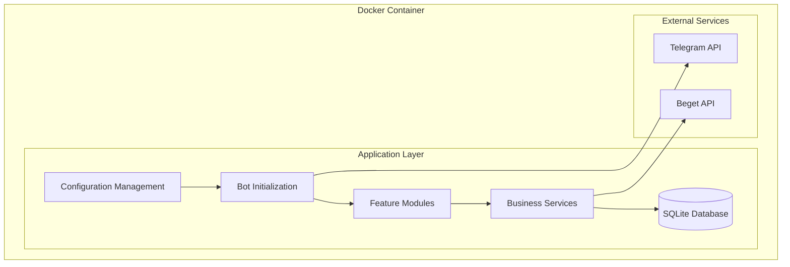
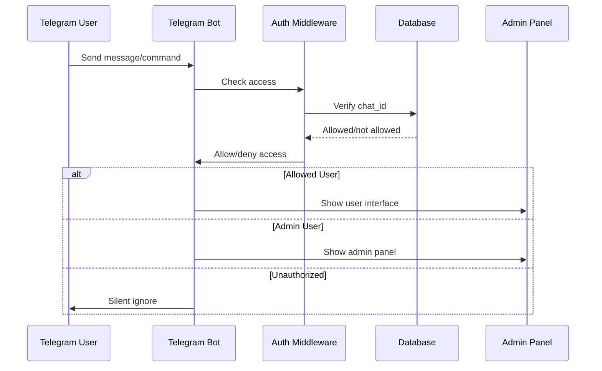

# Getting Started

<cite>
**Referenced Files in This Document**
- [README.md](file://README.md)
- [.env.example](file://.env.example)
- [docker-compose.yml](file://docker-compose.yml)
- [Dockerfile](file://Dockerfile)
- [requirements.txt](file://requirements.txt)
- [app/main.py](file://app/main.py)
- [app/config.py](file://app/config.py)
- [app/bot/bot.py](file://app/bot/bot.py)
- [app/services/database/connection.py](file://app/services/database/connection.py)
- [app/modules/admin/router.py](file://app/modules/admin/router.py)
- [app/modules/domains/router.py](file://app/modules/domains/router.py)
- [app/bot/middlewares/auth.py](file://app/bot/middlewares/auth.py)
- [app/bot/middlewares/logging.py](file://app/bot/middlewares/logging.py)
</cite>

## Table of Contents
1. [Introduction](#introduction)
2. [Prerequisites](#prerequisites)
3. [Installation](#installation)
4. [Configuration](#configuration)
5. [Deployment](#deployment)
6. [Initial Setup and Usage](#initial-setup-and-usage)
7. [Architecture Overview](#architecture-overview)
8. [Troubleshooting](#troubleshooting)
9. [Conclusion](#conclusion)

## Introduction
Beget Manager Bot is a Telegram bot that allows you to manage domains and DNS records on Beget hosting through their API. It provides features for domain management, subdomain management, DNS record management, access control, and activity logging.

Key capabilities include:
- Managing Beget domains and subdomains
- Creating and deleting subdomains
- Managing DNS records (A, AAAA, MX, TXT, CNAME, NS)
- Admin-controlled user access system
- Activity logging for all bot actions

## Prerequisites
Before installing Beget Manager Bot, ensure you have the following prerequisites:

### Docker and Docker Compose
- Docker Engine installed on your system
- Docker Compose installed and configured
- Sufficient permissions to run Docker containers

### Telegram Account
- Telegram account with access to [@BotFather](https://t.me/BotFather)
- Ability to communicate with Telegram bots

### Beget Hosting Account
- Active Beget hosting account with API access enabled
- Valid Beget login credentials (same as your control panel login)

### Administrative Access
- Your own Telegram Chat ID for admin access
- Ability to use Telegram bots like [@userinfobot](https://t.me/userinfobot)

**Section sources**
- [README.md](file://README.md#L16-L21)

## Installation

### Step 1: Clone the Repository
Clone the Beget Manager repository to your local machine:

```bash
git clone <your-repository-url>
cd beget-manager
```

### Step 2: Create Configuration File
Copy the example environment file to create your configuration:

```bash
cp .env.example .env
```

### Step 3: Configure Environment Variables
Edit the `.env` file with your credentials. The configuration includes:

- **Telegram Bot Configuration**: Bot token and admin chat ID
- **Beget API Credentials**: Login and password for Beget API access
- **Optional Settings**: Log level configuration

**Section sources**
- [README.md](file://README.md#L23-L56)
- [.env.example](file://.env.example#L1-L11)

## Configuration

### Telegram Bot Token from BotFather
Follow these steps to obtain your Telegram Bot Token:

1. Open Telegram and search for [@BotFather](https://t.me/BotFather)
2. Send `/newbot` command to create a new bot
3. Follow the interactive prompts to set up your bot name and username
4. Copy the token provided by BotFather
5. Paste it into the `TELEGRAM_BOT_TOKEN` field in your `.env` file

### Finding Your Telegram Chat ID
There are two primary methods to find your Telegram Chat ID:

#### Method 1: Using @userinfobot
1. Open Telegram and search for [@userinfobot](https://t.me/userinfobot)
2. Start the bot by clicking "Start" or sending `/start`
3. The bot responds with your user information, including your Chat ID
4. Copy the number shown as "Id" (may be negative for groups)
5. Paste it into the `ADMIN_CHAT_ID` field in your `.env` file

#### Method 2: Using @getidsbot
1. Open Chrome and navigate to `https://api.telegram.org/bot{your_bot_token}/getUpdates`
2. Start your bot by messaging it
3. Refresh the browser tab to see updates
4. Copy the "chat"."id" value from the JSON response
5. Paste it into the `ADMIN_CHAT_ID` field in your `.env` file

### Beget API Credentials
Set up your Beget API credentials:

1. Log in to your [Beget control panel](https://cp.beget.com/)
2. Use your Beget account login and password
3. These are the same credentials you use to access the Beget control panel
4. Enter them in the `BEGET_LOGIN` and `BEGET_PASSWORD` fields in your `.env` file

**Section sources**
- [README.md](file://README.md#L57-L86)

## Deployment

### Build and Start the Bot
Deploy the bot using Docker Compose:

```bash
docker-compose up -d
```

This command builds the Docker image and starts the bot container in detached mode.

### Verify Deployment Status
Check if the bot is running correctly:

```bash
docker-compose ps
```

This shows the current status of all containers managed by Docker Compose.

### View Logs
Monitor the bot's operation and troubleshoot issues:

```bash
docker-compose logs -f
```

This displays the container logs in real-time, useful for debugging and monitoring.

### Stop the Bot
To stop the bot gracefully:

```bash
docker-compose down
```

**Section sources**
- [README.md](file://README.md#L88-L112)
- [docker-compose.yml](file://docker-compose.yml#L1-L14)

## Initial Setup and Usage

### Initial Bot Setup Commands
After deployment, set up your bot with these commands:

1. Open Telegram and find your bot (by the username you created with BotFather)
2. Send `/start` command to begin the bot interaction
3. The bot responds with a welcome message and main menu options

### Basic Usage Examples
Once the bot is running, you can use it to manage your Beget domains:

#### For Admin Users
As the admin (the user whose Chat ID matches the `ADMIN_CHAT_ID`), you have full access:

1. Send `/start` to the bot
2. Click "Admin Panel" button
3. Use "Manage Chats" to add or remove allowed users
4. Use "View Logs" to monitor bot activity

#### Adding New Users
1. In Admin Panel → "Manage Chats" → "Add Chat"
2. Enter the Chat ID of the user you want to add
3. You can get their Chat ID by:
   - Asking them to use [@userinfobot](https://t.me/userinfobot)
   - Having them send a message to your bot and checking logs
4. Add an optional note to identify the user (e.g., "John Doe - Developer")

#### Removing Users
1. In Admin Panel → "Manage Chats"
2. Click on the chat you want to remove
3. Confirm removal when prompted

#### Domain Management
1. Send `/start` to the bot
2. Click "Domains" to see all your Beget domains
3. Select a domain to manage subdomains and DNS records

#### Subdomain Management
1. Select a domain from the list
2. Click "Subdomains"
3. Available actions:
   - View all existing subdomains
   - Add new subdomain: Click "Add Subdomain" and follow prompts
   - Delete subdomain: Click on subdomain → "Delete"

#### DNS Records Management
1. Select a domain from the list
2. Click "DNS Records"
3. Available options:
   - **View All**: See all DNS records (A, AAAA, MX, TXT, CNAME, NS)
   - **A Records**: Manage A records (IP addresses)
     - Add new A record
     - Change existing A record IP
     - Delete A record
   - **TXT Records**: Manage TXT records
     - Add new TXT record (for SPF, DKIM, verification, etc.)
     - View and delete existing TXT records

### Verification Steps
To ensure everything is working correctly:

1. **Container Status**: Verify the bot container is running with `docker-compose ps`
2. **Logs Check**: Review logs with `docker-compose logs -f` for any errors
3. **Bot Response**: Test bot functionality by sending `/start` and checking responses
4. **Database Creation**: Confirm the SQLite database is created at `./data/bot.db`
5. **Admin Access**: Verify your Chat ID matches the `ADMIN_CHAT_ID` configuration

**Section sources**
- [README.md](file://README.md#L114-L190)
- [app/bot/bot.py](file://app/bot/bot.py#L54-L81)

## Architecture Overview

The Beget Manager Bot follows a modular architecture built with Python and Docker:



**Diagram sources**
- [app/main.py](file://app/main.py#L10-L26)
- [app/config.py](file://app/config.py#L8-L35)
- [app/bot/bot.py](file://app/bot/bot.py#L18-L52)

The architecture consists of several key components:

### Core Components
- **Configuration Management**: Loads environment variables using Pydantic settings
- **Bot Initialization**: Sets up Telegram bot with middlewares and routing
- **Feature Modules**: Admin and domains management modules
- **Business Services**: Beget API integration and database operations
- **Database Layer**: SQLite persistence with automatic schema creation

### Authentication Flow


**Diagram sources**
- [app/bot/middlewares/auth.py](file://app/bot/middlewares/auth.py#L17-L45)
- [app/modules/admin/router.py](file://app/modules/admin/router.py#L43-L61)

**Section sources**
- [app/main.py](file://app/main.py#L1-L30)
- [app/config.py](file://app/config.py#L1-L52)
- [app/bot/bot.py](file://app/bot/bot.py#L1-L83)

## Troubleshooting

### Common Issues and Solutions

#### Bot Doesn't Respond
1. **Check Container Status**: Verify the bot container is running
   ```bash
   docker-compose ps
   ```

2. **Review Logs**: Check for error messages
   ```bash
   docker-compose logs -f
   ```

3. **Verify Bot Token**: Ensure your `TELEGRAM_BOT_TOKEN` is correct in `.env`

#### "Unauthorized Access" Error
This error occurs when your Chat ID is not in the allowed list:

1. **Check Actual Chat ID**: Review logs to see your actual Chat ID
   ```bash
   docker logs beget-manager-bot | grep "Unauthorized"
   ```

2. **Update Configuration**: Replace `ADMIN_CHAT_ID` with the correct value

3. **Restart Bot**: Apply changes by restarting the container
   ```bash
   docker-compose restart
   ```

#### Beget API Errors
Issues with Beget API connectivity:

1. **Verify Credentials**: Check your Beget login and password in `.env`
2. **Enable API Access**: Ensure API access is enabled in your Beget account
3. **Check Logs**: Review detailed API error messages
   ```bash
   docker-compose logs -f
   ```

#### Database Issues
If you need to reset the database:

1. **Stop the Bot**: 
   ```bash
   docker-compose down
   ```

2. **Remove Database**: Delete the data directory
   ```bash
   rm -rf data/
   ```

3. **Restart Bot**: The database will be recreated automatically
   ```bash
   docker-compose up -d
   ```

**Section sources**
- [README.md](file://README.md#L219-L275)

## Conclusion

Beget Manager Bot provides a comprehensive solution for managing Beget hosting resources through Telegram. With its modular architecture, robust authentication system, and comprehensive logging capabilities, it offers both security and usability for domain and DNS management tasks.

Key benefits of this setup include:
- **Containerized Deployment**: Easy installation and scaling with Docker
- **Security**: Admin-controlled access with audit logging
- **Flexibility**: Modular design allowing for easy feature additions
- **Reliability**: Automatic database persistence and error handling

For ongoing maintenance, regularly review the activity logs, keep the bot updated with `docker-compose up -d --build`, and monitor the container health with `docker-compose ps`.