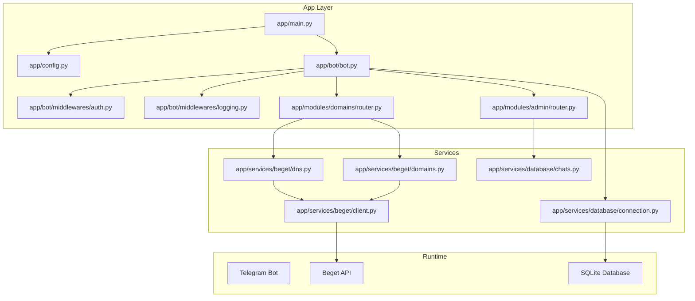
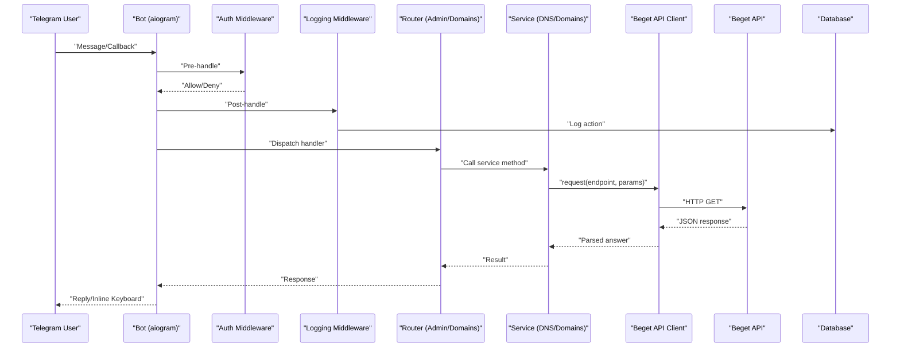
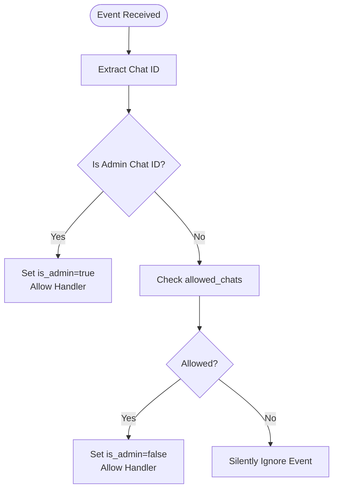
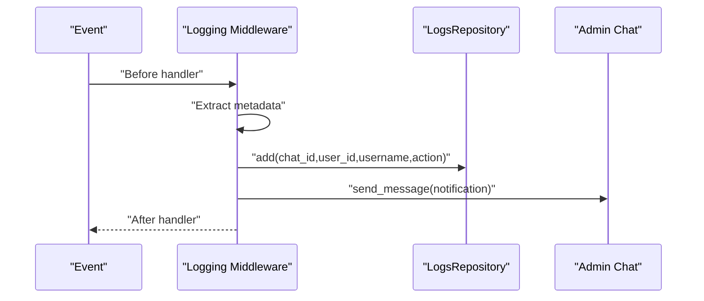
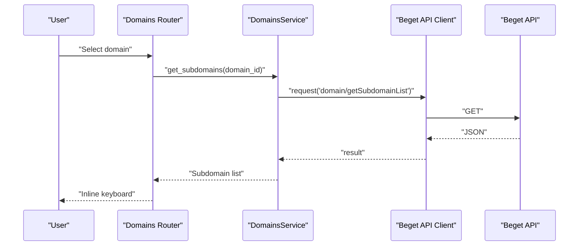
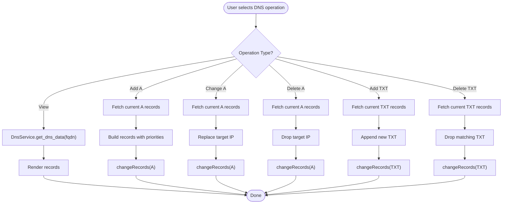
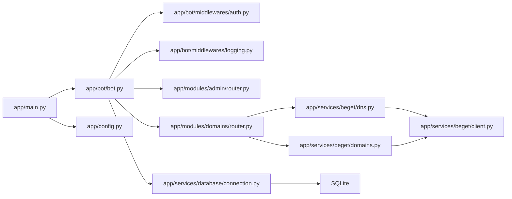

# Project Overview

<cite>
**Referenced Files in This Document**
- [README.md](file://README.md)
- [app/main.py](file://app/main.py)
- [app/config.py](file://app/config.py)
- [app/bot/bot.py](file://app/bot/bot.py)
- [app/bot/middlewares/auth.py](file://app/bot/middlewares/auth.py)
- [app/bot/middlewares/logging.py](file://app/bot/middlewares/logging.py)
- [app/modules/domains/router.py](file://app/modules/domains/router.py)
- [app/modules/admin/router.py](file://app/modules/admin/router.py)
- [app/services/beget/client.py](file://app/services/beget/client.py)
- [app/services/beget/dns.py](file://app/services/beget/dns.py)
- [app/services/beget/domains.py](file://app/services/beget/domains.py)
- [app/services/database/connection.py](file://app/services/database/connection.py)
- [app/services/database/chats.py](file://app/services/database/chats.py)
- [requirements.txt](file://requirements.txt)
- [Dockerfile](file://Dockerfile)
</cite>

## Table of Contents
1. [Introduction](#introduction)
2. [Project Structure](#project-structure)
3. [Core Components](#core-components)
4. [Architecture Overview](#architecture-overview)
5. [Detailed Component Analysis](#detailed-component-analysis)
6. [Dependency Analysis](#dependency-analysis)
7. [Performance Considerations](#performance-considerations)
8. [Troubleshooting Guide](#troubleshooting-guide)
9. [Conclusion](#conclusion)

## Introduction
Beget Manager is a Telegram bot that enables administrators and users with Beget hosting accounts to manage domains and DNS records directly from Telegram. It integrates with the Beget API to fetch and modify domain and DNS configurations, while providing an access control system and activity logging for security and auditability. The bot targets two primary audiences:
- Administrators: Full access to manage allowed users, view logs, and perform all domain and DNS operations.
- Regular users: Access to view domains, manage subdomains, and manage specific DNS records (A and TXT), subject to admin approval and access control.

Key capabilities include:
- Domain management: Listing and navigating domains.
- Subdomain operations: Creating and deleting subdomains.
- DNS record management: Viewing and editing A, AAAA, MX, TXT, CNAME, and NS records.
- Access control: Admin-defined allow-list of Telegram chat IDs.
- Activity logging: Tracking actions performed via the bot and notifying the administrator.

Benefits of using a Telegram interface for hosting management:
- Instant accessibility from anywhere with a Telegram client.
- No need to remember complex control panels or CLI commands.
- Immediate notifications and admin oversight through logging and alerts.
- Granular permissions and audit trails for safer operations.

## Project Structure
The project follows a modular structure organized by concerns:
- app/main.py: Application entry point initializing settings, bot, dispatcher, and database.
- app/config.py: Centralized settings management using Pydantic settings.
- app/bot/: Bot initialization, middlewares, and keyboard layouts.
- app/modules/: Feature modules (admin, domains) with routers and states.
- app/services/: Business logic for Beget API and database operations.
- app/utils/: Shared utilities.
- app/services/beget/*: API client and typed services for domains and DNS.
- app/services/database/*: Database connection and repositories for chats and logs.
- data/bot.db: Persisted SQLite database managed by aiosqlite.
- requirements.txt and Dockerfile: Dependencies and containerization.

**Diagram sources**
- [app/main.py](file://app/main.py#L10-L26)
- [app/bot/bot.py](file://app/bot/bot.py#L18-L82)
- [app/bot/middlewares/auth.py](file://app/bot/middlewares/auth.py#L10-L46)
- [app/bot/middlewares/logging.py](file://app/bot/middlewares/logging.py#L12-L76)
- [app/modules/admin/router.py](file://app/modules/admin/router.py#L22-L61)
- [app/modules/domains/router.py](file://app/modules/domains/router.py#L22-L52)
- [app/services/beget/client.py](file://app/services/beget/client.py#L21-L49)
- [app/services/beget/dns.py](file://app/services/beget/dns.py#L8-L19)
- [app/services/beget/domains.py](file://app/services/beget/domains.py#L7-L12)
- [app/services/database/connection.py](file://app/services/database/connection.py#L7-L33)
- [app/services/database/chats.py](file://app/services/database/chats.py#L20-L25)

**Section sources**
- [README.md](file://README.md#L191-L208)
- [app/main.py](file://app/main.py#L10-L26)
- [app/bot/bot.py](file://app/bot/bot.py#L18-L82)

## Core Components
- Configuration and settings: Centralized via Pydantic settings with environment variables for Telegram token, admin chat ID, and Beget credentials.
- Bot initialization: Sets up logging, database, middlewares, and registers routers for admin and domains modules.
- Authentication middleware: Enforces access control by checking allowed chats and admin privileges.
- Logging middleware: Captures user actions and notifies the administrator.
- Domain and DNS services: Typed services wrapping the Beget API client to manage domains, subdomains, and DNS records.
- Database: SQLite-backed repositories for allowed chats and action logs.

**Section sources**
- [app/config.py](file://app/config.py#L8-L35)
- [app/bot/bot.py](file://app/bot/bot.py#L18-L82)
- [app/bot/middlewares/auth.py](file://app/bot/middlewares/auth.py#L10-L46)
- [app/bot/middlewares/logging.py](file://app/bot/middlewares/logging.py#L12-L76)
- [app/services/beget/dns.py](file://app/services/beget/dns.py#L8-L19)
- [app/services/beget/domains.py](file://app/services/beget/domains.py#L7-L12)
- [app/services/database/connection.py](file://app/services/database/connection.py#L7-L33)

## Architecture Overview
High-level flow:
- Telegram user interacts with the bot (messages/callbacks).
- Middlewares authenticate and log actions.
- Routers dispatch to domain or admin handlers.
- Services call the Beget API client to fetch or modify data.
- Database persists allowed chats and logs.

**Diagram sources**
- [app/bot/bot.py](file://app/bot/bot.py#L44-L51)
- [app/bot/middlewares/auth.py](file://app/bot/middlewares/auth.py#L17-L45)
- [app/bot/middlewares/logging.py](file://app/bot/middlewares/logging.py#L20-L75)
- [app/modules/domains/router.py](file://app/modules/domains/router.py#L28-L52)
- [app/modules/admin/router.py](file://app/modules/admin/router.py#L64-L71)
- [app/services/beget/dns.py](file://app/services/beget/dns.py#L14-L19)
- [app/services/beget/domains.py](file://app/services/beget/domains.py#L13-L23)
- [app/services/beget/client.py](file://app/services/beget/client.py#L70-L118)
- [app/services/database/connection.py](file://app/services/database/connection.py#L14-L19)

## Detailed Component Analysis

### Access Control System
- Admin-only handlers are protected by a custom filter that checks the configured admin chat ID.
- Non-admin users are validated against the allowed chats table in the database.
- Authentication middleware injects an is_admin flag into handler context.

**Diagram sources**
- [app/bot/middlewares/auth.py](file://app/bot/middlewares/auth.py#L17-L45)
- [app/modules/admin/router.py](file://app/modules/admin/router.py#L43-L61)
- [app/services/database/chats.py](file://app/services/database/chats.py#L51-L57)

**Section sources**
- [app/bot/middlewares/auth.py](file://app/bot/middlewares/auth.py#L10-L46)
- [app/modules/admin/router.py](file://app/modules/admin/router.py#L43-L61)
- [app/services/database/chats.py](file://app/services/database/chats.py#L20-L25)

### Activity Logging
- Logging middleware captures chat_id, user_id, username, and action (text or callback data).
- Writes to action_logs table and attempts to notify the admin chat.
- Ensures non-admin actions are logged and monitored.

**Diagram sources**
- [app/bot/middlewares/logging.py](file://app/bot/middlewares/logging.py#L20-L75)
- [app/services/database/connection.py](file://app/services/database/connection.py#L45-L53)

**Section sources**
- [app/bot/middlewares/logging.py](file://app/bot/middlewares/logging.py#L12-L76)
- [app/services/database/connection.py](file://app/services/database/connection.py#L34-L58)

### Domain and Subdomain Management
- Lists domains and navigates to domain-specific menus.
- Retrieves subdomains and supports creation/deletion via virtual subdomain APIs.
- Uses state machines to guide multi-step workflows (e.g., adding subdomains).

**Diagram sources**
- [app/modules/domains/router.py](file://app/modules/domains/router.py#L72-L99)
- [app/services/beget/domains.py](file://app/services/beget/domains.py#L25-L41)
- [app/services/beget/client.py](file://app/services/beget/client.py#L70-L118)

**Section sources**
- [app/modules/domains/router.py](file://app/modules/domains/router.py#L28-L133)
- [app/services/beget/domains.py](file://app/services/beget/domains.py#L13-L57)

### DNS Record Management
- Supports viewing all record types (A, AAAA, MX, TXT, CNAME, NS).
- Adds, updates, and deletes A records with proper priority handling.
- Adds and deletes TXT records.
- Uses typed models to represent DNS data and records.

**Diagram sources**
- [app/modules/domains/router.py](file://app/modules/domains/router.py#L358-L718)
- [app/services/beget/dns.py](file://app/services/beget/dns.py#L14-L77)
- [app/services/beget/dns.py](file://app/services/beget/dns.py#L79-L152)

**Section sources**
- [app/modules/domains/router.py](file://app/modules/domains/router.py#L346-L718)
- [app/services/beget/dns.py](file://app/services/beget/dns.py#L8-L152)

### Technology Stack Overview
- Python 3.11 runtime.
- aiogram 3.4.1 for Telegram bot framework.
- aiohttp 3.9.3 for asynchronous HTTP requests to the Beget API.
- aiosqlite 0.19.0 for async SQLite access.
- pydantic 2.x and pydantic-settings for robust configuration management.
- Docker and Docker Compose for containerization.

**Section sources**
- [requirements.txt](file://requirements.txt#L1-L6)
- [Dockerfile](file://Dockerfile#L1-L17)
- [README.md](file://README.md#L298-L306)

## Dependency Analysis
- Entry point depends on configuration and bot setup.
- Bot setup depends on settings, database, and middlewares.
- Modules depend on services and configuration.
- Services depend on the Beget API client.
- Database layer depends on aiosqlite and exposes repositories.

**Diagram sources**
- [app/main.py](file://app/main.py#L10-L26)
- [app/bot/bot.py](file://app/bot/bot.py#L18-L82)
- [app/modules/domains/router.py](file://app/modules/domains/router.py#L8-L9)
- [app/services/beget/dns.py](file://app/services/beget/dns.py#L4-L5)
- [app/services/beget/domains.py](file://app/services/beget/domains.py#L3-L4)
- [app/services/beget/client.py](file://app/services/beget/client.py#L21-L31)
- [app/services/database/connection.py](file://app/services/database/connection.py#L7-L12)

**Section sources**
- [app/main.py](file://app/main.py#L10-L26)
- [app/bot/bot.py](file://app/bot/bot.py#L18-L82)
- [app/modules/domains/router.py](file://app/modules/domains/router.py#L8-L9)
- [app/services/beget/dns.py](file://app/services/beget/dns.py#L4-L5)
- [app/services/beget/domains.py](file://app/services/beget/domains.py#L3-L4)
- [app/services/beget/client.py](file://app/services/beget/client.py#L21-L31)
- [app/services/database/connection.py](file://app/services/database/connection.py#L7-L12)

## Performance Considerations
- Asynchronous design: aiohttp and aiosqlite minimize blocking and improve throughput under concurrent users.
- Minimal payload parsing: The API client logs masked URLs and response metadata to aid debugging without heavy serialization overhead.
- Efficient database queries: Indexes on logs timestamps and simple CRUD operations reduce latency.
- Stateless middlewares: Authentication and logging rely on lightweight checks and inserts.

[No sources needed since this section provides general guidance]

## Troubleshooting Guide
Common issues and resolutions:
- Bot does not respond: Verify container status and logs; ensure the Telegram token is correct.
- Unauthorized access: Confirm Chat ID matches ADMIN_CHAT_ID or is present in allowed chats; check logs for detected Chat IDs.
- Beget API errors: Validate credentials and API access; inspect logs for specific API error messages.
- Database issues: Reset the database by removing the data directory and restarting the container (note: this clears access records and logs).

**Section sources**
- [README.md](file://README.md#L219-L276)

## Conclusion
Beget Manager delivers a practical, secure, and accessible way to manage Beget domains and DNS records via Telegram. Its modular architecture, strict access control, and activity logging make it suitable for both administrators and trusted users. The combination of aiogram, aiohttp, aiosqlite, and Pydantic ensures a robust, maintainable, and scalable solution that integrates seamlessly with the Beget ecosystem.