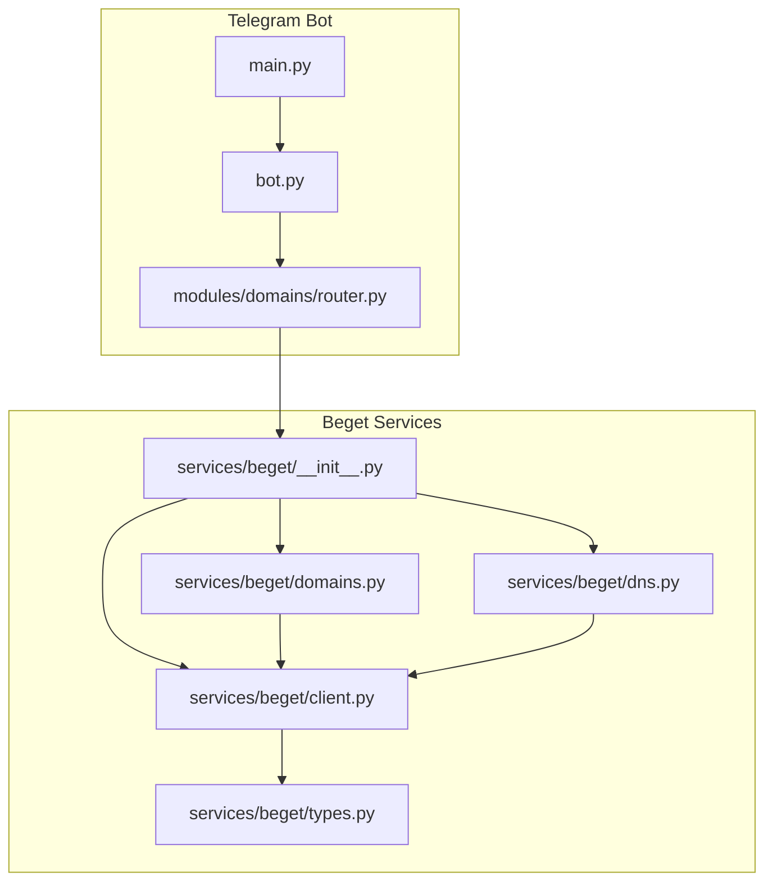
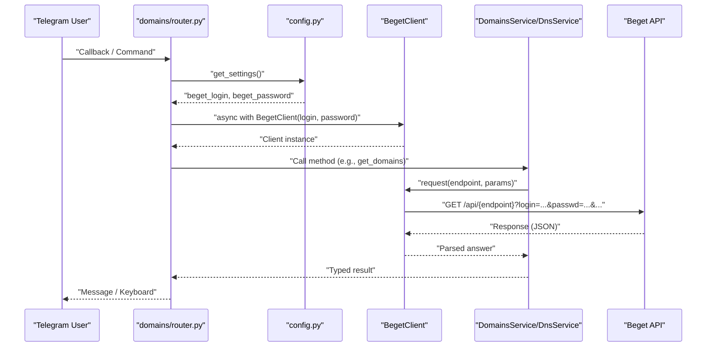
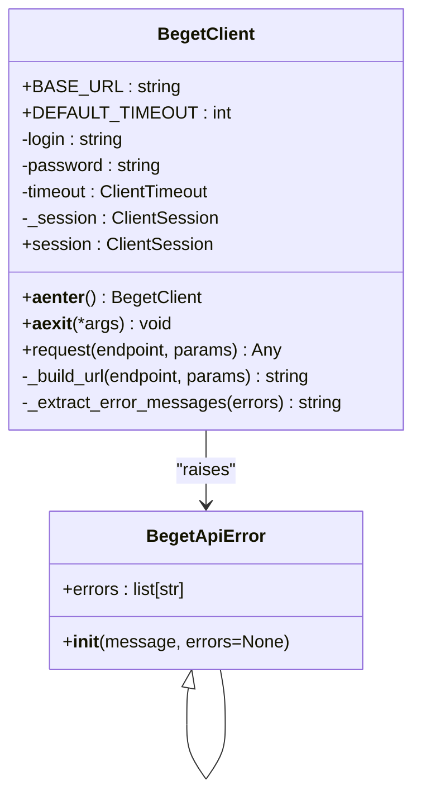
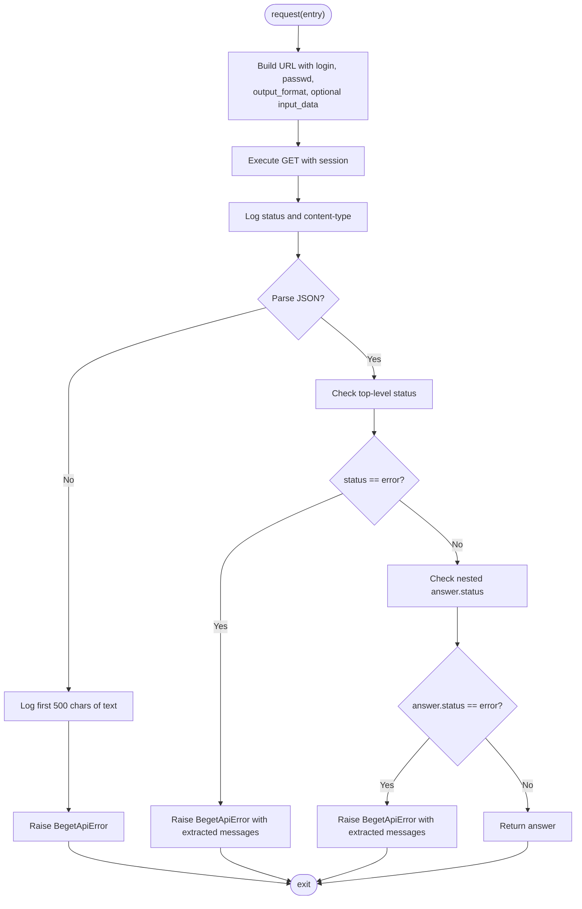
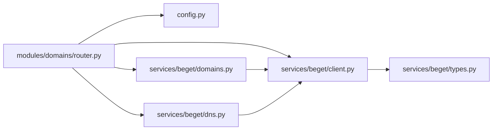

# Beget API Client

<cite>
**Referenced Files in This Document**
- [client.py](file://app/services/beget/client.py)
- [types.py](file://app/services/beget/types.py)
- [dns.py](file://app/services/beget/dns.py)
- [domains.py](file://app/services/beget/domains.py)
- [__init__.py](file://app/services/beget/__init__.py)
- [router.py](file://app/modules/domains/router.py)
- [bot.py](file://app/bot/bot.py)
- [config.py](file://app/config.py)
- [main.py](file://app/main.py)
</cite>

## Table of Contents
1. [Introduction](#introduction)
2. [Project Structure](#project-structure)
3. [Core Components](#core-components)
4. [Architecture Overview](#architecture-overview)
5. [Detailed Component Analysis](#detailed-component-analysis)
6. [Dependency Analysis](#dependency-analysis)
7. [Performance Considerations](#performance-considerations)
8. [Troubleshooting Guide](#troubleshooting-guide)
9. [Conclusion](#conclusion)

## Introduction
This document describes the Beget API Client implementation used by the Telegram bot to manage domains and DNS records on Beget hosting. It covers the client architecture, authentication, HTTP session handling, request/response processing, error handling, and practical usage patterns within the application.

## Project Structure
The Beget-related functionality resides under app/services/beget and is integrated into the Telegram bot modules under app/modules/domains. The client exposes a simple async interface for making Beget API calls and provides higher-level services for domains and DNS operations.

**Diagram sources**
- [bot.py](file://app/bot/bot.py#L1-L83)
- [main.py](file://app/main.py#L1-L30)
- [router.py](file://app/modules/domains/router.py#L1-L718)
- [__init__.py](file://app/services/beget/__init__.py#L1-L8)
- [client.py](file://app/services/beget/client.py#L1-L135)
- [types.py](file://app/services/beget/types.py#L1-L59)
- [domains.py](file://app/services/beget/domains.py#L1-L58)
- [dns.py](file://app/services/beget/dns.py#L1-L152)

**Section sources**
- [client.py](file://app/services/beget/client.py#L1-L135)
- [__init__.py](file://app/services/beget/__init__.py#L1-L8)
- [router.py](file://app/modules/domains/router.py#L1-L718)

## Core Components
- BegetClient: Async HTTP client that encapsulates authentication, URL building, request execution, and response parsing.
- BegetApiError: Custom exception type for API-related errors.
- DomainsService: Higher-level service for domain and subdomain operations.
- DnsService: Higher-level service for DNS record management.
- Types: Pydantic models representing API responses and data structures.

Key characteristics:
- Async context management via __aenter__/__aexit__ for automatic session lifecycle.
- Login/password authentication passed as URL parameters.
- JSON parsing fallback to handle non-JSON responses.
- Structured error extraction from API responses.

**Section sources**
- [client.py](file://app/services/beget/client.py#L13-L135)
- [types.py](file://app/services/beget/types.py#L1-L59)
- [domains.py](file://app/services/beget/domains.py#L1-L58)
- [dns.py](file://app/services/beget/dns.py#L1-L152)

## Architecture Overview
The client integrates with the Telegram bot’s domain management module. Handlers in the domains router create a temporary BegetClient instance per operation, call the appropriate service, and handle exceptions gracefully.

**Diagram sources**
- [router.py](file://app/modules/domains/router.py#L28-L52)
- [config.py](file://app/config.py#L37-L51)
- [client.py](file://app/services/beget/client.py#L70-L121)
- [domains.py](file://app/services/beget/domains.py#L13-L23)
- [dns.py](file://app/services/beget/dns.py#L14-L77)

## Detailed Component Analysis

### BegetClient
Responsibilities:
- Async context management for HTTP sessions.
- Authentication via login/password parameters.
- URL construction with parameter encoding and JSON serialization.
- Request execution with timeout handling.
- Response parsing with robust fallbacks and error extraction.

Implementation highlights:
- Session lifecycle: __aenter__ creates a ClientSession with configured timeout; __aexit__ closes it.
- URL building: Adds login, passwd, output_format, and optional input_format/input_data for JSON payloads.
- Request method: GET requests with logging of status, content-type, and raw response for debugging.
- Response parsing: Attempts JSON parsing regardless of Content-Type; raises BegetApiError on failure.
- Error handling: Checks top-level and nested "status" fields; extracts human-readable messages.

**Diagram sources**
- [client.py](file://app/services/beget/client.py#L13-L135)

**Section sources**
- [client.py](file://app/services/beget/client.py#L21-L135)

### Authentication and Security
- Authentication: Uses login and password as URL parameters. The client logs a masked URL for debugging while keeping credentials out of logs.
- Credential handling: Credentials are loaded from environment variables via Settings and passed to BegetClient during handler execution.
- Security considerations:
  - Avoid printing raw passwords in logs (masked URL is logged).
  - Use HTTPS base URL.
  - Prefer short-lived sessions via async context manager.

Integration points:
- Settings expose beget_login and beget_password.
- Handlers construct BegetClient inside async with blocks to ensure proper cleanup.

**Section sources**
- [client.py](file://app/services/beget/client.py#L27-L68)
- [config.py](file://app/config.py#L21-L23)
- [router.py](file://app/modules/domains/router.py#L34-L41)

### Request Method Implementation
Processing logic:
- Build URL with base parameters and optional JSON payload.
- Execute GET request with session.
- Log response metadata and raw body on JSON parse failure.
- Raise BegetApiError for timeouts and API errors.
- Extract answer from nested response structure.

**Diagram sources**
- [client.py](file://app/services/beget/client.py#L70-L121)

**Section sources**
- [client.py](file://app/services/beget/client.py#L70-L121)

### Error Handling Strategies
- BegetApiError: Carries a message and optional list of underlying error strings.
- Timeout handling: Catches asyncio.TimeoutError and raises BegetApiError with timeout message.
- JSON parsing fallback: On parse failure, logs first 500 characters of response body and raises BegetApiError with guidance.
- API error extraction: Parses nested error arrays and formats readable messages.

Practical usage:
- Handlers catch Exception and present user-friendly alerts.
- Services return typed data or empty collections when answer is missing.

**Section sources**
- [client.py](file://app/services/beget/client.py#L13-L19)
- [client.py](file://app/services/beget/client.py#L83-L121)
- [domains.py](file://app/services/beget/domains.py#L13-L23)
- [dns.py](file://app/services/beget/dns.py#L14-L77)

### DomainsService
Responsibilities:
- Retrieve domains and subdomains.
- Add/remove subdomains.
- Normalize nested API responses into typed models.

Key behaviors:
- Handles missing or empty answers by returning defaults.
- Filters subdomains by domain_id when the API returns a flat list.

**Section sources**
- [domains.py](file://app/services/beget/domains.py#L7-L58)

### DnsService
Responsibilities:
- Fetch DNS data and convert to typed DnsData.
- Modify DNS records by replacing entire sets of record types.
- Helper methods to add/update/delete A and TXT records with proper priority handling.

Key behaviors:
- Records are wrapped in a "records" container for change operations.
- Priority calculation ensures valid ordering for A/TXT records.
- Normalizes various record types into DnsRecord objects.

**Section sources**
- [dns.py](file://app/services/beget/dns.py#L8-L152)
- [types.py](file://app/services/beget/types.py#L28-L59)

### Type Definitions
Pydantic models:
- BegetResponse: Standardized response envelope with status, answer, and errors.
- Domain/Subdomain: Lightweight models for domain listings.
- DnsRecord: Single DNS record with value and priority.
- DnsData: Aggregated DNS data for a domain with lists of records by type.
- DnsChangeRequest: Payload for DNS record updates.

**Section sources**
- [types.py](file://app/services/beget/types.py#L6-L59)

## Dependency Analysis
- Router depends on Settings for credentials and on BegetClient/DomainsService/DnsService for operations.
- Services depend on BegetClient for HTTP calls.
- Client depends on aiohttp for HTTP and urllib.parse for URL encoding.
- Types are consumed by services for response modeling.

**Diagram sources**
- [router.py](file://app/modules/domains/router.py#L7-L20)
- [config.py](file://app/config.py#L37-L51)
- [client.py](file://app/services/beget/client.py#L1-L10)
- [domains.py](file://app/services/beget/domains.py#L3-L5)
- [dns.py](file://app/services/beget/dns.py#L3-L5)
- [types.py](file://app/services/beget/types.py#L3-L4)

**Section sources**
- [router.py](file://app/modules/domains/router.py#L1-L718)
- [client.py](file://app/services/beget/client.py#L1-L135)
- [domains.py](file://app/services/beget/domains.py#L1-L58)
- [dns.py](file://app/services/beget/dns.py#L1-L152)

## Performance Considerations
- Session reuse: The client uses a single aiohttp.ClientSession per async context, reducing overhead.
- Timeout tuning: DEFAULT_TIMEOUT is 15 seconds; adjust via constructor if needed.
- Minimal payload size: JSON payloads are compacted (no extra spaces) to reduce request size.
- Logging overhead: Debug logs include response bodies; disable debug logging in production.

[No sources needed since this section provides general guidance]

## Troubleshooting Guide
Common issues and resolutions:
- Invalid credentials: Ensure BEGET_LOGIN and BEGET_PASSWORD are set correctly in environment variables.
- Timeout errors: Increase timeout in BegetClient constructor or check network connectivity.
- Non-JSON responses: The client attempts JSON parsing regardless of Content-Type; check API endpoint correctness.
- API errors: Inspect BegetApiError.errors for detailed messages; verify endpoint names and parameters.
- Session lifecycle: Always use async with BegetClient(...) to ensure proper cleanup.

Operational checks:
- Verify settings loading via get_settings().
- Confirm router handlers wrap client usage in async with blocks.
- Monitor logs for masked URLs and error messages.

**Section sources**
- [config.py](file://app/config.py#L37-L51)
- [router.py](file://app/modules/domains/router.py#L34-L41)
- [client.py](file://app/services/beget/client.py#L118-L121)

## Conclusion
The Beget API Client provides a clean, async-first interface for interacting with Beget’s API. It handles authentication, URL construction, request/response processing, and error reporting in a structured way. The DomainsService and DnsService offer convenient abstractions for domain and DNS management, while the router demonstrates practical usage patterns with proper session lifecycle management and error handling.