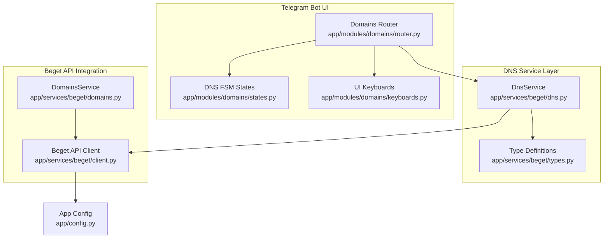
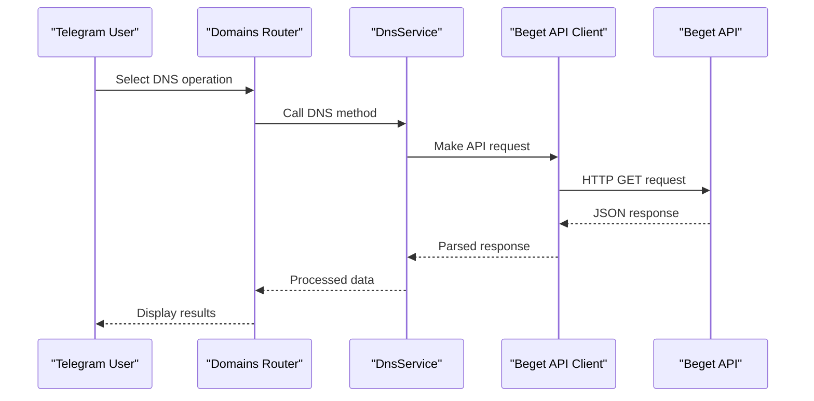
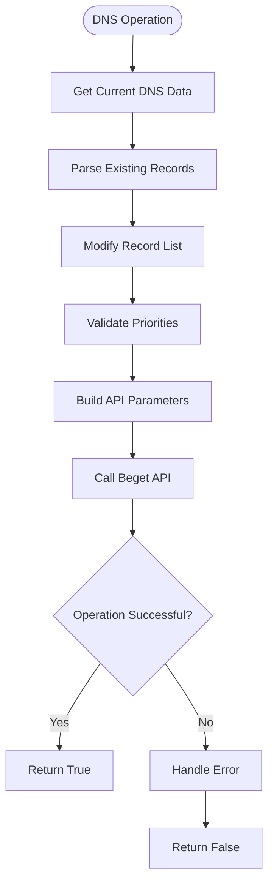
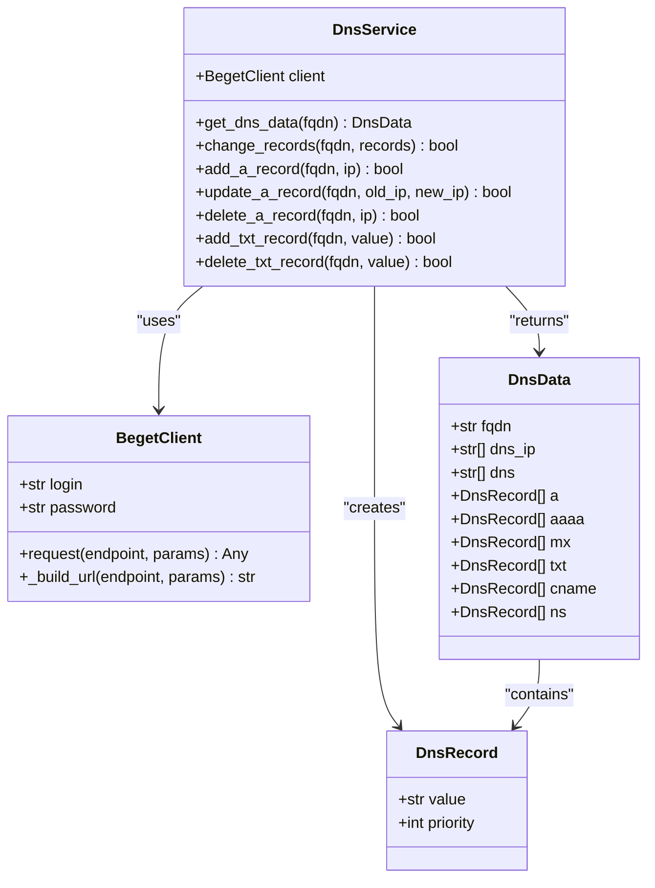

# DNS Service

<cite>
**Referenced Files in This Document**
- [dns.py](file://app/services/beget/dns.py)
- [client.py](file://app/services/beget/client.py)
- [types.py](file://app/services/beget/types.py)
- [domains.py](file://app/services/beget/domains.py)
- [router.py](file://app/modules/domains/router.py)
- [states.py](file://app/modules/domains/states.py)
- [keyboards.py](file://app/modules/domains/keyboards.py)
- [config.py](file://app/config.py)
- [__init__.py](file://app/services/beget/__init__.py)
- [README.md](file://README.md)
</cite>

## Table of Contents
1. [Introduction](#introduction)
2. [Project Structure](#project-structure)
3. [Core Components](#core-components)
4. [Architecture Overview](#architecture-overview)
5. [Detailed Component Analysis](#detailed-component-analysis)
6. [Dependency Analysis](#dependency-analysis)
7. [Performance Considerations](#performance-considerations)
8. [Troubleshooting Guide](#troubleshooting-guide)
9. [Conclusion](#conclusion)

## Introduction
This document provides comprehensive documentation for the DNS Service implementation that manages DNS records through the Beget API. The service supports A records, AAAA records, MX records, TXT records, CNAME records, and NS records. It integrates with the Beget API for DNS management, includes robust record validation logic, and processes API responses appropriately. The DNS service plays a central role in the domains module, enabling users to view, add, update, and delete DNS records for their domains via an intuitive Telegram bot interface.

## Project Structure
The DNS Service is part of the Beget API services and is integrated into the domains module. The key files involved in DNS management are:

- DNS Service implementation: app/services/beget/dns.py
- Beget API client: app/services/beget/client.py
- Type definitions: app/services/beget/types.py
- Domains service: app/services/beget/domains.py
- Domains module router: app/modules/domains/router.py
- FSM states for DNS operations: app/modules/domains/states.py
- Keyboard builders for UI: app/modules/domains/keyboards.py
- Application configuration: app/config.py
- Services package exports: app/services/beget/__init__.py
- Project overview: README.md

**Diagram sources**
- [router.py](file://app/modules/domains/router.py#L1-L718)
- [dns.py](file://app/services/beget/dns.py#L1-L152)
- [client.py](file://app/services/beget/client.py#L1-L135)
- [types.py](file://app/services/beget/types.py#L1-L59)
- [domains.py](file://app/services/beget/domains.py#L1-L58)
- [states.py](file://app/modules/domains/states.py#L1-L21)
- [keyboards.py](file://app/modules/domains/keyboards.py#L1-L196)
- [config.py](file://app/config.py#L1-L52)

**Section sources**
- [dns.py](file://app/services/beget/dns.py#L1-L152)
- [client.py](file://app/services/beget/client.py#L1-L135)
- [types.py](file://app/services/beget/types.py#L1-L59)
- [domains.py](file://app/services/beget/domains.py#L1-L58)
- [router.py](file://app/modules/domains/router.py#L1-L718)
- [states.py](file://app/modules/domains/states.py#L1-L21)
- [keyboards.py](file://app/modules/domains/keyboards.py#L1-L196)
- [config.py](file://app/config.py#L1-L52)
- [README.md](file://README.md#L1-L321)

## Core Components
The DNS Service consists of several core components that work together to provide comprehensive DNS management functionality:

### DnsService
The primary service responsible for DNS record operations. It handles:
- Retrieving DNS data for domains
- Adding, updating, and deleting various record types
- Managing record priorities and validation
- Integrating with the Beget API client

### Beget API Client
Provides HTTP communication with the Beget API, including:
- Authentication and request building
- Error handling and response processing
- Timeout management and logging

### Type Definitions
Defines the data structures used throughout the DNS service:
- DnsRecord: Base record structure with value and priority
- DnsData: Complete DNS data container for a domain
- DnsChangeRequest: Request structure for DNS modifications

### Domains Module Integration
The DNS service is tightly integrated with the domains module through:
- Router callbacks for DNS operations
- FSM states for user interaction flows
- Keyboard builders for UI navigation

**Section sources**
- [dns.py](file://app/services/beget/dns.py#L8-L152)
- [client.py](file://app/services/beget/client.py#L21-L135)
- [types.py](file://app/services/beget/types.py#L28-L59)
- [router.py](file://app/modules/domains/router.py#L343-L718)

## Architecture Overview
The DNS Service follows a layered architecture with clear separation of concerns:

**Diagram sources**
- [router.py](file://app/modules/domains/router.py#L358-L421)
- [dns.py](file://app/services/beget/dns.py#L14-L98)
- [client.py](file://app/services/beget/client.py#L70-L117)

The architecture ensures that:
- The router handles user interactions and orchestrates operations
- The DnsService encapsulates business logic and API integration
- The client manages low-level HTTP communication
- Type definitions provide consistent data structures

## Detailed Component Analysis

### DnsService Implementation
The DnsService provides comprehensive DNS record management capabilities:

#### DNS Data Retrieval
The service retrieves DNS data through the `get_dns_data` method, which:
- Calls the Beget API endpoint for DNS data
- Handles nested response structures
- Parses various record types into standardized DnsRecord objects
- Supports A, AAAA, MX, TXT, CNAME, and NS records

#### Record Operations
The service implements specific methods for each record type:

##### A Record Operations
- `add_a_record`: Adds new A records with automatic priority assignment
- `update_a_record`: Updates existing A record IP addresses
- `delete_a_record`: Removes specific A records while maintaining order

##### TXT Record Operations
- `add_txt_record`: Adds TXT records with priority management
- `delete_txt_record`: Removes specific TXT records

#### Priority Management
The service implements intelligent priority management:
- Automatic priority calculation based on record count
- Minimum priority enforcement (≥ 10)
- Consistent ordering for record operations

**Diagram sources**
- [dns.py](file://app/services/beget/dns.py#L101-L151)

**Section sources**
- [dns.py](file://app/services/beget/dns.py#L14-L151)

### Beget API Client
The client provides robust HTTP communication with the Beget API:

#### Authentication and Request Building
- Uses login/password authentication
- Builds URLs with proper encoding
- Supports JSON input format for API requests
- Implements request masking for security

#### Error Handling
- Comprehensive error extraction from API responses
- Custom exception types for different error scenarios
- Detailed logging for debugging and monitoring
- Timeout handling for network issues

#### Response Processing
- Handles various response formats from the API
- Extracts nested error information
- Provides structured data for higher-level services

**Section sources**
- [client.py](file://app/services/beget/client.py#L21-L135)

### Type System
The type definitions ensure data consistency and validation:

#### DnsRecord Model
- Standardized structure for all record types
- Priority field for record ordering
- Value field for record content

#### DnsData Model
- Complete DNS data container
- Support for all supported record types
- FQDN identification field

#### DnsChangeRequest Model
- Request structure for DNS modifications
- Optional fields for selective updates

**Section sources**
- [types.py](file://app/services/beget/types.py#L28-L59)

### Domains Module Integration
The DNS service integrates seamlessly with the domains module:

#### Router Integration
- DNS menu navigation through callback queries
- Record listing and management interfaces
- User interaction flows for DNS operations

#### State Management
- FSM states for collecting user input
- Data persistence during multi-step operations
- Validation of user-provided data

#### UI Components
- Keyboard builders for navigation
- Confirmation dialogs for destructive operations
- Display formatting for different record types

**Section sources**
- [router.py](file://app/modules/domains/router.py#L343-L718)
- [states.py](file://app/modules/domains/states.py#L14-L21)
- [keyboards.py](file://app/modules/domains/keyboards.py#L105-L196)

## Dependency Analysis
The DNS Service has well-defined dependencies that support maintainable architecture:

**Diagram sources**
- [dns.py](file://app/services/beget/dns.py#L8-L152)
- [client.py](file://app/services/beget/client.py#L21-L49)
- [types.py](file://app/services/beget/types.py#L28-L59)

### External Dependencies
The service relies on several external libraries:
- aiohttp for asynchronous HTTP communication
- pydantic for data validation and serialization
- aiogram for Telegram bot framework integration

### Internal Dependencies
- Configuration management through Settings class
- Type definitions shared across services
- Router integration for user interactions

**Section sources**
- [dns.py](file://app/services/beget/dns.py#L1-L8)
- [client.py](file://app/services/beget/client.py#L1-L10)
- [types.py](file://app/services/beget/types.py#L1-L4)
- [config.py](file://app/config.py#L8-L35)

## Performance Considerations
The DNS Service is designed with performance and reliability in mind:

### Asynchronous Operations
- All API calls use async/await patterns
- Non-blocking operations prevent UI blocking
- Efficient concurrent request handling

### Data Validation
- Input validation prevents unnecessary API calls
- Priority calculations optimize record ordering
- Minimal data transformation reduces overhead

### Error Handling
- Early validation reduces API load
- Comprehensive error messages aid debugging
- Graceful degradation for partial failures

## Troubleshooting Guide

### Common DNS Operation Issues
- **Invalid IP addresses**: The service validates IPv4 format before API calls
- **Record conflicts**: Priority management prevents duplicate entries
- **API rate limiting**: The client handles timeouts and retry scenarios

### Error Scenarios and Resolution
- **Authentication failures**: Verify Beget credentials in environment variables
- **Network timeouts**: Check API connectivity and timeout settings
- **Invalid record formats**: Ensure proper TXT record formatting and A record IP validation

### Debugging Strategies
- Enable debug logging to inspect API requests and responses
- Monitor response times and error rates
- Validate data structures using type definitions

**Section sources**
- [client.py](file://app/services/beget/client.py#L118-L135)
- [router.py](file://app/modules/domains/router.py#L484-L488)
- [router.py](file://app/modules/domains/router.py#L526-L530)

## Conclusion
The DNS Service provides a comprehensive solution for managing DNS records through the Beget API. Its layered architecture ensures maintainability while providing robust functionality for A, AAAA, MX, TXT, CNAME, and NS record management. The integration with the domains module creates a seamless user experience through the Telegram bot interface. The service's emphasis on validation, error handling, and performance makes it suitable for production use in managing domain DNS configurations.

Key strengths of the implementation include:
- Clear separation of concerns between UI, business logic, and API integration
- Comprehensive error handling and logging
- Robust data validation and type safety
- Extensible design supporting additional record types
- User-friendly interface through the Telegram bot

The service successfully fulfills its role in supporting the domains module and contributes significantly to the overall DNS management functionality of the Beget Manager Bot.