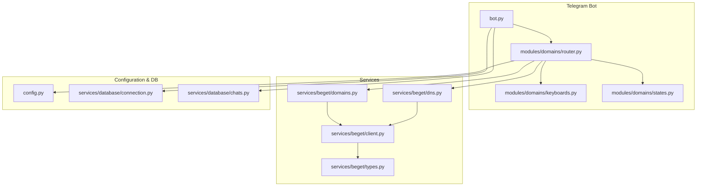
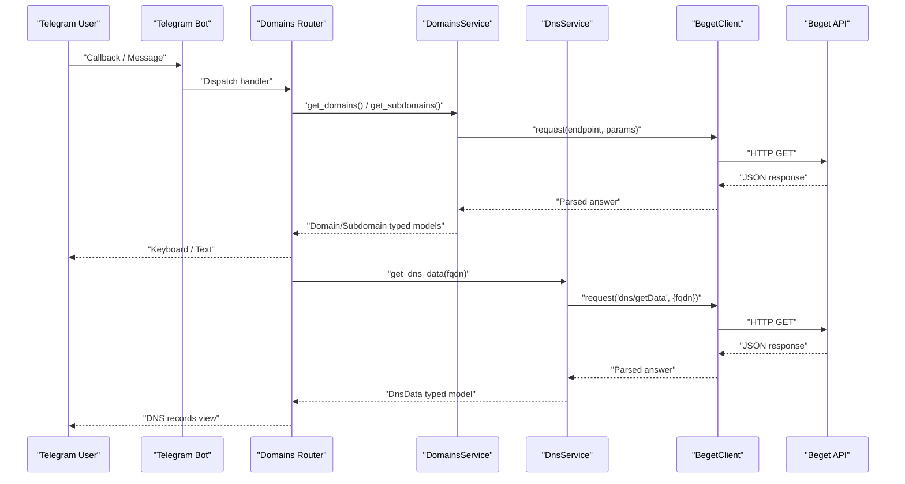
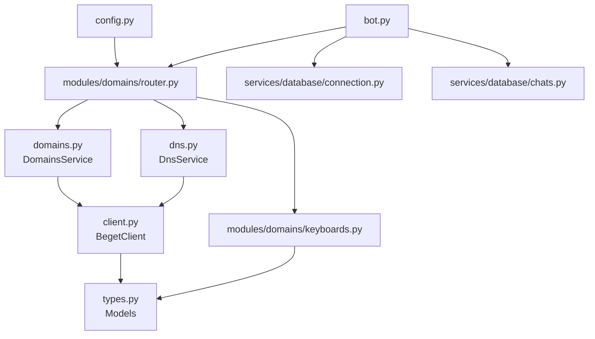

# Data Types and Models

<cite>
**Referenced Files in This Document**
- [types.py](file://app/services/beget/types.py)
- [dns.py](file://app/services/beget/dns.py)
- [domains.py](file://app/services/beget/domains.py)
- [client.py](file://app/services/beget/client.py)
- [router.py](file://app/modules/domains/router.py)
- [keyboards.py](file://app/modules/domains/keyboards.py)
- [states.py](file://app/modules/domains/states.py)
- [bot.py](file://app/bot/bot.py)
- [config.py](file://app/config.py)
- [connection.py](file://app/services/database/connection.py)
- [chats.py](file://app/services/database/chats.py)
- [main.py](file://app/main.py)
</cite>

## Table of Contents
1. [Introduction](#introduction)
2. [Project Structure](#project-structure)
3. [Core Components](#core-components)
4. [Architecture Overview](#architecture-overview)
5. [Detailed Component Analysis](#detailed-component-analysis)
6. [Dependency Analysis](#dependency-analysis)
7. [Performance Considerations](#performance-considerations)
8. [Troubleshooting Guide](#troubleshooting-guide)
9. [Conclusion](#conclusion)

## Introduction
This document describes the data types and models used in the Beget service layer of the application. It focuses on Pydantic models for API responses, domain representations, DNS record structures, and error handling objects. It explains type definitions for different record types (A, TXT, MX, CNAME, NS), domain metadata structures, and authentication models. It also documents validation rules, serialization patterns, and data transformation logic, and explains how data flows from the Beget API through the service layer to the Telegram bot interface. Type safety considerations and error handling patterns for malformed API responses are addressed.

## Project Structure
The project is organized around a Telegram bot that interacts with the Beget API via dedicated service modules. The service layer defines Pydantic models for typed data exchange and encapsulates API interactions and transformations. The Telegram bot routes user actions to handlers that orchestrate service calls and present results.

**Diagram sources**
- [bot.py](file://app/bot/bot.py#L18-L83)
- [router.py](file://app/modules/domains/router.py#L1-L718)
- [keyboards.py](file://app/modules/domains/keyboards.py#L1-L196)
- [states.py](file://app/modules/domains/states.py#L1-L21)
- [client.py](file://app/services/beget/client.py#L21-L135)
- [types.py](file://app/services/beget/types.py#L1-L59)
- [domains.py](file://app/services/beget/domains.py#L7-L58)
- [dns.py](file://app/services/beget/dns.py#L8-L152)
- [config.py](file://app/config.py#L8-L52)
- [connection.py](file://app/services/database/connection.py#L7-L59)
- [chats.py](file://app/services/database/chats.py#L9-L79)

**Section sources**
- [bot.py](file://app/bot/bot.py#L18-L83)
- [router.py](file://app/modules/domains/router.py#L1-L718)
- [client.py](file://app/services/beget/client.py#L21-L135)
- [types.py](file://app/services/beget/types.py#L1-L59)
- [domains.py](file://app/services/beget/domains.py#L7-L58)
- [dns.py](file://app/services/beget/dns.py#L8-L152)
- [config.py](file://app/config.py#L8-L52)
- [connection.py](file://app/services/database/connection.py#L7-L59)
- [chats.py](file://app/services/database/chats.py#L9-L79)

## Core Components
This section outlines the primary data models and their roles in the system.

- Beget API response envelope
  - A base response wrapper that captures status, answer payload, and errors.
  - Used to normalize Beget API responses and detect errors consistently.

- Domain and Subdomain models
  - Lightweight typed models representing domain identifiers and FQDNs.
  - Used by domain management services and rendered in Telegram keyboards.

- DNS record model
  - Typed representation of a single DNS record with value and priority.
  - Provides a uniform structure for all record types.

- DNS data model
  - Aggregates DNS-related information for a domain, including lists of records per type and nameserver lists.
  - Serves as the canonical internal representation of DNS data.

- DNS change request model
  - Defines the shape of requests to update DNS records.
  - Encapsulates the expected structure for record updates.

Key characteristics:
- Strong typing via Pydantic ensures runtime validation and serialization correctness.
- Default values and optional fields support graceful handling of missing data.
- Transformation logic converts Beget API structures into these typed models.

**Section sources**
- [types.py](file://app/services/beget/types.py#L6-L59)

## Architecture Overview
The data flow begins with user interactions in the Telegram bot, which trigger handlers in the domains router. Handlers call service methods that communicate with the Beget API via the HTTP client. Responses are parsed and transformed into typed models, then presented back to the user through keyboards and messages.

**Diagram sources**
- [router.py](file://app/modules/domains/router.py#L28-L52)
- [domains.py](file://app/services/beget/domains.py#L13-L41)
- [dns.py](file://app/services/beget/dns.py#L14-L77)
- [client.py](file://app/services/beget/client.py#L70-L117)

## Detailed Component Analysis

### Beget API Client and Error Handling
The client encapsulates HTTP communication with the Beget API, building URLs with authentication and input parameters, and parsing responses. It raises a dedicated error type when API-level errors occur or when JSON parsing fails.

Key behaviors:
- Authentication and URL construction with masked password logging for debugging.
- Robust JSON parsing regardless of Content-Type.
- Error detection at two levels: top-level status and nested answer status.
- Timeout handling with a descriptive error.

Type safety and validation:
- Uses Pydantic models for typed responses.
- Extracts human-readable error messages from API error arrays.

Error handling patterns:
- Converts malformed responses into a structured error with actionable guidance.
- Propagates API errors with original error codes/text.

**Section sources**
- [client.py](file://app/services/beget/client.py#L21-L135)

### Domain and Subdomain Models and Services
Domain and Subdomain are simple Pydantic models carrying identifiers and FQDNs. The DomainsService retrieves domain lists and subdomains, filters subdomains by domain ID, and performs add/delete operations.

Transformation logic:
- Normalizes nested API responses into typed lists of models.
- Filters subdomains server-side by domain_id because the API does not accept parameters for subdomain listing.

Validation rules:
- Ensures non-empty results before constructing models.
- Validates callback data and extracts domain identifiers safely.

**Section sources**
- [types.py](file://app/services/beget/types.py#L14-L26)
- [domains.py](file://app/services/beget/domains.py#L13-L58)

### DNS Record Models and Services
DnsRecord represents a single DNS record with value and priority. DnsData aggregates per-type record lists and nameserver lists. DnsService transforms Beget API responses into DnsData and provides operations to manage records.

Record type mappings and transformations:
- A: Maps address field to value; sets default priority.
- AAAA: Similar mapping to A.
- MX: Maps exchange to value (normalized by removing trailing dot); preserves preference as priority.
- TXT: Maps txtdata to value.
- CNAME: Maps cname to value (normalized by removing trailing dot).
- NS: Maps nsdname or value to value.
- DNS/DNS_IP: Extracts raw values into separate lists.

Change operations:
- changeRecords expects a records wrapper keyed by type.
- add_* and delete_* operations rebuild record lists with proper priorities.
- update_a_record preserves order and priority semantics.

Validation and normalization:
- Removes trailing dots from MX/CNAME values.
- Enforces minimum priority thresholds and increments by tens for ordering.

**Section sources**
- [types.py](file://app/services/beget/types.py#L28-L59)
- [dns.py](file://app/services/beget/dns.py#L14-L152)

### Telegram Bot Integration and Data Presentation
The bot initializes settings, middleware, and routers. The domains router orchestrates domain and DNS operations, invoking services and rendering results via keyboards. The keyboards module constructs interactive menus using typed models.

Data flow through the bot:
- Handlers call services within a Beget client context.
- Results are formatted into user-friendly messages and keyboards.
- State machines capture intermediate user inputs for multi-step operations.

Type safety in presentation:
- Keyboards accept typed models (Domain, Subdomain, DnsRecord) to build callback data and display text.
- Keyboard builders enforce consistent button layouts and callback data formats.

**Section sources**
- [bot.py](file://app/bot/bot.py#L18-L83)
- [router.py](file://app/modules/domains/router.py#L28-L718)
- [keyboards.py](file://app/modules/domains/keyboards.py#L9-L196)
- [states.py](file://app/modules/domains/states.py#L6-L21)

### Configuration and Database Models
Configuration loads environment variables into a typed Settings model, exposing credentials and paths. The database layer manages SQLite connections and schema initialization, while the chats repository provides typed entities for allowed chats.

Type safety:
- Settings uses Pydantic settings with environment-driven validation.
- Database entities use dataclasses for immutable records.

**Section sources**
- [config.py](file://app/config.py#L8-L52)
- [connection.py](file://app/services/database/connection.py#L7-L59)
- [chats.py](file://app/services/database/chats.py#L9-L79)

## Dependency Analysis
The following diagram shows how modules depend on each other and how typed models flow through the system.

**Diagram sources**
- [client.py](file://app/services/beget/client.py#L21-L135)
- [types.py](file://app/services/beget/types.py#L1-L59)
- [domains.py](file://app/services/beget/domains.py#L7-L58)
- [dns.py](file://app/services/beget/dns.py#L8-L152)
- [router.py](file://app/modules/domains/router.py#L1-L718)
- [keyboards.py](file://app/modules/domains/keyboards.py#L1-L196)
- [bot.py](file://app/bot/bot.py#L18-L83)
- [connection.py](file://app/services/database/connection.py#L7-L59)
- [chats.py](file://app/services/database/chats.py#L9-L79)
- [config.py](file://app/config.py#L8-L52)

**Section sources**
- [client.py](file://app/services/beget/client.py#L21-L135)
- [types.py](file://app/services/beget/types.py#L1-L59)
- [domains.py](file://app/services/beget/domains.py#L7-L58)
- [dns.py](file://app/services/beget/dns.py#L8-L152)
- [router.py](file://app/modules/domains/router.py#L1-L718)
- [keyboards.py](file://app/modules/domains/keyboards.py#L1-L196)
- [bot.py](file://app/bot/bot.py#L18-L83)
- [connection.py](file://app/services/database/connection.py#L7-L59)
- [chats.py](file://app/services/database/chats.py#L9-L79)
- [config.py](file://app/config.py#L8-L52)

## Performance Considerations
- Asynchronous I/O: The client uses aiohttp for non-blocking HTTP calls, and services operate asynchronously, minimizing latency in bot interactions.
- Minimal parsing overhead: Typed models enable fast validation and serialization; transformation logic avoids unnecessary copies.
- Batch operations: DNS change operations send full record sets, which reduces API round-trips but increases payload size. Consider incremental updates if needed.
- Caching: No explicit caching is implemented; consider memoizing domain/subdomain lists if repeated access is frequent.

## Troubleshooting Guide
Common issues and resolutions:
- Invalid API response or JSON parsing errors
  - Symptom: JSON parsing failure logs and a structured error raised by the client.
  - Resolution: Verify API credentials and ensure the endpoint returns JSON despite content-type.
  - Reference: [client.py](file://app/services/beget/client.py#L83-L95)

- API-level errors
  - Symptom: Top-level or nested answer status equals error.
  - Resolution: Inspect extracted error messages and adjust parameters accordingly.
  - Reference: [client.py](file://app/services/beget/client.py#L97-L115)

- Malformed DNS responses
  - Symptom: Missing keys or unexpected shapes in records.
  - Resolution: The service gracefully handles missing or empty results by returning default-initialized models.
  - Reference: [dns.py](file://app/services/beget/dns.py#L16-L25)

- Timeout errors
  - Symptom: Request timeout during API calls.
  - Resolution: Increase timeout or retry with exponential backoff.
  - Reference: [client.py](file://app/services/beget/client.py#L118-L120)

- State machine transitions
  - Symptom: Incorrect state handling in multi-step flows.
  - Resolution: Ensure state updates occur before prompts and clear state after completion.
  - Reference: [router.py](file://app/modules/domains/router.py#L153-L200), [states.py](file://app/modules/domains/states.py#L6-L21)

## Conclusion
The Beget service layer employs Pydantic models to ensure type safety and predictable data transformation across the application. The client normalizes API responses and surfaces errors clearly, while services convert raw API structures into domain-specific models. The Telegram bot integrates these services to deliver a user-friendly interface for domain and DNS management. Adhering to the documented validation rules and error handling patterns ensures robust operation even with varying API responses.