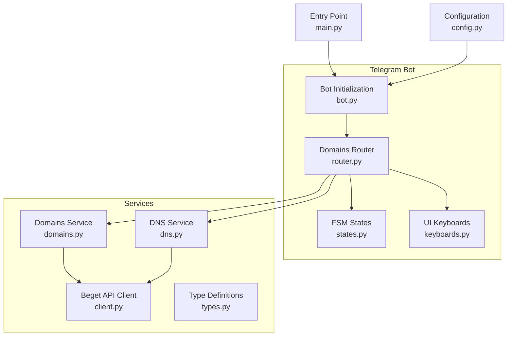
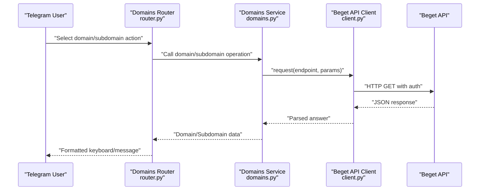
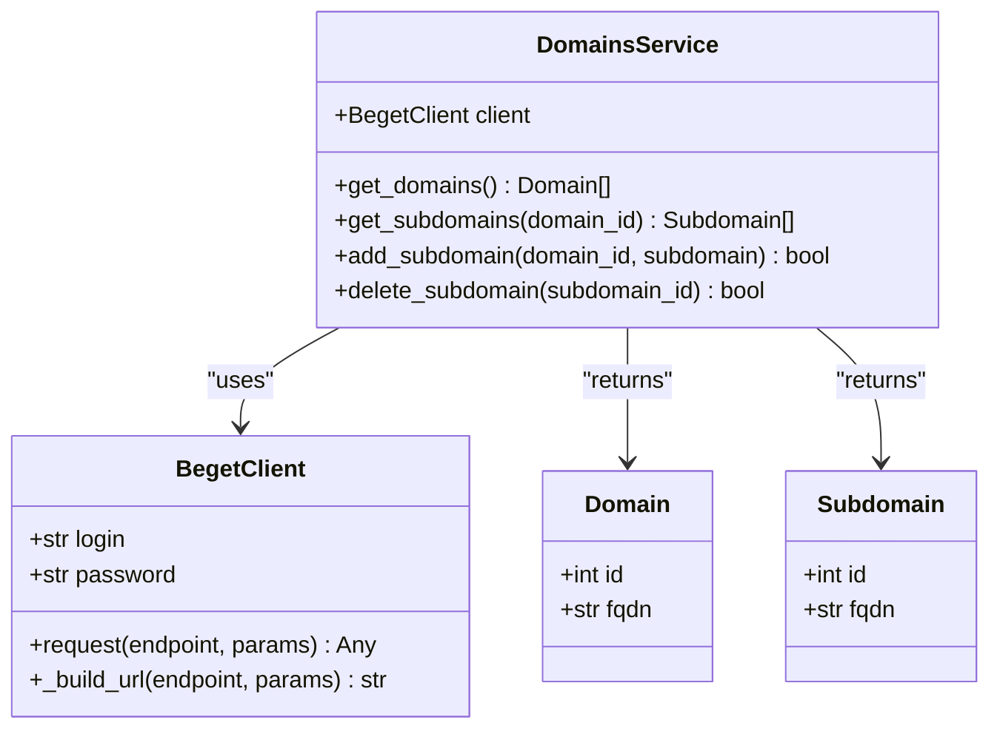
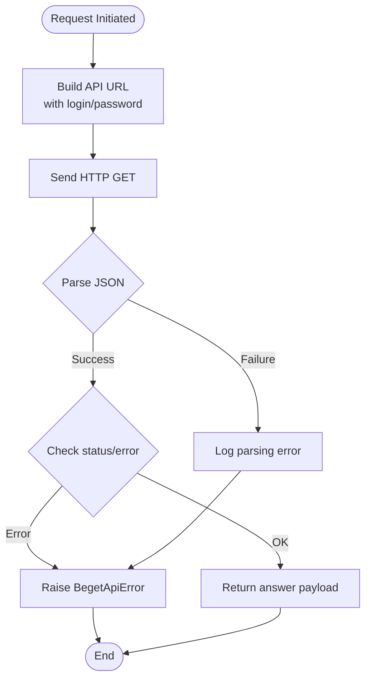
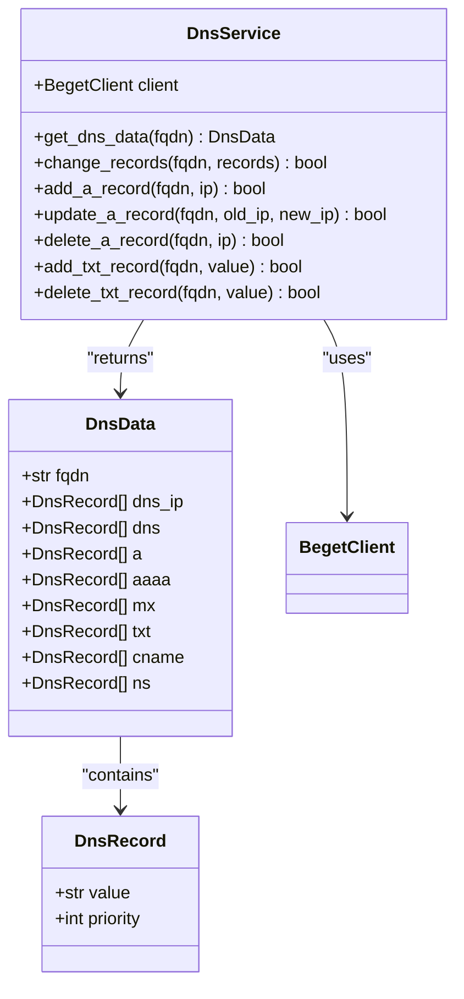
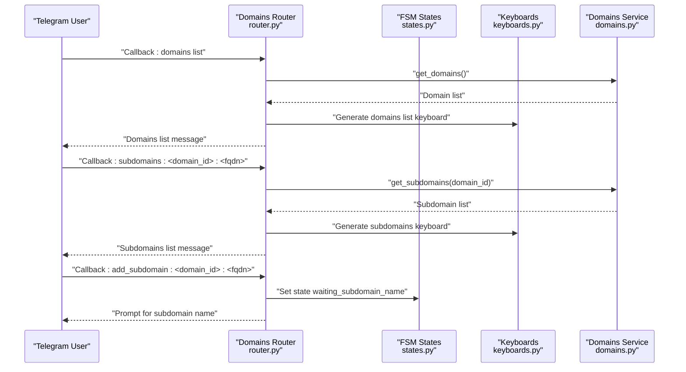
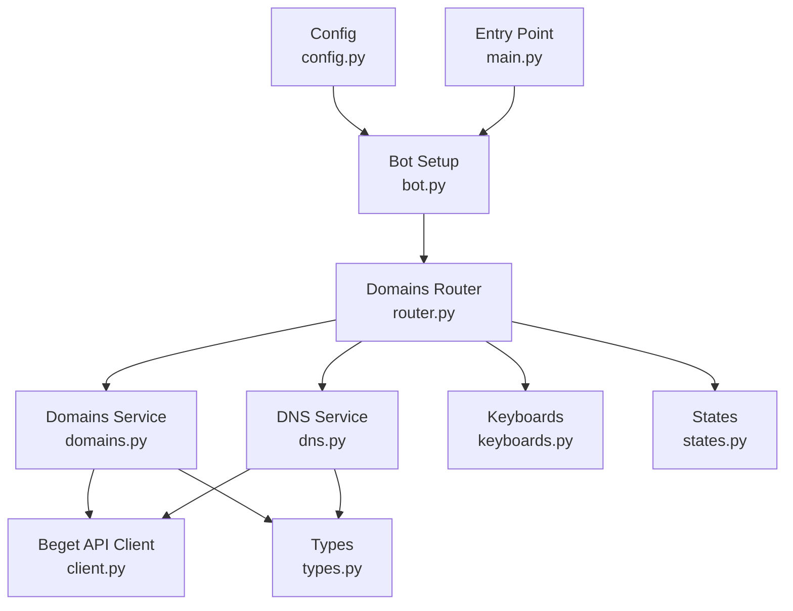

# Domains Service

<cite>
**Referenced Files in This Document**
- [domains.py](file://app/services/beget/domains.py)
- [client.py](file://app/services/beget/client.py)
- [types.py](file://app/services/beget/types.py)
- [dns.py](file://app/services/beget/dns.py)
- [router.py](file://app/modules/domains/router.py)
- [states.py](file://app/modules/domains/states.py)
- [keyboards.py](file://app/modules/domains/keyboards.py)
- [bot.py](file://app/bot/bot.py)
- [config.py](file://app/config.py)
- [main.py](file://app/main.py)
</cite>

## Table of Contents
1. [Introduction](#introduction)
2. [Project Structure](#project-structure)
3. [Core Components](#core-components)
4. [Architecture Overview](#architecture-overview)
5. [Detailed Component Analysis](#detailed-component-analysis)
6. [Dependency Analysis](#dependency-analysis)
7. [Performance Considerations](#performance-considerations)
8. [Troubleshooting Guide](#troubleshooting-guide)
9. [Conclusion](#conclusion)

## Introduction
This document provides comprehensive documentation for the Domains Service implementation within the Beget Manager Telegram bot. The Domains Service manages domain-related operations including listing domains, inspecting domain details, and managing subdomains. It integrates with the Beget API client to perform CRUD operations against the Beget hosting platform and formats responses for Telegram bot consumption through structured keyboards and state machines.

The service is part of a modular Telegram bot built with aiogram 3, featuring:
- Domain listing and selection
- Subdomain creation and deletion
- DNS record management (A and TXT records)
- Access control and activity logging
- Asynchronous API communication with Beget

## Project Structure
The Domains Service resides within the Beget service layer and is orchestrated by the domains module. The structure emphasizes separation of concerns:
- Services: Beget API client, Domains Service, DNS Service
- Modules: Telegram bot handlers and UI (keyboards, states)
- Configuration: Environment-driven settings
- Application entry point: Bot setup and routing

**Diagram sources**
- [bot.py](file://app/bot/bot.py#L18-L82)
- [router.py](file://app/modules/domains/router.py#L1-L718)
- [domains.py](file://app/services/beget/domains.py#L1-L58)
- [dns.py](file://app/services/beget/dns.py#L1-L152)
- [client.py](file://app/services/beget/client.py#L1-L135)
- [types.py](file://app/services/beget/types.py#L1-L59)
- [config.py](file://app/config.py#L1-L52)
- [main.py](file://app/main.py#L1-L30)

**Section sources**
- [bot.py](file://app/bot/bot.py#L1-L83)
- [router.py](file://app/modules/domains/router.py#L1-L718)
- [domains.py](file://app/services/beget/domains.py#L1-L58)
- [dns.py](file://app/services/beget/dns.py#L1-L152)
- [client.py](file://app/services/beget/client.py#L1-L135)
- [types.py](file://app/services/beget/types.py#L1-L59)
- [config.py](file://app/config.py#L1-L52)
- [main.py](file://app/main.py#L1-L30)

## Core Components
This section outlines the primary components involved in domain management and their responsibilities.

- Domains Service: Provides domain and subdomain operations by delegating to the Beget API client. It handles domain enumeration, subdomain filtering, and subdomain lifecycle operations.
- Beget API Client: Encapsulates HTTP requests to the Beget API, including authentication, URL construction, response parsing, and error handling.
- DNS Service: Manages DNS records for domains, including fetching, updating, and deleting A and TXT records.
- Telegram Router: Orchestrates user interactions for domains and subdomains, including navigation, validation, and confirmation flows.
- FSM States: Maintains conversational state for subdomain creation and DNS record modifications.
- Type Definitions: Defines Pydantic models for domain, subdomain, DNS record, and DNS data structures.

Key responsibilities:
- Domain listing: Retrieves all domains associated with the Beget account.
- Subdomain management: Lists subdomains for a selected domain, creates new virtual subdomains, and deletes existing ones.
- DNS record management: Integrates with DNS Service to view and modify A and TXT records.
- Validation and formatting: Validates user input for subdomain names and formats responses for Telegram keyboards.

**Section sources**
- [domains.py](file://app/services/beget/domains.py#L7-L58)
- [client.py](file://app/services/beget/client.py#L21-L135)
- [dns.py](file://app/services/beget/dns.py#L8-L152)
- [router.py](file://app/modules/domains/router.py#L25-L718)
- [states.py](file://app/modules/domains/states.py#L1-L21)
- [types.py](file://app/services/beget/types.py#L6-L59)

## Architecture Overview
The Domains Service operates within an asynchronous Telegram bot architecture. The flow begins with user interactions handled by the domains router, which delegates to the Domains Service and Beget API client. Responses are formatted using keyboards and state machines for Telegram consumption.

**Diagram sources**
- [router.py](file://app/modules/domains/router.py#L28-L52)
- [domains.py](file://app/services/beget/domains.py#L13-L57)
- [client.py](file://app/services/beget/client.py#L70-L117)

## Detailed Component Analysis

### Domains Service
The Domains Service encapsulates domain and subdomain operations, interacting with the Beget API client to retrieve and manipulate domain resources.

Key methods and behaviors:
- get_domains: Calls the Beget API endpoint to list domains and maps raw API responses to Domain objects.
- get_subdomains: Retrieves all subdomains and filters them by domain_id to return subdomains belonging to the selected domain.
- add_subdomain: Creates a virtual subdomain for the given domain using the Beget API endpoint.
- delete_subdomain: Removes a subdomain by its identifier.

Response handling:
- Normalizes nested API responses by extracting the "result" field when present.
- Returns empty lists when no data is available.
- Uses Domain and Subdomain Pydantic models for type safety.

**Diagram sources**
- [domains.py](file://app/services/beget/domains.py#L7-L58)
- [client.py](file://app/services/beget/client.py#L21-L135)
- [types.py](file://app/services/beget/types.py#L14-L26)

**Section sources**
- [domains.py](file://app/services/beget/domains.py#L7-L58)
- [types.py](file://app/services/beget/types.py#L14-L26)

### Beget API Client
The Beget API Client manages HTTP communication with the Beget API, including authentication, request building, response parsing, and error handling.

Key capabilities:
- Authentication: Embeds login and password in request parameters.
- URL construction: Builds URLs with proper encoding and input format.
- Response parsing: Attempts JSON parsing regardless of Content-Type.
- Error handling: Detects top-level and nested API errors and raises BegetApiError with extracted messages.

**Diagram sources**
- [client.py](file://app/services/beget/client.py#L51-L135)

**Section sources**
- [client.py](file://app/services/beget/client.py#L21-L135)

### DNS Service
The DNS Service complements the Domains Service by managing DNS records for domains, enabling viewing and modification of A and TXT records.

Key operations:
- get_dns_data: Parses DNS records from the API response and constructs DnsData with normalized record types.
- change_records: Sends a complete replacement of records for a domain.
- A record operations: add_a_record, update_a_record, delete_a_record handle priority ordering and record updates.
- TXT record operations: add_txt_record, delete_txt_record manage TXT record lists.

**Diagram sources**
- [dns.py](file://app/services/beget/dns.py#L8-L152)
- [types.py](file://app/services/beget/types.py#L28-L59)

**Section sources**
- [dns.py](file://app/services/beget/dns.py#L8-L152)
- [types.py](file://app/services/beget/types.py#L28-L59)

### Telegram Router and UI Integration
The domains router orchestrates user interactions for domains and subdomains, integrating with FSM states and keyboards for a seamless Telegram experience.

Key flows:
- Domain listing: Displays a keyboard with selectable domains and navigates to domain menus.
- Subdomain listing: Filters and displays subdomains for a selected domain with action buttons.
- Subdomain creation: Uses FSM states to collect and validate subdomain names, then confirms creation.
- Subdomain deletion: Confirms deletion and refreshes the subdomains list.

Validation and formatting:
- Subdomain name validation enforces lowercase letters, digits, and hyphens, disallowing spaces and special characters.
- DNS record views truncate long TXT values for readability.
- Confirmation keyboards provide explicit confirm/cancel options for destructive actions.

**Diagram sources**
- [router.py](file://app/modules/domains/router.py#L28-L341)
- [states.py](file://app/modules/domains/states.py#L6-L21)
- [keyboards.py](file://app/modules/domains/keyboards.py#L9-L196)

**Section sources**
- [router.py](file://app/modules/domains/router.py#L25-L718)
- [states.py](file://app/modules/domains/states.py#L1-L21)
- [keyboards.py](file://app/modules/domains/keyboards.py#L1-L196)

### Domain CRUD Operations
The Domains Service supports the following CRUD operations:

- Retrieve domain information:
  - Method: get_domains
  - Behavior: Calls the Beget API endpoint to list domains and maps results to Domain objects.
  - Response formatting: Returns a list of Domain instances suitable for Telegram keyboards.

- Validate domain names:
  - Subdomain name validation occurs in the router during subdomain creation.
  - Validation criteria: Lowercase letters, digits, and hyphens only; no spaces or special characters.

- Handle domain-specific API calls:
  - get_subdomains: Retrieves all subdomains and filters by domain_id.
  - add_subdomain: Creates a virtual subdomain using the Beget API endpoint.
  - delete_subdomain: Removes a subdomain by its identifier.

- Error handling for domain-specific scenarios:
  - API errors are caught and surfaced to the user via alerts or edited messages.
  - Timeout errors are logged and presented to the user.
  - Empty results return empty lists to prevent crashes.

**Section sources**
- [domains.py](file://app/services/beget/domains.py#L13-L57)
- [router.py](file://app/modules/domains/router.py#L153-L241)
- [client.py](file://app/services/beget/client.py#L97-L120)

## Dependency Analysis
The Domains Service depends on the Beget API client and type definitions, while the Telegram router coordinates UI interactions and state management.

Dependencies:
- Domains Service depends on Beget API client for HTTP operations and on type definitions for data modeling.
- Router depends on Domains Service, DNS Service, keyboards, and states for UI orchestration.
- Configuration is injected into the bot setup and used by routers for API client instantiation.

Potential circular dependencies:
- None observed; services are consumed by routers, not vice versa.

External integrations:
- Beget API for domain and DNS operations.
- Telegram Bot API via aiogram for user interactions.

**Diagram sources**
- [router.py](file://app/modules/domains/router.py#L1-L718)
- [domains.py](file://app/services/beget/domains.py#L1-L58)
- [dns.py](file://app/services/beget/dns.py#L1-L152)
- [client.py](file://app/services/beget/client.py#L1-L135)
- [types.py](file://app/services/beget/types.py#L1-L59)
- [bot.py](file://app/bot/bot.py#L1-L83)
- [config.py](file://app/config.py#L1-L52)
- [main.py](file://app/main.py#L1-L30)

**Section sources**
- [router.py](file://app/modules/domains/router.py#L1-L718)
- [domains.py](file://app/services/beget/domains.py#L1-L58)
- [dns.py](file://app/services/beget/dns.py#L1-L152)
- [client.py](file://app/services/beget/client.py#L1-L135)
- [types.py](file://app/services/beget/types.py#L1-L59)
- [bot.py](file://app/bot/bot.py#L1-L83)
- [config.py](file://app/config.py#L1-L52)
- [main.py](file://app/main.py#L1-L30)

## Performance Considerations
- Asynchronous operations: All API calls are asynchronous, minimizing blocking and improving responsiveness in Telegram interactions.
- Minimal network round trips: Subdomain enumeration retrieves all subdomains and filters locally, reducing repeated API calls.
- Efficient response parsing: The client parses JSON regardless of Content-Type and extracts nested answers, avoiding unnecessary retries.
- Keyboard generation: UI keyboards are generated dynamically from domain and subdomain lists, keeping memory usage proportional to the number of items displayed.

Optimization opportunities:
- Pagination: For large domain or subdomain lists, implement pagination in the router to limit message sizes and improve user experience.
- Caching: Introduce caching for domain and subdomain lists with TTL to reduce redundant API calls.
- Batch operations: Consolidate DNS record updates into fewer change_records calls to minimize API overhead.

## Troubleshooting Guide
Common issues and resolutions:
- Unauthorized access or invalid credentials:
  - Verify Beget login and password in environment variables.
  - Ensure API access is enabled in the Beget control panel.
  - Check logs for Beget API error messages.

- Timeout errors:
  - Increase timeout settings in the Beget API client if necessary.
  - Monitor network connectivity and retry failed operations.

- Empty domain or subdomain lists:
  - Confirm that the Beget account has domains configured.
  - Check that the API response contains expected fields.

- Validation failures for subdomain names:
  - Enforce lowercase letters, digits, and hyphens only.
  - Disallow spaces and special characters as per validation rules.

- DNS record operations:
  - Ensure DNS records are fetched before attempting updates.
  - Respect priority ordering for A records to avoid conflicts.

**Section sources**
- [client.py](file://app/services/beget/client.py#L97-L135)
- [router.py](file://app/modules/domains/router.py#L153-L241)
- [dns.py](file://app/services/beget/dns.py#L101-L151)

## Conclusion
The Domains Service provides a robust foundation for managing domains and subdomains within the Beget Manager Telegram bot. By leveraging the Beget API client, structured type definitions, and Telegram-specific UI components, it delivers a responsive and user-friendly interface for domain administration. The service’s integration with DNS management and stateful interactions ensures comprehensive control over domain resources, while error handling and validation contribute to reliability and usability.