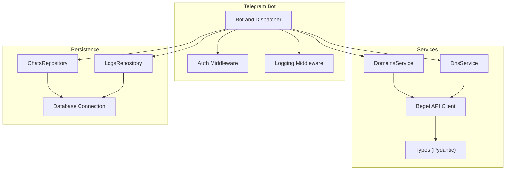
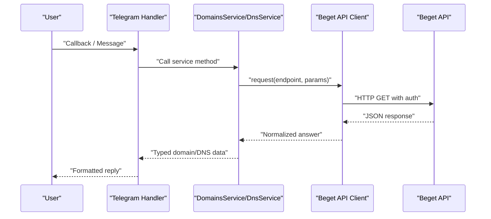
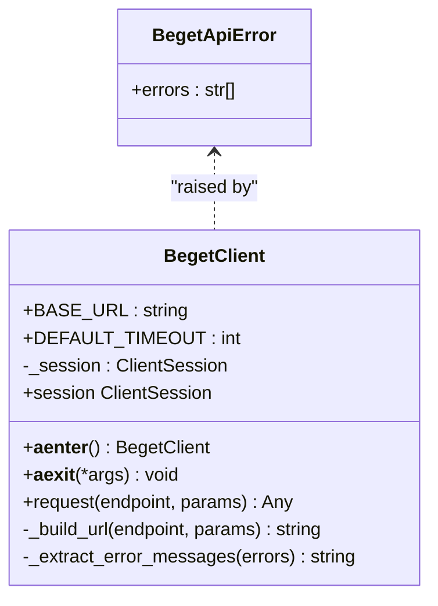
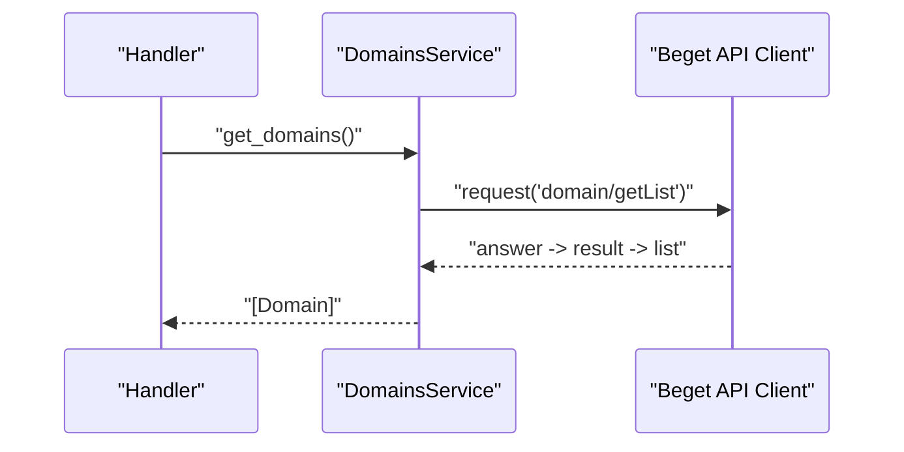
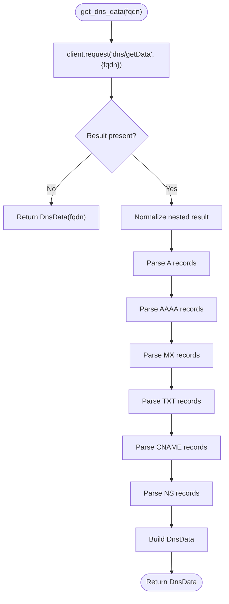
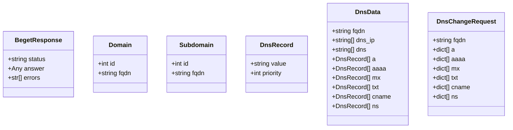
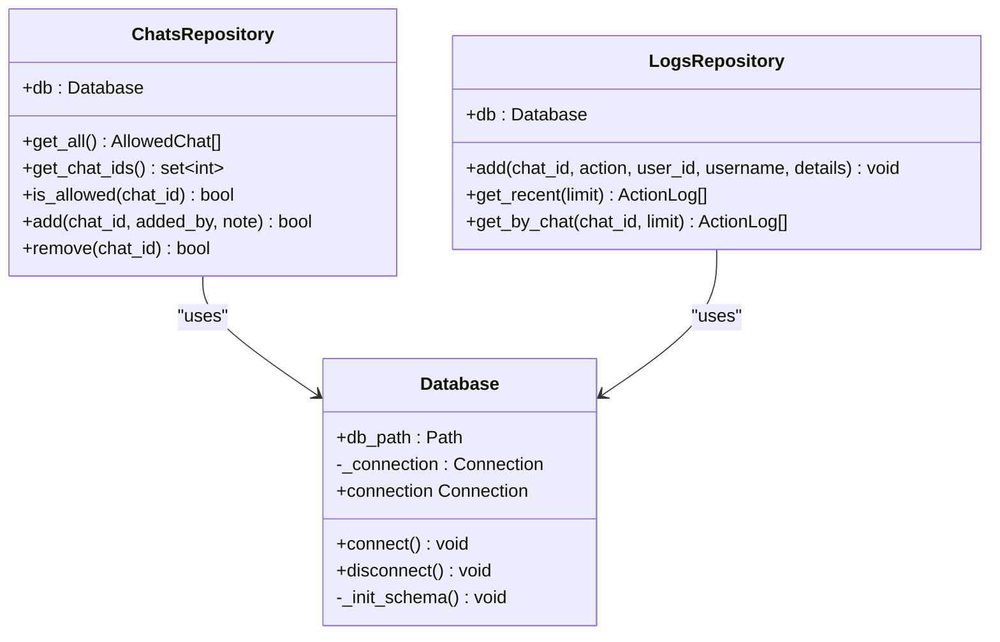
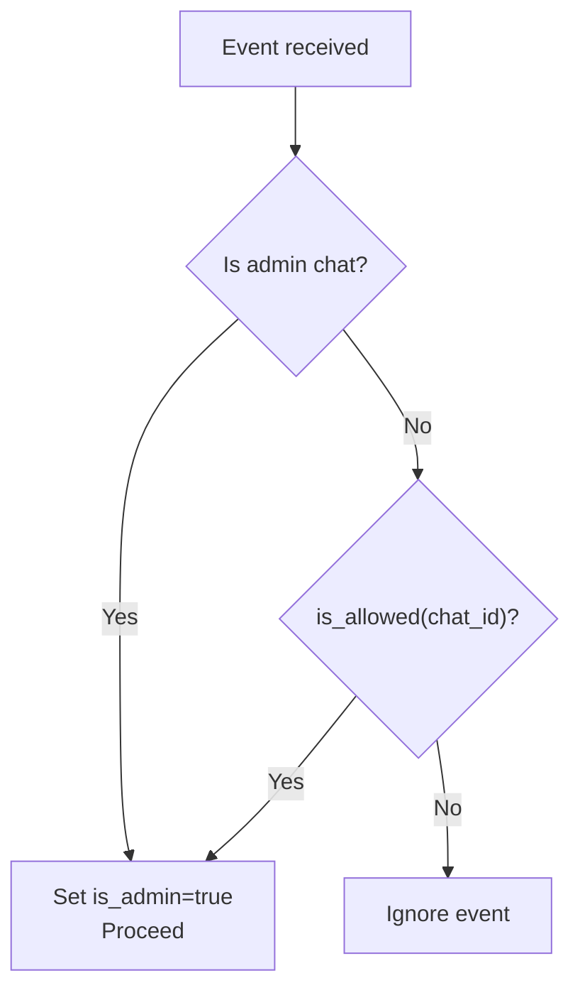
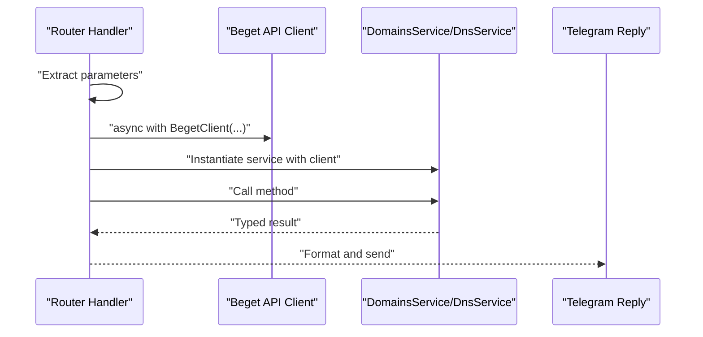
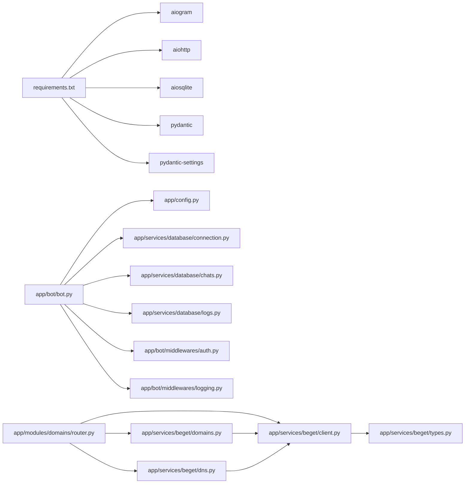

# Service Layer

<cite>
**Referenced Files in This Document**
- [app/services/beget/client.py](file://app/services/beget/client.py)
- [app/services/beget/dns.py](file://app/services/beget/dns.py)
- [app/services/beget/domains.py](file://app/services/beget/domains.py)
- [app/services/beget/types.py](file://app/services/beget/types.py)
- [app/services/beget/__init__.py](file://app/services/beget/__init__.py)
- [app/services/database/connection.py](file://app/services/database/connection.py)
- [app/services/database/chats.py](file://app/services/database/chats.py)
- [app/services/database/logs.py](file://app/services/database/logs.py)
- [app/bot/bot.py](file://app/bot/bot.py)
- [app/bot/middlewares/auth.py](file://app/bot/middlewares/auth.py)
- [app/modules/domains/router.py](file://app/modules/domains/router.py)
- [app/config.py](file://app/config.py)
- [app/main.py](file://app/main.py)
- [requirements.txt](file://requirements.txt)
- [README.md](file://README.md)
</cite>

## Table of Contents
1. [Introduction](#introduction)
2. [Project Structure](#project-structure)
3. [Core Components](#core-components)
4. [Architecture Overview](#architecture-overview)
5. [Detailed Component Analysis](#detailed-component-analysis)
6. [Dependency Analysis](#dependency-analysis)
7. [Performance Considerations](#performance-considerations)
8. [Troubleshooting Guide](#troubleshooting-guide)
9. [Conclusion](#conclusion)
10. [Appendices](#appendices)

## Introduction
This document describes the service layer of the Beget Manager bot, focusing on how the Telegram bot translates user requests into Beget API operations. It covers the Beget API client implementation, service abstractions for domain and DNS record management, data models, error handling, authentication and permission checks, and the integration with the broader application architecture. It also outlines lifecycle management, dependency injection patterns, and operational considerations such as rate limiting and error recovery.

## Project Structure
The service layer is organized around two primary domains:
- Beget API integration: HTTP client, typed responses, and domain/DNS services
- Persistence and access control: database connection, allowed chats, and action logs

The Telegram bot orchestrates routing and middleware, while the service layer encapsulates business logic and external integrations.

**Diagram sources**
- [app/bot/bot.py](file://app/bot/bot.py#L18-L83)
- [app/bot/middlewares/auth.py](file://app/bot/middlewares/auth.py#L10-L46)
- [app/services/beget/client.py](file://app/services/beget/client.py#L21-L135)
- [app/services/beget/domains.py](file://app/services/beget/domains.py#L7-L58)
- [app/services/beget/dns.py](file://app/services/beget/dns.py#L8-L152)
- [app/services/beget/types.py](file://app/services/beget/types.py#L6-L59)
- [app/services/database/connection.py](file://app/services/database/connection.py#L7-L59)
- [app/services/database/chats.py](file://app/services/database/chats.py#L20-L79)
- [app/services/database/logs.py](file://app/services/database/logs.py#L22-L90)

**Section sources**
- [app/bot/bot.py](file://app/bot/bot.py#L18-L83)
- [app/services/beget/__init__.py](file://app/services/beget/__init__.py#L1-L8)
- [app/services/database/connection.py](file://app/services/database/connection.py#L7-L59)

## Core Components
- Beget API Client: Async HTTP client with structured error handling and URL construction for Beget’s API.
- Domain Management Service: Wraps Beget domain and subdomain operations with response normalization.
- DNS Management Service: Parses and manipulates DNS records, translating between Telegram UI and Beget API payloads.
- Data Types: Pydantic models for API responses and domain/DNS entities.
- Database Services: Connection manager, allowed chats repository, and action logs repository.
- Authentication Middleware: Enforces access control based on allowed chats and admin configuration.

**Section sources**
- [app/services/beget/client.py](file://app/services/beget/client.py#L21-L135)
- [app/services/beget/domains.py](file://app/services/beget/domains.py#L7-L58)
- [app/services/beget/dns.py](file://app/services/beget/dns.py#L8-L152)
- [app/services/beget/types.py](file://app/services/beget/types.py#L6-L59)
- [app/services/database/connection.py](file://app/services/database/connection.py#L7-L59)
- [app/services/database/chats.py](file://app/services/database/chats.py#L20-L79)
- [app/services/database/logs.py](file://app/services/database/logs.py#L22-L90)
- [app/bot/middlewares/auth.py](file://app/bot/middlewares/auth.py#L10-L46)

## Architecture Overview
The service layer sits between the Telegram bot and external systems:
- Telegram handlers instantiate short-lived Beget API clients and services per operation.
- Services encapsulate API-specific logic and normalize responses into domain models.
- Database services support access control and audit logging.
- Middlewares enforce permissions and log actions.

**Diagram sources**
- [app/modules/domains/router.py](file://app/modules/domains/router.py#L28-L53)
- [app/services/beget/domains.py](file://app/services/beget/domains.py#L13-L23)
- [app/services/beget/dns.py](file://app/services/beget/dns.py#L14-L77)
- [app/services/beget/client.py](file://app/services/beget/client.py#L70-L121)

## Detailed Component Analysis

### Beget API Client
Responsibilities:
- Construct authenticated URLs with login/password and JSON payload encoding.
- Perform async HTTP GET requests with a fixed timeout.
- Parse responses defensively, handling both top-level and nested errors.
- Raise structured exceptions with extracted error messages.

Key behaviors:
- Session lifecycle via async context manager.
- Masked logging of sensitive URL components.
- Robust JSON parsing fallback and explicit error propagation.

**Diagram sources**
- [app/services/beget/client.py](file://app/services/beget/client.py#L13-L135)

**Section sources**
- [app/services/beget/client.py](file://app/services/beget/client.py#L21-L135)

### Domain Management Service
Responsibilities:
- Retrieve domains and subdomains from Beget.
- Create and delete subdomains.
- Normalize raw API responses into typed models.

Processing logic highlights:
- Handles nested answer/result structures returned by Beget.
- Filters subdomains by domain_id when the API returns a flat list.
- Uses the client’s request method and raises on API errors.

**Diagram sources**
- [app/services/beget/domains.py](file://app/services/beget/domains.py#L13-L23)
- [app/services/beget/client.py](file://app/services/beget/client.py#L70-L121)

**Section sources**
- [app/services/beget/domains.py](file://app/services/beget/domains.py#L7-L58)

### DNS Management Service
Responsibilities:
- Fetch DNS data and convert it into a normalized DnsData model.
- Modify DNS records atomically by replacing entire record sets.
- Provide convenience methods for A and TXT records with priority handling.

Processing logic highlights:
- Parses multiple record types (A, AAAA, MX, TXT, CNAME, NS).
- Ensures priorities are positive and incrementally ordered for A/TXT updates.
- Wraps records under a "records" structure for changeRequests.

**Diagram sources**
- [app/services/beget/dns.py](file://app/services/beget/dns.py#L14-L77)
- [app/services/beget/client.py](file://app/services/beget/client.py#L70-L121)

**Section sources**
- [app/services/beget/dns.py](file://app/services/beget/dns.py#L8-L152)

### Data Models and Types
- BegetResponse: Base shape for API responses with status, answer, and errors.
- Domain/Subdomain: Lightweight entities representing domain resources.
- DnsRecord: Value and priority for DNS entries.
- DnsData: Aggregated DNS data for a domain.
- DnsChangeRequest: Payload structure for record updates.

**Diagram sources**
- [app/services/beget/types.py](file://app/services/beget/types.py#L6-L59)

**Section sources**
- [app/services/beget/types.py](file://app/services/beget/types.py#L6-L59)

### Database Services
- Database: Async connection manager with schema initialization and index creation.
- ChatsRepository: CRUD operations for allowed chats with permission checks.
- LogsRepository: Audit logging for actions with filtering and pagination.

**Diagram sources**
- [app/services/database/connection.py](file://app/services/database/connection.py#L7-L59)
- [app/services/database/chats.py](file://app/services/database/chats.py#L20-L79)
- [app/services/database/logs.py](file://app/services/database/logs.py#L22-L90)

**Section sources**
- [app/services/database/connection.py](file://app/services/database/connection.py#L7-L59)
- [app/services/database/chats.py](file://app/services/database/chats.py#L20-L79)
- [app/services/database/logs.py](file://app/services/database/logs.py#L22-L90)

### Authentication and Permission Validation
- AuthMiddleware enforces access control:
  - Admin chat ID always permitted.
  - Otherwise, chat must be present in allowed_chats.
  - Unauthorized events are ignored silently.

Integration points:
- Middleware registered on message and callback_query.
- Depends on ChatsRepository for allowed chat checks.

**Diagram sources**
- [app/bot/middlewares/auth.py](file://app/bot/middlewares/auth.py#L17-L45)

**Section sources**
- [app/bot/middlewares/auth.py](file://app/bot/middlewares/auth.py#L10-L46)
- [app/services/database/chats.py](file://app/services/database/chats.py#L51-L57)

### Service Layer Integration with Telegram Handlers
- Handlers instantiate Beget API clients and services per request using async context managers.
- Services translate Beget responses into Telegram-friendly formats.
- Error handling in handlers surfaces user-friendly messages.

**Diagram sources**
- [app/modules/domains/router.py](file://app/modules/domains/router.py#L35-L41)
- [app/modules/domains/router.py](file://app/modules/domains/router.py#L364-L370)

**Section sources**
- [app/modules/domains/router.py](file://app/modules/domains/router.py#L28-L53)
- [app/modules/domains/router.py](file://app/modules/domains/router.py#L364-L370)

## Dependency Analysis
External dependencies:
- aiogram: Telegram framework
- aiohttp: Async HTTP client for Beget API
- aiosqlite: Async SQLite driver
- pydantic and pydantic-settings: Typed configuration and validation

Internal dependencies:
- Services depend on the Beget client and typed models.
- Telegram bot depends on services and repositories.
- Repositories depend on the database connection.

**Diagram sources**
- [requirements.txt](file://requirements.txt#L1-L6)
- [app/bot/bot.py](file://app/bot/bot.py#L18-L83)
- [app/modules/domains/router.py](file://app/modules/domains/router.py#L8-L8)
- [app/services/beget/client.py](file://app/services/beget/client.py#L21-L31)
- [app/services/beget/domains.py](file://app/services/beget/domains.py#L3-L4)
- [app/services/beget/dns.py](file://app/services/beget/dns.py#L4-L5)
- [app/services/beget/types.py](file://app/services/beget/types.py#L3)

**Section sources**
- [requirements.txt](file://requirements.txt#L1-L6)
- [app/bot/bot.py](file://app/bot/bot.py#L18-L83)
- [app/modules/domains/router.py](file://app/modules/domains/router.py#L8-L8)

## Performance Considerations
- Async I/O: All network calls are asynchronous; avoid blocking operations in handlers.
- Short-lived clients: Clients are created per request and closed promptly, reducing connection overhead.
- Minimal parsing: Responses are parsed once and normalized into typed models.
- No built-in retry: The client does not implement retries; consider adding exponential backoff and jitter if needed.
- Rate limiting: There is no client-side throttling; Beget API rate limits should be respected by controlling request frequency and batching operations where possible.
- Caching: No caching is implemented; consider memoizing domain/subdomain lists for short intervals if the UI frequently refreshes the same data.

[No sources needed since this section provides general guidance]

## Troubleshooting Guide
Common issues and resolutions:
- Unauthorized access: Verify ADMIN_CHAT_ID and that the user’s chat is in allowed_chats.
- Beget API errors: Check credentials and ensure API access is enabled; review logs for extracted error messages.
- Timeout errors: Increase client timeout if necessary; reduce concurrent operations.
- Database connectivity: Ensure the database path exists and is writable; schema initializes on first connect.

Operational tips:
- Use logs repository to track actions and diagnose issues.
- Monitor logs for masked URLs and error messages to pinpoint failures quickly.

**Section sources**
- [app/bot/middlewares/auth.py](file://app/bot/middlewares/auth.py#L34-L45)
- [app/services/beget/client.py](file://app/services/beget/client.py#L118-L121)
- [app/services/database/logs.py](file://app/services/database/logs.py#L28-L44)
- [README.md](file://README.md#L219-L276)

## Conclusion
The service layer cleanly separates concerns between Telegram UI orchestration, Beget API integration, and persistence. Services encapsulate API nuances and present a consistent, typed interface to handlers. Authentication and logging are enforced at middleware and repository layers respectively. While the current design emphasizes simplicity and clarity, future enhancements could include retry policies, rate limiting, and selective caching to improve resilience and performance.

[No sources needed since this section summarizes without analyzing specific files]

## Appendices

### Configuration and Lifecycle
- Settings are loaded from environment variables and cached.
- Application lifecycle initializes settings, database, and bot, then starts polling and ensures cleanup on shutdown.

**Section sources**
- [app/config.py](file://app/config.py#L8-L52)
- [app/main.py](file://app/main.py#L10-L26)
- [app/bot/bot.py](file://app/bot/bot.py#L18-L83)

### Service Exposure
- Public exports for Beget services enable clean imports in modules.

**Section sources**
- [app/services/beget/__init__.py](file://app/services/beget/__init__.py#L1-L8)