# Bot Framework Integration

<cite>
**Referenced Files in This Document**
- [main.py](file://app/main.py)
- [bot.py](file://app/bot/bot.py)
- [config.py](file://app/config.py)
- [auth.py](file://app/bot/middlewares/auth.py)
- [logging.py](file://app/bot/middlewares/logging.py)
- [common.py](file://app/bot/keyboards/common.py)
- [router.py](file://app/modules/admin/router.py)
- [router.py](file://app/modules/domains/router.py)
- [states.py](file://app/modules/admin/states.py)
- [states.py](file://app/modules/domains/states.py)
- [connection.py](file://app/services/database/connection.py)
- [chats.py](file://app/services/database/chats.py)
- [logs.py](file://app/services/database/logs.py)
- [.env.example](file://.env.example)
- [requirements.txt](file://requirements.txt)
- [Dockerfile](file://Dockerfile)
- [docker-compose.yml](file://docker-compose.yml)
</cite>

## Table of Contents
1. [Introduction](#introduction)
2. [Project Structure](#project-structure)
3. [Core Components](#core-components)
4. [Architecture Overview](#architecture-overview)
5. [Detailed Component Analysis](#detailed-component-analysis)
6. [Dependency Analysis](#dependency-analysis)
7. [Performance Considerations](#performance-considerations)
8. [Troubleshooting Guide](#troubleshooting-guide)
9. [Conclusion](#conclusion)
10. [Appendices](#appendices)

## Introduction
This document explains the Telegram bot framework integration built on AIogram 3.4.1. It covers the complete initialization and lifecycle of the bot, including configuration via environment variables, database setup, middleware registration, and handler orchestration. It also documents memory storage usage, state management patterns, and the relationship between the entry point and the bot initialization function.

## Project Structure
The bot is organized around a modular structure:
- Entry point initializes configuration and starts the polling loop.
- Bot initialization sets up logging, database, repositories, middleware, and base handlers.
- Feature modules register their own routers and states.
- Middleware enforces authentication and logging.
- Database services manage SQLite connections and repositories.

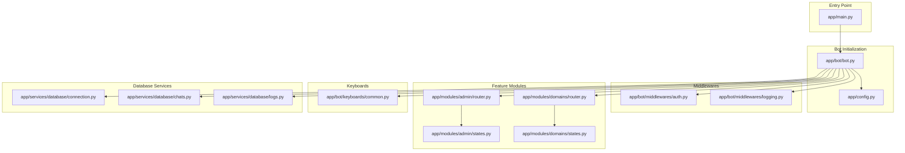

**Diagram sources**
- [main.py](file://app/main.py#L10-L29)
- [bot.py](file://app/bot/bot.py#L18-L82)
- [config.py](file://app/config.py#L8-L51)
- [auth.py](file://app/bot/middlewares/auth.py#L10-L45)
- [logging.py](file://app/bot/middlewares/logging.py#L12-L75)
- [router.py](file://app/modules/admin/router.py#L19-L61)
- [router.py](file://app/modules/domains/router.py#L22-L52)
- [states.py](file://app/modules/admin/states.py#L6-L11)
- [states.py](file://app/modules/domains/states.py#L6-L20)
- [common.py](file://app/bot/keyboards/common.py#L7-L26)
- [connection.py](file://app/services/database/connection.py#L7-L58)
- [chats.py](file://app/services/database/chats.py#L20-L78)
- [logs.py](file://app/services/database/logs.py#L22-L89)

**Section sources**
- [main.py](file://app/main.py#L1-L30)
- [bot.py](file://app/bot/bot.py#L1-L83)
- [config.py](file://app/config.py#L1-L52)

## Core Components
- Entry point: Initializes settings, creates bot and dispatcher, starts polling, and ensures cleanup.
- Bot initialization: Loads settings, configures logging, connects to the database, registers middlewares and routers, and defines base handlers.
- Configuration: Uses Pydantic settings with environment variables and a cached settings instance.
- Database: SQLite managed via aiosqlite with repositories for allowed chats and logs.
- Middlewares: Authentication middleware checks allowed chats and admin privileges; logging middleware records actions and notifies admins.
- Feature routers: Admin and domains modules register their own handlers and states.
- Keyboards: Shared inline keyboards for menus and navigation.

**Section sources**
- [main.py](file://app/main.py#L10-L29)
- [bot.py](file://app/bot/bot.py#L18-L82)
- [config.py](file://app/config.py#L8-L51)
- [connection.py](file://app/services/database/connection.py#L7-L58)
- [chats.py](file://app/services/database/chats.py#L20-L78)
- [logs.py](file://app/services/database/logs.py#L22-L89)
- [auth.py](file://app/bot/middlewares/auth.py#L10-L45)
- [logging.py](file://app/bot/middlewares/logging.py#L12-L75)
- [router.py](file://app/modules/admin/router.py#L19-L61)
- [router.py](file://app/modules/domains/router.py#L22-L52)
- [common.py](file://app/bot/keyboards/common.py#L7-L26)

## Architecture Overview
The bot follows a layered architecture:
- Application entry point orchestrates startup and shutdown.
- Bot initialization composes configuration, database, repositories, middlewares, and routers.
- Dispatching routes messages and callbacks to appropriate handlers.
- State machines manage multi-step operations.
- Repositories encapsulate persistence logic.

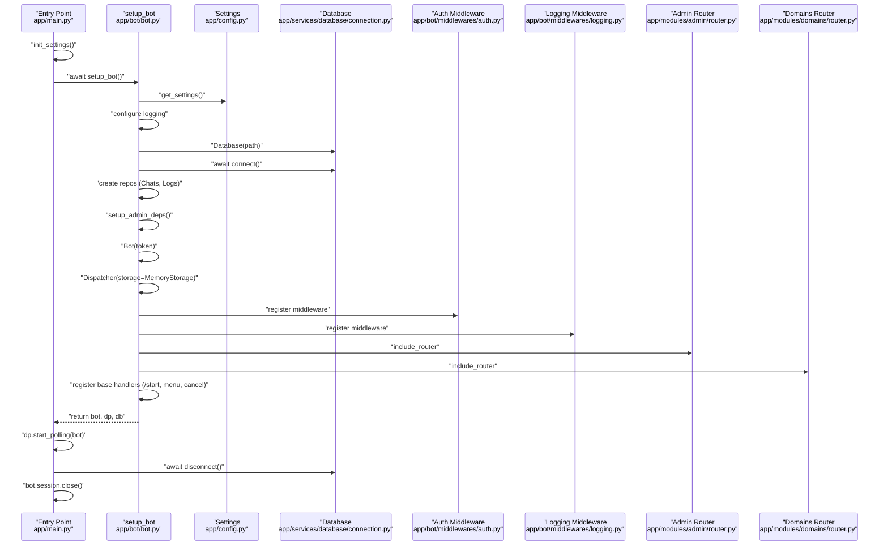

**Diagram sources**
- [main.py](file://app/main.py#L10-L29)
- [bot.py](file://app/bot/bot.py#L18-L82)
- [config.py](file://app/config.py#L37-L51)
- [connection.py](file://app/services/database/connection.py#L14-L25)
- [auth.py](file://app/bot/middlewares/auth.py#L17-L45)
- [logging.py](file://app/bot/middlewares/logging.py#L20-L75)
- [router.py](file://app/modules/admin/router.py#L32-L41)
- [router.py](file://app/modules/domains/router.py#L22-L52)

## Detailed Component Analysis

### Entry Point and Lifecycle
- The entry point initializes settings, constructs the bot and dispatcher via the setup function, starts long polling, and ensures database and session cleanup on shutdown.
- The lifecycle is straightforward: startup, run until interrupted, then teardown.

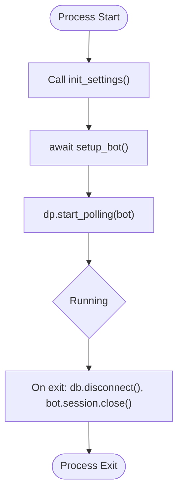

**Diagram sources**
- [main.py](file://app/main.py#L10-L29)

**Section sources**
- [main.py](file://app/main.py#L10-L29)

### Bot Initialization and setup_bot
- Loads settings and configures logging with level from environment.
- Establishes a SQLite database connection and initializes schema.
- Creates repositories for chats and logs and injects dependencies into the admin module.
- Instantiates Bot and Dispatcher with MemoryStorage for state persistence.
- Registers middlewares for authentication and logging.
- Includes admin and domains routers.
- Registers base handlers for /start, main menu navigation, and cancellation.

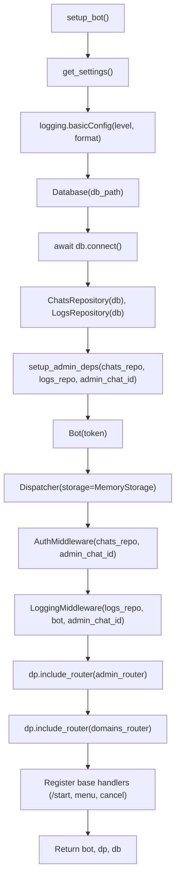

**Diagram sources**
- [bot.py](file://app/bot/bot.py#L18-L82)
- [config.py](file://app/config.py#L37-L51)
- [connection.py](file://app/services/database/connection.py#L14-L25)
- [auth.py](file://app/bot/middlewares/auth.py#L13-L15)
- [logging.py](file://app/bot/middlewares/logging.py#L15-L18)
- [router.py](file://app/modules/admin/router.py#L32-L41)
- [router.py](file://app/modules/domains/router.py#L22-L52)

**Section sources**
- [bot.py](file://app/bot/bot.py#L18-L82)

### Configuration Management (get_settings)
- Settings are loaded from environment variables using Pydantic settings with a dedicated .env file.
- Provides defaults for optional fields and computed paths for the database.
- Exposes a cached getter and an initialization function for eager loading.

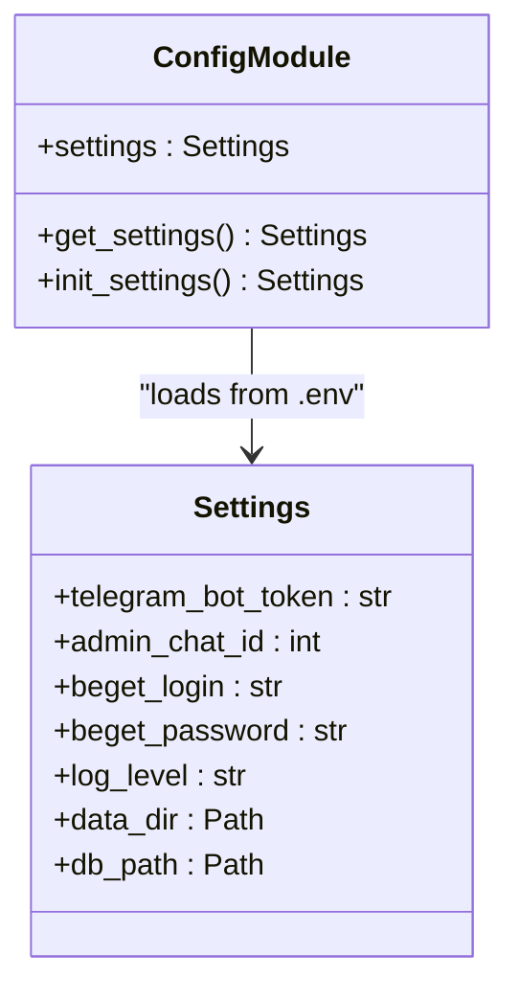

**Diagram sources**
- [config.py](file://app/config.py#L8-L51)

**Section sources**
- [config.py](file://app/config.py#L8-L51)
- [.env.example](file://.env.example#L1-L11)

### Database and Repositories
- Database manages SQLite connection, schema initialization, and exposes a shared connection.
- ChatsRepository handles allowed chats with CRUD operations and existence checks.
- LogsRepository persists action logs and supports recent and per-chat queries.

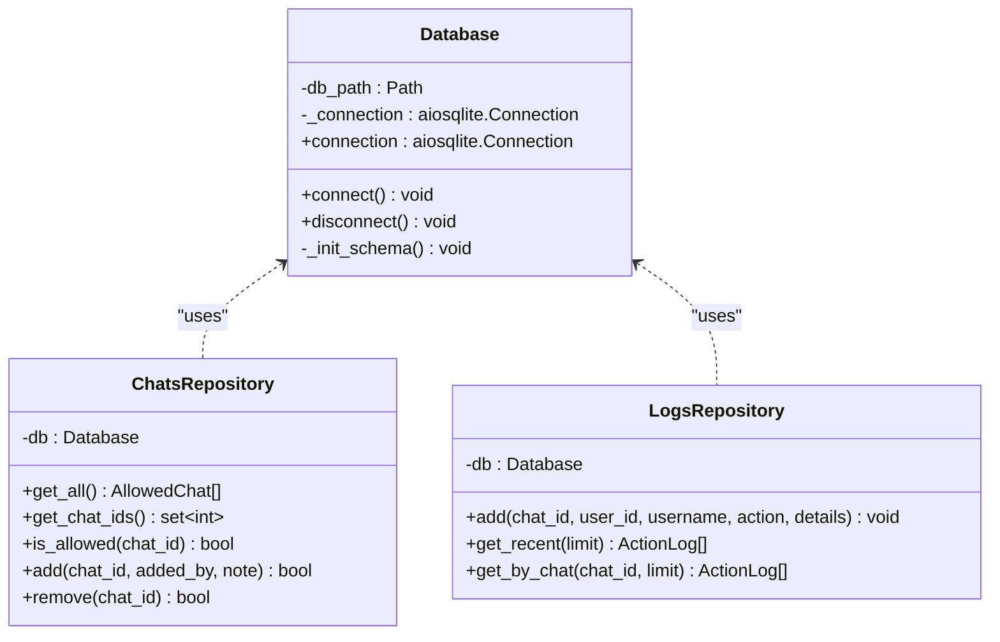

**Diagram sources**
- [connection.py](file://app/services/database/connection.py#L7-L58)
- [chats.py](file://app/services/database/chats.py#L20-L78)
- [logs.py](file://app/services/database/logs.py#L22-L89)

**Section sources**
- [connection.py](file://app/services/database/connection.py#L7-L58)
- [chats.py](file://app/services/database/chats.py#L20-L78)
- [logs.py](file://app/services/database/logs.py#L22-L89)

### Middlewares
- Authentication middleware checks admin privileges and allowed chats, injecting an is_admin flag into handler data.
- Logging middleware captures user actions, writes logs, and sends notifications to the admin chat.

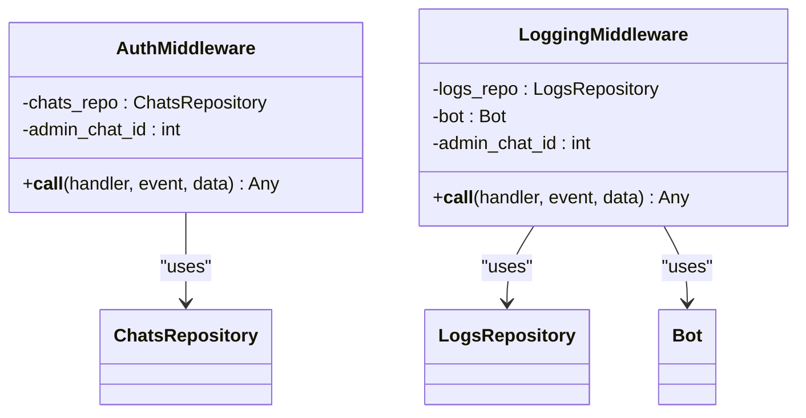

**Diagram sources**
- [auth.py](file://app/bot/middlewares/auth.py#L10-L45)
- [logging.py](file://app/bot/middlewares/logging.py#L12-L75)

**Section sources**
- [auth.py](file://app/bot/middlewares/auth.py#L10-L45)
- [logging.py](file://app/bot/middlewares/logging.py#L12-L75)

### Base Handlers and Navigation
- /start handler responds with a welcome message and displays the main menu, conditionally showing admin options.
- Main menu navigation uses callback data to refresh the message with the appropriate keyboard.
- Cancel handler clears the current state and returns to the main menu.

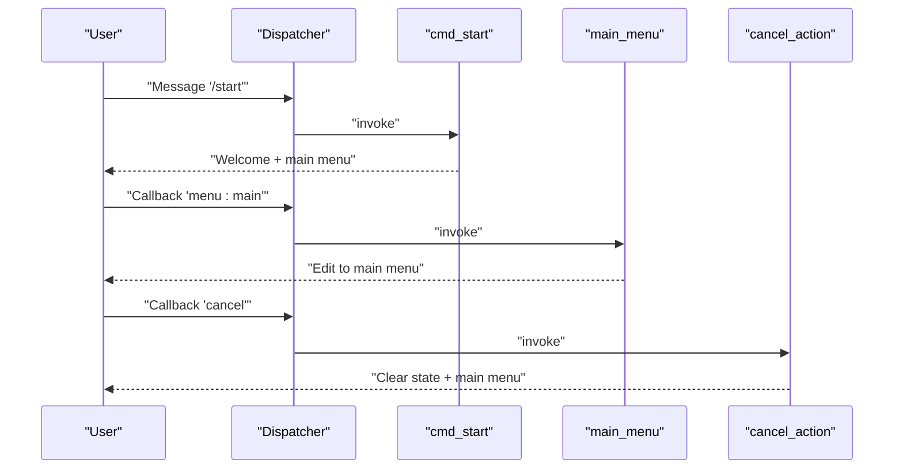

**Diagram sources**
- [bot.py](file://app/bot/bot.py#L54-L80)
- [common.py](file://app/bot/keyboards/common.py#L7-L17)

**Section sources**
- [bot.py](file://app/bot/bot.py#L54-L80)
- [common.py](file://app/bot/keyboards/common.py#L7-L17)

### Feature Modules: Admin and Domains
- Admin router:
  - Registers admin-only handlers and filters.
  - Manages allowed chats, logs viewing, and state-driven workflows.
  - Uses AdminStates for multi-step operations.
- Domains router:
  - Integrates with Beget API clients for domains and DNS operations.
  - Implements state machines for subdomain and DNS management.
  - Handles errors gracefully and updates UI via callback editing.

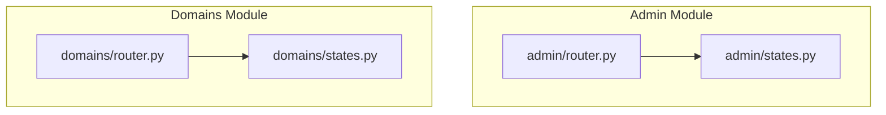

**Diagram sources**
- [router.py](file://app/modules/admin/router.py#L19-L61)
- [states.py](file://app/modules/admin/states.py#L6-L11)
- [router.py](file://app/modules/domains/router.py#L22-L52)
- [states.py](file://app/modules/domains/states.py#L6-L20)

**Section sources**
- [router.py](file://app/modules/admin/router.py#L19-L61)
- [states.py](file://app/modules/admin/states.py#L6-L11)
- [router.py](file://app/modules/domains/router.py#L22-L52)
- [states.py](file://app/modules/domains/states.py#L6-L20)

### Memory Storage and State Management
- Dispatcher uses MemoryStorage, persisting FSM state in memory for the lifetime of the process.
- State groups are defined per module to manage multi-step flows:
  - AdminStates: chat management workflows.
  - SubdomainStates and DnsStates: domains and DNS operations.
- Handlers use state transitions and data updates to guide users through operations.

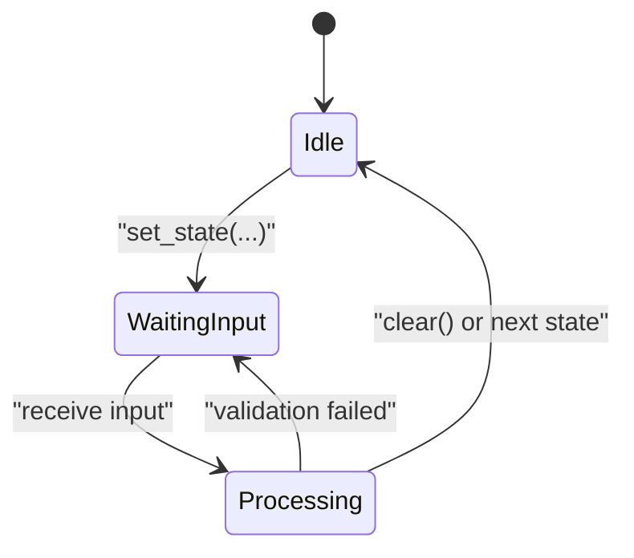

**Diagram sources**
- [bot.py](file://app/bot/bot.py#L41-L41)
- [states.py](file://app/modules/admin/states.py#L6-L11)
- [states.py](file://app/modules/domains/states.py#L6-L20)

**Section sources**
- [bot.py](file://app/bot/bot.py#L41-L41)
- [states.py](file://app/modules/admin/states.py#L6-L11)
- [states.py](file://app/modules/domains/states.py#L6-L20)

## Dependency Analysis
- External dependencies pinned in requirements: AIogram 3.4.1, aiohttp, aiosqlite, pydantic and pydantic-settings.
- Environment-driven configuration via .env.example.
- Containerization with Docker and docker-compose mounting persistent data volume.

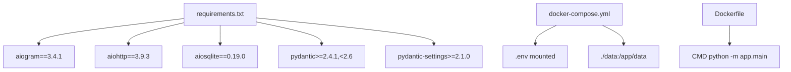

**Diagram sources**
- [requirements.txt](file://requirements.txt#L1-L6)
- [docker-compose.yml](file://docker-compose.yml#L1-L14)
- [Dockerfile](file://Dockerfile#L1-L17)

**Section sources**
- [requirements.txt](file://requirements.txt#L1-L6)
- [docker-compose.yml](file://docker-compose.yml#L1-L14)
- [Dockerfile](file://Dockerfile#L1-L17)

## Performance Considerations
- MemoryStorage is lightweight but not suitable for multi-instance deployments; consider Redis-backed storage for scaling.
- Database operations are synchronous in handlers; batch or cache where appropriate.
- Logging middleware performs database writes and admin notifications; ensure admin chat availability to avoid blocking.
- Long polling is efficient for moderate traffic; monitor memory usage and consider rate limits.

## Troubleshooting Guide
- Missing environment variables:
  - Ensure TELEGRAM_BOT_TOKEN, ADMIN_CHAT_ID, BEGET_LOGIN, BEGET_PASSWORD, and LOG_LEVEL are set in .env.
- Database connectivity:
  - Verify data directory permissions and path resolution; the database file is created under data/bot.db.
- Authentication failures:
  - Confirm the user’s chat ID is present in allowed chats or matches ADMIN_CHAT_ID.
- Handler not triggered:
  - Check middleware filters and callback data correctness.
- State not clearing:
  - Ensure cancel handlers call state.clear() and update UI accordingly.

**Section sources**
- [.env.example](file://.env.example#L1-L11)
- [connection.py](file://app/services/database/connection.py#L14-L19)
- [auth.py](file://app/bot/middlewares/auth.py#L34-L42)
- [bot.py](file://app/bot/bot.py#L72-L80)

## Conclusion
The bot integrates AIogram 3.4.1 with a clean initialization flow, robust configuration, and modular feature routers. Memory storage suits single-instance deployments, while middlewares and repositories provide extensible foundations for authentication, logging, and persistence. The entry point and setup function coordinate startup and shutdown reliably, ensuring a smooth operational lifecycle.

## Appendices
- Practical configuration steps:
  - Copy .env.example to .env and fill in credentials.
  - Build and run with Docker Compose; data persists in ./data.
- Error handling tips:
  - Wrap external API calls in try/except blocks and notify users appropriately.
  - Use state.clear() after exceptions to reset user workflows.