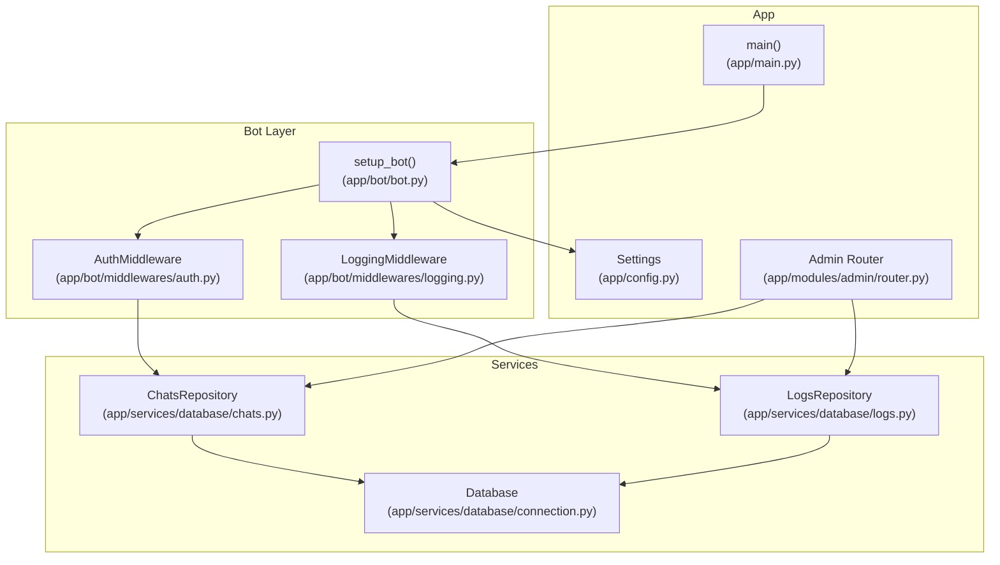
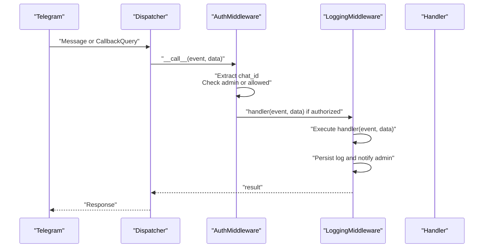
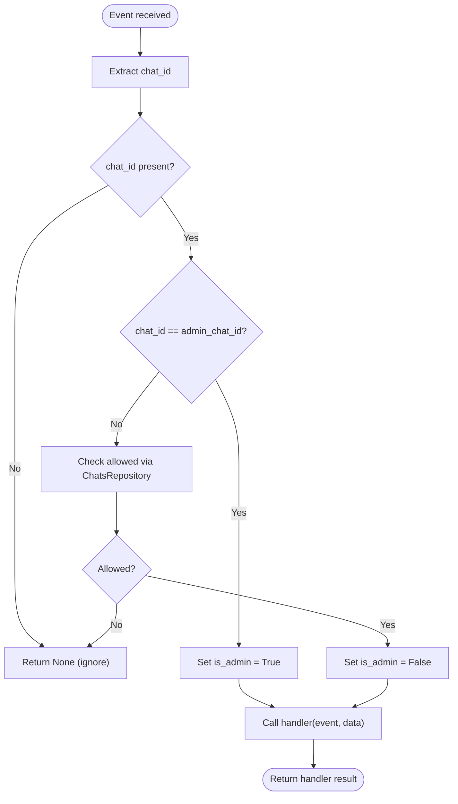
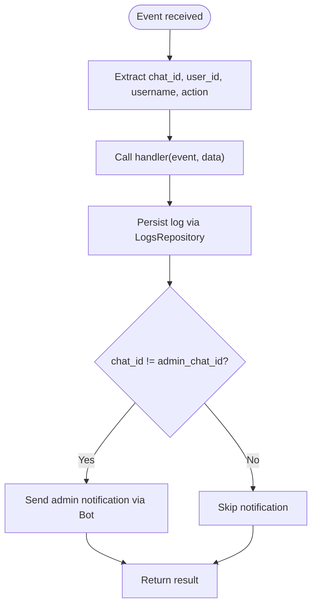
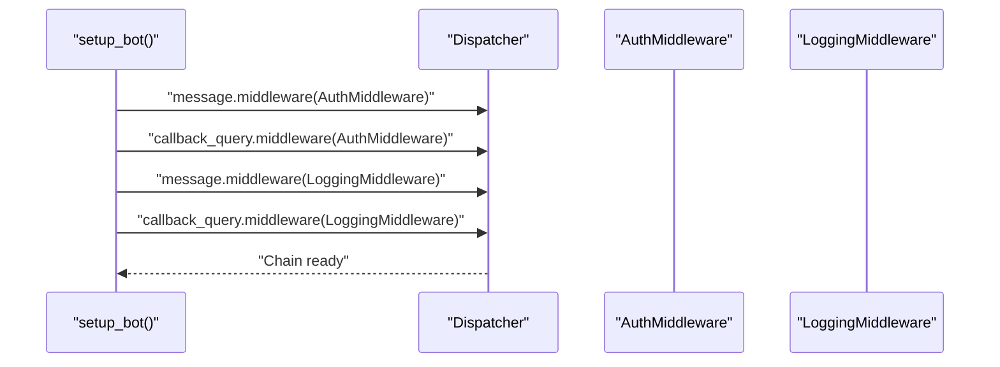
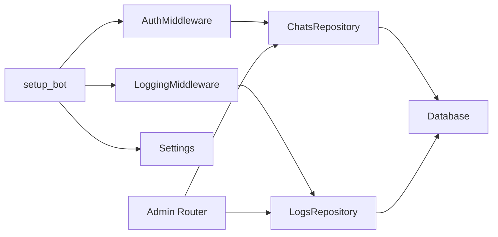

# Middleware System

<cite>
**Referenced Files in This Document**
- [middlewares/__init__.py](file://app/bot/middlewares/__init__.py)
- [auth.py](file://app/bot/middlewares/auth.py)
- [logging.py](file://app/bot/middlewares/logging.py)
- [bot.py](file://app/bot/bot.py)
- [main.py](file://app/main.py)
- [chats.py](file://app/services/database/chats.py)
- [logs.py](file://app/services/database/logs.py)
- [connection.py](file://app/services/database/connection.py)
- [config.py](file://app/config.py)
- [router.py](file://app/modules/admin/router.py)
- [helpers.py](file://app/utils/helpers.py)
</cite>

## Table of Contents
1. [Introduction](#introduction)
2. [Project Structure](#project-structure)
3. [Core Components](#core-components)
4. [Architecture Overview](#architecture-overview)
5. [Detailed Component Analysis](#detailed-component-analysis)
6. [Dependency Analysis](#dependency-analysis)
7. [Performance Considerations](#performance-considerations)
8. [Troubleshooting Guide](#troubleshooting-guide)
9. [Conclusion](#conclusion)
10. [Appendices](#appendices)

## Introduction
This document explains the middleware system that handles cross-cutting concerns in the bot architecture. It focuses on:
- Authentication middleware for validating user permissions and restricting access
- Logging middleware for tracking user actions and notifying administrators
- Registration of middlewares in setup_bot and their attachment to message and callback query handlers
- Execution order, parameter passing between middleware layers, and patterns for building custom middleware
- Performance considerations and error handling strategies

## Project Structure
The middleware system is organized under app/bot/middlewares and integrates with the bot setup, configuration, and database services.

**Diagram sources**
- [bot.py](file://app/bot/bot.py#L18-L83)
- [auth.py](file://app/bot/middlewares/auth.py#L10-L46)
- [logging.py](file://app/bot/middlewares/logging.py#L12-L76)
- [chats.py](file://app/services/database/chats.py#L20-L79)
- [logs.py](file://app/services/database/logs.py#L22-L90)
- [connection.py](file://app/services/database/connection.py#L7-L59)
- [config.py](file://app/config.py#L8-L52)
- [main.py](file://app/main.py#L10-L30)
- [router.py](file://app/modules/admin/router.py#L19-L222)

**Section sources**
- [bot.py](file://app/bot/bot.py#L18-L83)
- [auth.py](file://app/bot/middlewares/auth.py#L10-L46)
- [logging.py](file://app/bot/middlewares/logging.py#L12-L76)
- [chats.py](file://app/services/database/chats.py#L20-L79)
- [logs.py](file://app/services/database/logs.py#L22-L90)
- [connection.py](file://app/services/database/connection.py#L7-L59)
- [config.py](file://app/config.py#L8-L52)
- [main.py](file://app/main.py#L10-L30)
- [router.py](file://app/modules/admin/router.py#L19-L222)

## Core Components
- AuthMiddleware: Validates access by checking admin privileges or presence in allowed chats. Injects a flag into the data dictionary for downstream handlers.
- LoggingMiddleware: Records user actions, persists logs, and notifies the administrator chat.
- setup_bot: Initializes repositories, registers middlewares on message and callback_query dispatchers, and wires routers and base handlers.
- Configuration: Provides admin_chat_id and other settings used by middlewares.

Key responsibilities:
- Parameter passing: Middlewares inject flags (e.g., is_admin) into the data dictionary passed to handlers.
- Execution order: Registration order determines middleware chain order; AuthMiddleware runs before LoggingMiddleware.
- Error handling: Silent rejection for unauthorized events in AuthMiddleware; non-fatal exceptions for admin notifications in LoggingMiddleware.

**Section sources**
- [auth.py](file://app/bot/middlewares/auth.py#L10-L46)
- [logging.py](file://app/bot/middlewares/logging.py#L12-L76)
- [bot.py](file://app/bot/bot.py#L18-L83)
- [config.py](file://app/config.py#L17-L35)

## Architecture Overview
The middleware chain is attached to both message and callback_query update types. Each event passes through the chain in registration order before reaching the matching handler.

**Diagram sources**
- [bot.py](file://app/bot/bot.py#L44-L47)
- [auth.py](file://app/bot/middlewares/auth.py#L17-L45)
- [logging.py](file://app/bot/middlewares/logging.py#L20-L75)

## Detailed Component Analysis

### AuthMiddleware
AuthMiddleware enforces access control:
- Extracts chat_id from Message or CallbackQuery
- Grants immediate access to admin_chat_id
- Checks allowed chats via ChatsRepository
- Silently ignores unauthorized events

Parameter injection:
- Adds is_admin flag to data dictionary for downstream handlers.

**Diagram sources**
- [auth.py](file://app/bot/middlewares/auth.py#L17-L45)
- [chats.py](file://app/services/database/chats.py#L51-L57)

**Section sources**
- [auth.py](file://app/bot/middlewares/auth.py#L10-L46)
- [chats.py](file://app/services/database/chats.py#L20-L79)

### LoggingMiddleware
LoggingMiddleware records actions and notifies admins:
- Extracts chat_id, user_id, username, and action from Message or CallbackQuery
- Executes handler first, then persists logs and sends admin notification
- Skips logging for admin_chat_id to avoid self-notification loops
- Ignores notification failures to prevent blocking

**Diagram sources**
- [logging.py](file://app/bot/middlewares/logging.py#L20-L75)
- [logs.py](file://app/services/database/logs.py#L28-L44)
- [helpers.py](file://app/utils/helpers.py#L6-L8)

**Section sources**
- [logging.py](file://app/bot/middlewares/logging.py#L12-L76)
- [logs.py](file://app/services/database/logs.py#L22-L90)
- [helpers.py](file://app/utils/helpers.py#L1-L16)

### Middleware Registration in setup_bot
Middlewares are registered on both message and callback_query dispatchers:
- AuthMiddleware is registered first to enforce access control before any logging or handler logic
- LoggingMiddleware is registered second to record actions and notify admins

Base handlers demonstrate parameter passing:
- Handlers receive is_admin flag injected by AuthMiddleware

**Diagram sources**
- [bot.py](file://app/bot/bot.py#L44-L47)

**Section sources**
- [bot.py](file://app/bot/bot.py#L18-L83)

### Practical Examples and Patterns

#### Example: Authorization and Logging Flow
- An authorized user sends a message:
  - AuthMiddleware grants access and sets is_admin = False
  - LoggingMiddleware executes handler, persists log, and notifies admin
- An unauthorized user sends a callback query:
  - AuthMiddleware silently ignores the event
- An admin sends a message:
  - AuthMiddleware grants access and sets is_admin = True
  - LoggingMiddleware executes handler and persists log (admin notifications are skipped)

#### Parameter Passing Between Middleware Layers
- AuthMiddleware injects is_admin into data
- Handlers can accept is_admin as a keyword argument (as seen in base handlers)

#### Custom Middleware Development Patterns
- Implement BaseMiddleware with __call__(handler, event, data) signature
- Extract event-specific identifiers (chat_id, user_id)
- Decide early exit vs. calling handler(event, data)
- Use data dictionary to pass flags or extracted metadata to downstream handlers
- Wrap external calls (database, API) with minimal error propagation

**Section sources**
- [auth.py](file://app/bot/middlewares/auth.py#L17-L45)
- [logging.py](file://app/bot/middlewares/logging.py#L20-L75)
- [bot.py](file://app/bot/bot.py#L54-L81)

## Dependency Analysis
- AuthMiddleware depends on ChatsRepository for allowed chat checks
- LoggingMiddleware depends on LogsRepository and Bot for notifications
- Both repositories depend on Database for persistence
- setup_bot wires repositories and settings into middlewares
- Admin router demonstrates additional filtering via IsAdminFilter and uses the same repositories

**Diagram sources**
- [auth.py](file://app/bot/middlewares/auth.py#L10-L15)
- [logging.py](file://app/bot/middlewares/logging.py#L15-L18)
- [chats.py](file://app/services/database/chats.py#L20-L24)
- [logs.py](file://app/services/database/logs.py#L22-L26)
- [connection.py](file://app/services/database/connection.py#L7-L32)
- [bot.py](file://app/bot/bot.py#L18-L47)
- [config.py](file://app/config.py#L8-L35)
- [router.py](file://app/modules/admin/router.py#L22-L41)

**Section sources**
- [auth.py](file://app/bot/middlewares/auth.py#L10-L15)
- [logging.py](file://app/bot/middlewares/logging.py#L15-L18)
- [chats.py](file://app/services/database/chats.py#L20-L24)
- [logs.py](file://app/services/database/logs.py#L22-L26)
- [connection.py](file://app/services/database/connection.py#L7-L32)
- [bot.py](file://app/bot/bot.py#L18-L47)
- [config.py](file://app/config.py#L8-L35)
- [router.py](file://app/modules/admin/router.py#L22-L41)

## Performance Considerations
- AuthMiddleware performs a single database check per event; ensure database connections are reused and efficient
- LoggingMiddleware writes logs synchronously; consider batching or offloading notifications for high throughput
- Admin notifications are best-effort; exceptions are suppressed to avoid blocking the event pipeline
- Indexes on action_logs created_at improve query performance for recent logs

[No sources needed since this section provides general guidance]

## Troubleshooting Guide
Common issues and resolutions:
- Unauthorized access attempts:
  - Verify admin_chat_id setting and allowed chats list
  - Confirm AuthMiddleware is registered before LoggingMiddleware
- Missing logs or notifications:
  - Check LogsRepository persistence and admin_chat_id correctness
  - Ensure Bot instance is configured and operational
- Silent failures:
  - Admin notifications failures are intentionally ignored; verify logs are still persisted
- Handler not receiving is_admin:
  - Ensure AuthMiddleware is registered and event types match (message, callback_query)

**Section sources**
- [auth.py](file://app/bot/middlewares/auth.py#L31-L45)
- [logging.py](file://app/bot/middlewares/logging.py#L70-L73)
- [bot.py](file://app/bot/bot.py#L44-L47)
- [config.py](file://app/config.py#L17-L19)

## Conclusion
The middleware system cleanly separates cross-cutting concerns:
- AuthMiddleware ensures only authorized users can trigger handlers
- LoggingMiddleware provides auditability and admin visibility
- setup_bot orchestrates registration and parameter passing
- The design supports extensibility for custom middleware while maintaining predictable execution order and robust error handling

[No sources needed since this section summarizes without analyzing specific files]

## Appendices

### Middleware Registration Checklist
- Register AuthMiddleware before LoggingMiddleware
- Attach both to message and callback_query dispatchers
- Pass repositories and settings from setup_bot to middleware constructors
- Verify settings.admin_chat_id is configured

**Section sources**
- [bot.py](file://app/bot/bot.py#L44-L47)
- [config.py](file://app/config.py#L17-L19)