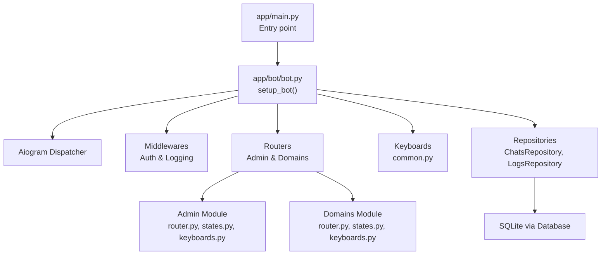
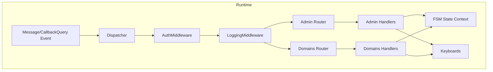
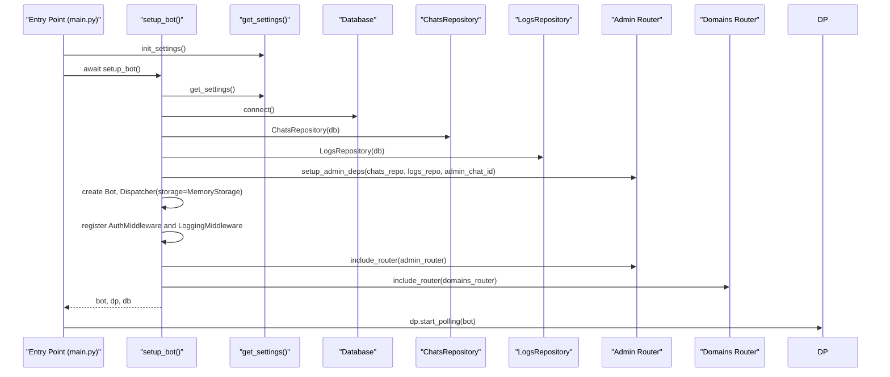
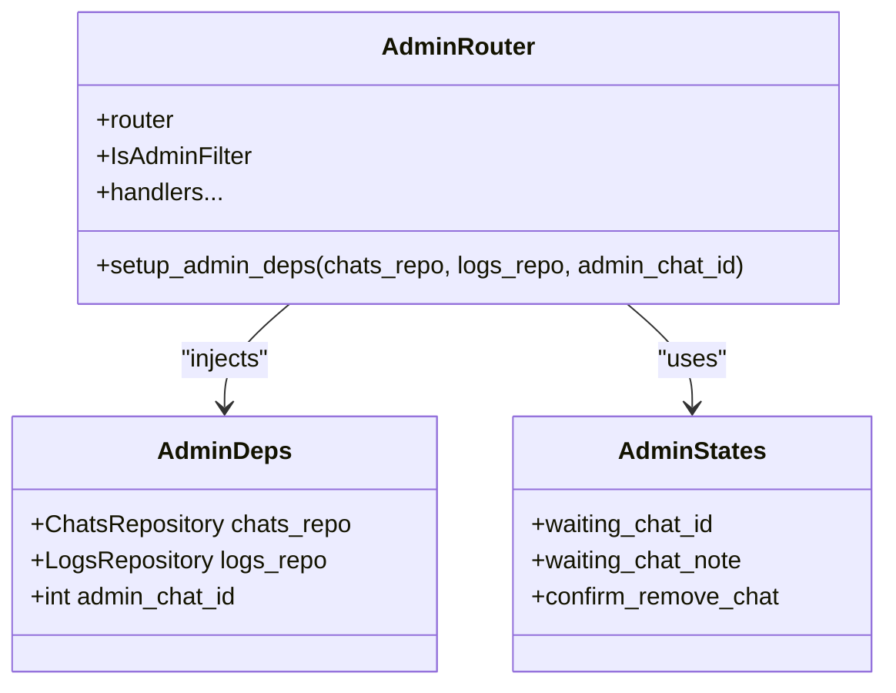
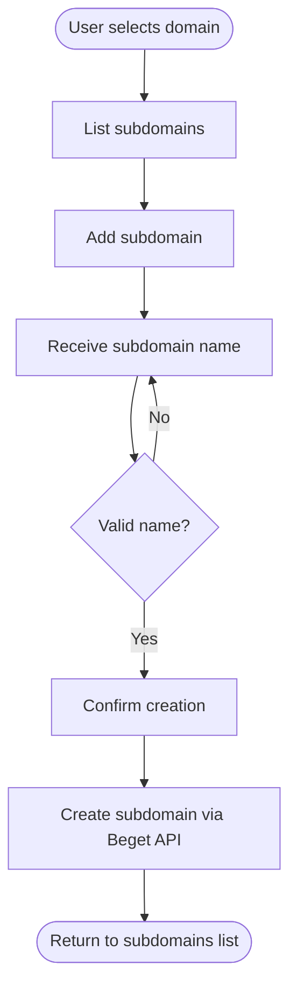
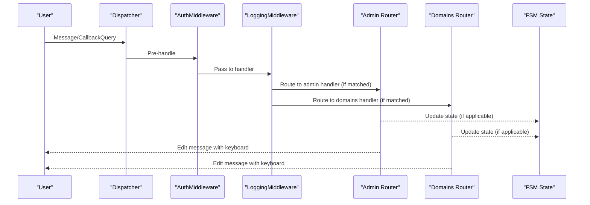
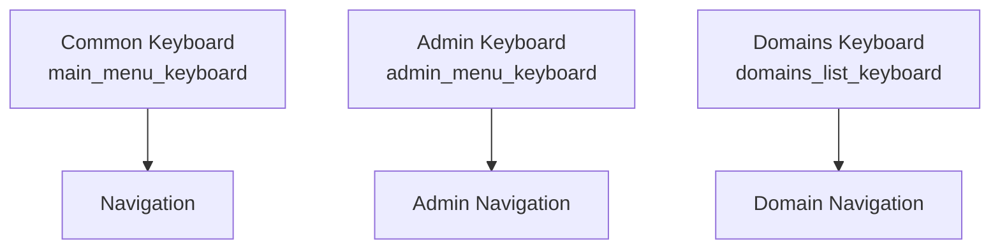
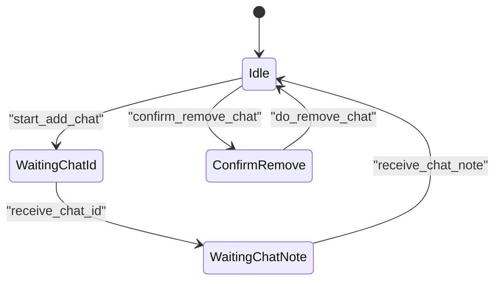
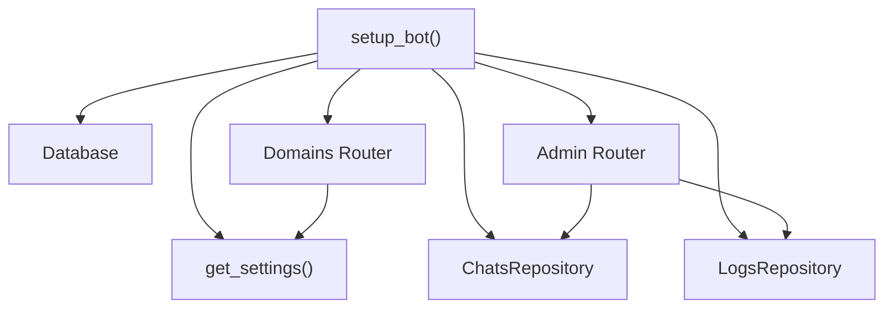

# Router and Handler Architecture

<cite>
**Referenced Files in This Document**
- [app/main.py](file://app/main.py)
- [app/bot/bot.py](file://app/bot/bot.py)
- [app/bot/middlewares/auth.py](file://app/bot/middlewares/auth.py)
- [app/bot/middlewares/logging.py](file://app/bot/middlewares/logging.py)
- [app/bot/keyboards/common.py](file://app/bot/keyboards/common.py)
- [app/modules/admin/router.py](file://app/modules/admin/router.py)
- [app/modules/admin/states.py](file://app/modules/admin/states.py)
- [app/modules/admin/keyboards.py](file://app/modules/admin/keyboards.py)
- [app/modules/domains/router.py](file://app/modules/domains/router.py)
- [app/modules/domains/states.py](file://app/modules/domains/states.py)
- [app/modules/domains/keyboards.py](file://app/modules/domains/keyboards.py)
- [app/services/database/chats.py](file://app/services/database/chats.py)
- [app/services/database/logs.py](file://app/services/database/logs.py)
- [app/config.py](file://app/config.py)
- [app/utils/helpers.py](file://app/utils/helpers.py)
</cite>

## Table of Contents
1. [Introduction](#introduction)
2. [Project Structure](#project-structure)
3. [Core Components](#core-components)
4. [Architecture Overview](#architecture-overview)
5. [Detailed Component Analysis](#detailed-component-analysis)
6. [Dependency Analysis](#dependency-analysis)
7. [Performance Considerations](#performance-considerations)
8. [Troubleshooting Guide](#troubleshooting-guide)
9. [Conclusion](#conclusion)

## Introduction
This document explains the router-based handler architecture that powers the bot’s functionality. It focuses on how routers are registered during setup, how handlers are organized per module, how state machines integrate with handlers, and how middlewares enforce authentication and logging. It also documents the separation of concerns across admin and domains functional areas, and how dependency injection is applied to keep modules decoupled and testable.

## Project Structure
The bot follows a modular structure:
- Entry point initializes configuration and starts the polling loop.
- Bot setup composes the Aiogram Dispatcher, registers middlewares, and includes module routers.
- Each module encapsulates its own router, states, and keyboards.
- Shared resources (database, repositories) are injected into module dependencies.
- Middlewares provide cross-cutting concerns (authentication and logging).

**Diagram sources**
- [app/main.py](file://app/main.py#L10-L26)
- [app/bot/bot.py](file://app/bot/bot.py#L18-L82)
- [app/modules/admin/router.py](file://app/modules/admin/router.py#L19-L61)
- [app/modules/domains/router.py](file://app/modules/domains/router.py#L22-L22)
- [app/bot/keyboards/common.py](file://app/bot/keyboards/common.py#L7-L17)
- [app/services/database/chats.py](file://app/services/database/chats.py#L20-L79)
- [app/services/database/logs.py](file://app/services/database/logs.py#L22-L90)

**Section sources**
- [app/main.py](file://app/main.py#L10-L26)
- [app/bot/bot.py](file://app/bot/bot.py#L18-L82)

## Core Components
- Bot setup and registration:
  - Initializes logging, database, and repositories.
  - Injects dependencies into admin module via a dedicated setup function.
  - Registers middlewares for authentication and logging.
  - Includes admin and domains routers.
  - Registers base handlers for start, main menu, and cancel actions.
- Routers and handlers:
  - Admin router: manages allowed chats, logs, and admin-only actions.
  - Domains router: lists domains, manages subdomains, and manipulates DNS records.
- State machines:
  - AdminStates: collects chat ID and note, confirms removal.
  - SubdomainStates and DnsStates: manage multi-step workflows for subdomain and DNS operations.
- Keyboards:
  - Common keyboard for main menu and navigation.
  - Module-specific keyboards for admin and domains menus and actions.
- Middlewares:
  - AuthMiddleware: filters unauthorized chats and injects is_admin flag.
  - LoggingMiddleware: logs actions and notifies admin.

**Section sources**
- [app/bot/bot.py](file://app/bot/bot.py#L18-L82)
- [app/modules/admin/router.py](file://app/modules/admin/router.py#L22-L61)
- [app/modules/domains/router.py](file://app/modules/domains/router.py#L22-L22)
- [app/modules/admin/states.py](file://app/modules/admin/states.py#L6-L11)
- [app/modules/domains/states.py](file://app/modules/domains/states.py#L6-L20)
- [app/bot/keyboards/common.py](file://app/bot/keyboards/common.py#L7-L17)
- [app/bot/middlewares/auth.py](file://app/bot/middlewares/auth.py#L10-L45)
- [app/bot/middlewares/logging.py](file://app/bot/middlewares/logging.py#L12-L75)

## Architecture Overview
The architecture is event-driven and modular:
- Entry point initializes settings and calls setup_bot.
- setup_bot wires up the Dispatcher, middlewares, and routers.
- Handlers are registered under module routers and use FSM states for multi-step flows.
- Keyboard builders construct navigation and action menus.
- Repositories provide persistence for chats and logs.

**Diagram sources**
- [app/bot/bot.py](file://app/bot/bot.py#L44-L51)
- [app/bot/middlewares/auth.py](file://app/bot/middlewares/auth.py#L17-L45)
- [app/bot/middlewares/logging.py](file://app/bot/middlewares/logging.py#L20-L75)
- [app/modules/admin/router.py](file://app/modules/admin/router.py#L64-L222)
- [app/modules/domains/router.py](file://app/modules/domains/router.py#L28-L718)

## Detailed Component Analysis

### Bot Setup and Registration
- setup_bot orchestrates:
  - Logging configuration from settings.
  - Database initialization and repository creation.
  - Admin dependency injection (chats_repo, logs_repo, admin_chat_id).
  - Aiogram Bot and Dispatcher creation with memory storage.
  - Middleware registration for auth and logging on both message and callback_query.
  - Router inclusion for admin and domains.
  - Base handlers for /start, main menu, and cancel actions.
- The main entry point calls setup_bot and starts polling, ensuring graceful shutdown.

**Diagram sources**
- [app/main.py](file://app/main.py#L10-L26)
- [app/bot/bot.py](file://app/bot/bot.py#L18-L82)
- [app/config.py](file://app/config.py#L37-L51)

**Section sources**
- [app/main.py](file://app/main.py#L10-L26)
- [app/bot/bot.py](file://app/bot/bot.py#L18-L82)
- [app/config.py](file://app/config.py#L37-L51)

### Admin Router and Dependencies
- Router registration:
  - Router is included in the Dispatcher.
  - An admin filter restricts handlers to admin_chat_id.
- Dependency injection:
  - setup_admin_deps injects ChatsRepository, LogsRepository, and admin_chat_id into a module-scoped AdminDeps container.
- Handlers:
  - Admin menu navigation.
  - Listing allowed chats with actions (add/remove).
  - Adding chats with two-step state machine (chat ID and optional note).
  - Viewing action logs.
- State machine:
  - AdminStates defines waiting_chat_id, waiting_chat_note, and confirm_remove_chat.

**Diagram sources**
- [app/modules/admin/router.py](file://app/modules/admin/router.py#L22-L61)
- [app/modules/admin/router.py](file://app/modules/admin/router.py#L32-L41)
- [app/modules/admin/states.py](file://app/modules/admin/states.py#L6-L11)

**Section sources**
- [app/modules/admin/router.py](file://app/modules/admin/router.py#L19-L61)
- [app/modules/admin/router.py](file://app/modules/admin/router.py#L32-L41)
- [app/modules/admin/states.py](file://app/modules/admin/states.py#L6-L11)
- [app/modules/admin/keyboards.py](file://app/modules/admin/keyboards.py#L9-L76)

### Domains Router and Workflows
- Router registration:
  - Router is included in the Dispatcher.
- Handlers:
  - Domain listing and selection.
  - Subdomain management (list, add, delete) with multi-step state machine.
  - DNS management (view, add/change/delete A and TXT records) with state machine.
- State machines:
  - SubdomainStates: waiting_subdomain_name, confirm_create_subdomain, confirm_delete_subdomain.
  - DnsStates: waiting_a_record_ip, waiting_new_a_ip, waiting_txt_value, confirm_delete_record.
- Keyboard builders:
  - Domains, subdomains, DNS menus and action keyboards.

**Diagram sources**
- [app/modules/domains/router.py](file://app/modules/domains/router.py#L72-L242)
- [app/modules/domains/states.py](file://app/modules/domains/states.py#L6-L20)

**Section sources**
- [app/modules/domains/router.py](file://app/modules/domains/router.py#L22-L22)
- [app/modules/domains/router.py](file://app/modules/domains/router.py#L28-L53)
- [app/modules/domains/router.py](file://app/modules/domains/router.py#L72-L242)
- [app/modules/domains/states.py](file://app/modules/domains/states.py#L6-L20)
- [app/modules/domains/keyboards.py](file://app/modules/domains/keyboards.py#L9-L196)

### Handler Execution Flow
- Authentication and logging:
  - AuthMiddleware checks chat permissions and injects is_admin into handler data.
  - LoggingMiddleware logs non-admin actions and notifies admin.
- Dispatcher routing:
  - Dispatcher matches incoming events to registered routers and handlers.
- State management:
  - Handlers update FSM state to guide multi-step flows.
- Keyboard navigation:
  - Handlers edit messages with inline keyboards for navigation and actions.

**Diagram sources**
- [app/bot/middlewares/auth.py](file://app/bot/middlewares/auth.py#L17-L45)
- [app/bot/middlewares/logging.py](file://app/bot/middlewares/logging.py#L20-L75)
- [app/bot/bot.py](file://app/bot/bot.py#L44-L51)
- [app/modules/admin/router.py](file://app/modules/admin/router.py#L64-L222)
- [app/modules/domains/router.py](file://app/modules/domains/router.py#L28-L718)

**Section sources**
- [app/bot/middlewares/auth.py](file://app/bot/middlewares/auth.py#L10-L45)
- [app/bot/middlewares/logging.py](file://app/bot/middlewares/logging.py#L12-L75)
- [app/bot/bot.py](file://app/bot/bot.py#L44-L51)

### Keyboard Navigation Systems
- Common keyboard:
  - Main menu with conditional Admin Panel visibility based on is_admin.
  - Back and confirm/cancel utilities.
- Admin keyboard:
  - Admin menu, chats list with actions, confirm remove.
- Domains keyboard:
  - Domains list, domain menu, subdomains list, subdomain actions, DNS menu, A/TXT record lists and actions.

**Diagram sources**
- [app/bot/keyboards/common.py](file://app/bot/keyboards/common.py#L7-L42)
- [app/modules/admin/keyboards.py](file://app/modules/admin/keyboards.py#L9-L76)
- [app/modules/domains/keyboards.py](file://app/modules/domains/keyboards.py#L9-L196)

**Section sources**
- [app/bot/keyboards/common.py](file://app/bot/keyboards/common.py#L7-L42)
- [app/modules/admin/keyboards.py](file://app/modules/admin/keyboards.py#L9-L76)
- [app/modules/domains/keyboards.py](file://app/modules/domains/keyboards.py#L9-L196)

### State Machine Integration
- Admin:
  - Two-step chat addition: waiting_chat_id → waiting_chat_note.
  - Removal confirmation via confirm_remove_chat.
- Domains:
  - Subdomain creation: waiting_subdomain_name → confirm_create_subdomain.
  - Subdomain deletion: confirm_delete_subdomain.
  - DNS A record: waiting_a_record_ip → change IP flow → waiting_new_a_ip.
  - DNS TXT record: waiting_txt_value.
- State transitions are driven by handlers and confirmed by inline keyboards.

**Diagram sources**
- [app/modules/admin/states.py](file://app/modules/admin/states.py#L6-L11)
- [app/modules/admin/router.py](file://app/modules/admin/router.py#L98-L150)

**Section sources**
- [app/modules/admin/states.py](file://app/modules/admin/states.py#L6-L11)
- [app/modules/admin/router.py](file://app/modules/admin/router.py#L98-L150)

### Handler Patterns and Organization
- Pattern: callback_query with structured callback_data for navigation and actions.
- Pattern: message handlers bound to FSM states for multi-step flows.
- Pattern: try/except around external API calls with user-friendly feedback.
- Pattern: keyboard builders centralize UI construction and reuse.

Examples by file path:
- Admin menu handler: [app/modules/admin/router.py](file://app/modules/admin/router.py#L64-L71)
- Add chat flow: [app/modules/admin/router.py](file://app/modules/admin/router.py#L98-L150)
- Domains list handler: [app/modules/domains/router.py](file://app/modules/domains/router.py#L28-L53)
- Subdomain creation flow: [app/modules/domains/router.py](file://app/modules/domains/router.py#L135-L242)
- DNS A record add/change: [app/modules/domains/router.py](file://app/modules/domains/router.py#L465-L542)

**Section sources**
- [app/modules/admin/router.py](file://app/modules/admin/router.py#L64-L222)
- [app/modules/domains/router.py](file://app/modules/domains/router.py#L28-L718)

### Separation of Concerns
- Admin module:
  - Access control and audit logging.
  - Chat allow-list management.
- Domains module:
  - Domain discovery and subdomain management.
  - DNS record manipulation.
- Shared concerns:
  - Authentication and logging via middlewares.
  - Common UI via shared keyboards.
  - Persistence via repositories.

**Section sources**
- [app/bot/middlewares/auth.py](file://app/bot/middlewares/auth.py#L10-L45)
- [app/bot/middlewares/logging.py](file://app/bot/middlewares/logging.py#L12-L75)
- [app/bot/keyboards/common.py](file://app/bot/keyboards/common.py#L7-L17)
- [app/services/database/chats.py](file://app/services/database/chats.py#L20-L79)
- [app/services/database/logs.py](file://app/services/database/logs.py#L22-L90)

## Dependency Analysis
- setup_bot depends on:
  - Settings for tokens, admin chat ID, and paths.
  - Database and repositories for persistence.
  - Admin dependency setup for module wiring.
  - Middlewares and routers for runtime behavior.
- Routers depend on:
  - Repositories (injected) for data access.
  - Settings for external API credentials.
  - FSM states for multi-step flows.
  - Keyboard builders for UI.

**Diagram sources**
- [app/bot/bot.py](file://app/bot/bot.py#L18-L82)
- [app/config.py](file://app/config.py#L37-L51)
- [app/services/database/chats.py](file://app/services/database/chats.py#L20-L79)
- [app/services/database/logs.py](file://app/services/database/logs.py#L22-L90)

**Section sources**
- [app/bot/bot.py](file://app/bot/bot.py#L18-L82)
- [app/config.py](file://app/config.py#L37-L51)

## Performance Considerations
- Memory storage: The Dispatcher uses in-memory FSM storage, suitable for single-instance deployments. For horizontal scaling, consider Redis-backed storage.
- External API calls: Beget API requests are made per user action; consider caching domain/subdomain lists per session or adding retry/backoff.
- Keyboard building: Reuse builders to minimize repeated allocations.
- Logging overhead: Logging middleware performs DB writes and admin notifications; ensure DB and network I/O are not bottlenecks.

## Troubleshooting Guide
- Unauthorized access:
  - Verify admin_chat_id and allowed chats list.
  - Check AuthMiddleware logic and is_admin flag propagation.
- Handler not triggered:
  - Confirm router inclusion and callback_data patterns match handlers.
  - Ensure state transitions are correctly cleared or updated.
- API errors:
  - Wrap external calls with try/except and present user-friendly messages.
  - Inspect Beget API client error handling and timeouts.
- Logging issues:
  - Ensure admin_chat_id is configured and logs repository is connected.

**Section sources**
- [app/bot/middlewares/auth.py](file://app/bot/middlewares/auth.py#L17-L45)
- [app/bot/middlewares/logging.py](file://app/bot/middlewares/logging.py#L20-L75)
- [app/modules/domains/router.py](file://app/modules/domains/router.py#L34-L41)
- [app/services/beget/client.py](file://app/services/beget/client.py#L70-L121)

## Conclusion
The router-based architecture cleanly separates concerns across admin and domains modules while leveraging FSM states for complex workflows. setup_bot centralizes registration and dependency injection, ensuring middlewares and routers are consistently wired. The modular design, combined with shared keyboards and repositories, enables maintainability and extensibility. For production, consider persistent FSM storage, API caching, and robust error handling around external services.