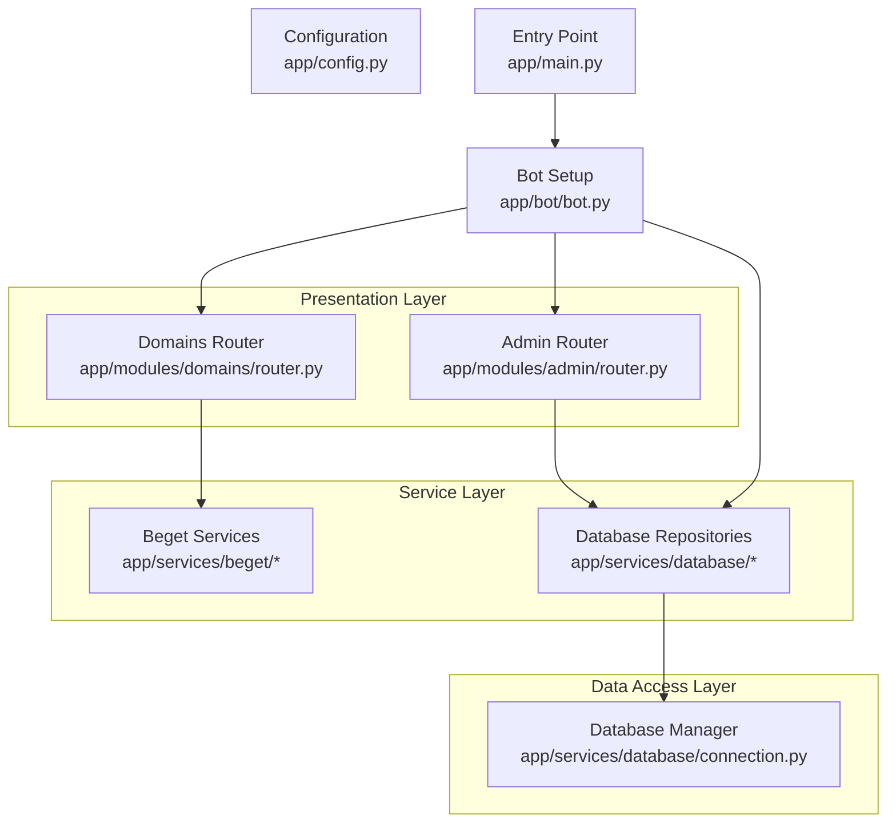
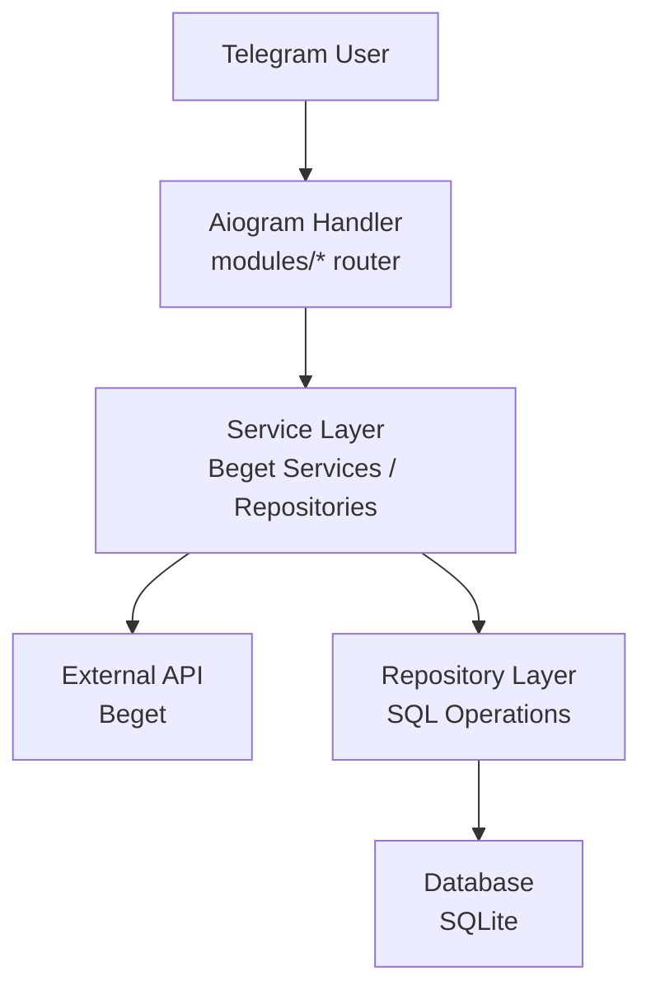
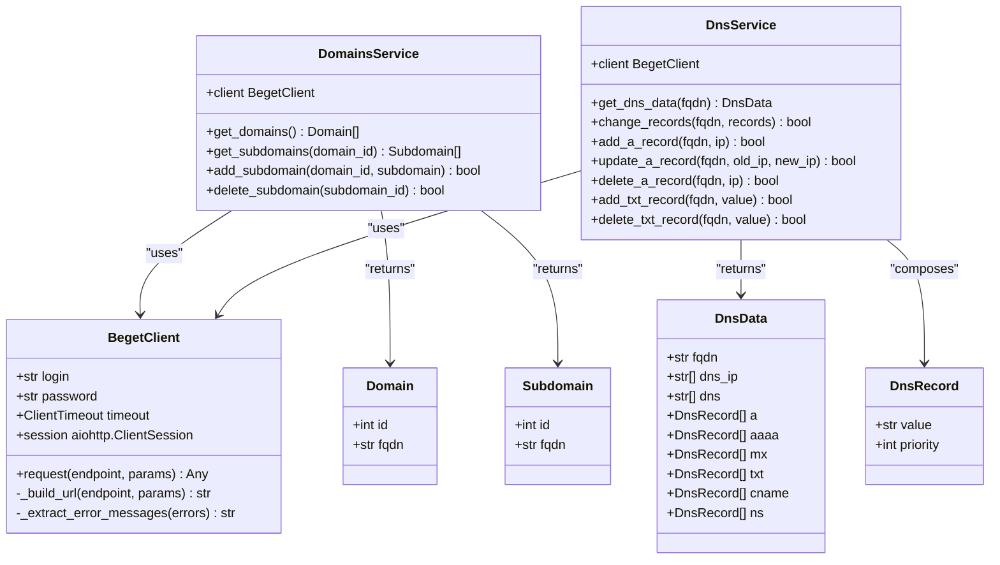
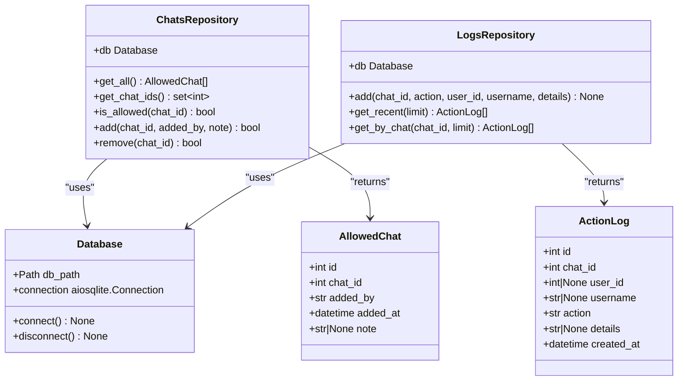
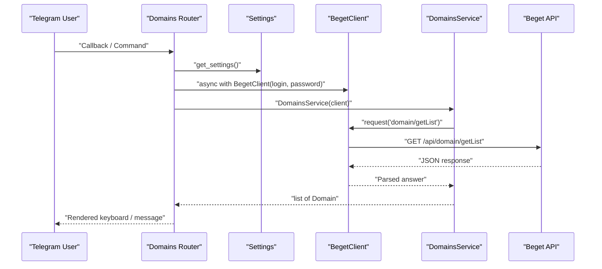
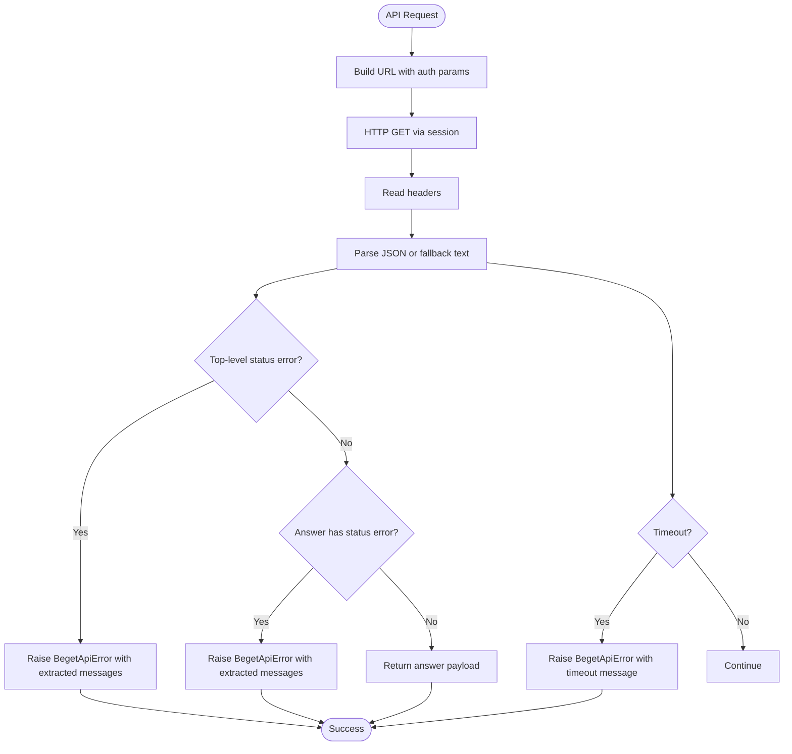
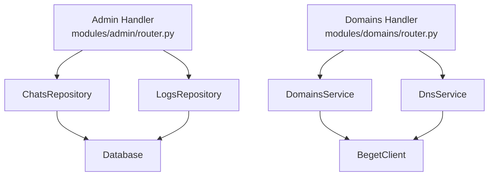
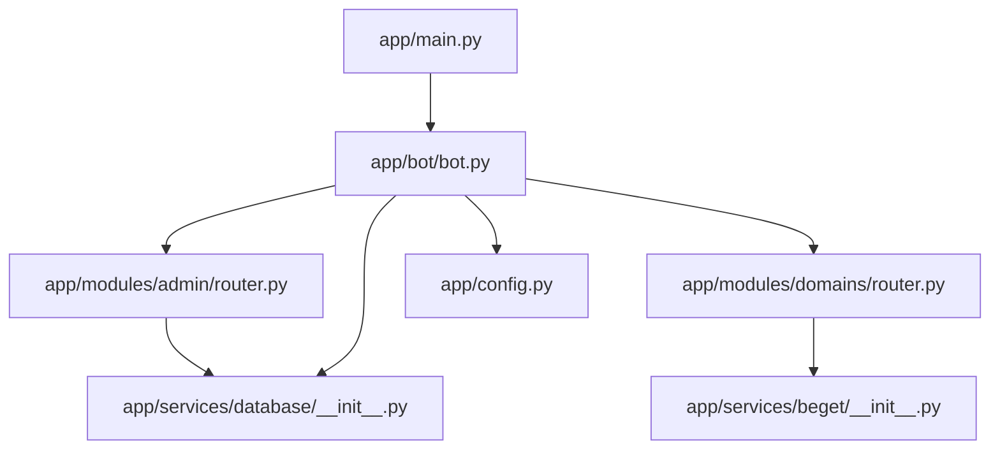

# Service Layer Pattern

<cite>
**Referenced Files in This Document**
- [app/main.py](file://app/main.py)
- [app/config.py](file://app/config.py)
- [app/bot/bot.py](file://app/bot/bot.py)
- [app/services/beget/__init__.py](file://app/services/beget/__init__.py)
- [app/services/beget/client.py](file://app/services/beget/client.py)
- [app/services/beget/domains.py](file://app/services/beget/domains.py)
- [app/services/beget/dns.py](file://app/services/beget/dns.py)
- [app/services/beget/types.py](file://app/services/beget/types.py)
- [app/services/database/__init__.py](file://app/services/database/__init__.py)
- [app/services/database/connection.py](file://app/services/database/connection.py)
- [app/services/database/chats.py](file://app/services/database/chats.py)
- [app/services/database/logs.py](file://app/services/database/logs.py)
- [app/modules/admin/router.py](file://app/modules/admin/router.py)
- [app/modules/domains/router.py](file://app/modules/domains/router.py)
</cite>

## Table of Contents
1. [Introduction](#introduction)
2. [Project Structure](#project-structure)
3. [Core Components](#core-components)
4. [Architecture Overview](#architecture-overview)
5. [Detailed Component Analysis](#detailed-component-analysis)
6. [Dependency Analysis](#dependency-analysis)
7. [Performance Considerations](#performance-considerations)
8. [Troubleshooting Guide](#troubleshooting-guide)
9. [Conclusion](#conclusion)

## Introduction
This document explains the service layer pattern implemented in the application, focusing on how business logic is abstracted from presentation and data access layers. It covers:
- The Beget API service layer with centralized client access and specialized services for domains and DNS operations
- The repository pattern for database operations, including ChatsRepository and LogsRepository
- Service abstractions that separate business logic from presentation and data access
- Examples of service method implementations, error handling strategies, and the relationship between services and repositories
- Service dependency injection, asynchronous operation patterns, and separation of concerns

## Project Structure
The application follows a layered architecture:
- Presentation layer: Aiogram routers and handlers in modules
- Service layer: Beget API services and database repositories
- Data access layer: Database connection manager and repositories
- Configuration and entry point: Settings loading and bot setup

**Diagram sources**
- [app/main.py](file://app/main.py#L10-L26)
- [app/bot/bot.py](file://app/bot/bot.py#L18-L83)
- [app/modules/admin/router.py](file://app/modules/admin/router.py#L1-L222)
- [app/modules/domains/router.py](file://app/modules/domains/router.py#L1-L718)
- [app/services/database/connection.py](file://app/services/database/connection.py#L7-L32)
- [app/services/beget/client.py](file://app/services/beget/client.py#L21-L49)

**Section sources**
- [app/main.py](file://app/main.py#L10-L26)
- [app/bot/bot.py](file://app/bot/bot.py#L18-L83)
- [app/config.py](file://app/config.py#L8-L51)

## Core Components
- Beget API client and services:
  - Centralized HTTP client for Beget API requests
  - Domain management service
  - DNS management service
  - Strongly typed models for API responses and domain/DNS data
- Database services and repositories:
  - Database connection manager with schema initialization
  - Repository for allowed chats
  - Repository for action logs
- Dependency injection:
  - Admin module dependency container
  - Router-level service instantiation for Beget operations

Key implementation references:
- Beget client and error handling: [BegetApiError](file://app/services/beget/client.py#L13-L18), [BegetClient.request](file://app/services/beget/client.py#L70-L121)
- Domain service methods: [DomainsService.get_domains](file://app/services/beget/domains.py#L13-L23), [DomainsService.get_subdomains](file://app/services/beget/domains.py#L25-L41), [DomainsService.add_subdomain](file://app/services/beget/domains.py#L43-L49), [DomainsService.delete_subdomain](file://app/services/beget/domains.py#L51-L57)
- DNS service methods: [DnsService.get_dns_data](file://app/services/beget/dns.py#L14-L77), [DnsService.change_records](file://app/services/beget/dns.py#L79-L99), [DnsService.add_a_record](file://app/services/beget/dns.py#L101-L109), [DnsService.update_a_record](file://app/services/beget/dns.py#L111-L121), [DnsService.delete_a_record](file://app/services/beget/dns.py#L123-L132), [DnsService.add_txt_record](file://app/services/beget/dns.py#L134-L140), [DnsService.delete_txt_record](file://app/services/beget/dns.py#L142-L151)
- Domain/DNS models: [Domain](file://app/services/beget/types.py#L14-L26), [Subdomain](file://app/services/beget/types.py#L21-L26), [DnsRecord](file://app/services/beget/types.py#L28-L33), [DnsData](file://app/services/beget/types.py#L35-L58)
- Database connection and schema: [Database.connect](file://app/services/database/connection.py#L14-L19), [Database._init_schema](file://app/services/database/connection.py#L34-L57)
- Chats repository methods: [ChatsRepository.get_all](file://app/services/database/chats.py#L26-L41), [ChatsRepository.get_chat_ids](file://app/services/database/chats.py#L43-L49), [ChatsRepository.is_allowed](file://app/services/database/chats.py#L51-L57), [ChatsRepository.add](file://app/services/database/chats.py#L59-L69), [ChatsRepository.remove](file://app/services/database/chats.py#L71-L78)
- Logs repository methods: [LogsRepository.add](file://app/services/database/logs.py#L28-L44), [LogsRepository.get_recent](file://app/services/database/logs.py#L46-L64), [LogsRepository.get_by_chat](file://app/services/database/logs.py#L66-L89)
- Dependency injection in admin module: [AdminDeps](file://app/modules/admin/router.py#L22-L29), [setup_admin_deps](file://app/modules/admin/router.py#L32-L41)
- Router-level service instantiation: [Domains router async with client](file://app/modules/domains/router.py#L35-L36), [DNS router async with client](file://app/modules/domains/router.py#L364-L366)

**Section sources**
- [app/services/beget/client.py](file://app/services/beget/client.py#L13-L135)
- [app/services/beget/domains.py](file://app/services/beget/domains.py#L7-L58)
- [app/services/beget/dns.py](file://app/services/beget/dns.py#L8-L152)
- [app/services/beget/types.py](file://app/services/beget/types.py#L6-L59)
- [app/services/database/connection.py](file://app/services/database/connection.py#L7-L59)
- [app/services/database/chats.py](file://app/services/database/chats.py#L20-L79)
- [app/services/database/logs.py](file://app/services/database/logs.py#L22-L90)
- [app/modules/admin/router.py](file://app/modules/admin/router.py#L22-L41)
- [app/modules/domains/router.py](file://app/modules/domains/router.py#L35-L36)

## Architecture Overview
The system enforces separation of concerns:
- Presentation layer (routers) orchestrates user interactions and delegates business logic to services
- Service layer encapsulates Beget API operations and domain-specific logic
- Repository layer abstracts database operations behind typed entities
- Configuration and dependency injection ensure clean initialization and wiring

**Diagram sources**
- [app/modules/admin/router.py](file://app/modules/admin/router.py#L74-L150)
- [app/modules/domains/router.py](file://app/modules/domains/router.py#L28-L52)
- [app/services/beget/client.py](file://app/services/beget/client.py#L70-L121)
- [app/services/database/chats.py](file://app/services/database/chats.py#L26-L41)
- [app/services/database/logs.py](file://app/services/database/logs.py#L28-L44)
- [app/services/database/connection.py](file://app/services/database/connection.py#L14-L19)

## Detailed Component Analysis

### Beget API Service Layer
The Beget service layer provides:
- Centralized HTTP client with async context management and robust error handling
- Domain service for listing domains, subdomains, and performing CRUD-like operations
- DNS service for fetching DNS data, building typed models, and updating records atomically

**Diagram sources**
- [app/services/beget/client.py](file://app/services/beget/client.py#L21-L135)
- [app/services/beget/domains.py](file://app/services/beget/domains.py#L7-L58)
- [app/services/beget/dns.py](file://app/services/beget/dns.py#L8-L152)
- [app/services/beget/types.py](file://app/services/beget/types.py#L14-L58)

**Section sources**
- [app/services/beget/client.py](file://app/services/beget/client.py#L21-L135)
- [app/services/beget/domains.py](file://app/services/beget/domains.py#L7-L58)
- [app/services/beget/dns.py](file://app/services/beget/dns.py#L8-L152)
- [app/services/beget/types.py](file://app/services/beget/types.py#L6-L59)

### Repository Pattern Implementation
Repositories encapsulate database operations behind typed entities:
- ChatsRepository manages allowed chats with CRUD-like operations
- LogsRepository persists and retrieves action logs with filtering and pagination

**Diagram sources**
- [app/services/database/connection.py](file://app/services/database/connection.py#L7-L59)
- [app/services/database/chats.py](file://app/services/database/chats.py#L9-L79)
- [app/services/database/logs.py](file://app/services/database/logs.py#L9-L90)

**Section sources**
- [app/services/database/connection.py](file://app/services/database/connection.py#L7-L59)
- [app/services/database/chats.py](file://app/services/database/chats.py#L20-L79)
- [app/services/database/logs.py](file://app/services/database/logs.py#L22-L90)

### Service Abstraction and Separation of Concerns
- Presentation layer (routers) handles user events and delegates to services
- Service layer isolates business logic and external API integrations
- Repository layer abstracts persistence concerns
- Configuration and dependency injection keep initialization centralized

Examples of service method implementations:
- Domain listing: [DomainsService.get_domains](file://app/services/beget/domains.py#L13-L23)
- Subdomain filtering and CRUD: [DomainsService.get_subdomains](file://app/services/beget/domains.py#L25-L41), [DomainsService.add_subdomain](file://app/services/beget/domains.py#L43-L49), [DomainsService.delete_subdomain](file://app/services/beget/domains.py#L51-L57)
- DNS record retrieval and updates: [DnsService.get_dns_data](file://app/services/beget/dns.py#L14-L77), [DnsService.change_records](file://app/services/beget/dns.py#L79-L99), [DnsService.add_a_record](file://app/services/beget/dns.py#L101-L109), [DnsService.update_a_record](file://app/services/beget/dns.py#L111-L121), [DnsService.delete_a_record](file://app/services/beget/dns.py#L123-L132), [DnsService.add_txt_record](file://app/services/beget/dns.py#L134-L140), [DnsService.delete_txt_record](file://app/services/beget/dns.py#L142-L151)
- Repository operations: [ChatsRepository.add](file://app/services/database/chats.py#L59-L69), [ChatsRepository.remove](file://app/services/database/chats.py#L71-L78), [LogsRepository.add](file://app/services/database/logs.py#L28-L44)

**Section sources**
- [app/services/beget/domains.py](file://app/services/beget/domains.py#L13-L57)
- [app/services/beget/dns.py](file://app/services/beget/dns.py#L14-L151)
- [app/services/database/chats.py](file://app/services/database/chats.py#L59-L78)
- [app/services/database/logs.py](file://app/services/database/logs.py#L28-L44)

### Asynchronous Operation Patterns
- Async HTTP client with context manager for session lifecycle
- Async database operations with typed row factory
- Handlers in routers orchestrate async service calls

**Diagram sources**
- [app/modules/domains/router.py](file://app/modules/domains/router.py#L33-L41)
- [app/services/beget/client.py](file://app/services/beget/client.py#L33-L42)
- [app/services/beget/domains.py](file://app/services/beget/domains.py#L13-L23)

**Section sources**
- [app/services/beget/client.py](file://app/services/beget/client.py#L33-L42)
- [app/modules/domains/router.py](file://app/modules/domains/router.py#L33-L41)

### Error Handling Strategies
- Centralized API error type with structured error extraction
- Robust request handling with timeout and response parsing
- Graceful error propagation to handlers for user feedback

**Diagram sources**
- [app/services/beget/client.py](file://app/services/beget/client.py#L70-L121)

**Section sources**
- [app/services/beget/client.py](file://app/services/beget/client.py#L13-L18)
- [app/services/beget/client.py](file://app/services/beget/client.py#L70-L121)

### Relationship Between Services and Repositories
- Admin module handlers depend on injected repositories for allowed chats and logs
- Domain/DNS routers instantiate services per request using the configured client
- Repositories depend on the shared Database connection manager

**Diagram sources**
- [app/modules/admin/router.py](file://app/modules/admin/router.py#L7-L29)
- [app/modules/domains/router.py](file://app/modules/domains/router.py#L35-L36)
- [app/services/beget/domains.py](file://app/services/beget/domains.py#L10-L11)
- [app/services/beget/dns.py](file://app/services/beget/dns.py#L11-L12)
- [app/services/database/chats.py](file://app/services/database/chats.py#L23-L24)
- [app/services/database/logs.py](file://app/services/database/logs.py#L25-L26)

**Section sources**
- [app/modules/admin/router.py](file://app/modules/admin/router.py#L7-L29)
- [app/modules/domains/router.py](file://app/modules/domains/router.py#L35-L36)
- [app/services/beget/domains.py](file://app/services/beget/domains.py#L10-L11)
- [app/services/beget/dns.py](file://app/services/beget/dns.py#L11-L12)
- [app/services/database/chats.py](file://app/services/database/chats.py#L23-L24)
- [app/services/database/logs.py](file://app/services/database/logs.py#L25-L26)

## Dependency Analysis
- Module-level dependencies:
  - Admin router depends on repositories and admin chat ID
  - Domains router depends on Beget services and settings
- Service-level dependencies:
  - DomainsService and DnsService depend on BegetClient
  - Repositories depend on Database
- Initialization dependencies:
  - Bot setup creates repositories and injects them into admin router
  - Entry point initializes settings and starts polling

**Diagram sources**
- [app/main.py](file://app/main.py#L10-L26)
- [app/bot/bot.py](file://app/bot/bot.py#L18-L83)
- [app/modules/admin/router.py](file://app/modules/admin/router.py#L9-L16)
- [app/modules/domains/router.py](file://app/modules/domains/router.py#L7-L8)
- [app/services/beget/__init__.py](file://app/services/beget/__init__.py#L1-L7)
- [app/services/database/__init__.py](file://app/services/database/__init__.py#L1-L7)
- [app/config.py](file://app/config.py#L37-L51)

**Section sources**
- [app/main.py](file://app/main.py#L10-L26)
- [app/bot/bot.py](file://app/bot/bot.py#L18-L83)
- [app/modules/admin/router.py](file://app/modules/admin/router.py#L9-L16)
- [app/modules/domains/router.py](file://app/modules/domains/router.py#L7-L8)
- [app/services/beget/__init__.py](file://app/services/beget/__init__.py#L1-L7)
- [app/services/database/__init__.py](file://app/services/database/__init__.py#L1-L7)
- [app/config.py](file://app/config.py#L37-L51)

## Performance Considerations
- Asynchronous I/O: Both HTTP and database operations are async, minimizing blocking and improving throughput under concurrent load
- Minimal parsing overhead: The Beget client parses responses once and raises structured errors early
- Efficient queries: Repositories use parameterized statements and targeted selects to reduce overhead
- Connection lifecycle: Async context managers ensure sessions and connections are properly managed

## Troubleshooting Guide
Common issues and resolutions:
- API authentication failures:
  - Verify Beget credentials in environment variables and ensure correct login/password
  - Review BegetApiError messages and extracted error texts
  - Check request URLs logged with masked passwords for debugging
  - Reference: [BegetApiError](file://app/services/beget/client.py#L13-L18), [BegetClient.request](file://app/services/beget/client.py#L70-L121)
- Network timeouts:
  - Adjust timeout settings if the API is slow to respond
  - Inspect timeout error messages raised during requests
  - Reference: [BegetClient.request timeout handling](file://app/services/beget/client.py#L118-L120)
- Database connectivity:
  - Ensure database path exists and is writable
  - Confirm schema initialization ran successfully
  - Reference: [Database.connect](file://app/services/database/connection.py#L14-L19), [Database._init_schema](file://app/services/database/connection.py#L34-L57)
- Repository operations:
  - Add operations return booleans indicating success/failure; handle duplicates gracefully
  - Remove operations return row counts; confirm deletions by checking returned values
  - Reference: [ChatsRepository.add](file://app/services/database/chats.py#L59-L69), [ChatsRepository.remove](file://app/services/database/chats.py#L71-L78), [LogsRepository.add](file://app/services/database/logs.py#L28-L44)

**Section sources**
- [app/services/beget/client.py](file://app/services/beget/client.py#L13-L18)
- [app/services/beget/client.py](file://app/services/beget/client.py#L70-L121)
- [app/services/database/connection.py](file://app/services/database/connection.py#L14-L19)
- [app/services/database/connection.py](file://app/services/database/connection.py#L34-L57)
- [app/services/database/chats.py](file://app/services/database/chats.py#L59-L69)
- [app/services/database/chats.py](file://app/services/database/chats.py#L71-L78)
- [app/services/database/logs.py](file://app/services/database/logs.py#L28-L44)

## Conclusion
The service layer pattern in this application cleanly separates concerns:
- Presentation layer focuses on user interactions
- Service layer encapsulates business logic and external integrations
- Repository layer abstracts persistence
- Dependency injection and async patterns improve maintainability and testability

This design enables straightforward testing of services and repositories independently, while keeping presentation logic minimal and focused on routing and UI composition.