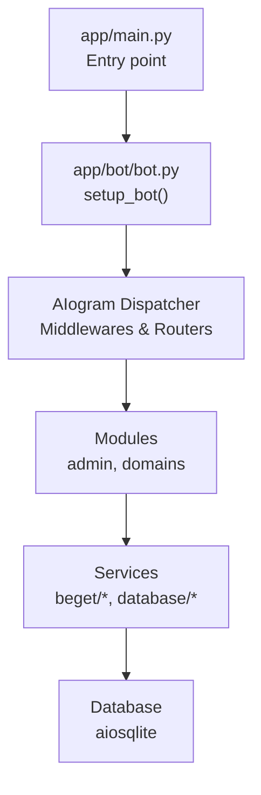
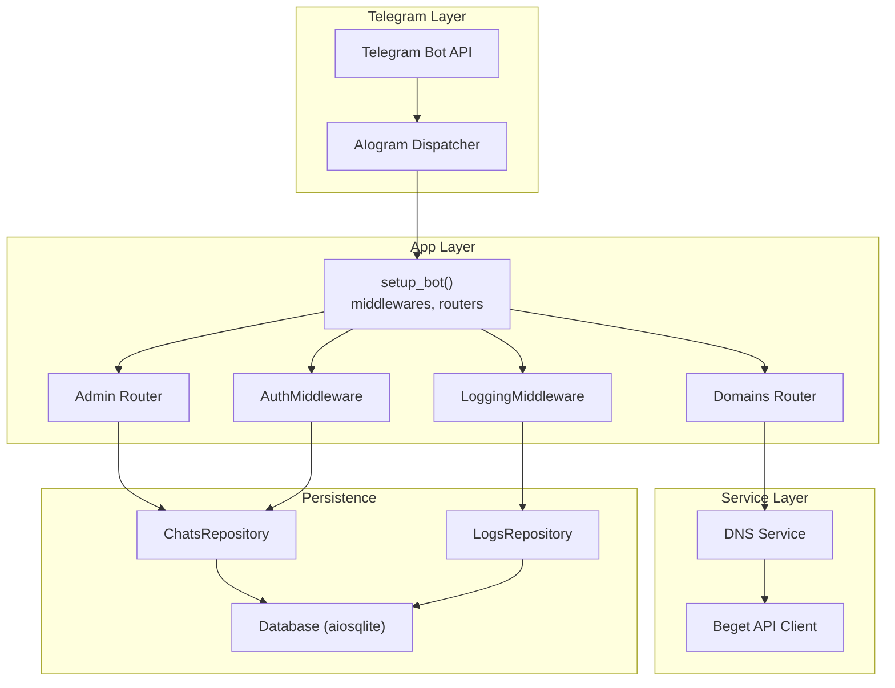
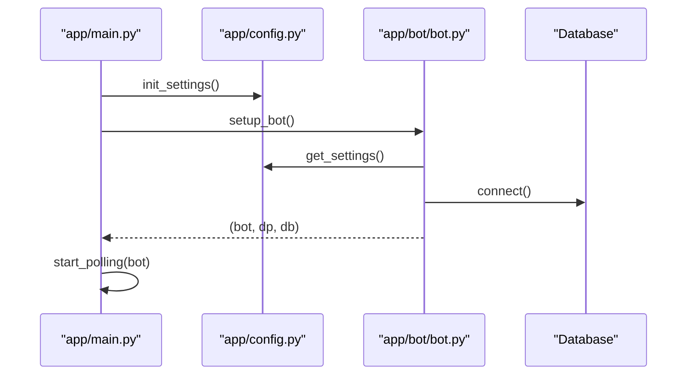
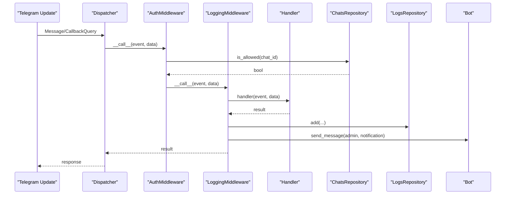
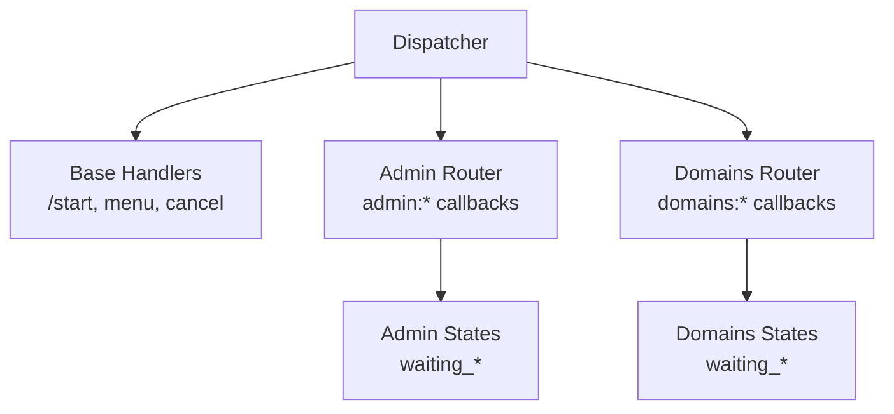
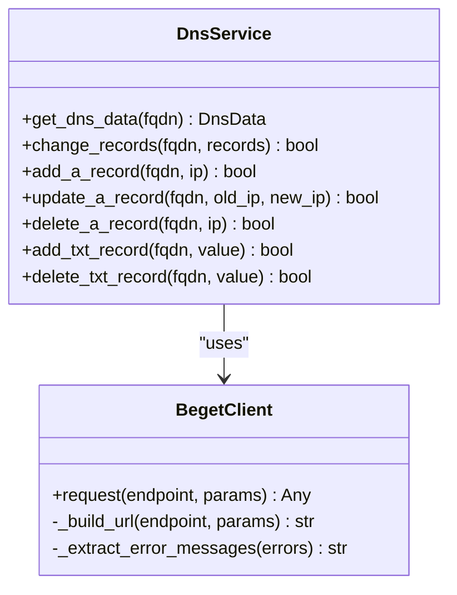
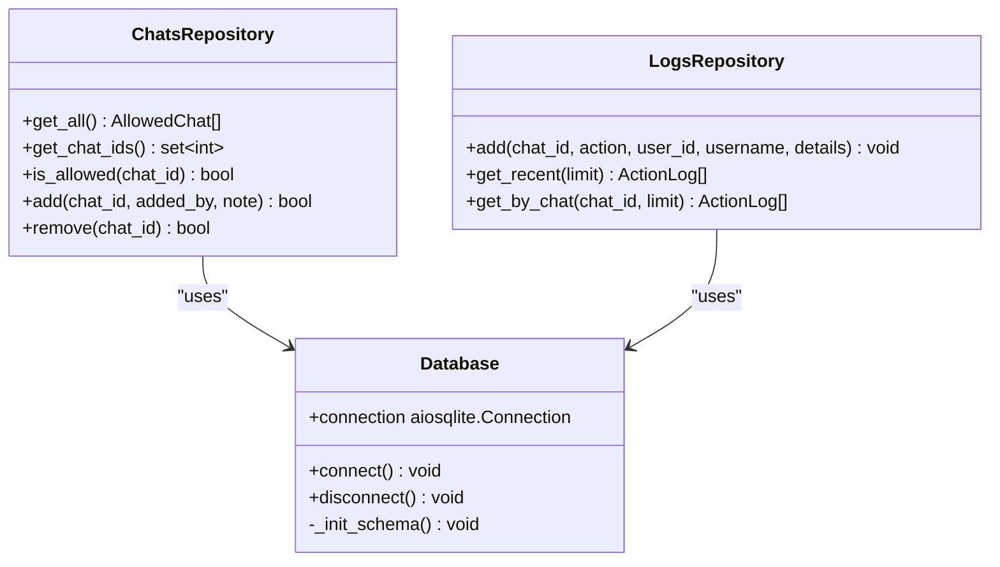
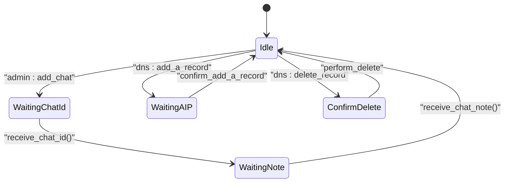
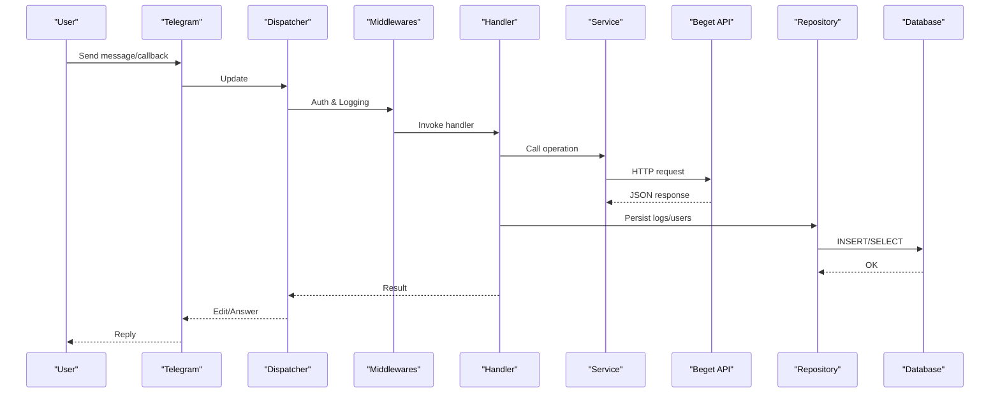
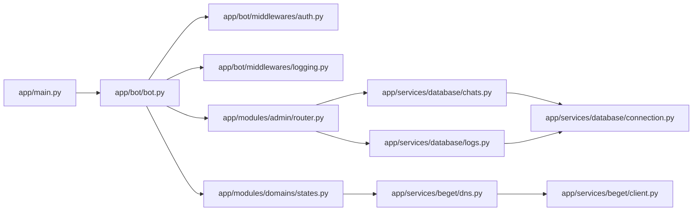

# System Architecture

<cite>
**Referenced Files in This Document**
- [app/main.py](file://app/main.py)
- [app/bot/bot.py](file://app/bot/bot.py)
- [app/config.py](file://app/config.py)
- [app/bot/middlewares/auth.py](file://app/bot/middlewares/auth.py)
- [app/bot/middlewares/logging.py](file://app/bot/middlewares/logging.py)
- [app/services/database/connection.py](file://app/services/database/connection.py)
- [app/services/database/chats.py](file://app/services/database/chats.py)
- [app/services/database/logs.py](file://app/services/database/logs.py)
- [app/modules/admin/router.py](file://app/modules/admin/router.py)
- [app/modules/domains/states.py](file://app/modules/domains/states.py)
- [app/services/beget/client.py](file://app/services/beget/client.py)
- [app/services/beget/dns.py](file://app/services/beget/dns.py)
- [app/utils/helpers.py](file://app/utils/helpers.py)
- [Dockerfile](file://Dockerfile)
- [docker-compose.yml](file://docker-compose.yml)
</cite>

## Table of Contents
1. [Introduction](#introduction)
2. [Project Structure](#project-structure)
3. [Core Components](#core-components)
4. [Architecture Overview](#architecture-overview)
5. [Detailed Component Analysis](#detailed-component-analysis)
6. [Dependency Analysis](#dependency-analysis)
7. [Performance Considerations](#performance-considerations)
8. [Troubleshooting Guide](#troubleshooting-guide)
9. [Conclusion](#conclusion)
10. [Appendices](#appendices)

## Introduction
This document describes the system architecture of the Beget Manager Telegram bot. It explains how the Telegram Bot API integration layer interacts with middleware, router-based handlers, a service layer for Beget API operations, and a SQLite-based persistence layer. It also documents cross-cutting concerns such as authentication, logging, error handling, and security, along with containerization via Docker and Docker Compose.

## Project Structure
The project follows a layered, modular structure:
- Application entry point initializes configuration and starts the bot.
- Bot setup composes AIogram Dispatcher, middlewares, and routers.
- Modules define feature-specific routers and finite-state machines (FSM).
- Services encapsulate external API integrations and domain logic.
- Database layer provides repositories and schema initialization.
- Utilities offer shared helpers.
- Containerization defines runtime packaging and deployment.

**Diagram sources**
- [app/main.py](file://app/main.py#L10-L26)
- [app/bot/bot.py](file://app/bot/bot.py#L18-L82)

**Section sources**
- [app/main.py](file://app/main.py#L1-L30)
- [app/bot/bot.py](file://app/bot/bot.py#L1-L83)
- [app/config.py](file://app/config.py#L1-L52)

## Core Components
- Configuration: Centralized settings loading from environment variables with caching.
- Bot and Dispatcher: AIogram-based integration with middlewares and routers.
- Middleware: Authentication and logging layers applied to message and callback queries.
- Repositories: Database abstraction for allowed chats and action logs.
- Services: Beget API client and DNS management service.
- Modules: Feature routers with state machines for multi-step operations.
- Utilities: Formatting and truncation helpers.
- Containerization: Docker image and compose configuration.

**Section sources**
- [app/config.py](file://app/config.py#L8-L52)
- [app/bot/bot.py](file://app/bot/bot.py#L18-L82)
- [app/bot/middlewares/auth.py](file://app/bot/middlewares/auth.py#L10-L46)
- [app/bot/middlewares/logging.py](file://app/bot/middlewares/logging.py#L12-L76)
- [app/services/database/connection.py](file://app/services/database/connection.py#L7-L59)
- [app/services/database/chats.py](file://app/services/database/chats.py#L20-L79)
- [app/services/database/logs.py](file://app/services/database/logs.py#L22-L90)
- [app/services/beget/client.py](file://app/services/beget/client.py#L21-L135)
- [app/services/beget/dns.py](file://app/services/beget/dns.py#L8-L152)
- [app/modules/domains/states.py](file://app/modules/domains/states.py#L6-L21)
- [app/utils/helpers.py](file://app/utils/helpers.py#L6-L16)
- [Dockerfile](file://Dockerfile#L1-L17)
- [docker-compose.yml](file://docker-compose.yml#L1-L14)

## Architecture Overview
The system is event-driven and asynchronous. The AIogram Dispatcher routes updates to registered routers. Middlewares intercept events for authentication and logging. Handlers trigger service operations against the Beget API and persist results to the database. Admin and domains modules demonstrate modular extension.

**Diagram sources**
- [app/bot/bot.py](file://app/bot/bot.py#L18-L82)
- [app/bot/middlewares/auth.py](file://app/bot/middlewares/auth.py#L10-L46)
- [app/bot/middlewares/logging.py](file://app/bot/middlewares/logging.py#L12-L76)
- [app/modules/admin/router.py](file://app/modules/admin/router.py#L19-L61)
- [app/services/beget/client.py](file://app/services/beget/client.py#L21-L135)
- [app/services/beget/dns.py](file://app/services/beget/dns.py#L8-L152)
- [app/services/database/connection.py](file://app/services/database/connection.py#L7-L59)
- [app/services/database/chats.py](file://app/services/database/chats.py#L20-L79)
- [app/services/database/logs.py](file://app/services/database/logs.py#L22-L90)

## Detailed Component Analysis

### Configuration and Bootstrapping
- Settings are loaded from environment variables with Pydantic settings and cached for performance.
- The application entry point initializes settings and starts the bot via polling.
- The bot setup configures logging, connects to the database, creates repositories, registers middlewares and routers, and defines base handlers.

**Diagram sources**
- [app/main.py](file://app/main.py#L10-L26)
- [app/config.py](file://app/config.py#L37-L52)
- [app/bot/bot.py](file://app/bot/bot.py#L18-L82)
- [app/services/database/connection.py](file://app/services/database/connection.py#L14-L25)

**Section sources**
- [app/config.py](file://app/config.py#L8-L52)
- [app/main.py](file://app/main.py#L10-L26)
- [app/bot/bot.py](file://app/bot/bot.py#L18-L82)

### AIogram Integration and Middleware Pattern
- Authentication middleware checks if a chat is allowed or is the admin chat; otherwise drops the event.
- Logging middleware extracts user/action metadata, persists logs, and notifies the admin chat.
- Both middlewares are registered for message and callback query events.

**Diagram sources**
- [app/bot/middlewares/auth.py](file://app/bot/middlewares/auth.py#L17-L45)
- [app/bot/middlewares/logging.py](file://app/bot/middlewares/logging.py#L20-L75)
- [app/services/database/chats.py](file://app/services/database/chats.py#L51-L57)
- [app/services/database/logs.py](file://app/services/database/logs.py#L28-L44)

**Section sources**
- [app/bot/middlewares/auth.py](file://app/bot/middlewares/auth.py#L10-L46)
- [app/bot/middlewares/logging.py](file://app/bot/middlewares/logging.py#L12-L76)

### Router-Based Handler System
- Base handlers for /start, main menu, and cancel actions are registered at the dispatcher level.
- Admin router enforces admin-only access via a custom filter and exposes CRUD-like operations for allowed chats and logs.
- Domains router integrates with FSM states for multi-step operations (e.g., DNS record management).

**Diagram sources**
- [app/bot/bot.py](file://app/bot/bot.py#L54-L81)
- [app/modules/admin/router.py](file://app/modules/admin/router.py#L19-L61)
- [app/modules/domains/states.py](file://app/modules/domains/states.py#L6-L21)

**Section sources**
- [app/bot/bot.py](file://app/bot/bot.py#L54-L81)
- [app/modules/admin/router.py](file://app/modules/admin/router.py#L19-L61)
- [app/modules/domains/states.py](file://app/modules/domains/states.py#L6-L21)

### Service Layer for Beget API Operations
- Beget API client encapsulates HTTP requests with proper URL construction, JSON parsing, and error extraction.
- DNS service wraps client operations to fetch and modify DNS records, normalizing responses into typed data structures.

**Diagram sources**
- [app/services/beget/client.py](file://app/services/beget/client.py#L21-L135)
- [app/services/beget/dns.py](file://app/services/beget/dns.py#L8-L152)

**Section sources**
- [app/services/beget/client.py](file://app/services/beget/client.py#L21-L135)
- [app/services/beget/dns.py](file://app/services/beget/dns.py#L8-L152)

### Database Persistence Layer (Repository Pattern)
- Database connection manager handles async SQLite connections and schema initialization.
- Repositories provide typed access to allowed chats and action logs with CRUD operations.
- Entities are simple data containers for structured data retrieval.

**Diagram sources**
- [app/services/database/connection.py](file://app/services/database/connection.py#L7-L59)
- [app/services/database/chats.py](file://app/services/database/chats.py#L20-L79)
- [app/services/database/logs.py](file://app/services/database/logs.py#L22-L90)

**Section sources**
- [app/services/database/connection.py](file://app/services/database/connection.py#L7-L59)
- [app/services/database/chats.py](file://app/services/database/chats.py#L20-L79)
- [app/services/database/logs.py](file://app/services/database/logs.py#L22-L90)

### State Machine Pattern for Multi-Step Operations
- Finite-state machines define conversational steps for admin and domains features.
- Handlers transition between states, prompting for user input and confirming actions.

**Diagram sources**
- [app/modules/admin/router.py](file://app/modules/admin/router.py#L98-L150)
- [app/modules/domains/states.py](file://app/modules/domains/states.py#L6-L21)

**Section sources**
- [app/modules/admin/router.py](file://app/modules/admin/router.py#L98-L150)
- [app/modules/domains/states.py](file://app/modules/domains/states.py#L6-L21)

### Data Flow: From User Input to External API and Database
- User input arrives via Telegram updates processed by AIogram.
- Middlewares authenticate and log actions.
- Handlers orchestrate service calls to Beget API and database writes.
- Responses are sent back to the user through the bot.

**Diagram sources**
- [app/bot/bot.py](file://app/bot/bot.py#L54-L81)
- [app/bot/middlewares/auth.py](file://app/bot/middlewares/auth.py#L17-L45)
- [app/bot/middlewares/logging.py](file://app/bot/middlewares/logging.py#L20-L75)
- [app/services/beget/dns.py](file://app/services/beget/dns.py#L14-L77)
- [app/services/database/logs.py](file://app/services/database/logs.py#L28-L44)

## Dependency Analysis
- Low coupling between modules and services through DI containers and repositories.
- Clear separation of concerns: AIogram for transport, middlewares for cross-cutting, routers for routing, services for domain logic, repositories for persistence.
- External dependencies: aiohttp for HTTP, aiosqlite for DB, aiogram for Telegram integration.

**Diagram sources**
- [app/main.py](file://app/main.py#L10-L26)
- [app/bot/bot.py](file://app/bot/bot.py#L18-L82)
- [app/bot/middlewares/auth.py](file://app/bot/middlewares/auth.py#L10-L46)
- [app/bot/middlewares/logging.py](file://app/bot/middlewares/logging.py#L12-L76)
- [app/modules/admin/router.py](file://app/modules/admin/router.py#L22-L61)
- [app/modules/domains/states.py](file://app/modules/domains/states.py#L6-L21)
- [app/services/beget/dns.py](file://app/services/beget/dns.py#L8-L152)
- [app/services/beget/client.py](file://app/services/beget/client.py#L21-L135)
- [app/services/database/chats.py](file://app/services/database/chats.py#L20-L79)
- [app/services/database/logs.py](file://app/services/database/logs.py#L22-L90)
- [app/services/database/connection.py](file://app/services/database/connection.py#L7-L59)

**Section sources**
- [app/main.py](file://app/main.py#L10-L26)
- [app/bot/bot.py](file://app/bot/bot.py#L18-L82)
- [app/modules/admin/router.py](file://app/modules/admin/router.py#L22-L61)

## Performance Considerations
- Asynchronous design with aiohttp and aiosqlite ensures non-blocking I/O.
- Middleware short-circuits unauthorized events early to reduce downstream work.
- Caching of settings avoids repeated environment reads.
- Indexes on timestamps improve log retrieval performance.
- Consider connection pooling and retry/backoff for external API calls.

[No sources needed since this section provides general guidance]

## Troubleshooting Guide
- Authentication failures: Verify admin chat ID and allowed chats entries; check middleware logic and repository queries.
- Logging issues: Ensure admin chat ID is configured; verify notifications are not blocked; check repository insertions.
- Beget API errors: Inspect BegetApiError exceptions and logged URLs; confirm credentials and endpoint correctness.
- Database connectivity: Validate path creation and schema initialization; ensure file permissions on mounted volume.
- Container logs: Use Docker logging configuration to manage log rotation.

**Section sources**
- [app/bot/middlewares/auth.py](file://app/bot/middlewares/auth.py#L34-L45)
- [app/bot/middlewares/logging.py](file://app/bot/middlewares/logging.py#L60-L73)
- [app/services/beget/client.py](file://app/services/beget/client.py#L97-L120)
- [app/services/database/connection.py](file://app/services/database/connection.py#L14-L19)
- [docker-compose.yml](file://docker-compose.yml#L9-L13)

## Conclusion
The Beget Manager Telegram bot employs a clean, layered architecture leveraging AIogram’s middleware and router patterns. Cross-cutting concerns are handled by dedicated middlewares, while repositories encapsulate persistence. The service layer isolates external API complexity, and state machines enable robust multi-step workflows. Containerization simplifies deployment and scaling.

[No sources needed since this section summarizes without analyzing specific files]

## Appendices

### System Boundaries and Integration Points
- Telegram Bot API boundary: Updates enter via polling; responses are sent back to users.
- Beget API boundary: DNS operations are invoked via documented endpoints; responses are parsed and normalized.
- Database boundary: Local SQLite file under a persistent volume; repositories expose typed operations.

**Section sources**
- [app/bot/bot.py](file://app/bot/bot.py#L54-L81)
- [app/services/beget/client.py](file://app/services/beget/client.py#L24-L68)
- [app/services/database/connection.py](file://app/services/database/connection.py#L14-L19)
- [docker-compose.yml](file://docker-compose.yml#L7-L8)

### Technology Stack and Architectural Decisions
- Python 3.11 with async-first libraries for concurrency.
- AIogram for Telegram integration and FSM management.
- aiohttp for robust HTTP client behavior.
- aiosqlite for async SQLite access.
- Pydantic settings for type-safe configuration.
- Docker for containerization and portability.
- Decision rationale: Simplicity, maintainability, and strong async support across the stack.

**Section sources**
- [Dockerfile](file://Dockerfile#L1-L17)
- [app/config.py](file://app/config.py#L37-L52)
- [app/services/beget/client.py](file://app/services/beget/client.py#L3-L6)
- [app/services/database/connection.py](file://app/services/database/connection.py#L3-L4)