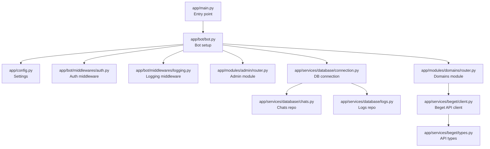
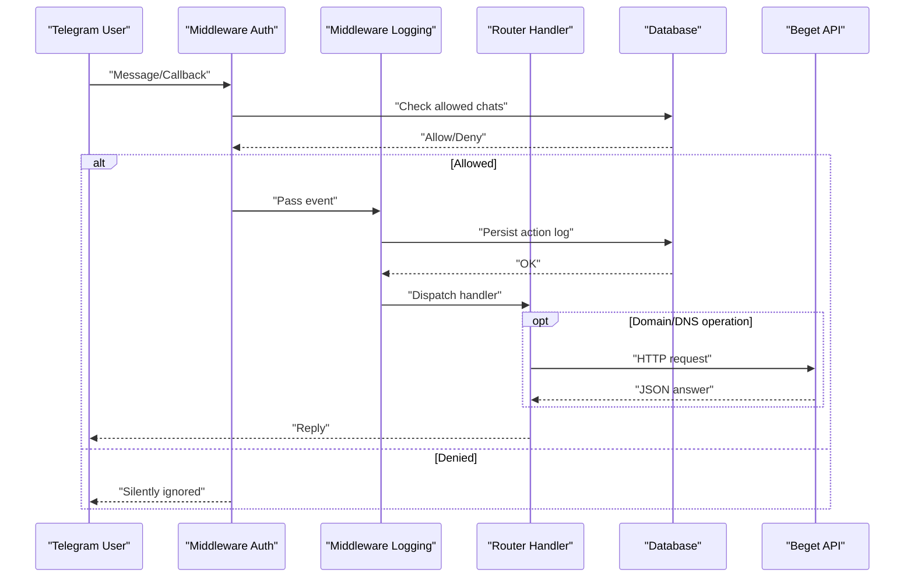
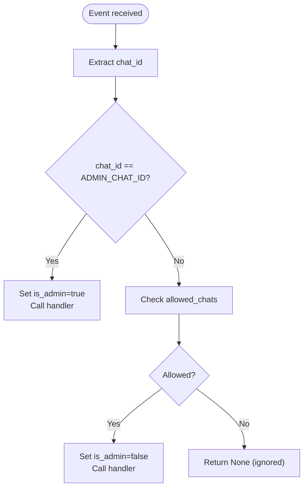
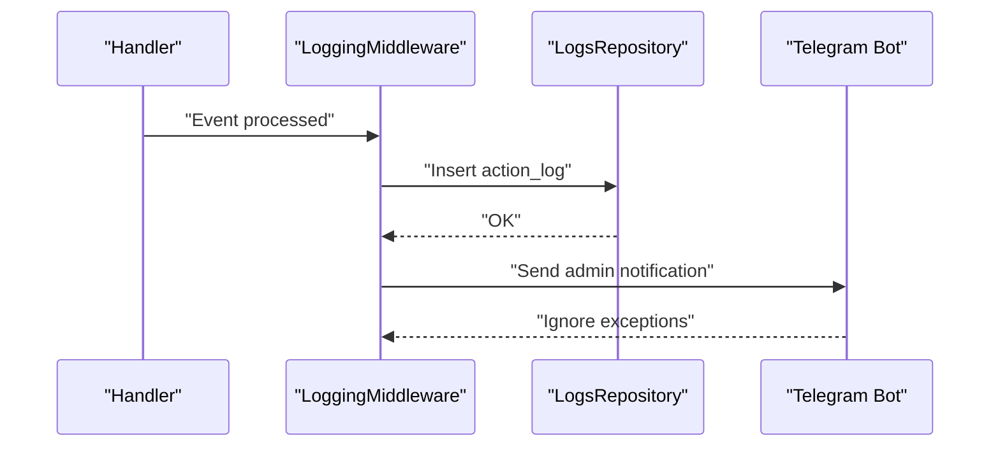
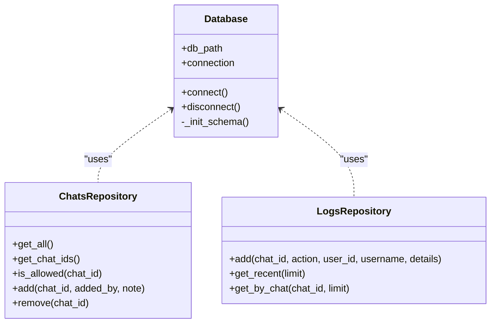
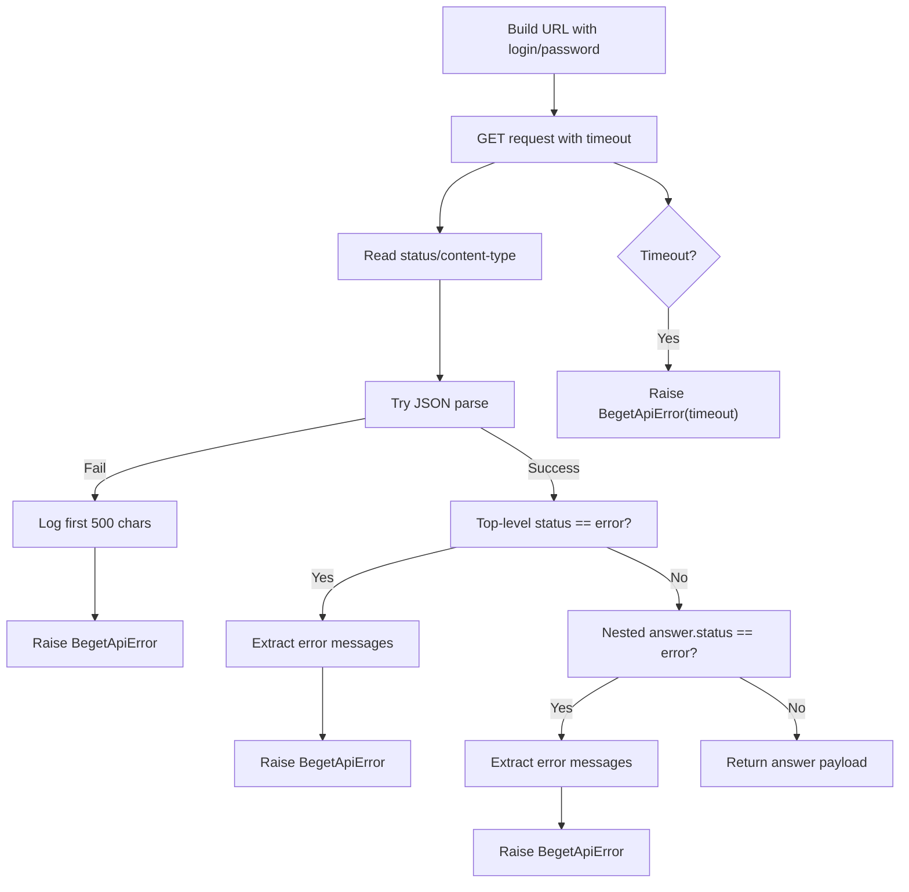
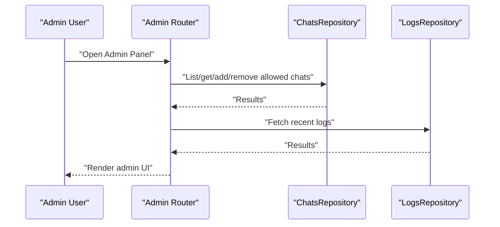
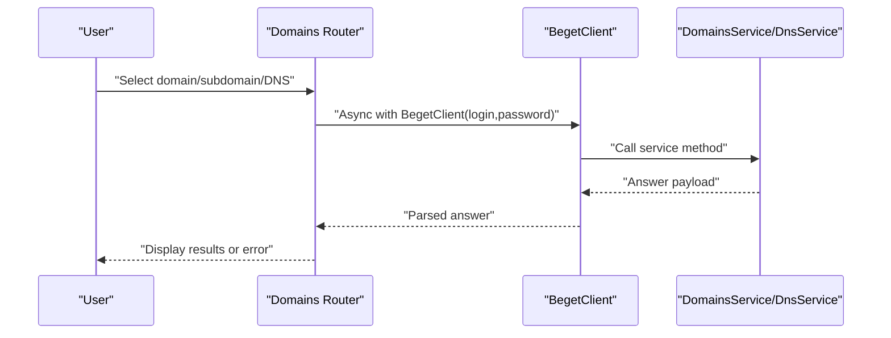
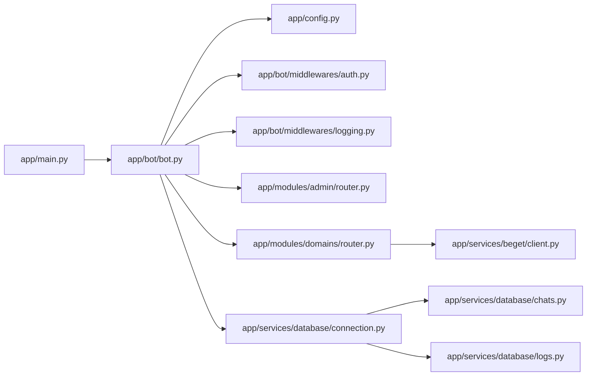

# Troubleshooting Guide

<cite>
**Referenced Files in This Document**
- [README.md](file://README.md)
- [main.py](file://app/main.py)
- [config.py](file://app/config.py)
- [bot.py](file://app/bot/bot.py)
- [docker-compose.yml](file://docker-compose.yml)
- [.env.example](file://.env.example)
- [auth.py](file://app/bot/middlewares/auth.py)
- [logging.py](file://app/bot/middlewares/logging.py)
- [connection.py](file://app/services/database/connection.py)
- [chats.py](file://app/services/database/chats.py)
- [logs.py](file://app/services/database/logs.py)
- [client.py](file://app/services/beget/client.py)
- [types.py](file://app/services/beget/types.py)
- [router.py (admin)](file://app/modules/admin/router.py)
- [router.py (domains)](file://app/modules/domains/router.py)
- [helpers.py](file://app/utils/helpers.py)
</cite>

## Table of Contents
1. [Introduction](#introduction)
2. [Project Structure](#project-structure)
3. [Core Components](#core-components)
4. [Architecture Overview](#architecture-overview)
5. [Detailed Component Analysis](#detailed-component-analysis)
6. [Dependency Analysis](#dependency-analysis)
7. [Performance Considerations](#performance-considerations)
8. [Troubleshooting Guide](#troubleshooting-guide)
9. [Conclusion](#conclusion)
10. [Appendices](#appendices)

## Introduction
This guide provides a comprehensive troubleshooting methodology for the Beget Manager bot. It focuses on diagnosing and resolving common issues such as bot unresponsiveness, unauthorized access errors, Beget API connectivity problems, and database-related issues. It also covers log analysis techniques, error interpretation, step-by-step resolutions, and preventive maintenance recommendations.

## Project Structure
The bot is organized around a modular architecture:
- Configuration and entry point
- Bot initialization and middleware pipeline
- Feature modules (admin, domains)
- Services for Beget API and database
- Utilities for formatting and helpers

**Diagram sources**
- [main.py](file://app/main.py#L10-L26)
- [bot.py](file://app/bot/bot.py#L18-L82)
- [config.py](file://app/config.py#L8-L35)
- [auth.py](file://app/bot/middlewares/auth.py#L10-L45)
- [logging.py](file://app/bot/middlewares/logging.py#L12-L75)
- [router.py (admin)](file://app/modules/admin/router.py#L22-L61)
- [router.py (domains)](file://app/modules/domains/router.py#L25-L52)
- [connection.py](file://app/services/database/connection.py#L7-L33)
- [chats.py](file://app/services/database/chats.py#L20-L57)
- [logs.py](file://app/services/database/logs.py#L22-L44)
- [client.py](file://app/services/beget/client.py#L21-L49)
- [types.py](file://app/services/beget/types.py#L6-L12)

**Section sources**
- [README.md](file://README.md#L191-L208)
- [docker-compose.yml](file://docker-compose.yml#L1-L14)

## Core Components
- Settings and configuration: Loads environment variables and exposes paths and defaults.
- Bot setup: Initializes logging, database, repositories, middlewares, and routers.
- Middlewares: Authentication checks and action logging with admin notifications.
- Modules: Admin panel and domain/DNS management handlers.
- Database: SQLite-backed repositories for allowed chats and action logs.
- Beget API client: Async HTTP client with structured error handling and timeouts.

**Section sources**
- [config.py](file://app/config.py#L8-L35)
- [bot.py](file://app/bot/bot.py#L18-L82)
- [auth.py](file://app/bot/middlewares/auth.py#L10-L45)
- [logging.py](file://app/bot/middlewares/logging.py#L12-L75)
- [chats.py](file://app/services/database/chats.py#L20-L79)
- [logs.py](file://app/services/database/logs.py#L22-L90)
- [client.py](file://app/services/beget/client.py#L21-L135)

## Architecture Overview
The runtime flow connects Telegram events to module handlers, enforced by authentication and logging middlewares, and integrates with the database and Beget API.

**Diagram sources**
- [auth.py](file://app/bot/middlewares/auth.py#L17-L45)
- [logging.py](file://app/bot/middlewares/logging.py#L20-L75)
- [router.py (domains)](file://app/modules/domains/router.py#L28-L52)
- [client.py](file://app/services/beget/client.py#L70-L121)
- [connection.py](file://app/services/database/connection.py#L14-L25)

## Detailed Component Analysis

### Authentication Middleware
- Purpose: Allow admin chat ID unconditionally; otherwise require presence in allowed chats.
- Behavior: Injects is_admin flag; silently ignores unauthorized events.

**Diagram sources**
- [auth.py](file://app/bot/middlewares/auth.py#L17-L45)

**Section sources**
- [auth.py](file://app/bot/middlewares/auth.py#L10-L45)

### Logging Middleware
- Purpose: Persist non-admin actions and notify admin via Telegram.
- Behavior: Captures chat/user/action metadata; sends admin notification; swallows notification errors.

**Diagram sources**
- [logging.py](file://app/bot/middlewares/logging.py#L20-L75)
- [logs.py](file://app/services/database/logs.py#L28-L44)

**Section sources**
- [logging.py](file://app/bot/middlewares/logging.py#L12-L75)
- [logs.py](file://app/services/database/logs.py#L22-L90)

### Database Layer
- Connection: Creates data directory, sets row factory, initializes schema with indexes.
- Repositories:
  - ChatsRepository: allowed_chats CRUD and membership checks.
  - LogsRepository: action_logs CRUD and queries.

**Diagram sources**
- [connection.py](file://app/services/database/connection.py#L7-L58)
- [chats.py](file://app/services/database/chats.py#L20-L79)
- [logs.py](file://app/services/database/logs.py#L22-L90)

**Section sources**
- [connection.py](file://app/services/database/connection.py#L7-L58)
- [chats.py](file://app/services/database/chats.py#L20-L79)
- [logs.py](file://app/services/database/logs.py#L22-L90)

### Beget API Client
- Purpose: Encapsulates HTTP requests to Beget API with timeouts and robust error extraction.
- Key behaviors:
  - Builds authenticated URLs with login/password.
  - Logs request/response metadata.
  - Parses JSON regardless of Content-Type.
  - Raises BegetApiError with extracted messages.
  - Handles timeouts explicitly.

**Diagram sources**
- [client.py](file://app/services/beget/client.py#L51-L121)

**Section sources**
- [client.py](file://app/services/beget/client.py#L13-L135)
- [types.py](file://app/services/beget/types.py#L6-L12)

### Admin Module
- Provides admin-only routes to manage allowed chats and view logs.
- Uses dependency injection to bind repositories and admin chat ID.

**Diagram sources**
- [router.py (admin)](file://app/modules/admin/router.py#L22-L61)
- [chats.py](file://app/services/database/chats.py#L26-L79)
- [logs.py](file://app/services/database/logs.py#L46-L64)

**Section sources**
- [router.py (admin)](file://app/modules/admin/router.py#L22-L222)

### Domains Module
- Loads domains, subdomains, and DNS records via Beget API.
- Handles user input validation and error propagation to UI.

**Diagram sources**
- [router.py (domains)](file://app/modules/domains/router.py#L28-L52)
- [client.py](file://app/services/beget/client.py#L33-L49)

**Section sources**
- [router.py (domains)](file://app/modules/domains/router.py#L25-L718)

## Dependency Analysis
- Entry point depends on settings and bot setup.
- Bot setup depends on configuration, database, middlewares, and routers.
- Routers depend on Beget client and services.
- Middlewares depend on repositories and bot instance.
- Database repositories depend on connection.

**Diagram sources**
- [main.py](file://app/main.py#L10-L26)
- [bot.py](file://app/bot/bot.py#L18-L82)
- [config.py](file://app/config.py#L8-L35)
- [auth.py](file://app/bot/middlewares/auth.py#L10-L45)
- [logging.py](file://app/bot/middlewares/logging.py#L12-L75)
- [router.py (admin)](file://app/modules/admin/router.py#L22-L61)
- [router.py (domains)](file://app/modules/domains/router.py#L25-L52)
- [client.py](file://app/services/beget/client.py#L21-L49)
- [connection.py](file://app/services/database/connection.py#L7-L33)
- [chats.py](file://app/services/database/chats.py#L20-L57)
- [logs.py](file://app/services/database/logs.py#L22-L44)

**Section sources**
- [main.py](file://app/main.py#L10-L26)
- [bot.py](file://app/bot/bot.py#L18-L82)

## Performance Considerations
- Memory usage: The bot uses in-memory FSM storage; long sessions or many concurrent users may increase memory footprint. Consider persistent storage if scaling.
- Network latency: Beget API requests are synchronous per operation; batch operations are not implemented. Monitor response times and consider reducing concurrent requests.
- Logging overhead: Frequent admin notifications and database writes can impact throughput under load. Adjust LOG_LEVEL to reduce verbosity if needed.
- Database I/O: SQLite is single-writer; ensure handlers complete promptly to avoid contention.

[No sources needed since this section provides general guidance]

## Troubleshooting Guide

### 1) Bot Unresponsiveness
Symptoms:
- No replies to commands.
- Menu does not appear after /start.

Diagnostic steps:
- Check container status:
  - docker-compose ps
- Inspect logs for startup and runtime errors:
  - docker-compose logs -f
- Verify environment variables:
  - Ensure TELEGRAM_BOT_TOKEN and ADMIN_CHAT_ID are present and correct.
- Validate configuration loading:
  - Confirm settings are initialized before bot startup.

Resolution checklist:
- Restart container if stuck:
  - docker-compose restart
- Rebuild and redeploy if dependencies changed:
  - docker-compose up -d --build

Common causes:
- Container not running.
- Invalid TELEGRAM_BOT_TOKEN.
- Misconfigured LOG_LEVEL causing silent failures.
- Missing .env file or missing keys.

Escalation:
- If logs show repeated connection errors to Telegram or database, escalate to platform/container health checks.

**Section sources**
- [README.md](file://README.md#L221-L231)
- [main.py](file://app/main.py#L10-L26)
- [bot.py](file://app/bot/bot.py#L18-L30)
- [config.py](file://app/config.py#L47-L51)
- [.env.example](file://.env.example#L1-L11)

### 2) Unauthorized Access Errors
Symptoms:
- Silent ignore of messages/inline buttons.
- Admin panel inaccessible to non-admin users.

Diagnostic steps:
- Review logs for unauthorized attempts:
  - docker-compose logs -f | grep -i "unauthorized\|denied"
- Identify actual Chat ID from logs:
  - Look for action logs or admin notifications indicating sender chat_id.
- Confirm ADMIN_CHAT_ID vs allowed chats:
  - Compare ADMIN_CHAT_ID with entries in allowed_chats.

Resolution checklist:
- Add user Chat ID to allowed_chats:
  - Use Admin Panel → Manage Chats → Add Chat.
- Ensure ADMIN_CHAT_ID matches your admin Chat ID.
- Restart bot to apply changes:
  - docker-compose restart

Common causes:
- Chat ID not present in allowed_chats.
- ADMIN_CHAT_ID mismatch.
- Event without chat_id (edge case).

Escalation:
- If logs indicate repeated unauthorized attempts, review access control logic and ensure repositories are initialized.

**Section sources**
- [README.md](file://README.md#L235-L249)
- [auth.py](file://app/bot/middlewares/auth.py#L17-L45)
- [logging.py](file://app/bot/middlewares/logging.py#L50-L74)
- [router.py (admin)](file://app/modules/admin/router.py#L74-L95)

### 3) Beget API Connectivity Problems
Symptoms:
- “Error loading domains” or similar handler errors.
- Timeouts or invalid response messages.

Diagnostic steps:
- Inspect logs for API request/response details:
  - docker-compose logs -f
  - Look for API Response Status and Content-Type lines.
- Verify credentials:
  - Confirm BEGET_LOGIN and BEGET_PASSWORD in .env.
- Test connectivity:
  - curl/wget against https://api.beget.com/api (outside container) to validate network access.

Resolution checklist:
- Update .env with correct credentials.
- Retry operation after correcting credentials.
- If timeout occurs, consider increasing timeout in client (requires code change) or network optimization.
- If JSON parse fails, ensure API endpoint returns JSON despite Content-Type.

Error interpretation:
- BegetApiError raised with extracted messages; check errors array for human-readable reasons.
- Timeout indicates network latency or rate limiting.

Common causes:
- Incorrect login/password.
- Network restrictions or firewall blocking outbound HTTPS.
- API endpoint returning non-JSON or unexpected format.

Escalation:
- If persistent timeouts or frequent errors, coordinate with Beget support and review network policies.

**Section sources**
- [README.md](file://README.md#L251-L258)
- [client.py](file://app/services/beget/client.py#L70-L121)
- [router.py (domains)](file://app/modules/domains/router.py#L33-L41)
- [.env.example](file://.env.example#L5-L7)

### 4) Database-Related Issues
Symptoms:
- “Service unavailable” in Admin Panel.
- Missing or corrupted allowed_chats/action_logs.
- Startup errors related to database connection.

Diagnostic steps:
- Check container logs for database initialization and connection errors:
  - docker-compose logs -f
- Verify data volume persistence:
  - Confirm ./data directory exists and is writable.
- Inspect schema initialization:
  - allowed_chats and action_logs tables should exist with proper indexes.

Resolution checklist:
- If database corruption suspected, reset database:
  - docker-compose down
  - rm -rf data/
  - docker-compose up -d
  - Note: This deletes all allowed chats and logs.
- Ensure permissions on ./data directory allow write access.

Common causes:
- Missing data directory or insufficient permissions.
- SQLite busy or locked during concurrent operations.
- Schema mismatch after updates.

Escalation:
- If schema issues persist, review migration strategy and ensure atomic schema updates.

**Section sources**
- [README.md](file://README.md#L260-L275)
- [connection.py](file://app/services/database/connection.py#L14-L58)
- [docker-compose.yml](file://docker-compose.yml#L7-L8)

### 5) Performance and Timeout Scenarios
Symptoms:
- Slow responses or timeouts when fetching domains/DNS.
- Memory growth over time.

Diagnostic steps:
- Observe log timestamps and response durations.
- Reduce log verbosity if noisy:
  - Set LOG_LEVEL to WARNING or ERROR.
- Monitor container resource usage externally.

Resolution checklist:
- Limit concurrent operations in UI.
- Consider persistent FSM storage for long sessions.
- Scale horizontally if usage grows.

Common causes:
- Network latency to Beget API.
- Large number of DNS records increasing payload size.
- High-frequency polling or excessive logs.

Escalation:
- If timeouts persist, contact Beget support and review network SLAs.

**Section sources**
- [client.py](file://app/services/beget/client.py#L25-L30)
- [router.py (domains)](file://app/modules/domains/router.py#L33-L41)
- [config.py](file://app/config.py#L26-L26)

### 6) Error Codes and Meanings
- BegetApiError:
  - Raised when API returns status error or parsing fails.
  - Contains extracted error messages list for diagnosis.
- Runtime errors:
  - Database not connected: indicates misconfiguration or shutdown timing.
  - Client not initialized: indicates misuse of async context.

Interpretation tips:
- Top-level and nested answer status fields are checked.
- JSON parse failures are logged with first 500 characters of response body.

**Section sources**
- [client.py](file://app/services/beget/client.py#L13-L19)
- [client.py](file://app/services/beget/client.py#L97-L121)
- [connection.py](file://app/services/database/connection.py#L30-L32)

### 7) Preventive Maintenance and Monitoring Best Practices
- Monitor logs regularly:
  - docker-compose logs -f
- Rotate logs to prevent disk pressure:
  - json-file driver with max-size and max-file configured.
- Keep credentials secure:
  - Never commit .env; use .env.example as template.
- Audit access:
  - Periodically review allowed_chats and action_logs.
- Update dependencies:
  - docker-compose build and restart after pulling updates.

**Section sources**
- [README.md](file://README.md#L277-L288)
- [docker-compose.yml](file://docker-compose.yml#L9-L13)
- [README.md](file://README.md#L290-L296)

## Conclusion
This guide outlined systematic diagnostics for bot unresponsiveness, unauthorized access, Beget API connectivity, and database issues. By following the procedures—checking container status, analyzing logs, validating configurations, and testing API connectivity—you can quickly isolate and resolve most problems. For persistent or complex issues, escalate to platform/network support or Beget support as appropriate.

## Appendices

### A) Quick Commands Reference
- Check container status: docker-compose ps
- View logs: docker-compose logs -f
- Restart bot: docker-compose restart
- Rebuild and redeploy: docker-compose up -d --build
- Reset database: docker-compose down && rm -rf data/ && docker-compose up -d

**Section sources**
- [README.md](file://README.md#L96-L112)
- [README.md](file://README.md#L262-L273)